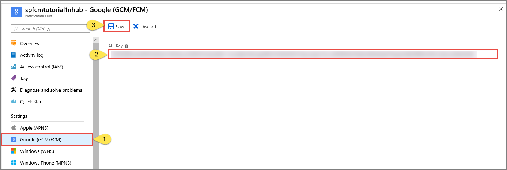
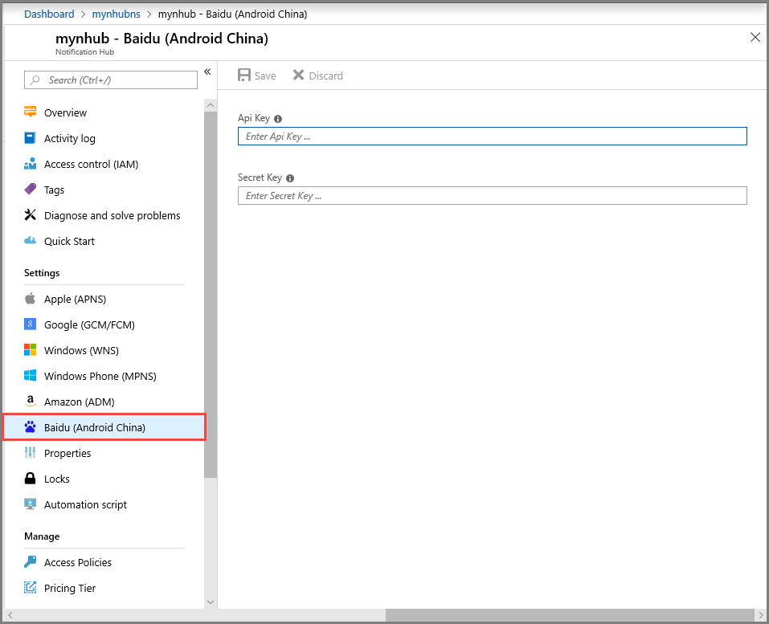

# Set up push notifications in a notification hub in the Azure portal

Azure Notification Hubs provides a push engine that's easy to use and that scales out. Use Notification Hubs to send notifications to any platform (iOS, Android, Windows, Baidu) and from any back end (cloud or on-premises). For more information, see [What is Azure Notification Hubs?](notification-hubs-push-notification-overview.md).

In this quickstart, you'll use the platform notification system (PNS) settings in Notification Hubs to set up push notifications on multiple platforms. The quickstart shows you the steps to take in the Azure portal.

If you haven't already created a notification hub, create one now. For more information, see [Create an Azure notification hub in the Azure portal](create-notification-hub-portal.md). 

## Apple Push Notification Service

To set up Apple Push Notification Service (APNS):

1. In the Azure portal, on the **Notification Hub** page, select **Apple (APNS)** from the left menu.

1. For **Authentication Mode**, select either **Certificate** or **Token**.

   a. If you select **Certificate**:
   * Select the file icon, and then select the *.p12* file you want to upload.
   * Enter a password.
   * Select **Sandbox** mode. Or, to send push notifications to users who purchased your app from the store, select **Production** mode.

     

   b. If you select **Token**:

   * Enter the values for **Key ID**, **Bundle ID**, **Team ID**, and **Token**.
   * Select **Sandbox** mode. Or, to send push notifications to users who purchased your app from the store, select **Production** mode.

     

For more information, see [Push notifications to iOS by using Azure Notification Hubs](notification-hubs-ios-apple-push-notification-apns-get-started.md).

## Google Firebase Cloud Messaging

To set up push notifications for Google Firebase Cloud Messaging (FCM):

1. In the Azure portal, on the **Notification Hub** page, select **Google (GCM/FCM)** from the left menu. 
2. Paste the **API Key** for the FCM project that you saved earlier. 
3. Select **Save**. 

   

When you complete these steps, an alert indicates that the notification hub has been successfully updated. The **Save** button is disabled. 

For more information, see [Push notifications to Android devices by using Notification Hubs and Google FCM](notification-hubs-android-push-notification-google-fcm-get-started.md).

## Windows Push Notification Service

To set up Windows Push Notification Service (WNS):

1. In the Azure portal, on the **Notification Hub** page, select **Windows (WNS)** from the left menu.
2. Enter values for **Package SID** and **Security Key**.
3. Select **Save**.

   

For information, see [Send notifications to UWP apps by using Azure Notification Hubs](notification-hubs-windows-store-dotnet-get-started-wns-push-notification.md).

## Microsoft Push Notification Service for Windows Phone

To set up Microsoft Push Notification Service (MPNS) for Windows Phone: 

1. In the Azure portal, on the **Notification Hub** page, select **Windows Phone (MPNS)** from the left menu.
1. Enable either unauthenticated or authenticated push notifications:

   a. To enable unauthenticated push notifications, select **Enable unauthenticated push** > **Save**.

      

   b. To enable authenticated push notifications:
      * On the toolbar, select **Upload Certificate**.
      * Select the file icon, and then select the certificate file.
      * Enter the password for the certificate.
      * Select **OK**.
      * On the **Windows Phone (MPNS)** page, select **Save**.

For more information, see [Push notifications to Windows Phone apps by using Notification Hubs](notification-hubs-windows-mobile-push-notifications-mpns.md).
      

## Baidu (Android China)

To set up push notifications for Baidu:

1. In the Azure portal, on the **Notification Hub** page, select **Baidu (Android China)** from the left menu. 
2. Enter the **Api Key** that you obtained from the Baidu console in the Baidu cloud push project. 
3. Enter the **Secret Key** that you obtained from the Baidu console in the Baidu cloud push project. 
4. Select **Save**. 

    

When you complete these steps, an alert indicates that the notification hub has been successfully updated. The **Save** button is disabled. 

For more information, see [Get started with Notification Hubs by using Baidu](notification-hubs-baidu-china-android-notifications-get-started.md).

## Next steps
In this quickstart, you learned how to configure platform notification system settings for a notification hub in the Azure portal. 

To learn more about how to push notifications to various platforms, see these tutorials:

- [Push notifications to iOS devices by using Notification Hubs and APNS](notification-hubs-ios-apple-push-notification-apns-get-started.md)
- [Push notifications to Android devices by using Notification Hubs and Google FCM](notification-hubs-android-push-notification-google-fcm-get-started.md)
- [Push notifications to a UWP app running on a Windows device](notification-hubs-windows-store-dotnet-get-started-wns-push-notification.md)
- [Push notifications to a Windows Phone 8 app by using MPNS](notification-hubs-windows-mobile-push-notifications-mpns.md)
- [Push notifications by using Notification Hubs and Baidu cloud push](notification-hubs-baidu-china-android-notifications-get-started.md)
