# Tutorial: Push location-based notifications with Azure Notification Hubs and Bing Spatial Data

In this tutorial, you learn how to deliver location-based push notifications with Azure Notification Hubs and Bing Spatial Data.

In this tutorial, you take the following steps:

> [!div class="checklist"]
> * Set up the data source
> * Set up the UWP application
> * Set up the backend
> * Test push notifications in the Universal Windows Platform (UWP) app

## Prerequisites

* **Azure subscription**. If you don't have an Azure subscription,  [create a free Azure account](https://azure.microsoft.com/free/) before you begin.
* [Visual Studio 2015 Update 1](https://www.visualstudio.com/downloads/download-visual-studio-vs.aspx) or later ([Community Edition](https://go.microsoft.com/fwlink/?LinkId=691978&clcid=0x409).
* Latest version of the [Azure SDK](https://azure.microsoft.com/downloads/).
* [Bing Maps Dev Center account](https://www.bingmapsportal.com/) (you can create one for free and associate it with your Microsoft account).

## Set up the data source

1. Log in to the [Bing Maps Dev Center](https://www.bingmapsportal.com/).
2. In the top navigation bar, select **Data sources**, and select **Manage Data Sources**.

    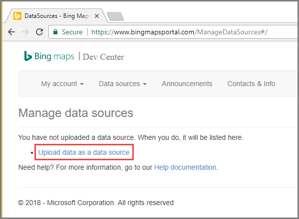
3. If you don't have an existing data source, you see a link to create a data source. Select **Upload data as a data source**. You can also use **Data sources** > **Upload data** menu.

    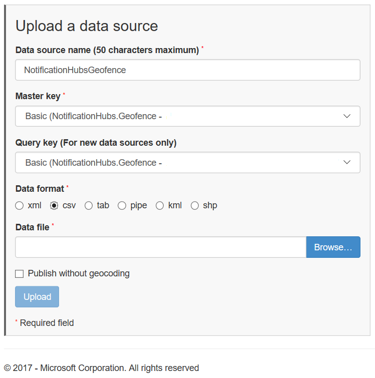
4. Create a file `NotificationHubsGeofence.pipe` on your hard drive with the following content: In this tutorial, you use a sample pipe-based file that frames an area of the San Francisco waterfront:

    ```text
    Bing Spatial Data Services, 1.0, TestBoundaries
    EntityID(Edm.String,primaryKey)|Name(Edm.String)|Longitude(Edm.Double)|Latitude(Edm.Double)|Boundary(Edm.Geography)
    1|SanFranciscoPier|||POLYGON ((-122.389825 37.776598,-122.389438 37.773087,-122.381885 37.771849,-122.382186 37.777022,-122.389825 37.776598))
    ```

    The pipe file represents this entity:

    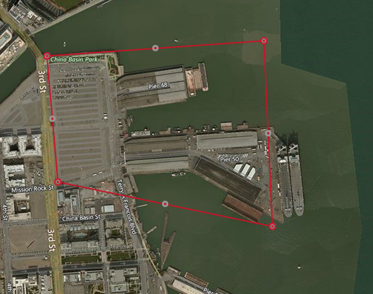
5. In the **Upload a data source** page, do the following actions:
   1. Select **pipe** for **Data format**.
   2. Browse and select the `NotificationHubGeofence.pipe` file that you created in the previous step.
   3. Select **Upload** button.

      > [!NOTE]
      > You might be prompted to specify a new key for the **Master Key** that is different from the **Query Key**. Simply create a new key through the dashboard and refresh the data source upload page.
6. Once you upload the data file, you need to make sure that you publish the data source. Select **Data sources** -> **Manage Data Sources** like you did before.
7. Select your data source in the list, and choose **Publish** in the **Actions** column.

    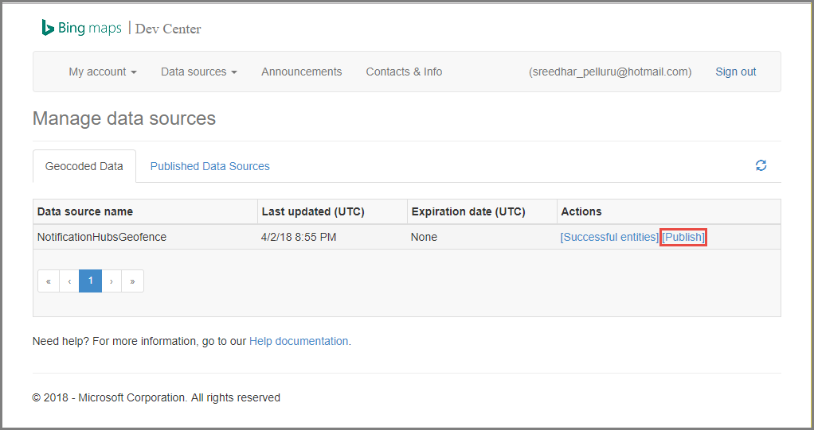
8. Switch to the **Published Data Sources** tab, and confirm that you see your data source in the list.

    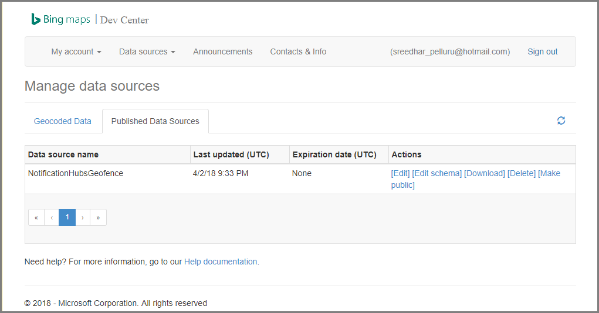
9. Select **Edit**. You see (at a glance) what locations you introduced in the data.

    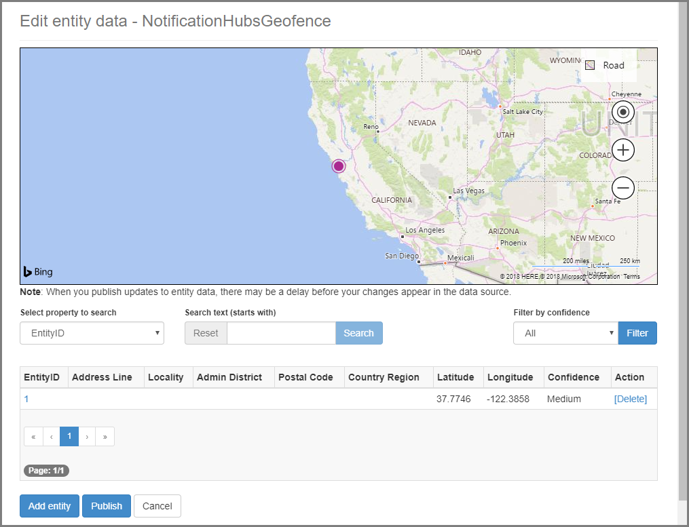

    At this point, the portal does not show you the boundaries for the geofence that you created – all you need is confirmation that the location specified is in the right vicinity.
10. Now you have all the requirements for the data source. To get the details on the request URL for the API call, in the Bing Maps Dev Center, choose **Data sources** and select **Data Source Information**.

    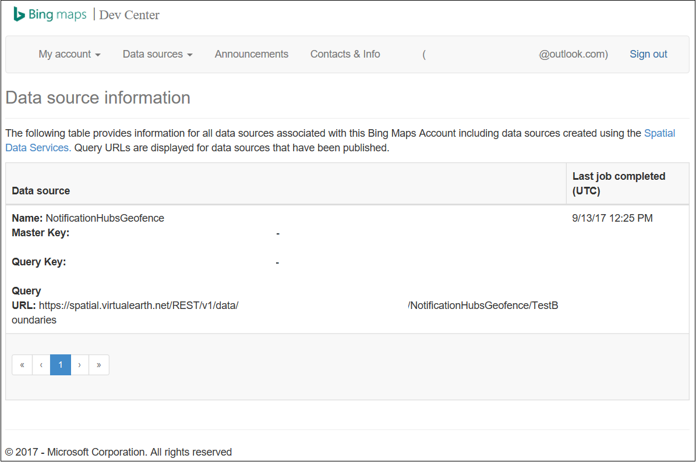

    The **Query URL** is the endpoint against which you can execute queries to check whether the device is currently within the boundaries of a location or not. To perform this check, you just execute a GET call against the query URL, with the following parameters appended:

    ```text
    ?spatialFilter=intersects(%27POINT%20LONGITUDE%20LATITUDE)%27)&$format=json&key=QUERY_KEY
    ```

    Bing Maps automatically performs the calculations to see whether the device is within the geofence. Once you execute the request through a browser (or cURL), you get a standard JSON response:

    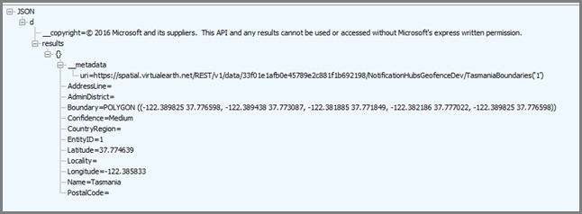

    This response only happens when the point is actually within the designated boundaries. If it is not, you get an empty **results** bucket:

    

## Set up the UWP application

1. In Visual Studio, start a new project of type **Blank App (Universal Windows)**.

    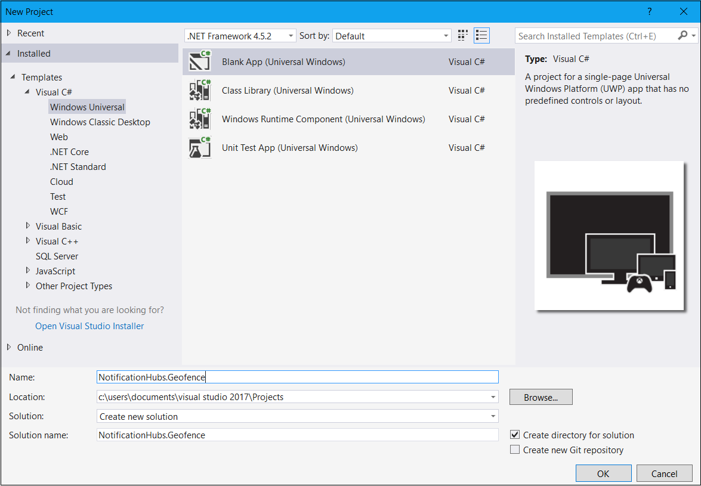

    Once the project creation is complete, you should have the harness for the app itself. Now let’s set up everything for the geo-fencing infrastructure. Because you are going to use Bing services for this solution, there is a public REST API endpoint that allows you to query specific location frames:

    ```text
    http://spatial.virtualearth.net/REST/v1/data/
    ```
    Specify the following parameters to get it working:

   * **Data Source ID** and **Data Source Name** – in Bing Maps API, data sources contain various bucketed metadata, such as locations and business hours of operation.  
   * **Entity Name** – the entity you want to use as a reference point for the notification.
   * **Bing Maps API Key** – The key that you obtained earlier when you created the Bing Dev Center account.

     Now that you have the data source ready, you can start working on the UWP application.
2. Enable location services for your application. Open the `Package.appxmanifest` file in **Solution Explorer**.

    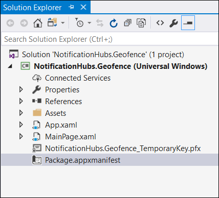
3. In the package properties tab that just opened, switch to the **Capabilities** tab, and select **Location**.

    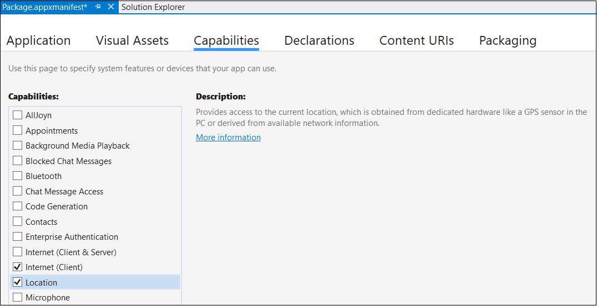
4. Create a new folder in your solution named `Core`, and add a new file within it, named `LocationHelper.cs`:

    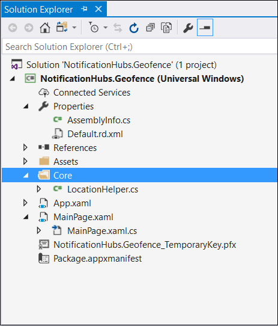

    The `LocationHelper` class has code to obtain the user location through the system API:

    ```csharp
    using System;
    using System.Threading.Tasks;
    using Windows.Devices.Geolocation;

    namespace NotificationHubs.Geofence.Core
    {
        public class LocationHelper
        {
            private static readonly uint AppDesiredAccuracyInMeters = 10;

            public async static Task<Geoposition> GetCurrentLocation()
            {
                var accessStatus = await Geolocator.RequestAccessAsync();
                switch (accessStatus)
                {
                    case GeolocationAccessStatus.Allowed:
                        {
                            Geolocator geolocator = new Geolocator { DesiredAccuracyInMeters = AppDesiredAccuracyInMeters };

                            return await geolocator.GetGeopositionAsync();
                        }
                    default:
                        {
                            return null;
                        }
                }
            }

        }
    }
    ```

    To learn more about getting the user’s location in UWP apps, see[Get the user's location](https://msdn.microsoft.com/library/windows/apps/mt219698.aspx).
5. To check that the location acquisition is actually working, open the code side of your main page (`MainPage.xaml.cs`). Create a new event handler for the `Loaded` event in the `MainPage` constructor.

    ```csharp
    public MainPage()
    {
        this.InitializeComponent();
        this.Loaded += MainPage_Loaded;
    }
    ```

    The implementation of the event handler is as follows:

    ```csharp
    private async void MainPage_Loaded(object sender, RoutedEventArgs e)
    {
        var location = await LocationHelper.GetCurrentLocation();

        if (location != null)
        {
            Debug.WriteLine(string.Concat(location.Coordinate.Longitude,
                " ", location.Coordinate.Latitude));
        }
    }
    ```
6. Run the application and allow it to access your location.

    
7. Once the application launches, you should be able to see the coordinates in the **Output** window:

    

    Now you know that location acquisition works, you can remove the Loaded event handler if you like because you won’t be using it anymore.
8. The next step is to capture location changes. In the `LocationHelper` class, add the event handler for `PositionChanged`:

    ```csharp
    geolocator.PositionChanged += Geolocator_PositionChanged;
    ```

    The implementation shows the location coordinates in the **Output** window:

    ```csharp
    private static async void Geolocator_PositionChanged(Geolocator sender, PositionChangedEventArgs args)
    {
        await CoreApplication.MainView.CoreWindow.Dispatcher.RunAsync(CoreDispatcherPriority.Normal, () =>
        {
            Debug.WriteLine(string.Concat(args.Position.Coordinate.Longitude, " ", args.Position.Coordinate.Latitude));
        });
    }
    ```

## Set up the backend

1. Download the [.NET Backend Sample from GitHub](https://github.com/Azure/azure-notificationhubs-samples/tree/master/dotnet/NotifyUsers).
2. Once the download completes, open the `NotifyUsers` folder, and then open `NotifyUsers.sln` file in Visual Studio.
3. Set the `AppBackend` project as the **StartUp Project** and launch it.

    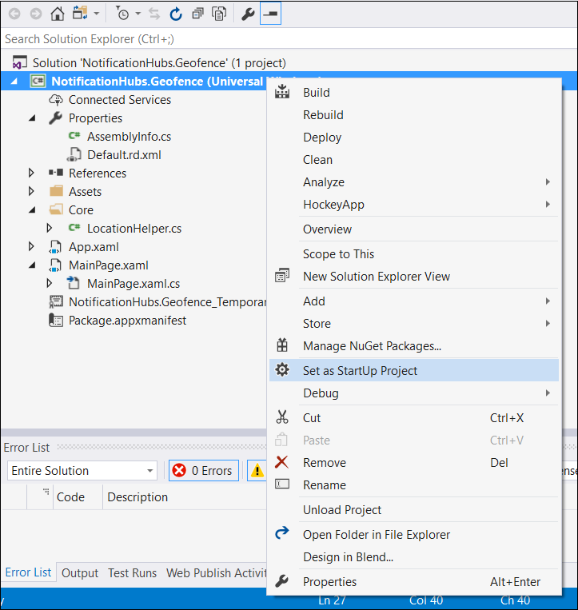

    The project is already configured to send push notifications to target devices, so you need to do only two things – specify right connection string for the notification hub and add boundary identification to send the notification only when the user is within the geofence.

4. To configure the connection string, in the `Models` folder open `Notifications.cs`. The `NotificationHubClient.CreateClientFromConnectionString` function should contain the information about your notification hub that you can get in the [Azure portal](https://portal.azure.com) (look inside the **Access Policies** page in **Settings**). Save the updated configuration file.
5. Create a model for the Bing Maps API result. The easiest way to do that is to open the `Models` folder and choose **Add** > **Class**. Name it `GeofenceBoundary.cs`. Once done, copy the JSON from the API response that you got in the first section. In Visual Studio, use **Edit** > **Paste Special** > **Paste JSON as Classes**.

    This way you ensure that the object is deserialized exactly as it was intended. Your resulting class set should resemble the following class:

    ```csharp
    namespace AppBackend.Models
    {
        public class Rootobject
        {
            public D d { get; set; }
        }

        public class D
        {
            public string __copyright { get; set; }
            public Result[] results { get; set; }
        }

        public class Result
        {
            public __Metadata __metadata { get; set; }
            public string EntityID { get; set; }
            public string Name { get; set; }
            public float Longitude { get; set; }
            public float Latitude { get; set; }
            public string Boundary { get; set; }
            public string Confidence { get; set; }
            public string Locality { get; set; }
            public string AddressLine { get; set; }
            public string AdminDistrict { get; set; }
            public string CountryRegion { get; set; }
            public string PostalCode { get; set; }
        }

        public class __Metadata
        {
            public string uri { get; set; }
        }
    }
    ```
6. Next, open `Controllers` > `NotificationsController.cs`. Update the Post call to account for the target longitude and latitude. To do so, add two strings to the function signature – `latitude` and `longitude`.

    ```csharp
    public async Task<HttpResponseMessage> Post(string pns, [FromBody]string message, string to_tag, string latitude, string longitude)
    ```
7. Create a new class within the project called `ApiHelper.cs` – you use it to connect to Bing to check point boundary intersections. Implement a `IsPointWithinBounds` function as shown in the following code:

    ```csharp
    public class ApiHelper
    {
        public static readonly string ApiEndpoint = "{YOUR_QUERY_ENDPOINT}?spatialFilter=intersects(%27POINT%20({0}%20{1})%27)&$format=json&key={2}";
        public static readonly string ApiKey = "{YOUR_API_KEY}";

        public static bool IsPointWithinBounds(string longitude,string latitude)
        {
            var json = new WebClient().DownloadString(string.Format(ApiEndpoint, longitude, latitude, ApiKey));
            var result = JsonConvert.DeserializeObject<Rootobject>(json);
            if (result.d.results != null && result.d.results.Count() > 0)
            {
                return true;
            }
            else
            {
                return false;
            }
        }
    }
    ```

    > [!IMPORTANT]
    > Make sure to substitute the API endpoint with the query URL that you obtained earlier from the Bing Dev Center (same applies to the API key).

    If there are results to the query, that means that the specified point is within the boundaries of the geofence, so the function returns `true`. If there are no results, Bing is telling you that the point is outside the lookup frame, so the function returns `false`.
8. In `NotificationsController.cs`, create a check right before the switch statement:

    ```csharp
    if (ApiHelper.IsPointWithinBounds(longitude, latitude))
    {
        switch (pns.ToLower())
        {
            case "wns":
                //// Windows 8.1 / Windows Phone 8.1
                var toast = @"<toast><visual><binding template=""ToastText01""><text id=""1"">" +
                            "From " + user + ": " + message + "</text></binding></visual></toast>";
                outcome = await Notifications.Instance.Hub.SendWindowsNativeNotificationAsync(toast, userTag);

                // Windows 10 specific Action Center support
                toast = @"<toast><visual><binding template=""ToastGeneric""><text id=""1"">" +
                            "From " + user + ": " + message + "</text></binding></visual></toast>";
                outcome = await Notifications.Instance.Hub.SendWindowsNativeNotificationAsync(toast, userTag);

                break;
        }
    }
    ```

## Test push notifications in the UWP app

1. In the UWP app, you should now be able to test notifications. Within the `LocationHelper` class, create a new function – `SendLocationToBackend`:

    ```csharp
    public static async Task SendLocationToBackend(string pns, string userTag, string message, string latitude, string longitude)
    {
        var POST_URL = "http://localhost:8741/api/notifications?pns=" +
            pns + "&to_tag=" + userTag + "&latitude=" + latitude + "&longitude=" + longitude;

        using (var httpClient = new HttpClient())
        {
            try
            {
                await httpClient.PostAsync(POST_URL, new StringContent("\"" + message + "\"",
                    System.Text.Encoding.UTF8, "application/json"));
            }
            catch (Exception ex)
            {
                Debug.WriteLine(ex.Message);
            }
        }
    }
    ```

    > [!NOTE]
    > Set the `POST_URL` to the location of your deployed web application. For now, it’s OK to run it locally, but as you work on deploying a public version, you need to host it with an external provider.
2. Register the UWP app for push notifications. In Visual Studio, choose **Project** > **Store** > **Associate app with the store**.

    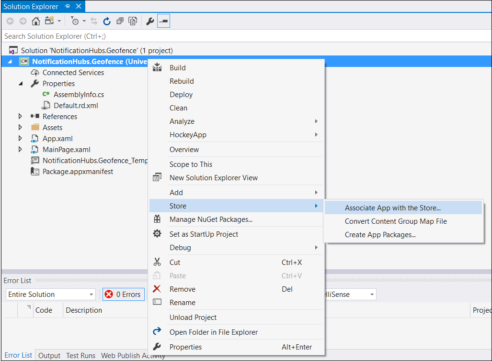
3. Once you sign in to your developer account, make sure you select an existing app or create a new one and associate the package with it.
4. Go to the Dev Center and open the app that you created. Choose **Services** > **Push Notifications** > **Live Services site**.

    
5. On the site, take note of the **Application Secret** and the **Package SID**. You need both in the Azure portal – open your notification hub, choose **Settings** > **Notification Services** > **Windows (WNS)** and enter the information in the required fields.

    
6. Choose **Save**.
7. Open **References** in **Solution Explorer** and select **Manage NuGet Packages**. Add a reference to the **Microsoft Azure Service Bus managed library** – simply search for `WindowsAzure.Messaging.Managed` and add it to your project.

    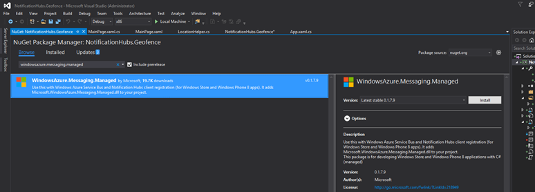
8. For testing purposes, create the `MainPage_Loaded` event handler once again, and add this code snippet to it:

    ```csharp
    var channel = await PushNotificationChannelManager.CreatePushNotificationChannelForApplicationAsync();

    var hub = new NotificationHub("HUB_NAME", "HUB_LISTEN_CONNECTION_STRING");
    var result = await hub.RegisterNativeAsync(channel.Uri);

    // Displays the registration ID so you know it was successful
    if (result.RegistrationId != null)
    {
        Debug.WriteLine("Reg successful.");
    }
    ```

    The code registers the app with the notification hub. You are ready to go!
9. In `LocationHelper`, inside the `Geolocator_PositionChanged` handler, you can add a piece of test code that forcefully puts the location inside the geofence:

    ```csharp
    await LocationHelper.SendLocationToBackend("wns", "TEST_USER", "TEST", "37.7746", "-122.3858");
    ```

10. Because you are not passing the real coordinates (which might not be within the boundaries at the moment) and are using predefined test values, you see a notification show up on update:

    

## Next steps

There are a couple of steps that you might need to follow to make the solution production-ready.

1. First, you need to ensure that geofences are dynamic. It requires some extra work with the Bing API to be able to upload new boundaries within the existing data source. For more information, see [Bing Spatial Data Services API documentation](https://msdn.microsoft.com/library/ff701734.aspx).
2. Second, as you are working to ensure that the delivery is done to the right participants, you might want to target them via [tagging](notification-hubs-tags-segment-push-message.md).

The solution shown in this tutorial describes a scenario in which you might have a wide variety of target platforms, so it does not limit the geofencing to system-specific capabilities. That said, the Universal Windows Platform offers capabilities to [detect geofences right out-of-the-box](https://msdn.microsoft.com/windows/uwp/maps-and-location/set-up-a-geofence).
