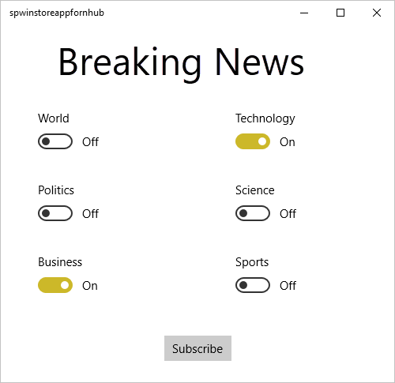
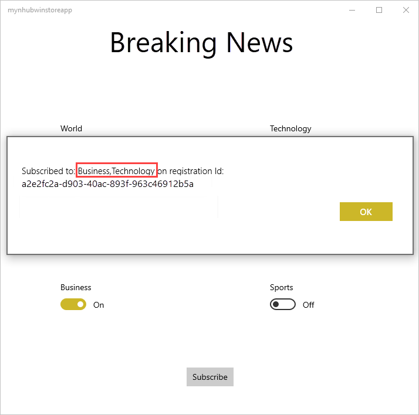

# Tutorial: Send notifications to specific devices running Universal Windows Platform applications

[!INCLUDE [notification-hubs-selector-breaking-news](../../includes/notification-hubs-selector-breaking-news.md)]

## Overview

This tutorial shows you how to use Azure Notification Hubs to broadcast breaking news notifications. This tutorial covers Windows Store or Windows Phone 8.1 (non-Silverlight) applications. If you're targeting Windows Phone 8.1 Silverlight, see [Push notifications to specific Windows Phone devices by using Azure Notification Hubs](notification-hubs-windows-phone-push-xplat-segmented-mpns-notification.md).

In this tutorial, you learn how to use Azure Notification Hubs to push notifications to specific Windows devices running a Universal Windows Platform (UWP) application. After you complete the tutorial, you can register for the breaking news categories that you're interested in. You'll receive push notifications for those categories only.

To enable broadcast scenarios, include one or more *tags* when you create a registration in the notification hub. When notifications are sent to a tag, all devices that are registered for the tag receive the notification. For more information about tags, see [Routing and tag expressions](notification-hubs-tags-segment-push-message.md).

> [!NOTE]
> Windows Store and Windows Phone project versions 8.1 and earlier are not supported in Visual Studio 2019. For more information, see [Visual Studio 2019 Platform Targeting and Compatibility](/visualstudio/releases/2019/compatibility).

In this tutorial, you do the following tasks:

> [!div class="checklist"]
> * Add category selection to the mobile app
> * Register for notifications
> * Send tagged notifications
> * Run the app and generate notifications

## Prerequisites

Complete the [Tutorial: Send notifications to Universal Windows Platform apps by using Azure Notification Hubs][get-started] before starting this tutorial.  

## Add category selection to the app

The first step is to add UI elements to your existing main page so that users can select categories to register. The selected categories are stored on the device. When the app starts, it creates a device registration in your notification hub, with the selected categories as tags.

1. Open the *MainPage.xaml* project file, and then copy the following code in the `Grid` element:

    ```xml
    <Grid>
        <Grid.RowDefinitions>
            <RowDefinition/>
            <RowDefinition/>
            <RowDefinition/>
            <RowDefinition/>
            <RowDefinition/>
        </Grid.RowDefinitions>
        <Grid.ColumnDefinitions>
            <ColumnDefinition/>
            <ColumnDefinition/>
        </Grid.ColumnDefinitions>
        <TextBlock Grid.Row="0" Grid.Column="0" Grid.ColumnSpan="2"  TextWrapping="Wrap" Text="Breaking News" FontSize="42" VerticalAlignment="Top" HorizontalAlignment="Center"/>
        <ToggleSwitch Header="World" Name="WorldToggle" Grid.Row="1" Grid.Column="0" HorizontalAlignment="Center"/>
        <ToggleSwitch Header="Politics" Name="PoliticsToggle" Grid.Row="2" Grid.Column="0" HorizontalAlignment="Center"/>
        <ToggleSwitch Header="Business" Name="BusinessToggle" Grid.Row="3" Grid.Column="0" HorizontalAlignment="Center"/>
        <ToggleSwitch Header="Technology" Name="TechnologyToggle" Grid.Row="1" Grid.Column="1" HorizontalAlignment="Center"/>
        <ToggleSwitch Header="Science" Name="ScienceToggle" Grid.Row="2" Grid.Column="1" HorizontalAlignment="Center"/>
        <ToggleSwitch Header="Sports" Name="SportsToggle" Grid.Row="3" Grid.Column="1" HorizontalAlignment="Center"/>
        <Button Name="SubscribeButton" Content="Subscribe" HorizontalAlignment="Center" Grid.Row="4" Grid.Column="0" Grid.ColumnSpan="2" Click="SubscribeButton_Click"/>
    </Grid>
    ```

1. In **Solution Explorer**, right-click the project, select **Add** > **Class**. In **Add New Item**, name the class *Notifications*, and select **Add**. If necessary, add the `public` modifier to the class definition.

1. Add the following `using` statements to the new file:

    ```csharp
    using Windows.Networking.PushNotifications;
    using Microsoft.WindowsAzure.Messaging;
    using Windows.Storage;
    using System.Threading.Tasks;
    ```

1. Copy the following code to the new `Notifications` class:

    ```csharp
    private NotificationHub hub;

    public Notifications(string hubName, string listenConnectionString)
    {
        hub = new NotificationHub(hubName, listenConnectionString);
    }

    public async Task<Registration> StoreCategoriesAndSubscribe(IEnumerable<string> categories)
    {
        ApplicationData.Current.LocalSettings.Values["categories"] = string.Join(",", categories);
        return await SubscribeToCategories(categories);
    }

    public IEnumerable<string> RetrieveCategories()
    {
        var categories = (string) ApplicationData.Current.LocalSettings.Values["categories"];
        return categories != null ? categories.Split(','): new string[0];
    }

    public async Task<Registration> SubscribeToCategories(IEnumerable<string> categories = null)
    {
        var channel = await PushNotificationChannelManager.CreatePushNotificationChannelForApplicationAsync();

        if (categories == null)
        {
            categories = RetrieveCategories();
        }

        // Using a template registration to support notifications across platforms.
        // Any template notifications that contain messageParam and a corresponding tag expression
        // will be delivered for this registration.

        const string templateBodyWNS = "<toast><visual><binding template=\"ToastText01\"><text id=\"1\">$(messageParam)</text></binding></visual></toast>";

        return await hub.RegisterTemplateAsync(channel.Uri, templateBodyWNS, "simpleWNSTemplateExample",
                categories);
    }
    ```

    This class uses the local storage to store the categories of news that this device must receive. Instead of calling the `RegisterNativeAsync` method, call `RegisterTemplateAsync` to register for the categories by using a template registration.

    If you want to register more than one template, provide a template name, for example, *simpleWNSTemplateExample*. You name the templates so that you can update or delete them. You might register more than one template to have one for toast notifications and one for tiles.

    >[!NOTE]
    > With Notification Hubs, a device can register multiple templates by using the same tag. In this case, an incoming message that targets the tag results in multiple notifications being delivered to the device, one for each template. This process enables you to display the same message in multiple visual notifications, such as both as a badge and as a toast notification in a Windows Store app.

    For more information, see [Templates](notification-hubs-templates-cross-platform-push-messages.md).

1. In the *App.xaml.cs* project file, add the following property to the `App` class:

    ```csharp
    public Notifications notifications = new Notifications("<hub name>", "<connection string with listen access>");
    ```

    You use this property to create and access a `Notifications` instance.

    In the code, replace the `<hub name>` and `<connection string with listen access>` placeholders with your notification hub name and the connection string for **DefaultListenSharedAccessSignature**, which you obtained earlier.

   > [!NOTE]
   > Because credentials that are distributed with a client app are not usually secure, distribute only the key for *listen* access with your client app. With listen access, your app can register for notifications, but existing registrations cannot be modified, and notifications cannot be sent. The full access key is used in a secured back-end service for sending notifications and changing existing registrations.

1. In the *MainPage.xaml.cs* file, add the following line:

    ```csharp
    using Windows.UI.Popups;
    ```

1. In the *MainPage.xaml.cs* file, add the following method:

    ```csharp
    private async void SubscribeButton_Click(object sender, RoutedEventArgs e)
    {
        var categories = new HashSet<string>();
        if (WorldToggle.IsOn) categories.Add("World");
        if (PoliticsToggle.IsOn) categories.Add("Politics");
        if (BusinessToggle.IsOn) categories.Add("Business");
        if (TechnologyToggle.IsOn) categories.Add("Technology");
        if (ScienceToggle.IsOn) categories.Add("Science");
        if (SportsToggle.IsOn) categories.Add("Sports");

        var result = await ((App)Application.Current).notifications.StoreCategoriesAndSubscribe(categories);

        var dialog = new MessageDialog("Subscribed to: " + string.Join(",", categories) + " on registration Id: " + result.RegistrationId);
        dialog.Commands.Add(new UICommand("OK"));
        await dialog.ShowAsync();
    }
    ```

    This method creates a list of categories and uses the `Notifications` class to store the list in the local storage. It also registers the corresponding tags with your notification hub. When the categories change, the registration is re-created with the new categories.

Your app can now store a set of categories in local storage on the device. The app registers with the notification hub whenever users change the category selection.

## Register for notifications

In this section, you register with the notification hub on startup by using the categories that you've stored in local storage.

> [!NOTE]
> Because the channel URI that's assigned by the Windows Notification Service (WNS) can change at any time, you should register for notifications frequently to avoid notification failures. This example registers for notification every time that the app starts. For apps that you run frequently, say, more than once a day, you can probably skip registration to preserve bandwidth if less than a day has passed since the previous registration.

1. To use the `notifications` class to subscribe based on categories, open the *App.xaml.cs* file, and then update the `InitNotificationsAsync` method.

    ```csharp
    // *** Remove or comment out these lines ***
    //var channel = await PushNotificationChannelManager.CreatePushNotificationChannelForApplicationAsync();
    //var hub = new NotificationHub("your hub name", "your listen connection string");
    //var result = await hub.RegisterNativeAsync(channel.Uri);

    var result = await notifications.SubscribeToCategories();
    ```

    This process ensures that when the app starts, it retrieves the categories from local storage. It then requests registration of these categories. You created the `InitNotificationsAsync` method as part of the [Send notifications to Universal Windows Platform apps by using Azure Notification Hubs][get-started] tutorial.
2. In the *MainPage.xaml.cs* project file, add the following code to the `OnNavigatedTo` method:

    ```csharp
    protected override void OnNavigatedTo(NavigationEventArgs e)
    {
        var categories = ((App)Application.Current).notifications.RetrieveCategories();

        if (categories.Contains("World")) WorldToggle.IsOn = true;
        if (categories.Contains("Politics")) PoliticsToggle.IsOn = true;
        if (categories.Contains("Business")) BusinessToggle.IsOn = true;
        if (categories.Contains("Technology")) TechnologyToggle.IsOn = true;
        if (categories.Contains("Science")) ScienceToggle.IsOn = true;
        if (categories.Contains("Sports")) SportsToggle.IsOn = true;
    }
    ```

    This code updates the main page, based on the status of previously saved categories.

The app is now complete. It can store a set of categories in the device local storage. When users change the category selection, the saved categories are used to register with the notification hub. In the next section, you define a back end that can send category notifications to this app.

## Run the UWP app

1. In Visual Studio, select F5 to compile and start the app. The app UI provides a set of toggles that lets you choose the categories to subscribe to.

   

1. Enable one or more category toggles, and then select **Subscribe**.

   The app converts the selected categories into tags and requests a new device registration for the selected tags from the notification hub. The app displays the registered categories in a dialog box.

    

## Create a console app to send tagged notifications

[!INCLUDE [notification-hubs-send-categories-template](../../includes/notification-hubs-send-categories-template.md)]

## Run the console app to send tagged notifications

Run the app created in the previous section. Notifications for the selected categories appear as toast notifications.

## Next steps

In this article, you learned how to broadcast breaking news by category. The back-end application pushes tagged notifications to devices that have registered to receive notifications for that tag. To learn how to push notifications to specific users independent of what device they use, advance to the following tutorial:

> [!div class="nextstepaction"]
> [Push localized notifications to Windows apps by using Azure Notification Hubs](notification-hubs-windows-store-dotnet-xplat-localized-wns-push-notification.md)

<!-- Anchors. -->
[Add category selection to the app]: #adding-categories
[Register for notifications]: #register
[Send notifications from your back-end]: #send
[Run the app and generate notifications]: #test-app
[Next Steps]: #next-steps

<!-- URLs.-->
[get-started]: notification-hubs-windows-store-dotnet-get-started-wns-push-notification.md
[Use Notification Hubs to broadcast localized breaking news]: notification-hubs-windows-store-dotnet-xplat-localized-wns-push-notification.md
[Notify users with Notification Hubs]: notification-hubs-aspnet-backend-windows-dotnet-wns-notification.md
[Mobile Service]: /develop/mobile/tutorials/get-started/
[Notification Hubs Guidance]: /previous-versions/azure/azure-services/jj927170(v=azure.100)
[Notification Hubs How-To for Windows Store]: /previous-versions/azure/azure-services/jj927170(v=azure.100)
[Submit an app page]: https://go.microsoft.com/fwlink/p/?LinkID=266582
[My Applications]: https://go.microsoft.com/fwlink/p/?LinkId=262039
[Live SDK for Windows]: https://go.microsoft.com/fwlink/p/?LinkId=262253
[wns object]: https://go.microsoft.com/fwlink/p/?LinkId=260591
