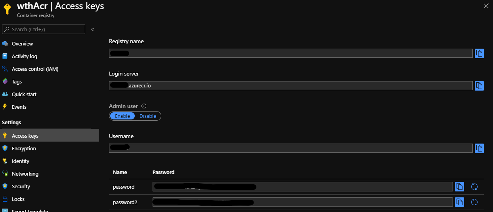

# Use Azure Container Registry with Azure Red Hat OpenShift (ARO)

Azure Container Registry (ACR) is a managed container registry service that you can use to store private Docker container images with enterprise capabilities such as geo-replication. To access the ACR from an ARO cluster, the cluster can authenticate with ACR by storing Docker login credentials in a Kubernetes secret.  Likewise, an ARO  cluster can use an imagePullSecret in the pod spec to authenticate against the registry when pulling the image. In this article, you'll learn how to set up an Azure Container Registry with an Azure Red Hat OpenShift cluster to store and pull private Docker container images.

## Prerequisites

This guide assumes that you have an existing Azure Container Registry. If you do not, use the Azure portal or [Azure CLI instructions](../container-registry/container-registry-get-started-azure-cli.md) to create a container registry.

This article also assumes that you have an existing Azure Red Hat OpenShift cluster and have the `oc` CLI installed. If not, follow instructions in the [Create ARO cluster tutorial](tutorial-create-cluster.md).

## Get a pull secret

You'll need a pull secret from ACR to access the registry from your ARO cluster.

To get your pull secret credentials, you can use either the Azure portal or the Azure CLI.

If using the Azure portal, navigate to your ACR instance, and select **Access Keys**.  Your `docker-username` is the name of your container registry, use either password or password2 for `docker-password`.



Instead, you can use the Azure CLI to get these credentials:
```azurecli
az acr credential show -n <your registry name>
```

## Create the Kubernetes secret

Now, we'll use these credentials to create a Kubernetes secret. Execute the following command with your ACR credentials:

```
oc create secret docker-registry \
    --docker-server=<your registry name>.azurecr.io \
    --docker-username=<your registry name> \
    --docker-password=******** \
    --docker-email=unused \
    acr-secret
```

>[!NOTE]
>This secret will be stored in the current OpenShift Project (Kubernetes Namespace) and will only be referenceable by pods created in that Project.  See this [document](https://docs.openshift.com/container-platform/4.4/openshift_images/managing_images/using-image-pull-secrets.html) for further instructions on creating a cluster wide pull secret.

## Create a pod using a private registry image

Now that we've connected your ARO cluster to your ACR, let's pull an image from your ACR to create a pod.

Start with a podSpec and specify the secret you created as an imagePullSecret:

```yaml
apiVersion: v1
kind: Pod
metadata:
  name: hello-world
spec:
  containers:
  - name: hello-world
    image: <your registry name>.azurecr.io/hello-world:v1
  imagePullSecrets:
  - name: acr-secret
```

To test that your pod is up and running, execute this command and wait until the status is **Running**:

```bash
$ oc get pods --watch
NAME         READY   STATUS    RESTARTS   AGE
hello-world  1/1     Running   0          30s
```

## Next steps

* [Azure Container Registry](../container-registry/container-registry-concepts.md)
* [Quickstart: Create a private container registry using the Azure CLI](../container-registry/container-registry-get-started-azure-cli.md)
