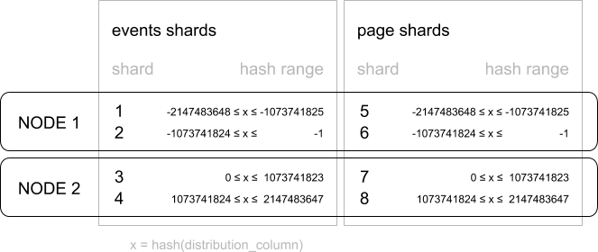
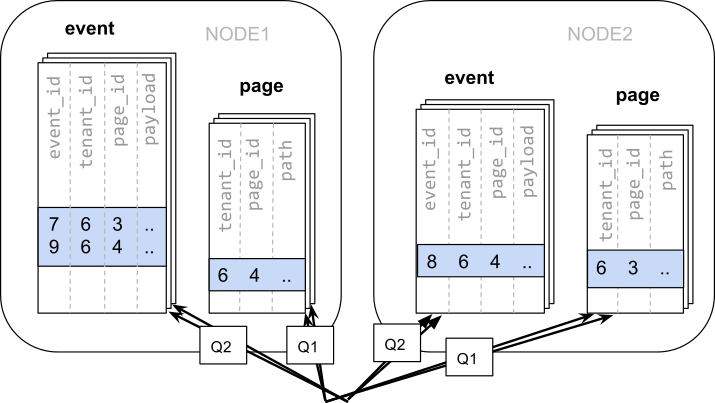
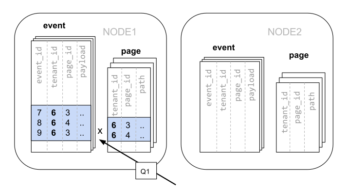

# Table colocation in Azure Database for PostgreSQL – Hyperscale (Citus)

Colocation means storing related information together on the same nodes. Queries can go fast when all the necessary data is available without any network traffic. Colocating related data on different nodes allows queries to run efficiently in parallel on each node.

## Data colocation for hash-distributed tables

In Azure Database for PostgreSQL – Hyperscale (Citus) Preview, a row is stored in a shard if the hash of the value in the distribution column falls within the shard's hash range. Shards with the same hash range are always placed on the same node. Rows with equal distribution column values are always on the same node across tables.



## A practical example of colocation

Consider the following tables that might be part of a multi-tenant web
analytics SaaS:

```sql
CREATE TABLE event (
  tenant_id int,
  event_id bigint,
  page_id int,
  payload jsonb,
  primary key (tenant_id, event_id)
);

CREATE TABLE page (
  tenant_id int,
  page_id int,
  path text,
  primary key (tenant_id, page_id)
);
```

Now we want to answer queries that might be issued by a customer-facing
dashboard. An example query is "Return the number of visits in the past week for
all pages starting with '/blog' in tenant six."

If our data was in the Single-Server deployment option, we could easily express
our query by using the rich set of relational operations offered by SQL:

```sql
SELECT page_id, count(event_id)
FROM
  page
LEFT JOIN  (
  SELECT * FROM event
  WHERE (payload->>'time')::timestamptz >= now() - interval '1 week'
) recent
USING (tenant_id, page_id)
WHERE tenant_id = 6 AND path LIKE '/blog%'
GROUP BY page_id;
```

As long as the [working set](https://en.wikipedia.org/wiki/Working_set) for this query fits in memory, a single-server table is an appropriate solution. Let's consider the opportunities of scaling the data model with the Hyperscale (Citus) deployment option.

### Distribute tables by ID

Single-server queries start slowing down as the number of tenants and the data stored for each tenant grows. The working set stops fitting in memory and CPU becomes a bottleneck.

In this case, we can shard the data across many nodes by using Hyperscale (Citus). The
first and most important choice we need to make when we decide to shard is the
distribution column. Let's start with a naive choice of using `event_id` for
the event table and `page_id` for the `page` table:

```sql
-- naively use event_id and page_id as distribution columns

SELECT create_distributed_table('event', 'event_id');
SELECT create_distributed_table('page', 'page_id');
```

When data is dispersed across different workers, we can't perform a join like we would on a single PostgreSQL node. Instead, we need to issue two queries:

```sql
-- (Q1) get the relevant page_ids
SELECT page_id FROM page WHERE path LIKE '/blog%' AND tenant_id = 6;

-- (Q2) get the counts
SELECT page_id, count(*) AS count
FROM event
WHERE page_id IN (/*…page IDs from first query…*/)
  AND tenant_id = 6
  AND (payload->>'time')::date >= now() - interval '1 week'
GROUP BY page_id ORDER BY count DESC LIMIT 10;
```

Afterwards, the results from the two steps need to be combined by the
application.

Running the queries must consult data in shards scattered across nodes.



In this case, the data distribution creates substantial drawbacks:

-   Overhead from querying each shard and running multiple queries.
-   Overhead of Q1 returning many rows to the client.
-   Q2 becomes large.
-   The need to write queries in multiple steps requires changes in the application.

The data is dispersed, so the queries can be parallelized. It's
only beneficial if the amount of work that the query does is substantially
greater than the overhead of querying many shards.

### Distribute tables by tenant

In Hyperscale (Citus), rows with the same distribution column value are guaranteed to
be on the same node. Starting over, we can create our tables with `tenant_id`
as the distribution column.

```sql
-- co-locate tables by using a common distribution column
SELECT create_distributed_table('event', 'tenant_id');
SELECT create_distributed_table('page', 'tenant_id', colocate_with => 'event');
```

Now Hyperscale (Citus) can answer the original single-server query without modification (Q1):

```sql
SELECT page_id, count(event_id)
FROM
  page
LEFT JOIN  (
  SELECT * FROM event
  WHERE (payload->>'time')::timestamptz >= now() - interval '1 week'
) recent
USING (tenant_id, page_id)
WHERE tenant_id = 6 AND path LIKE '/blog%'
GROUP BY page_id;
```

Because of filter and join on tenant_id, Hyperscale (Citus) knows that the entire
query can be answered by using the set of colocated shards that contain the data
for that particular tenant. A single PostgreSQL node can answer the query in
a single step.



In some cases, queries and table schemas must be changed to include the tenant ID in unique constraints and join conditions. This change is usually straightforward.

## Next steps

- See how tenant data is colocated in the [multi-tenant tutorial](tutorial-design-database-hyperscale-multi-tenant.md).
