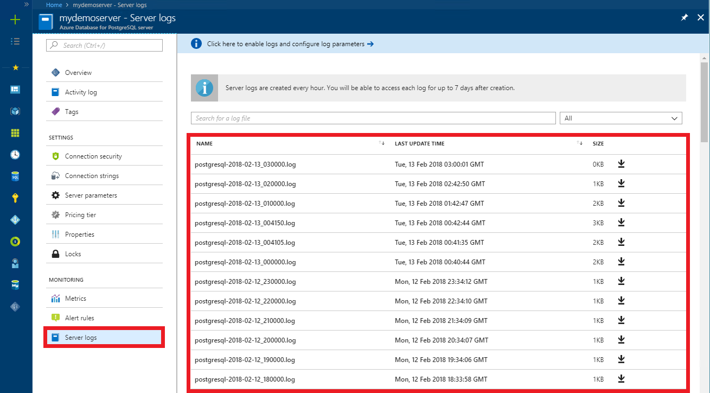
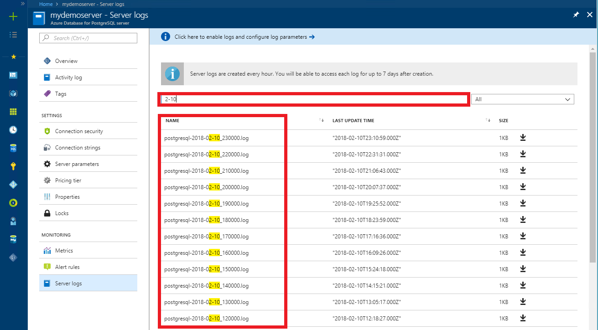
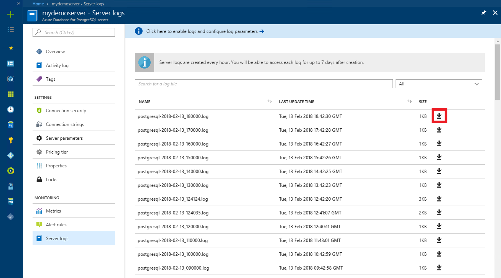

# Configure and access Azure Database for PostgreSQL - Single Server logs from the Azure portal

You can configure, list, and download the [Azure Database for PostgreSQL logs](concepts-server-logs.md) from the Azure portal.

## Prerequisites
The steps in this article require that you have [Azure Database for PostgreSQL server](quickstart-create-server-database-portal.md).

## Configure logging
Configure access to the query logs and error logs. 

1. Sign in to the [Azure portal](https://portal.azure.com/).

2. Select your Azure Database for PostgreSQL server.

3. Under the **Monitoring** section in the sidebar, select **Server logs**. 

   

4. To see the server parameters, select **Click here to enable logs and configure log parameters**.

5. Change the parameters that you need to adjust. All changes you make in this session are highlighted in purple.

   After you have changed the parameters, select **Save**. Or, you can discard your changes. 

   

From the **Server Parameters** page, you can return to the list of logs by closing the page.

## View list and download logs
After logging begins, you can view a list of available logs, and download individual log files. 

1. Open the Azure portal.

2. Select your Azure Database for PostgreSQL server.

3. Under the **Monitoring** section in the sidebar, select **Server logs**. The page shows a list of your log files.

   

   > [!TIP]
   > The naming convention of the log is **postgresql-yyyy-mm-dd_hh0000.log**. The date and time used in the file name is the time when the log was issued. The log files rotate every hour or 100 MB, whichever comes first.

4. If needed, use the search box to quickly narrow down to a specific log, based on date and time. The search is on the name of the log.

   

5. To download individual log files, select the down-arrow icon next to each log file in the table row.

   

## Next steps
- See [Access server logs in CLI](howto-configure-server-logs-using-cli.md) to learn how to download logs programmatically.
- Learn more about [server logs](concepts-server-logs.md) in Azure Database for PostgreSQL. 
- For more information about the parameter definitions and PostgreSQL logging, see the PostgreSQL documentation on [error reporting and logging](https://www.postgresql.org/docs/current/static/runtime-config-logging.html).

