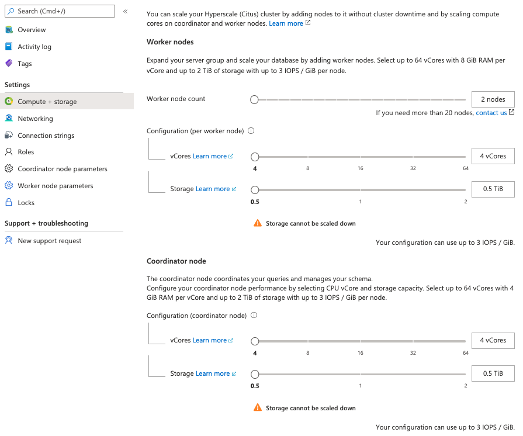

# Scale a Hyperscale (Citus) server group

Azure Database for PostgreSQL - Hyperscale (Citus) provides self-service
scaling to deal with increased load. The Azure portal makes it easy to add new
worker nodes.

To do so, go to the **Configure** tab in your Hyperscale (Citus) server group.
Drag the slider for **Worker node count** to change the value.



Click the "Save" button to make the changed value take effect.

> [!NOTE]
> Once increased and saved, the number of worker nodes cannot be decreased
> using the slider.
>
> Also, vCores and Storage cannot yet be adjusted on the coordinator or workers
> with this user interface. Open a support ticket if scaling compute on the
> coordinator or worker nodes is needed.

To take advantage of newly added nodes you must rebalance distributed table
[shards](concepts-hyperscale-distributed-data.md#shards), which means moving
some shards from existing nodes to the new ones. To start the shard rebalancer,
connect to the cluster coordinator node with psql and run:

```sql
SELECT rebalance_table_shards('distributed_table_name');
```

The `rebalance_table_shards` function rebalances all tables in the
[colocation](concepts-hyperscale-colocation.md) group of the table named in its
argument. Thus you do not have to call the function for every distributed
table, just call it on a representative table from each colocation group.

## Next steps

Learn more about server group [performance
options](concepts-hyperscale-configuration-options.md).
