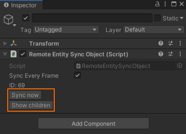

# Interact with Unity game objects and components

Azure Remote Rendering (ARR) is optimized for vast numbers of objects (see [Limitations](../../reference/limits.md)). While it's possible to manage large and complex hierarchies on the host, replicating them all in Unity on low-powered devices is unfeasible.

Therefore, when a model is loaded on the host, Azure Remote Rendering mirrors the information about the model structure on the client device (which will incur network traffic), but does not replicate the objects and components in Unity. Instead, it expects you to request the needed Unity game objects and components manually, such that you can limit the overhead to what is actually needed. This way you have more control over the client-side performance.

Consequently, the Unity integration of Azure Remote Rendering comes with additional functionality to replicate the Remote Rendering structure on demand.

## Load a model in Unity

When you load a model, you get a reference to the root object of the loaded model. This reference is not a Unity game object, but you can turn it into one using the extension method `Entity.GetOrCreateGameObject()`. That function expects an argument of type `UnityCreationMode`. If you pass `CreateUnityComponents`, the newly created Unity game object will additionally be populated with proxy components for all Remote Rendering components that exist on the host. It is recommended, though, to prefer `DoNotCreateUnityComponents`, to keep the overhead minimal.

### Load model with task

```cs
LoadModelAsync _pendingLoadTask = null;
void LoadModelWithTask()
{
    _pendingLoadTask = RemoteManagerUnity.CurrentSession.Actions.LoadModelFromSASAsync(new LoadModelFromSASParams("builtin://Engine"));

    _pendingLoadTask.Completed += (LoadModelAsync res) =>
    {
        // turn the root object into a Unity game object
        var gameObject = res.Result.Root?.GetOrCreateGameObject(UnityCreationMode.DoNotCreateUnityComponents);
        _pendingLoadTask = null;
    };

    // also listen to progress updates:
    _pendingLoadTask.ProgressUpdated += (float progress) =>
    {
        // progress is a fraction in [0..1] range
        int percentage = (int)(progress * 100.0f);
        // do something...
        // Since the updates are triggered by the main thread, we may access unity objects here.
    };
}
```

### Load model with Unity coroutines

```cs
IEnumerator LoadModelWithCoroutine()
{
    LoadModelAsync task = RemoteManagerUnity.CurrentSession.Actions.LoadModelFromSASAsync(new LoadModelFromSASParams("builtin://Engine"));

    while (!task.IsCompleted)
    {
        int percentage = (int)(task.Progress * 100.0f);
        yield return null;
    }

    if (!task.IsFaulted)
    {
        var gameObject = task.Result.Root?.GetOrCreateGameObject(UnityCreationMode.DoNotCreateUnityComponents);
    }

    task = null;
}
```

### Load model with await pattern

```cs
async void LoadModelWithAwait()
{
    var result = await RemoteManagerUnity.CurrentSession.Actions.LoadModelFromSASAsync(new LoadModelFromSASParams("builtin://Engine")).AsTask();
    var gameObject = result.Root?.GetOrCreateGameObject(UnityCreationMode.DoNotCreateUnityComponents);
}
```

The code samples above used the model loading path via SAS because the built-in model is loaded. Addressing the model via blob containers (using `LoadModelAsync` and `LoadModelParams`) works fully analogously.

## RemoteEntitySyncObject

Creating a Unity game object implicitly adds a `RemoteEntitySyncObject` component to the game object. This component is used to synchronize the entity transform to the server. By default `RemoteEntitySyncObject` requires the user to explicitly call `SyncToRemote()` to synchronize the local Unity state to the server. Enabling `SyncEveryFrame` will synchronize the object automatically.

Objects with a `RemoteEntitySyncObject` can have their remote children instantiated and shown in the Unity editor through the **:::no-loc text="Show children":::** button.



## Wrapper components

[Components](../../concepts/components.md) attached to Remote Rendering entities are exposed to Unity through proxy `MonoBehavior`s. These proxies represent the remote component in Unity, and forward all modifications to the host.

To create proxy Remote Rendering components, use the extension method `GetOrCreateArrComponent`:

```cs
var cutplane = gameObject.GetOrCreateArrComponent<ARRCutPlaneComponent>(RemoteManagerUnity.CurrentSession);
```

## Coupled lifetimes

The lifetime of a remote [entity](../../concepts/entities.md) and a Unity game object is coupled while they are bound through a `RemoteEntitySyncObject`. If you call `UnityEngine.Object.Destroy(...)` with such a game object, the remote entity will be removed as well.

To destroy the Unity game object, without affecting the remote entity, you first need to call `Unbind()` on the `RemoteEntitySyncObject`.

The same is true for all proxy components. To destroy only the client-side representation, you need to call `Unbind()` on the proxy component first:

```cs
var cutplane = gameObject.GetComponent<ARRCutPlaneComponent>();
if (cutplane != null)
{
    cutplane.Unbind();
    UnityEngine.Object.Destroy(cutplane);
}
```

## Next steps

* [Set up Remote Rendering for Unity](unity-setup.md)
* [Tutorial: Manipulate remote entities in Unity](../../tutorials/unity/manipulate-models/manipulate-models.md)
