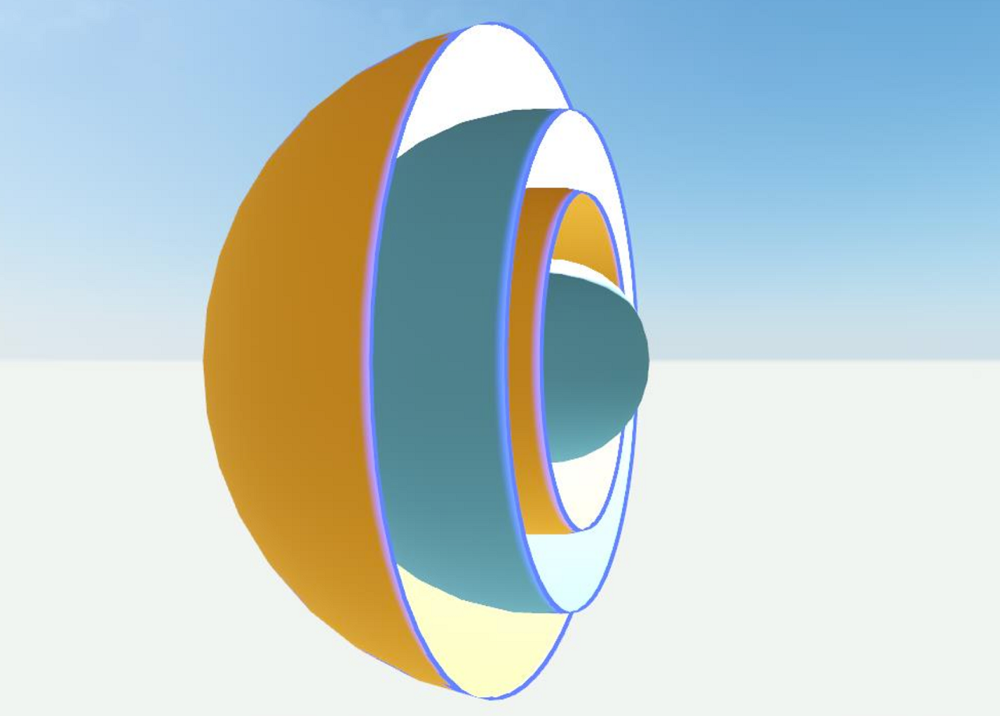

# Cut planes

A *cut plane* is a visual feature that clips pixels on one side of a virtual plane, revealing the inside of [meshes](../../concepts/meshes.md).
The image below demonstrates the effect. The left shows the original mesh, on the right one can look inside the mesh:


## CutPlaneComponent

You add a cut plane to the scene by creating a *CutPlaneComponent*. The location and orientation of the plane is determined by the component's owner [entity](../../concepts/entities.md).

```cs
void CreateCutPlane(RenderingSession session, Entity ownerEntity)
{
    CutPlaneComponent cutPlane = (CutPlaneComponent)session.Connection.CreateComponent(ObjectType.CutPlaneComponent, ownerEntity);
    cutPlane.Normal = Axis.X; // normal points along the positive x-axis of the owner object's orientation
    cutPlane.FadeColor = new Color4Ub(255, 0, 0, 128); // fade to 50% red
    cutPlane.FadeLength = 0.05f; // gradient width: 5cm
}
```

```cpp
void CreateCutPlane(ApiHandle<RenderingSession> session, ApiHandle<Entity> ownerEntity)
{
    ApiHandle<CutPlaneComponent> cutPlane = session->Connection()->CreateComponent(ObjectType::CutPlaneComponent, ownerEntity)->as<CutPlaneComponent>();;
    cutPlane->SetNormal(Axis::X); // normal points along the positive x-axis of the owner object's orientation
    Color4Ub fadeColor;
    fadeColor.channels = { 255, 0, 0, 128 }; // fade to 50% red
    cutPlane->SetFadeColor(fadeColor);
    cutPlane->SetFadeLength(0.05f); // gradient width: 5cm
}
```

### CutPlaneComponent properties

The following properties are exposed on a cut plane component:

* `Enabled`: You can temporarily switch off cut planes by disabling the component. Disabled cut planes don't incur rendering overhead and also don't count against the global cut plane limit.

* `Normal`: Specifies which direction (+X,-X,+Y,-Y,+Z,-Z) is used as the plane normal. This direction is relative to the owner entity's orientation. Move and rotate the owner entity for exact placement.

* `FadeColor` and `FadeLength`:

  If the alpha value of *FadeColor* is non-zero, pixels close to the cut plane will fade towards the RGB part of FadeColor. The strength of the alpha channel determines whether it will fade fully towards the fade color or only partially. *FadeLength* defines over which distance this fade will take place.

* `ObjectFilterMask`: A filter bit mask that determines which geometry is affected by the cut plane. See next paragraph for detailed information.

### Selective cut planes

It is possible to configure individual cut planes so that they only affect specific geometry. The following picture illustrates how this setup may look in practice:



The filtering works through **logical bit mask comparison** between a bit mask on the cut plane side and a second bit mask that is set on the geometry. If the result of a logical `AND` operation between the masks is not zero, the cut plane will affect the geometry.

* The bit mask on the cut plane component is set via its `ObjectFilterMask` property
* The bit mask on a sub hierarchy of geometry is set via the [HierarchicalStateOverrideComponent](override-hierarchical-state.md#features)

Examples:

| Cut plane filter mask | Geometry filter mask  | Result of logical `AND` | Cut plane affects geometry?  |
|--------------------|-------------------|-------------------|:----------------------------:|
| (0000 0001) == 1   | (0000 0001) == 1  | (0000 0001) == 1  | Yes |
| (1111 0000) == 240 | (0001 0001) == 17 | (0001 0000) == 16 | Yes |
| (0000 0001) == 1   | (0000 0010) == 2  | (0000 0000) == 0  | No |
| (0000 0011) == 3   | (0000 1000) == 8  | (0000 0000) == 0  | No |

>[!TIP]
> Setting a cut plane's `ObjectFilterMask` to 0 means it won't affect any geometry because the result of logical `AND` can never be non-null. The rendering system won't consider those planes in the first place, so this is a lightweight method to disable individual cut planes. These cut planes also don't count against the limit of 8 active planes.

## Limitations

* Azure Remote Rendering supports a **maximum of eight active cut planes**. You may create more cut plane components, but if you try to enable more simultaneously, it will ignore the activation. Disable other planes first if you want to switch which components should affect the scene.
* Cut planes are a purely visual feature, they don't affect the outcome of [spatial queries](spatial-queries.md). If you do want to ray cast into a cut-open mesh, you can adjust the starting point of the ray to be on the cut plane. This way the ray can only hit visible parts.

## Performance considerations

Each active cut plane incurs a small cost during rendering. Disable or delete cut planes when they aren't needed.

## API documentation

* [C# CutPlaneComponent class](/dotnet/api/microsoft.azure.remoterendering.cutplanecomponent)
* [C++ CutPlaneComponent class](/cpp/api/remote-rendering/cutplanecomponent)

## Next steps

* [Single sided rendering](single-sided-rendering.md)
* [Spatial queries](spatial-queries.md)