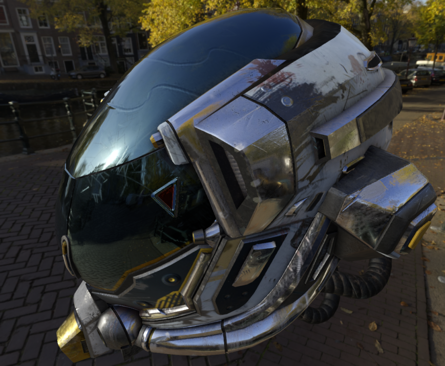
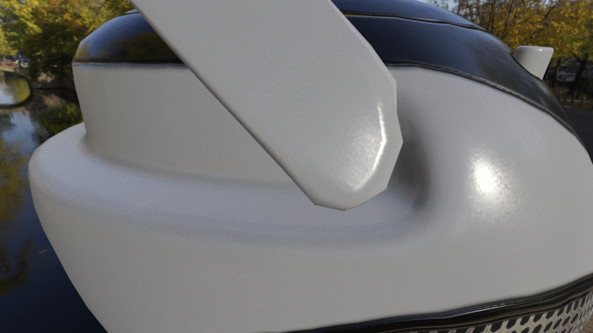

# PBR materials

*PBR materials* are one of the supported [material types](../../concepts/materials.md) in Azure Remote Rendering. They are used for [meshes](../../concepts/meshes.md) that should receive realistic lighting.

PBR stands for **P**hysically **B**ased **R**endering and means that the material describes the visual properties of a surface in a physically plausible way, such that realistic results are possible under all lighting conditions. Most modern game engines and content creation tools support PBR materials because they are considered the best approximation of real world scenarios for real-time rendering.

PBR materials are not a universal solution, though. There are materials that reflect color differently depending on the viewing angle. For example, some fabrics or car paints. These kinds of materials are not handled by the standard PBR model, and are currently not supported by Azure Remote Rendering. This includes PBR extensions, such as *Thin-Film* (multi-layered surfaces) and *Clear-Coat* (for car paints).

## Common material properties

These properties are common to all materials:

* **albedoColor:** This color is multiplied with other colors, such as the *albedoMap* or *vertex colors*. If *transparency* is enabled on a material, the alpha channel is used to adjust the opacity, with `1` meaning fully opaque and `0` meaning fully transparent. Default is white.

  > [!NOTE]
  > When a PBR material is fully transparent, like a perfectly clean piece of glass, it still reflects the environment. Bright spots like the sun are still visible in the reflection. This is different for [color materials](color-materials.md).

* **albedoMap:** A [2D texture](../../concepts/textures.md) for per-pixel albedo values.

* **alphaClipEnabled** and **alphaClipThreshold:** If *alphaClipEnabled* is true, all pixels where the albedo alpha value is lower than *alphaClipThreshold* won't be drawn. Alpha clipping can be used even without enabling transparency and is much faster to render. Alpha clipped materials are still slower to render than fully opaque materials, though. By default alpha clipping is disabled.

* **textureCoordinateScale** and **textureCoordinateOffset:** The scale is multiplied into the UV texture coordinates, the offset is added to it. Can be used to stretch and shift the textures. The default scale is (1, 1) and offset is (0, 0).

* **useVertexColor:** If the mesh contains vertex colors and this option is enabled, the meshes' vertex colors are multiplied into the *albedoColor* and *albedoMap*. By default vertex colors are disabled.

* **isDoubleSided:** If double-sidedness is set to true, triangles with this material are rendered even if the camera is looking at their back faces. For PBR materials lighting is also computed properly for back faces. By default this option is disabled. See also [Single-sided rendering](single-sided-rendering.md).

## PBR material properties

The core idea of physically based rendering is to use *BaseColor*, *Metalness*, and *Roughness* properties to emulate a wide range of real-world materials. A detailed description of PBR is beyond the scope of this article. For more information about PBR, see [other sources](http://www.pbr-book.org). The following properties are specific to PBR materials:

* **baseColor:** In PBR materials, the *albedo color* is referred to as the *base color*. In Azure Remote Rendering the *albedo color* property is already present through the common material properties, so there is no additional base color property.

* **roughness** and **roughnessMap:** Roughness defines how rough or smooth the surface is. Rough surfaces scatter the light in more directions than smooth surfaces, which make reflections blurry rather than sharp. The value range is from `0.0` to `1.0`. When `roughness` equals `0.0`, reflections will be sharp. When `roughness` equals `0.5`, reflections will become blurry.

  If both a roughness value and a roughness map are supplied, the final value will be the product of the two.

* **metalness** and **metalnessMap:** In physics, this property corresponds to whether a surface is conductive or dielectric. Conductive materials have different reflective properties, and they tend to be reflective with no albedo color. In PBR materials, this property affects how much a surface reflects the surrounding environment. Values range from `0.0` to `1.0`. When metalness is `0.0`, the albedo color is fully visible and the material looks like plastic or ceramics. When metalness is `0.5`, it looks like painted metal. When metalness is `1.0`, the surface almost completely loses its albedo color and only reflects the surroundings. For instance, if `metalness` is `1.0` and `roughness` is `0.0` then a surface looks like real-world mirror.

  If both a metalness value and a metalness map are supplied, the final value will be the product of the two.

  

  In the picture above, the sphere in the bottom-right corner looks like a real metal material, the bottom-left looks like ceramic or plastic. The albedo color is also changing according to physical properties. With increasing roughness, the material loses reflection sharpness.

* **normalMap:** To simulate fine grained detail, a [normal map](https://en.wikipedia.org/wiki/Normal_mapping) can be provided.

* **occlusionMap** and **aoScale:** [Ambient occlusion](https://en.wikipedia.org/wiki/Ambient_occlusion) makes objects with crevices look more realistic by adding shadows to occluded areas. Occlusion value range from `0.0` to `1.0`, where `0.0` means darkness (occluded) and `1.0` means no occlusions. If a 2D texture is provided as an occlusion map, the effect is enabled and *aoScale* acts as a multiplier.

  

* **transparent:** For PBR materials, there is only one transparency setting: it is enabled or not. The opacity is defined by the albedo color's alpha channel. When enabled, a more complex rendering pipeline is invoked to draw semi-transparent surfaces. Azure Remote Rendering implements true [order independent transparency](https://en.wikipedia.org/wiki/Order-independent_transparency) (OIT).

  Transparent geometry is expensive to render. If you only need holes in a surface, for example for the leaves of a tree, it is better to use alpha clipping instead.

  
  Notice in the image above, how the right-most sphere is fully transparent, but the reflection is still visible.

  > [!IMPORTANT]
  > If any material is supposed to be switched from opaque to transparent at runtime, the renderer must use the *TileBasedComposition* [rendering mode](../../concepts/rendering-modes.md). This limitation does not apply to materials that are converted as transparent materials to begin with.

## Technical details

Azure Remote Rendering uses the Cook-Torrance micro-facet BRDF with GGX NDF, Schlick Fresnel, and a GGX Smith correlated visibility term with a Lambert diffuse term. This model is the de facto industry standard at the moment. For more in-depth details, refer to this article: [Physically based Rendering - Cook Torrance](http://www.codinglabs.net/article_physically_based_rendering_cook_torrance.aspx)

 An alternative to the *Metalness-Roughness* PBR model used in Azure Remote Rendering is the *Specular-Glossiness* PBR model. This model can represent a broader range of materials. However, it is more expensive, and usually does not work well for real-time cases.
 It is not always possible to convert from *Specular-Glossiness* to *Metalness-Roughness* as there are *(Diffuse, Specular)* value pairs that cannot be converted to *(BaseColor, Metalness)*. The conversion in the other direction is simpler and more precise, since all *(BaseColor, Metalness)* pairs correspond to well-defined *(Diffuse, Specular)* pairs.

## Next steps

* [Color materials](color-materials.md)
* [Textures](../../concepts/textures.md)
* [Meshes](../../concepts/meshes.md)
