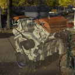
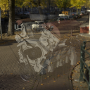
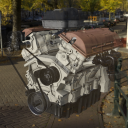
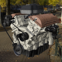

# Shell rendering

The shell state of the [Hierarchical state override component](../../overview/features/override-hierarchical-state.md) is a transparency effect. In contrast to [see-through](../../overview/features/override-hierarchical-state.md) rendering, only the front-most layer of objects is visible, akin to opaque rendering. Additionally, the objects' normal appearance can be altered when rendered as shells. The effect is intended for use cases where the user should be visually guided away from non-important parts while still maintaining spatial awareness for the whole scene.

You can configure the appearance of shell-rendered objects via the `ShellRenderingSettings` global state. All objects that use shell rendering will use the same setting. There are no per object parameters.

## ShellRenderingSettings parameters

Class `ShellRenderingSettings` holds the settings related to global shell rendering properties:

| Parameter      | Type    | Description                                             |
|----------------|---------|---------------------------------------------------------|
| `Desaturation` | float   | The amount of desaturation to apply to the usual final object color, in range 0 (no desaturation) to 1 (full desaturation) |
| `Opacity`      | float   | The opacity of the shell-rendered objects, in range 0 (invisible) to 1 (fully opaque) |

See also the following table for examples of the parameters' effects when applied to a whole scene:

|                | 0 | 0.25 | 0.5 | 0.75 | 1.0 | 
|----------------|:-:|:----:|:---:|:----:|:---:|
| **Desaturation** |  |  |  |  |  |
| **Opacity**      |  |  |  |  |  |

The shell effect is applied on the final opaque color the scene would be rendered with otherwise. That includes the [tint hierarchical state override](../../overview/features/override-hierarchical-state.md).

## Example

The following code shows an example usage of the `ShellRenderingSettings` state via the API:

```cs
void SetShellSettings(RenderingSession session)
{
    ShellRenderingSettings shellRenderingSettings = session.Connection.ShellRenderingSettings;
    shellRenderingSettings.Desaturation = 0.5f;
    shellRenderingSettings.Opacity = 0.1f;
}
```

```cpp
void SetShellSettings(ApiHandle<RenderingSession> session)
{
    ApiHandle<ShellRenderingSettings> shellRenderingSettings = session->Connection()->GetShellRenderingSettings();
    shellRenderingSettings->SetDesaturation(0.5f);
    shellRenderingSettings->SetOpacity(0.1f);
}
```

## Performance

The shell rendering feature carries a small constant overhead in comparison with standard opaque rendering. It is significantly faster than using transparent materials on objects or [see-through](../../overview/features/override-hierarchical-state.md) rendering. Performance may degrade more strongly if only portions of the scene are switched to shell rendering. This degradation can occur due to additionally revealed objects requiring rendering. In that regard, performance behaves similarly to the [Cut planes](../../overview/features/cut-planes.md) feature.

## Next steps

* [Hierarchical state override component](../../overview/features/override-hierarchical-state.md)