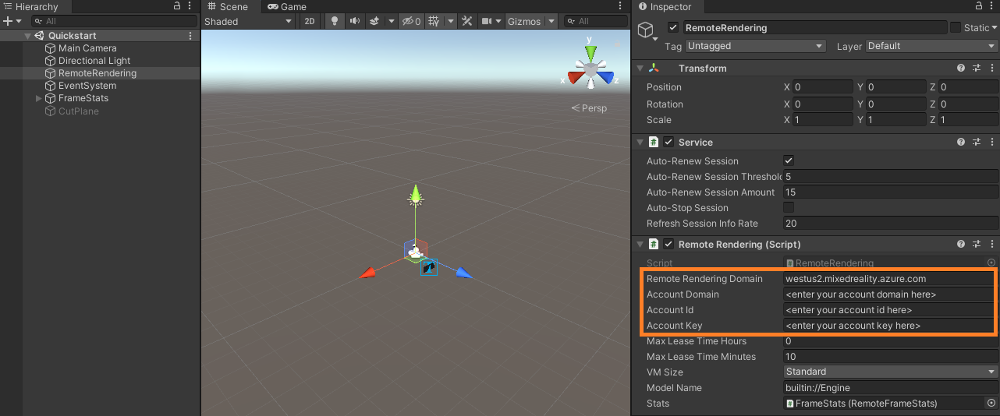
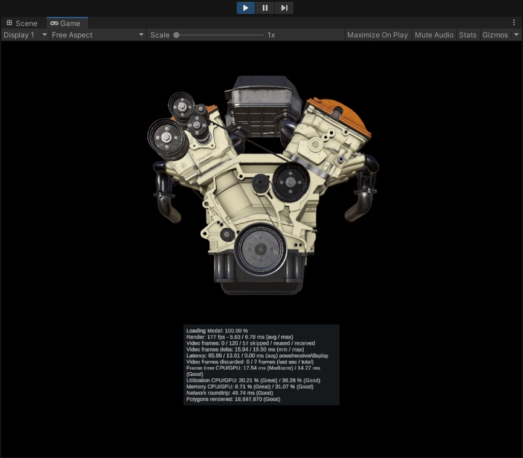

# Quickstart: Render a model with Unity

This quickstart covers how to run a Unity sample that renders a built-in model remotely, using the Azure Remote Rendering (ARR) service.

We won't go into detail about the ARR API itself or how to set up a new Unity project. Those topics are covered in [Tutorial: Viewing remotely rendered models](../tutorials/unity/view-remote-models/view-remote-models.md).

In this quickstart you will learn how to:
> [!div class="checklist"]
>
>* Set up your local development environment
>* Get and build the ARR Quickstart sample app for Unity
>* Render a model in the ARR Quickstart sample app

## Prerequisites

To get access to the Azure Remote Rendering service, you first need to [create an account](../how-tos/create-an-account.md).

The following software must be installed:

* Windows SDK 10.0.18362.0 [(download)](https://developer.microsoft.com/windows/downloads/windows-10-sdk)
* The latest version of Visual Studio 2019 [(download)](https://visualstudio.microsoft.com/vs/older-downloads/)
* [Visual Studio tools for Mixed Reality](https://docs.microsoft.com/windows/mixed-reality/install-the-tools). Specifically, the following *Workload* installations are mandatory:
  * **Desktop development with C++**
  * **Universal Windows Platform (UWP) development**
* GIT [(download)](https://git-scm.com/downloads)
* Unity 2019.3.1 [(download)](https://unity3d.com/get-unity/download)
  * Install these modules in Unity:
    * **UWP** - Universal Windows Platform Build Support
    * **IL2CPP** - Windows Build Support (IL2CPP)

## Clone the sample app

Open a command prompt (type `cmd` in the Windows start menu) and change to a directory where you want to store the ARR sample project.

Run the following commands:

```cmd
mkdir ARR
cd ARR
git clone https://github.com/Azure/azure-remote-rendering
```

The last command creates a subdirectory in the ARR directory containing the various sample projects for Azure Remote Rendering.

The quickstart sample app for Unity is found in the subdirectory *Unity/Quickstart*.

## Rendering a model with the Unity sample project

Open the Unity Hub and add the sample project, which is the *ARR\azure-remote-rendering\Unity\Quickstart* folder.
Open the project. If necessary, allow Unity to upgrade the project to your installed version.

The default model we render is a [built-in sample model](../samples/sample-model.md). We will show how to convert a custom model using the ARR conversion service in the [next quickstart](convert-model.md).

### Enter your account info

1. In the Unity asset browser, navigate to the *Scenes* folder and open the **Quickstart** scene.
1. From the *Hierarchy*, select the **RemoteRendering** game object.
1. In the *Inspector*, enter your [account credentials](../how-tos/create-an-account.md). If you don't have an account yet, [create one](../how-tos/create-an-account.md).



> [!IMPORTANT]
> Azure Portal displays your account's domain only as *mixedreality.azure.com*. This is insufficient for successfully connecting.
> Set **AccountDomain** to `<region>.mixedreality.azure.com`, where `<region>` is [one of the available regions near you](../reference/regions.md).

Later we want to deploy this project to a HoloLens and connect to the Remote Rendering service from that device. Since we have no easy way to enter the credentials on the device, the quickstart sample will **save the credentials in the Unity scene**.

> [!WARNING]
> Make sure to not check the project with your saved credentials into some repository where it would leak secret login information!

### Create a session and view the default model

Press Unity's **Play** button to start the session. You should see an overlay with status text, at the bottom of the viewport in the *Game* panel. The session will undergo a series of state transitions. In the **Starting** state, the server is spun up, which takes several minutes. Upon success, it transitions to the **Ready** state. Now the session enters the **Connecting** state, where it tries to reach the rendering runtime on that server. When successful, the sample transitions to the **Connected** state. At this point, it will start downloading the model for rendering. Because of the model's size, the download can take a few more minutes. Then the remotely rendered model will appear.



Congratulations! You are now viewing a remotely rendered model!

## Inspecting the scene

Once the remote rendering connection is running, the Inspector panel updates with additional status information:


You can now explore the scene graph by selecting the new node and clicking **Show children** in the Inspector.


There is a [cut plane](../overview/features/cut-planes.md) object in the scene. Try enabling it in its properties and moving it around:


To synchronize transforms, either click **Sync now** or check the **Sync every frame** option. For component properties, just changing them is enough.

## Next steps

In the next quickstart, we will deploy the sample to a HoloLens to view the remotely rendered model in its original size.

> [!div class="nextstepaction"]
> [Quickstart: Deploy Unity sample to HoloLens](deploy-to-hololens.md)

Alternatively, the sample can also be deployed to a desktop PC.

> [!div class="nextstepaction"]
> [Quickstart: Deploy Unity sample to Desktop](deploy-to-desktop.md)
