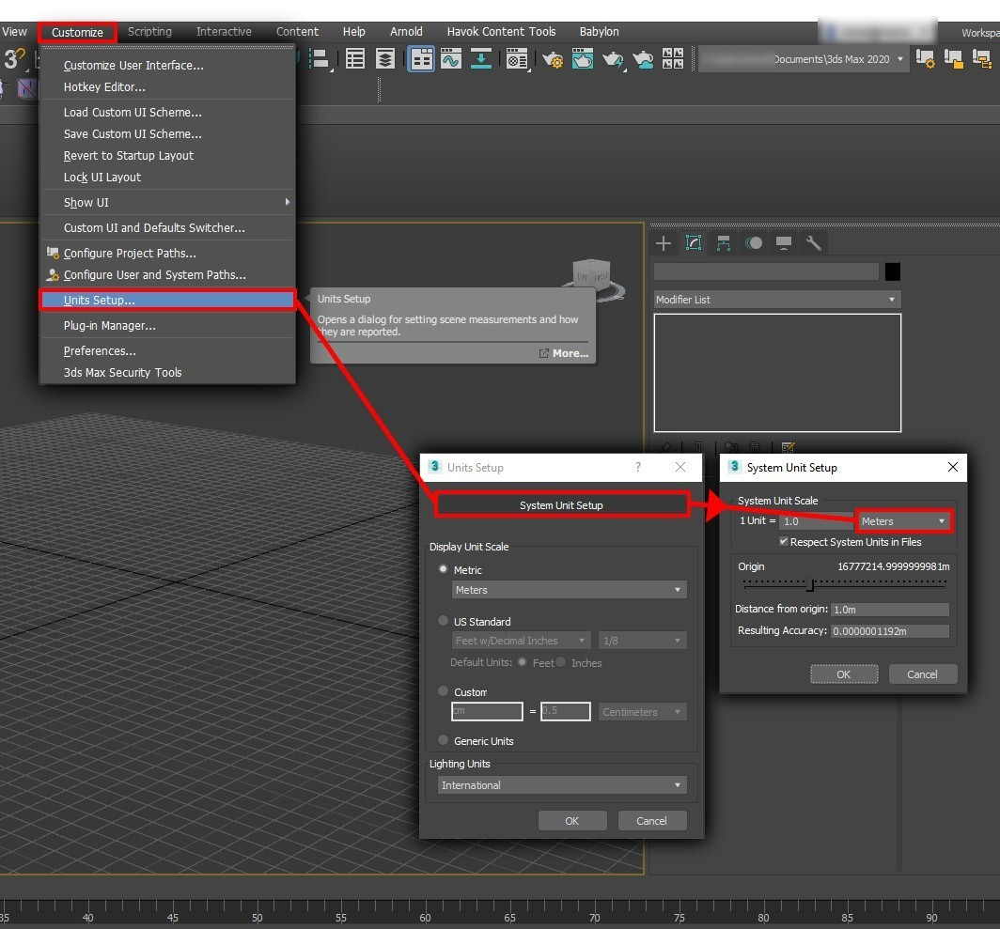
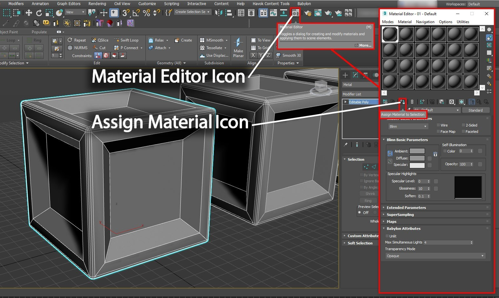
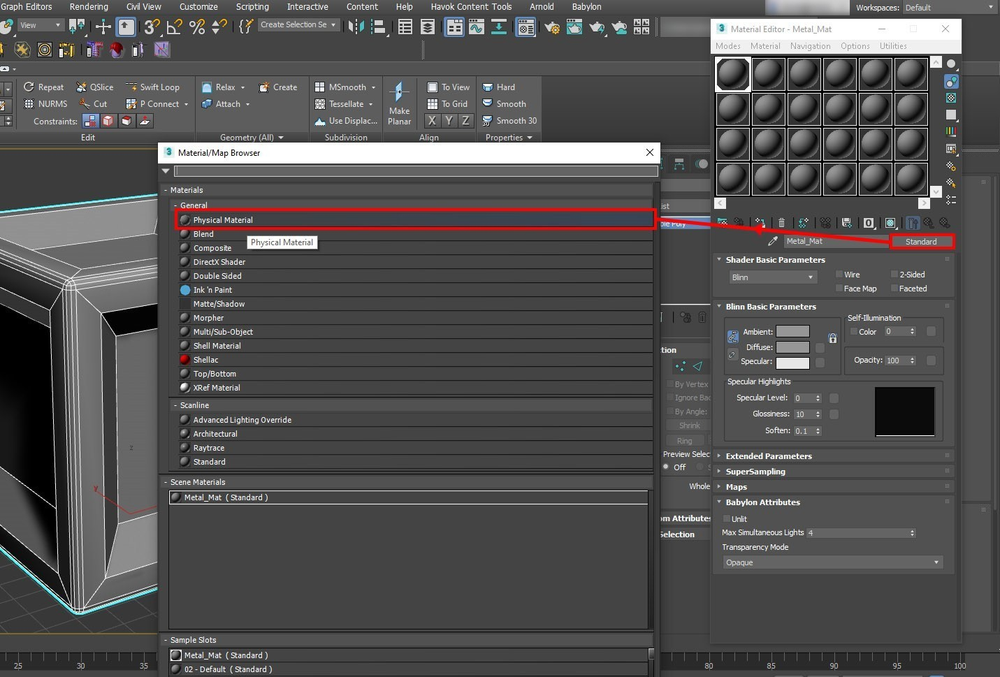
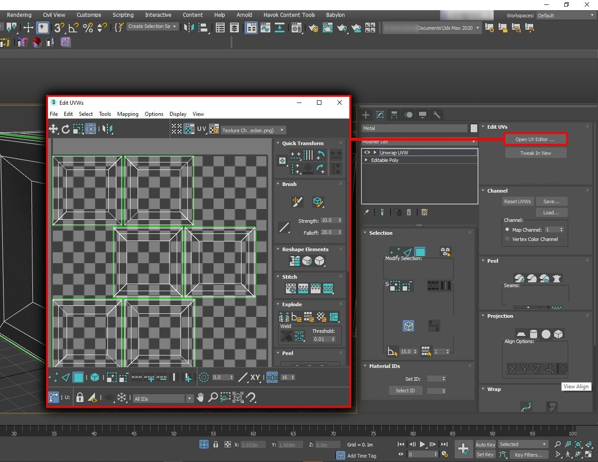
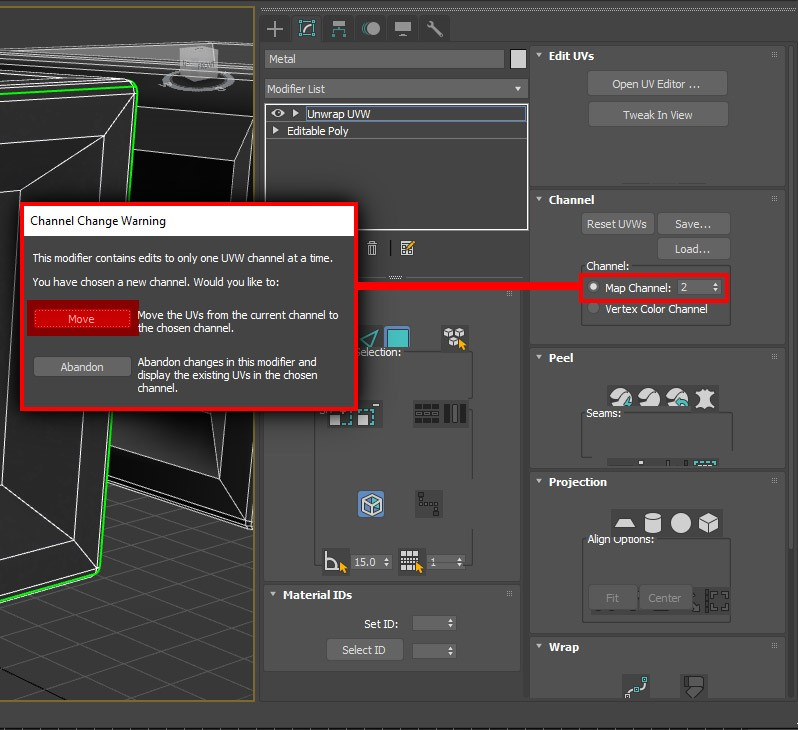
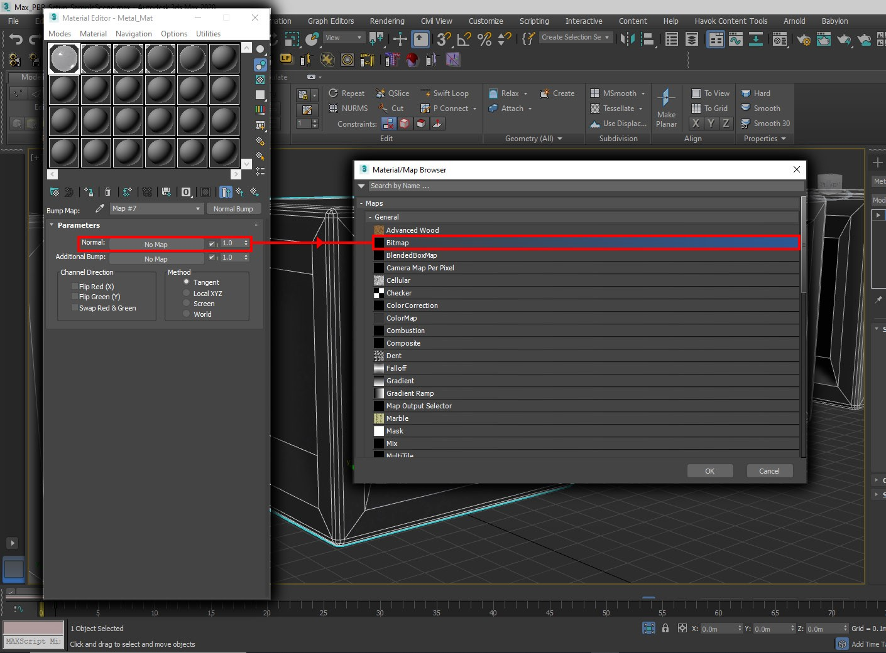
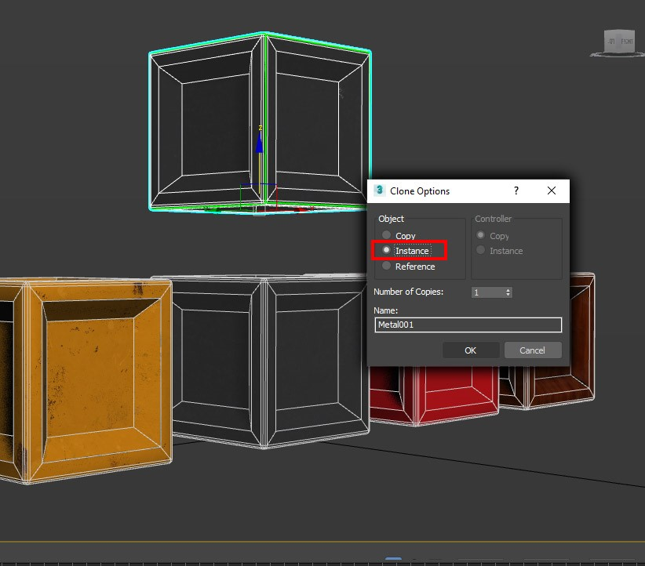

# Tutorial: Set up physically based rendering materials in 3ds Max

## Overview
In this tutorial, you'll learn how to:

>[!div class="checklist"]
>
> * Assign materials with advanced lighting to objects in a scene.
> * Handle instancing of objects and materials.
> * Export a scene to FBX format, and select important options.

Creating [physically based rendering (PBR) materials](../../overview/features/pbr-materials.md) in 3ds Max is a straightforward task. It's similar in many ways to PBR setup in other content-creation apps like Maya. This tutorial is a guide to basic PBR shader setup and FBX export for Azure Remote Rendering projects.

The sample scene in this tutorial contains a number of polygon box objects. They're assigned different materials, like wood, metal, painted metal, plastic, and rubber. Broadly speaking, each material contains all or most of the following textures:

* **Albedo**, which is the material's color map and is also called **Diffuse** and **BaseColor**.
* **Metalness**, which determines if a material is metallic and which parts are metallic. 
* **Roughness**, which determines how rough or smooth a surface is.
It also affects the sharpness or blurriness of the reflections and highlights on a surface.
* **Normal**, which adds detail to a surface without adding more polygons. Examples of detail are pitting and dents on a metal surface or grain in wood.
* **Ambient Occlusion**, which is used to add soft shading and contact shadows to a model. It's a grayscale map that indicates which areas of the model receive full lighting (white) or full shade (black).

## Prepare the scene
In 3ds Max, the process for setting up a PBR material is as follows.

To start, we'll create a number of box objects, each of which represents a different type of material.

>[!TIP]
>It's worth noting before you start to create assets for Remote Rendering that it uses meters for measurement.  
>
>So it's a good idea to set your scene's system units to meters. It's also  a good idea to set **Units** to meters in the FBX export settings when you export a scene.

The following screenshot shows the steps to set the system units to meters in 3ds Max. 

1. On the main menu, go to **Customize** > **Units Setup** > **System Units Setup**. In **System Unit Scale**, select **Meters**:

1. We can now begin to create the models. In the sample scene, we'll create several box objects, each representing a different material type. For example, metal, rubber, and plastic. 

   >[!TIP]
   >When you create assets, it's a good practice to name them appropriately as you go. This makes them easier to find later if the scene contains a lot of objects.

1. Rename the objects, as shown in the following screenshot: 

   

## Assign materials

Now that we have some objects in our scene, in this case a number of cubes, we can begin the PBR setup:

1. On the main toolbar, select the **Material Editor** icon as shown in the following screenshot. You can also select **M** on your keyboard to open the editor. The Material Editor has two modes that you can select in the **Modes** list: **Compact Material Editor** mode and **Slate Material Editor** mode. Because this scene is relatively simple, we'll use the compact mode.

1. In the Material Editor, you'll see a number of spheres. These spheres are the materials. We'll assign one of these materials to each object (each box) in the scene. To assign the materials, first select one of the objects in the main viewport. Then select the first sphere in the Material Editor. After it's assigned to an object, the selected material will be highlighted, as shown in the next image.

1. Select **Assign Material to Selection**, as shown. The material is now assigned to the selected object.

   

    In the Material Editor, you can choose from a wide selection of material types, depending on your needs. Typically, the material type is set to **Standard** by default. This material is a basic material that's not suitable for PBR setup. So we need to change the material type to a PBR material. Physical Material is the preferred 3ds Max material for Azure Remote Rendering projects.

1. In the Material Editor, select the **Standard** tab. In the **Material/Map Browser**, select **Physical Material**. This action converts the assigned **Standard** material to a PBR Physical Material.

   

    In the Material Editor, you now see the properties for the Physical Material, as shown in the following screenshot. You can now start to assign textures to the asset.

   

As you can see, there are a wide range of maps and textures that you can add to the material. For this tutorial, we use only five texture slots in the material.

>[!TIP]
>It's good practice to name your materials appropriately, as shown in the preceding screenshot.

How you generate your textures can vary according to preference or usage. For example, you might want to use tiling textures that can be applied to any asset. Or you might need specific parts of a project or asset to have their own custom sets of textures. You might want to use generic tiling textures that you can get online. You can also create them yourself in apps like Photoshop, Quixel Suite, and Substance Suite.

Before we start to assign textures, we'll need to consider the asset's texture coordinates (UVW). It's a best practice when you apply any textures to a model to ensure that the model is unwrapped. (Textures won't display properly without proper UV unwrapping.) It's especially important for our purposes because we want to use an Ambient Occlusion (AO) map on our model. Unlike Stingray Shader in Maya, Physical Material in 3ds Max doesn't have a dedicated AO texture slot. So we'll apply the AO map to another slot. To allow it to be used separately from the other textures (tiling textures, for example), we'll assign it a UVW map channel of its own. 

We'll start by assigning an unwrap UVW modifier to the model, as shown in the following screenshot. 

- In the selected objects properties editor, select the modifier list. In the drop-down list that appears, scroll down and select **Unwrap UVW**. This action applies an unwrap UVW modifier to the asset.

  The map channel is set to 1. You'll typically do the main unwrapping in map channel 1. In this case, the object has been unwrapped with no overlapping texture coordinates (UV).

The next step is to create a second UV map channel.

1. Close the UV editor if it's open. In the **Channel** section of the **Edit UVs** menu, change the channel number to **2**. Map channel 2 is the expected channel for AO maps. 

1. In the **Channel Change Warning** dialog box, you can either **Move** the existing UVs in channel 1 into the new channel 2 or **Abandon** the existing UVs that will create a new UV unwrap automatically. Select **Abandon** only if you plan to create a new UV unwrap for the AO map that differs from the UVs in map channel 1. (For example, if you want to use tiling textures in channel 1.) In this tutorial, we'll move the UVs from channel one to channel 2 because we don't need to edit the new UV channel.

   >[!NOTE]
   >Even if you've copied (moved) the UV unwrap from map channel 1 into map channel 2, you can make any necessary edits to the new channel UVs without affecting the original map channel.

   

Now that we've created the new map channel, we can return to the Physical Material in the Material Editor and start to add our textures to it. First we'll add the AO map because there's another step to allow it to work correctly. After the AO map is plugged in to our material, we need to configure it to use map channel 2.

As noted earlier, there's no dedicated slot for AO maps in the 3ds Max Physical Material. We'll instead apply the AO map to the **Diffuse Roughness** slot.

1. In the Physical Material's **Generic Maps** list, select the **No Map** slot next to **Diffuse Roughness** and load your AO map.

1. In the AO textures properties, the map channel is set to **1** by default. Change this value to **2**. This action completes the steps necessary to add your AO map.

   >[!IMPORTANT]
   >This is an important step, particularly if your UVs in channel 2 are different from those in channel 1, because the AO won't map correctly if the wrong channel is selected.

   

We'll now assign the normal map to the PBR material. This action differs somewhat from the process in Maya. The normal map isn't applied directly to the bump map slot. (There's no normal map slot in the 3ds Max Physical Material.) Instead, you add the normal map to a normal map modifier, which itself is plugged into the normal's slot.

1. In the **Special Maps** section of the Physical Material properties (in the Material Editor), select the **No Map** slot next to **Bump Map**. 

1. In the **Material/Map Browser**, locate and select **Normal Bump**. This action adds a **Normal Bump** modifier to the material.

1. In the **Normal Bump** modifier, select **No Map** next to **Normal**. Locate and load your normal map.

1. Make sure the method is set to **Tangent**. (It should be, by default.) If necessary, toggle **Flip Green (Y)**.

   
   

With the normal map correctly assigned, we can assign the remaining textures to complete the Physical Material setup. This process is simple. There are no special settings to consider. The following screenshot shows the full set of textures assigned to the material: 

Now that the PBR materials are created and set up, it's worth thinking about instancing objects in the scene. Instance similar objects in the scene, like nuts, bolts, screws, and washers. Any objects that are the same can yield significant savings in terms of file size. Instances of a master object can have their own scale, rotation, and transforms, so you can place them as needed in your scene. In 3ds Max, the process of instancing is simple.

1. In the main viewport, select the object or objects that you want to export.

1. Hold the **Shift** key and drag the assets upwards by using the transform (move) tool. 

1. In the **Clone Options** dialog box, set **Object** to **Instance** and then select **OK**:

   

This action creates an instance of your object that you can move, rotate, or scale independently of its parent and of other instances of that parent.

>[!IMPORTANT]
>Any changes you make to an instance while you're in sub object mode are transmitted to all instances of the object. So if you're working with an instanced object's components, like vertices and polygon faces, be sure that you want any changes you make to affect all of the instances. Remember that any instanced object can be made into a unique object at any time. 

>[!TIP]
>When instancing in your scene, it's a good idea to create instances as you go along. Replacing copies with instanced objects later is difficult. 

One final thing to consider before we move on to the export process is how you might want to package your scene/asset for sharing. Ideally, if you pass the asset on to clients or team members, you'll want them to be able to open and view the asset as it should be seen with a minimum amount of fuss. So it's important to keep your asset's texture paths relative to the scene file. If the texture paths for your asset point to a local drive or absolute path/location, they won't load into the scene if opened on a different computer, even if the .max file is in the same folder as the textures. Making the texture paths relative in 3ds Max solves this problem and is fairly simple.

1. On the main toolbar, go to **File** > **Reference** > **Asset Tracking Toggle**. 

1. In the Asset Tracking window, you'll see all or most of the textures that you've applied to your PBR materials listed in the **Maps/Shaders** column.

1. Next to them, in the **Full Path** column, you'll see the path of the location of your textures, most likely the path of their location on your local machine.

1. Finally, you'll see a column called **Status**. This column indicates whether a given texture has been located and applied to your scene. It flags the texture with one of these terms: **Ok**, **Found**, or **File Missing**. The first two indicate that the file has been found and loaded. The last obviously means that the tracker has failed to locate the file.
 
   

You might notice that not all of your textures are listed in the Asset Tracking window when you first open it. This is nothing to be concerned about. Running through the path-finding process once or twice usually finds all of a scene's textures. The path-finding process is as follows: 

1. In the Asset Tracking window, hold down the **Shift** key and select the top texture in the **Maps/Shaders** list, and, continuing to hold **Shift**, select the last texture in the list. This action selects all the textures in the list. The selected textures are highlighted in blue. (See the preceding screenshot.)

1. Right-click the selection and select **Set Path**.

1. In the **Specify Asset Path** box, select the local path to your textures and replace it with `.\`.  Select **OK**. 

    The Asset Tracking window will update as shown in the following screenshot. This update might take a while, depending on how many textures are in your scene and on how large your scene is.

Notice that the **Full Path** column is now blank. This means that the scene is no longer looking for the relevant textures in a specific (absolute) location. It will always find them as long as the .max file or related FBX file is in the same folder as the textures. 

>[!NOTE]
>You might have to repeat this process a couple times to find and resolve all textures and paths. This is nothing to be concerned about. Just repeat the process until all relevant assets are accounted for. In some cases, some files won't be found. In that case, simply select all the assets in the list and then select **Remove Missing Paths**. (See the preceding image.)

## FBX export

Now that we've made the texture paths relative, we can move on to the FBX export. Again, the process is simple, and you can do it in a couple of ways. 

>[!TIP]
>Unless you want to export your entire scene, it's a good idea to select for export only the assets that you need. In resource-intensive scenes, export can take a long time.
>
>If you've used modifiers like Turbosmooth or Open SubDiv, it's a good idea to collapse them before export because they can cause problems during export. Be sure to save your scene before collapsing them. 

1. In the scene, select the assets that you want to export. On the main toolbar, go to **File** > **Export** > **Export Selected**.

1. In the **Select File to Export** dialog box, type or select an output file name. In the **Save as type** list, select **Autodesk (*.fbx)**. This action opens the FBX Export window.

  >[!IMPORTANT] 
  >If you've created instances in your scene, it's important to select **Preserve Instances** in the FBX export settings. 

  

  Remember, there are a couple of ways to export the file. If the intention is to share the FBX along with its texture files in a folder/directory, the settings shown in the following screenshot should work well. 

   If you prefer not to share large folders/directories of textures along with the FBX, you can choose to embed the textures in the FBX. If you embed the textures, the entire asset, including textures, is added to a single FBX. Doing so combines your export into a single asset, but the FBX file will be considerably larger as a result.

   >[!IMPORTANT]
   >If the resulting FBX file is bigger than 2.4 GB, the minimum version specified in the FBX export settings should be 2016 or later. (See the preceding screenshot.) Newer versions have 64 bit support, so they support bigger files.

1. If you want to export the scene with textures included, in the *FBX Export window, select **Embed Media**. 

1. Select the rest of your settings, and then select **OK**:

    

   When you export to FBX while using a Physical Material, you'll probably see the following warning after you select **OK** in the FBX Export window: 

   

   This warning is telling you that the exported materials might not be compatible with other software packages. Because Physical Material is compatible with Azure Remote Rendering, you don't need to worry about this warning. 

1. Select **OK** to complete the process and close the window.

## Conclusion

In general, this type of material looks more realistic because it's based on the real-world physics of light. It creates an additional immersive effect so that the scene appears to exist in the real world.

## Next steps

You now know how to set up materials with advanced lighting for objects in a scene. You also know how to export objects to FBX format, which is supported by Azure Remote Rendering. The next step is to convert the FBX file and visualize it in Azure Remote Rendering.

>[!div class="nextstepaction"]
>[Quickstart: Convert a model for rendering](../../quickstarts\convert-model.md)
