# Tutorial: Securing Azure Remote Rendering and model storage

In this tutorial, you learn how to:

> [!div class="checklist"]
>
> * Secure Azure Blob Storage containing Azure Remote Rendering models
> * Authenticate with Azure AD to access your Azure Remote Rendering instance
> * Use Azure credentials for Azure Remote Rendering authentication

## Prerequisites

* This tutorial builds on [Tutorial: Refining materials, lighting, and effects](..\materials-lighting-effects\materials-lighting-effects.md).

## Why additional security is needed

The current state of the application and its access to your Azure resources looks like this:

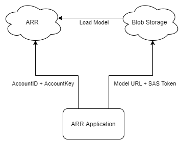

Both the "AccountID + AccountKey" and the "URL + SAS Token" are both essentially storing a username and password together. For example, if the "AccountID + AccountKey" were exposed, it would be trivial for an attacker to use your ARR resources without your permission at your expense.

## Securing your content in Azure Blob Storage

Azure Remote Rendering can securely access the contents of your Azure Blob Storage with the correct configuration. See [How-to: Link storage accounts](../../../how-tos/create-an-account.md#link-storage-accounts) to configure your Azure Remote Rendering instance with your blob storage accounts.

When using a linked blob storage, you'll use slightly different methods for loading models:

```csharp
var loadModelParams = new LoadModelFromSASParams(modelPath, modelEntity);
var loadModelAsync = ARRSessionService.CurrentActiveSession.Actions.LoadModelFromSASAsync(loadModelParams);
```

The above lines use the `FromSAS` version of the params and session action. They must be converted to the non-SAS versions:

```csharp
var loadModelParams = new LoadModelParams(storageAccountPath, blobContainerName, modelPath, modelEntity);
var loadModelAsync = ARRSessionService.CurrentActiveSession.Actions.LoadModelAsync(loadModelParams);
```

Let's modify **RemoteRenderingCoordinator** to load a custom model, from a linked blob storage account.

1. If you haven't already, complete the [How-to: Link storage accounts](../../../how-tos/create-an-account.md#link-storage-accounts) to grant your ARR instance permission to access your Blob Storage instance.
1. Add the following modified **LoadModel** method to **RemoteRenderingCoordinator** just below the current **LoadModel** method:

    ```csharp
    /// <summary>
    /// Loads a model from blob storage that has been linked to the ARR instance
    /// </summary>
    /// <param name="storageAccountName">The storage account name, this contains the blob containers </param>
    /// <param name="blobContainerName">The blob container name, i.e. arroutput</param>
    /// <param name="modelPath">The relative path inside the container to the model, i.e. test/MyCustomModel.arrAsset</param>
    /// <param name="parent">The parent Transform for this remote entity</param>
    /// <param name="progress">A call back method that accepts a float progress value [0->1]</param>
    /// <returns></returns>
    public async Task<Entity> LoadModel(string storageAccountName, string blobContainerName, string modelPath, Transform parent = null, ProgressHandler progress = null)
    {
        //Create a root object to parent a loaded model to
        var modelEntity = ARRSessionService.CurrentActiveSession.Actions.CreateEntity();

        //Get the game object representation of this entity
        var modelGameObject = modelEntity.GetOrCreateGameObject(UnityCreationMode.DoNotCreateUnityComponents);

        //Ensure the entity will sync its transform with the server
        var sync = modelGameObject.GetComponent<RemoteEntitySyncObject>();
        sync.SyncEveryFrame = true;

        //Parent the new object under the defined parent
        if (parent != null)
        {
            modelGameObject.transform.SetParent(parent, false);
            modelGameObject.name = parent.name + "_Entity";
        }

    #if UNITY_WSA
        //Anchor the model in the world, prefer anchoring parent if there is one
        if (parent != null)
        {
            parent.gameObject.AddComponent<WorldAnchor>();
        }
        else
        {
            modelGameObject.AddComponent<WorldAnchor>();
        }
    #endif

        //Load a model that will be parented to the entity
        var loadModelParams = new LoadModelParams($"{storageAccountName}.blob.core.windows.net", blobContainerName, modelPath, modelEntity);
        var loadModelAsync = ARRSessionService.CurrentActiveSession.Actions.LoadModelAsync(loadModelParams);
        if (progress != null)
            loadModelAsync.ProgressUpdated += progress;
        var result = await loadModelAsync.AsTask();
        return modelEntity;
    }
    ```

    For the most part, this code is identical to the original `LoadModel` method, however we've replaced the SAS version of the method calls with the non-SAS versions.

    The additional inputs `storageAccountName` and `blobContainerName` have also been added to the arguments. We'll call this new **LoadModel** method from another method similar to the very first **LoadTestModel** method we created in the first tutorial.

1. Add the following method to **RemoteRenderingCoordinator** just after **LoadTestModel**

    ```csharp
    private bool loadingLinkedCustomModel = false;

    [SerializeField]
    private string storageAccountName;
    public string StorageAccountName {
        get => storageAccountName.Trim();
        set => storageAccountName = value;
    }

    [SerializeField]
    private string blobContainerName;
    public string BlobContainerName {
        get => blobContainerName.Trim();
        set => blobContainerName = value;
    }

    [SerializeField]
    private string modelPath;
    public string ModelPath {
        get => modelPath.Trim();
        set => modelPath = value;
    }

    [ContextMenu("Load Linked Custom Model")]
    public async void LoadLinkedCustomModel()
    {
        if (CurrentCoordinatorState != RemoteRenderingState.RuntimeConnected)
        {
            Debug.LogError("Please wait for the runtime to connect before loading the test model. Try again later.");
            return;
        }
        if (loadingLinkedCustomModel)
        {
            Debug.Log("Linked Test model already loading or loaded!");
            return;
        }
        loadingLinkedCustomModel = true;

        // Create a parent object to use for positioning
        GameObject testParent = new GameObject("LinkedCustomModel");
        testParent.transform.position = new Vector3(0f, 0f, 3f);

        await LoadModel(StorageAccountName, BlobContainerName, ModelPath, testParent.transform, (progressValue) => Debug.Log($"Loading Test Model progress: {Math.Round(progressValue * 100, 2)}%"));
    }
    ```

    This code adds three additional string variables to your **RemoteRenderingCoordinator** component.
    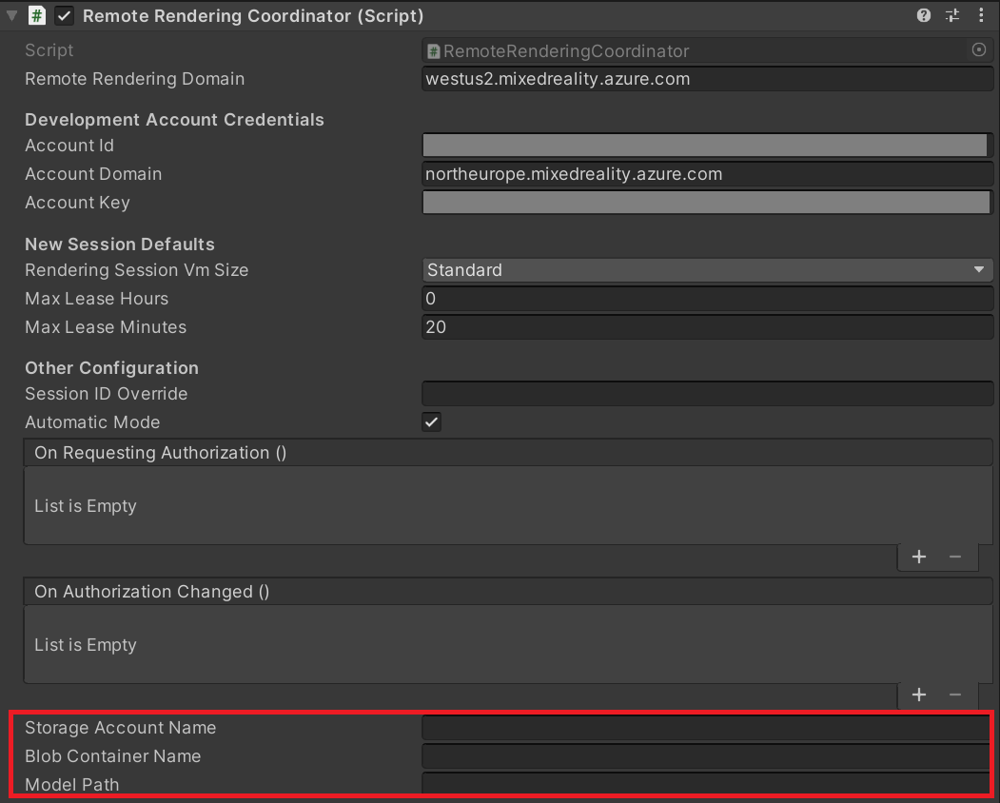

1. Add your values to the **RemoteRenderingCoordinator** component. Having followed the [Quickstart for model conversion](../../../quickstarts/convert-model.md), your values should be:

    * **Storage Account Name**: Your storage account name, the globally unique name you choose for your storage account. In the quickstart this was *arrtutorialstorage*, your value will be different.
    * **Blob Container Name**: arroutput, the Blob Storage Container
    * **Model Path**: The combination of the "outputFolderPath" and the "outputAssetFileName" defined in the *arrconfig.json* file. In the quickstart this was "outputFolderPath":"converted/robot", "outputAssetFileName": "robot.arrAsset". Which would result in a Model Path value of "converted/robot/robot.arrAsset", your value will be different.

    >[!TIP]
    > If you [run the **Conversion.ps1**](../../../quickstarts/convert-model.md#run-the-conversion) script, without the "-UseContainerSas" argument, the script will output all of the above values for your instead of the SAS token. 
1. For the time being, remove or disable the GameObject **TestModel**, to make room for your custom model to load.
1. Play the scene and connect to a remote session.
1. Right click on your **RemoteRenderingCoordinator** and select **Load Linked Custom Model**.
    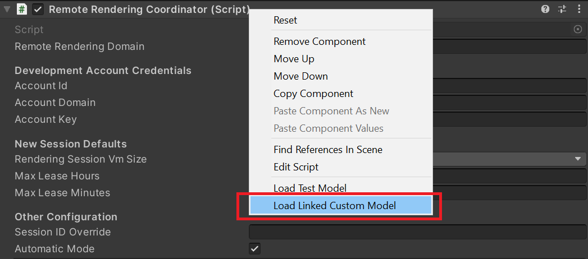

These steps have increased the security of the application by removing the SAS token from the local application.

Now the current state of the application and its access to your Azure resources looks like this:

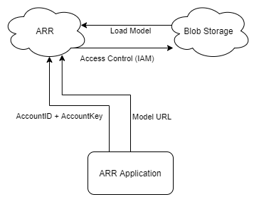

We have one more "password", the AccountKey, to remove from the local application. This can be done using Azure Active Directory (AAD) authentication.

## Azure Active Directory (Azure AD) authentication

AAD authentication will allow you to determine which individuals or groups are using ARR in a more controlled way. ARR has built in support for accepting [Access Tokens](https://docs.microsoft.com/azure/active-directory/develop/access-tokens) instead of using an Account Key. You can think of Access Tokens as a time-limited, user-specific key, that only unlocks certain parts of the specific resource it was requested for.

The **RemoteRenderingCoordinator** script has a delegate named **ARRCredentialGetter**, which holds a method that returns a **AzureFrontendAccountInfo** object, which is used to configure the remote session management. We can assign a different method to **ARRCredentialGetter**, allowing us to use an Azure sign in flow, generating a **AzureFrontendAccountInfo** object that contains an Azure Access Token. This Access Token will be specific to the user that's signing in.

1. Follow the [How To: Configure authentication - Authentication for deployed applications](../../../how-tos/authentication.md#authentication-for-deployed-applications), specifically you'll follow the instructions listed in the Azure Spatial Anchors documentation [Azure AD user authentication](https://docs.microsoft.com/azure/spatial-anchors/concepts/authentication?tabs=csharp#azure-ad-user-authentication). Which involves registering a new Azure Active Directory application and configuring access to your ARR instance.
1. After configuring the new AAD application, check your AAD application looks like the following images:

    **AAD Application -> Authentication**
    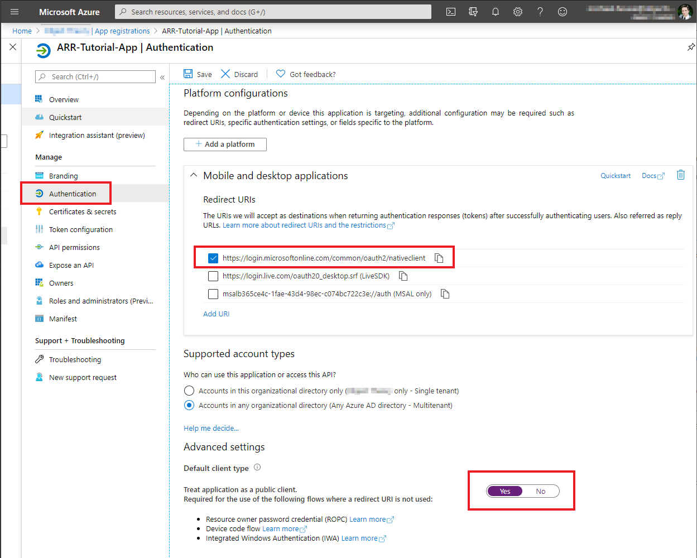

    **AAD Application -> API Permissions**
    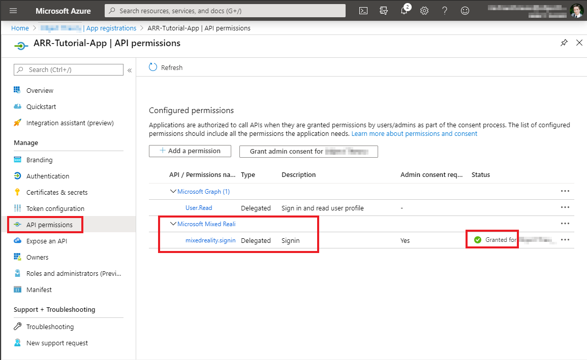

1. After configuring your Remote Rendering account, check your configuration looks like the following image:

    **AAR -> AccessControl (IAM)**
    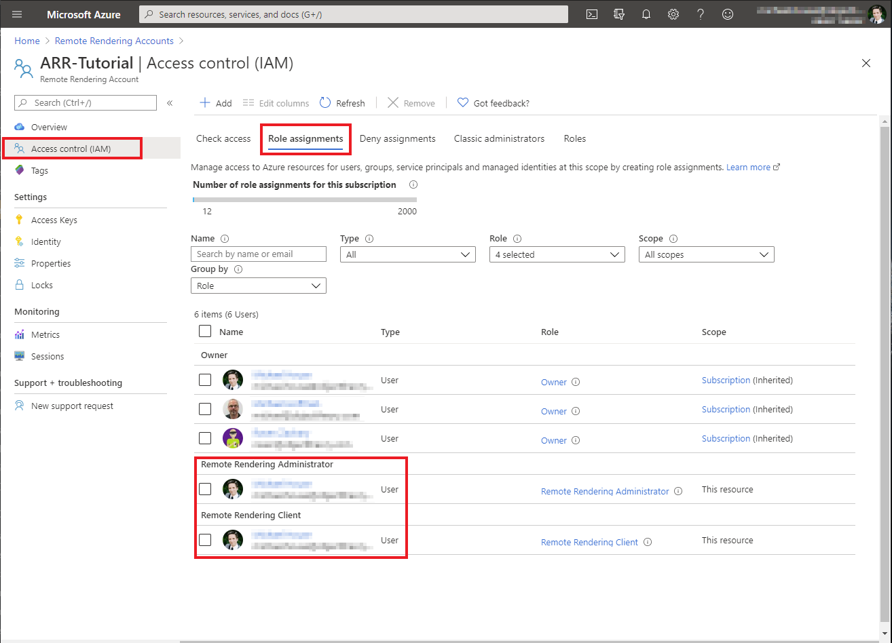

    >[!NOTE]
    > An *Owner* role is not sufficient to manage sessions via the client application. For every user you want to grant the ability to manage sessions you must provide the role **Remote Rendering Client**. For every user you want to manage sessions and convert models, you must provide the role **Remote Rendering Administrator**.

With the Azure side of things in place, we now need to modify how your code connects to the AAR service. We do that by implementing an instance of **BaseARRAuthentication**, which will return a new **AzureFrontendAccountInfo** object. In this case, the account info will be configured with the Azure Access Token.

1. Create a new script named **AADAuthentication** and replace its code with the following:

    ```csharp
    // Copyright (c) Microsoft Corporation. All rights reserved.
    // Licensed under the MIT License. See LICENSE in the project root for license information.

    using Microsoft.Azure.RemoteRendering;
    using Microsoft.Identity.Client;
    using System;
    using System.Linq;
    using System.Threading;
    using System.Threading.Tasks;
    using UnityEngine;

    public class AADAuthentication : BaseARRAuthentication
    {
        [SerializeField]
        private string accountDomain;
        public string AccountDomain
        {
            get => accountDomain.Trim();
            set => accountDomain = value;
        }

        [SerializeField]
        private string activeDirectoryApplicationClientID;
        public string ActiveDirectoryApplicationClientID
        {
            get => activeDirectoryApplicationClientID.Trim();
            set => activeDirectoryApplicationClientID = value;
        }

        [SerializeField]
        private string azureTenantID;
        public string AzureTenantID
        {
            get => azureTenantID.Trim();
            set => azureTenantID = value;
        }

        [SerializeField]
        private string azureRemoteRenderingAccountID;
        public string AzureRemoteRenderingAccountID
        {
            get => azureRemoteRenderingAccountID.Trim();
            set => azureRemoteRenderingAccountID = value;
        }

        public override event Action<string> AuthenticationInstructions;

        string authority => "https://login.microsoftonline.com/" + AzureTenantID;

        string redirect_uri = "https://login.microsoftonline.com/common/oauth2/nativeclient";

        string[] scopes => new string[] { "https://sts.mixedreality.azure.com/mixedreality.signin" };

        public void OnEnable()
        {
            RemoteRenderingCoordinator.ARRCredentialGetter = GetAARCredentials;
            this.gameObject.AddComponent<ExecuteOnUnityThread>();
        }

        public async override Task<AzureFrontendAccountInfo> GetAARCredentials()
        {
            var result = await TryLogin();
            if (result != null)
            {
                Debug.Log("Account signin successful " + result.Account.Username);

                var AD_Token = result.AccessToken;

                return await Task.FromResult(new AzureFrontendAccountInfo(AccountDomain, AzureRemoteRenderingAccountID, "", AD_Token, ""));
            }
            else
            {
                Debug.LogError("Error logging in");
            }
            return default;
        }

        private Task DeviceCodeReturned(DeviceCodeResult deviceCodeDetails)
        {
            //Since everything in this task can happen on a different thread, invoke responses on the main Unity thread
            ExecuteOnUnityThread.Enqueue(() =>
            {
                // Display instructions to the user for how to authenticate in the browser
                Debug.Log(deviceCodeDetails.Message);
                AuthenticationInstructions?.Invoke(deviceCodeDetails.Message);
            });

            return Task.FromResult(0);
        }

        public override async Task<AuthenticationResult> TryLogin()
        {
            var clientApplication = PublicClientApplicationBuilder.Create(ActiveDirectoryApplicationClientID).WithAuthority(authority).WithRedirectUri(redirect_uri).Build();
            AuthenticationResult result = null;
            try
            {
                var accounts = await clientApplication.GetAccountsAsync();

                if (accounts.Any())
                {
                    result = await clientApplication.AcquireTokenSilent(scopes, accounts.First()).ExecuteAsync();

                    return result;
                }
                else
                {
                    try
                    {
                        result = await clientApplication.AcquireTokenWithDeviceCode(scopes, DeviceCodeReturned).ExecuteAsync(CancellationToken.None);
                        return result;
                    }
                    catch (MsalUiRequiredException ex)
                    {
                        Debug.LogError("MsalUiRequiredException");
                        Debug.LogException(ex);
                    }
                    catch (MsalServiceException ex)
                    {
                        Debug.LogError("MsalServiceException");
                        Debug.LogException(ex);
                    }
                    catch (MsalClientException ex)
                    {
                        Debug.LogError("MsalClientException");
                        Debug.LogException(ex);
                        // Mitigation: Use interactive authentication
                    }
                    catch (Exception ex)
                    {
                        Debug.LogError("Exception");
                        Debug.LogException(ex);
                    }
                }
            }
            catch (Exception ex)
            {
                Debug.LogError("GetAccountsAsync");
                Debug.LogException(ex);
            }

            return null;
        }
    }
    ```

>[!NOTE]
> This code is by no means complete and is not ready for a commercial application. For example, at a minimum you'll likely want to add the ability to sign out too. This can be done using the `Task RemoveAsync(IAccount account)` method provided by the client application. This code is only intended for tutorial use, your implementation will be specific to your application.

The code first tries to get the token silently using **AquireTokenSilent**. This will be successful if the user has previously authenticated this application. If it's not successful, move on to a more user-involved strategy.

For this code, we're using the [device code flow](https://docs.microsoft.com/azure/active-directory/develop/v2-oauth2-device-code) to obtain an Access Token. This flow allows the user to sign in to their Azure account on a computer or mobile device and have the resulting token sent back to the HoloLens application.

The most important part of this class from an ARR perspective is this line:

```csharp
return await Task.FromResult(new AzureFrontendAccountInfo(AccountDomain, AzureRemoteRenderingAccountID, "", AD_Token, ""));
```

Here, we create a new **AzureFrontendAccountInfo** object using the account domain, account ID, and access token. This token is then used by the ARR service to query, create, and join remote rendering sessions as long as the user is authorized based on the role-based permissions configured earlier.

With this change, the current state of the application and its access to your Azure resources looks like this:

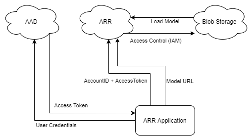

Since the User Credentials aren't stored on the device (or in this case even entered on the device), their exposure risk is very low. Now the device is using a user-specific, time-limited Access Token to access ARR, which uses access control (IAM) to access the Blob Storage. These two steps have completely removed the "passwords" from the source code and increased security considerably. However, this isn't the most security available, moving the model and session management to a web service will improve security further. Additional security considerations are discussed in the [Commercial Readiness](../commercial-ready/commercial-ready.md) chapter.

### Testing AAD Auth

In the Unity Editor, when AAD Auth is active, you will need to authenticate every time you launch the application. On device, the authentication step will happen the first time and only be required again when the token expires or is invalidated.

1. Add the **AADAuthentication** component to the **RemoteRenderingCoordinator** GameObject.

    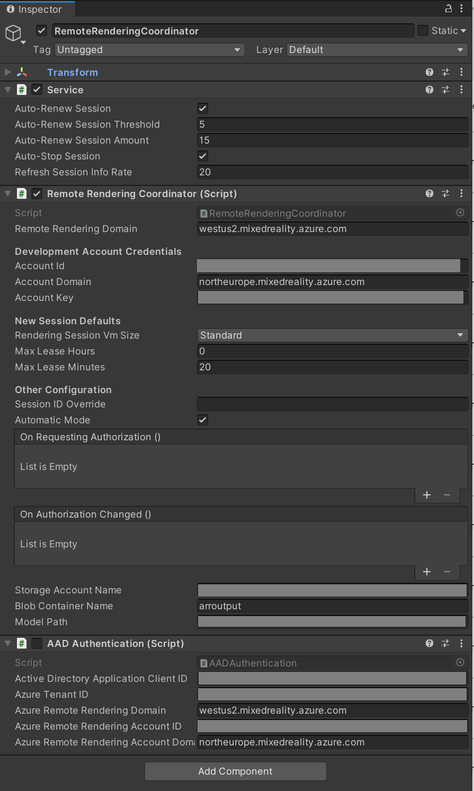

1. Fill in your values for the Client ID and the Tenant ID. These values can be found in your App Registration's Overview Page:

    * **Account Domain** is the same domain you've been using in the **RemoteRenderingCoordinator**'s Account Domain.
    * **Active Directory Application Client ID** is the *Application (client) ID* found in your AAD app registration (see image below).
    * **Azure Tenant ID** is the *Directory (tenant) ID* found in your AAD app registration ( see image below).
    * **Azure Remote Rendering Account ID** is the same **Account ID** you've been using for **RemoteRenderingCoordinator**.

    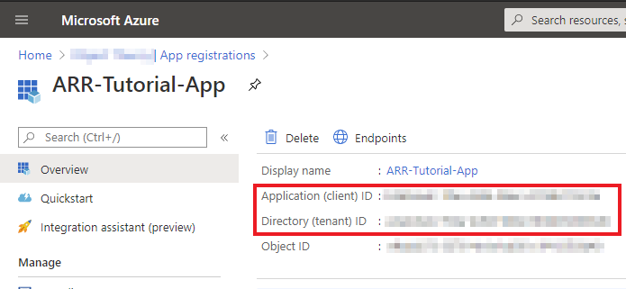

1. Press Play in the Unity Editor and consent to running a session.
    Since the **AADAuthentication** component has a view controller, its automatically hooked up to display a prompt after the session authorization modal panel.
1. Follow the instructions found in the panel to the right of the **AppMenu**.
    You should see something similar to this:
    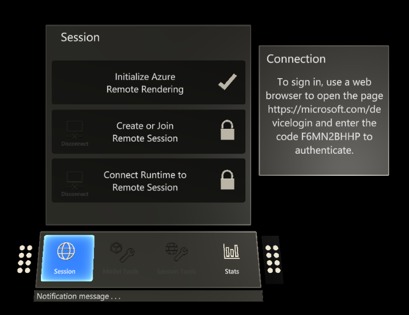
    After entering the provided coded on your secondary device (or browser on the same device) and logging in using your credentials, an Access Token will be returned to the requesting application, in this case, the Unity Editor.
1. After this point, everything in the application should proceed normally. Check the Unity Console for any errors if you're not progressing through the stages as expected.

## Build to device

If you're building an application using MSAL to device, you'll need to include a file in your project's **Assets** folder. This will help the compiler build the application correctly using the *Microsoft.Identity.Client.dll* included in the **Tutorial Assets**.

1. Add a new file in **Assets** named **link.xml**
1. Add the following for to the file:

    ```xml
    <linker>
        <assembly fullname="Microsoft.Identity.Client" preserve="all"/>
        <assembly fullname="System.Runtime.Serialization" preserve="all"/>
        <assembly fullname="System.Core">
            <type fullname="System.Linq.Expressions.Interpreter.LightLambda" preserve="all" />
        </assembly>
    </linker>
    ```

1. Save the changes

Follow the steps found in [Quickstart: Deploy Unity sample to HoloLens - Build the sample Project](../../../quickstarts/deploy-to-hololens.md#build-the-sample-project), to build to HoloLens.

## Next steps

The remainder of this tutorial set contains conceptual topics for creating a production-ready application that uses Azure Remote Rendering.

> [!div class="nextstepaction"]
> [Next: Commercial Readiness](../commercial-ready/commercial-ready.md)
