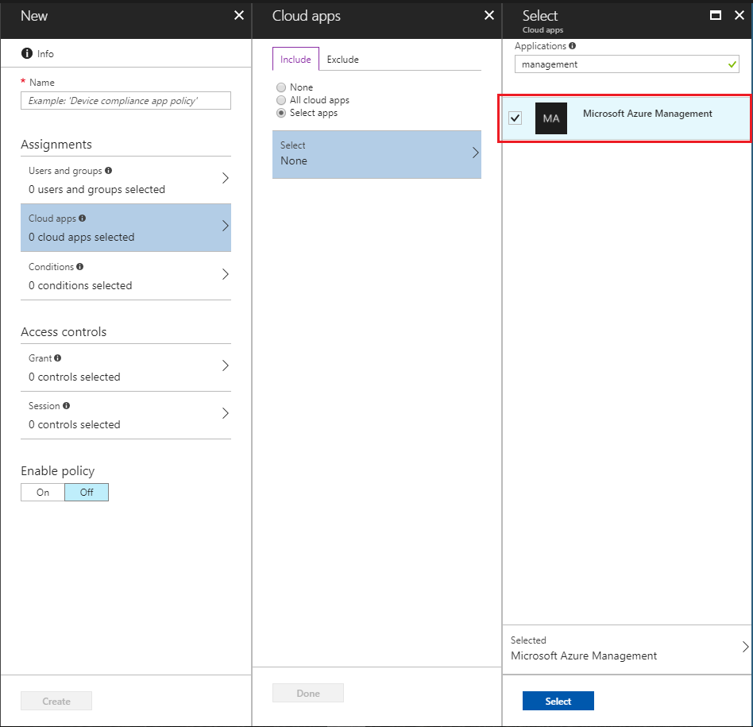

# Manage access to Azure management with Conditional Access

Conditional Access in Azure Active Directory (Azure AD) controls access to cloud apps based on specific conditions that you specify. To allow access, you create Conditional Access policies that allow or block access based on whether or not the requirements in the policy are met. 

Typically, you use Conditional Access to control access to your cloud apps. You can also set up policies to control access to Azure management based on certain conditions (such as sign-in risk, location, or device) and to enforce requirements like multi-factor authentication.

To create a policy for Azure management, you select **Microsoft Azure Management** under **Cloud apps** when choosing the app to which to apply the policy.

The policy you create applies to all Azure management endpoints, including the following:

- Azure portal
- Azure Resource Manager provider
- Classic Service Management APIs
- Azure PowerShell
- Visual Studio subscriptions administrator portal
- Azure DevOps

Note that the policy applies to Azure PowerShell, which calls the Azure Resource Manager API. It does not apply to [Azure AD PowerShell](/powershell/azure/active-directory/install-adv2), which calls Microsoft Graph.

> [!CAUTION]
> Make sure you understand how Conditional Access works before setting up a policy to manage access to Azure management. Make sure you don't create conditions that could block your own access to the portal.

For more information on how to set up and use Conditional Access, see [Conditional Access in Azure Active Directory](../active-directory/active-directory-conditional-access-azure-portal.md).