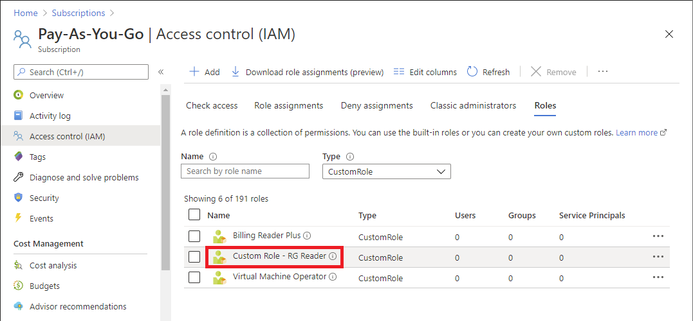

# Create an Azure custom role using an Azure Resource Manager template

If the [Azure built-in roles](built-in-roles.md) don't meet the specific needs of your organization, you can create your own [custom roles](custom-roles.md). This article describes how to create a custom role using an Azure Resource Manager template.

[!INCLUDE [About Azure Resource Manager](../../includes/resource-manager-quickstart-introduction.md)]

## Prerequisites

To create a custom role, you must have:

- Permissions to create custom roles, such as [Owner](built-in-roles.md#owner) or [User Access Administrator](built-in-roles.md#user-access-administrator)

## Create a custom role

To create a custom role, you specify a role name, permissions, and where the role can be used. In this article, you create a role named "Custom Role - RG Reader" with resource permissions that can be assigned at a subscription scope or lower.

### Review the template

The template used in this article is from [Azure Quickstart Templates](https://github.com/Azure/azure-quickstart-templates/tree/master/subscription-deployments/create-role-def). The template has four parameters and a resources section. The four parameters are:

- Array of actions with a default value of ["Microsoft.Resources/subscriptions/resourceGroups/read"]
- Array of notActions with an empty default value
- Role name with a default value of "Custom Role - RG Reader"
- Role description with a default value of "Subscription Level Deployment of a Role Definition"

The resource defined in the template is:

- [Microsoft.Authorization/roleDefinitions](/azure/templates/Microsoft.Authorization/roleDefinitions)

The scope where this custom role can be assigned is set to the current subscription.

:::code language="json" source="~/quickstart-templates/subscription-deployments/create-role-def/azuredeploy.json":::

### Deploy the template

Follow these steps to deploy the previous template.

1. Sign in to the [Azure portal](https://portal.azure.com).

1. Open Azure Cloud Shell for PowerShell.

1. Copy and paste the following script into Cloud Shell.

    ```azurepowershell
    $location = Read-Host -Prompt "Enter a location (i.e. centralus)"
    [string[]]$actions = Read-Host -Prompt "Enter actions as a comma-separated list (i.e. action1,action2)"
    $actions = $actions.Split(',')

    $templateUri = "https://raw.githubusercontent.com/Azure/azure-quickstart-templates/master/subscription-deployments/create-role-def/azuredeploy.json"

    New-AzDeployment -Location $location -TemplateUri $templateUri -actions $actions
    ```

1. Enter a location for the deployment such as *centralus*.

1. Enter a list of actions for the custom role as a comma-separated list such as *Microsoft.Resources/resources/read,Microsoft.Resources/subscriptions/resourceGroups/read*.

1. If necessary, press Enter to run the New-AzDeployment command.

    The [New-AzDeployment](/powershell/module/az.resources/new-azdeployment) command deploys the template to create the custom role.

    You should see output similar to the following:

    ```azurepowershell
    PS> New-AzDeployment -Location $location -TemplateUri $templateUri -actions $actions
    
    Id                      : /subscriptions/{subscriptionId}/providers/Microsoft.Resources/deployments/azuredeploy
    DeploymentName          : azuredeploy
    Location                : centralus
    ProvisioningState       : Succeeded
    Timestamp               : 6/25/2020 8:08:32 PM
    Mode                    : Incremental
    TemplateLink            :
                              Uri            : https://raw.githubusercontent.com/Azure/azure-quickstart-templates/master/subscription-deployments/create-role-def/azuredeploy.json
                              ContentVersion : 1.0.0.0
    
    Parameters              :
                              Name               Type                       Value
                              =================  =========================  ==========
                              actions            Array                      [
                                "Microsoft.Resources/resources/read",
                                "Microsoft.Resources/subscriptions/resourceGroups/read"
                              ]
                              notActions         Array                      []
                              roleName           String                     Custom Role - RG Reader
                              roleDescription    String                     Subscription Level Deployment of a Role Definition
    
    Outputs                 :
    DeploymentDebugLogLevel :
    ```

## Review deployed resources

Follow these steps to verify that the custom role was created.

1. Run the [Get-AzRoleDefinition](/powershell/module/az.resources/get-azroledefinition) command to list the custom role.

    ```azurepowershell
    Get-AzRoleDefinition "Custom Role - RG Reader" | ConvertTo-Json
    ```

    You should see output similar to the following:

    ```azurepowershell
    {
      "Name": "Custom Role - RG Reader",
      "Id": "11111111-1111-1111-1111-111111111111",
      "IsCustom": true,
      "Description": "Subscription Level Deployment of a Role Definition",
      "Actions": [
        "Microsoft.Resources/resources/read",
        "Microsoft.Resources/subscriptions/resourceGroups/read"
      ],
      "NotActions": [],
      "DataActions": [],
      "NotDataActions": [],
      "AssignableScopes": [
        "/subscriptions/{subscriptionId}"
      ]
    }
    ```

1. In the Azure portal, open your subscription.

1. In the left menu, click **Access control (IAM)**.

1. Click the **Roles** tab.

1. Set the **Type** list to **CustomRole**.

1. Verify that the **Custom Role - RG Reader** role is listed.

   

## Clean up resources

To remove the custom role, follow these steps.

1. Run the following command to remove the custom role.

    ```azurepowershell
    Get-AzRoleDefinition -Name "Custom Role - RG Reader" | Remove-AzRoleDefinition
    ```

1. Enter **Y** to confirm that you want to remove the custom role.

## Next steps

- [Understand Azure role definitions](role-definitions.md)
- [Quickstart: Add an Azure role assignment using an Azure Resource Manager template](quickstart-role-assignments-template.md)
- [ARM template documentation](../azure-resource-manager/templates/index.yml)
