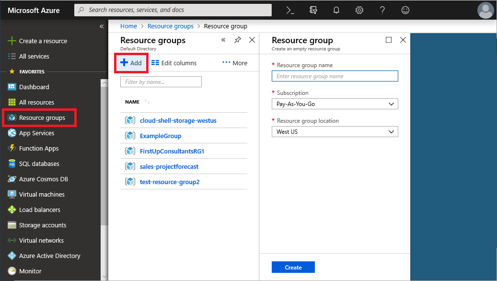
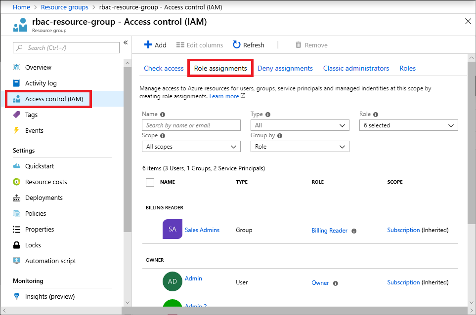
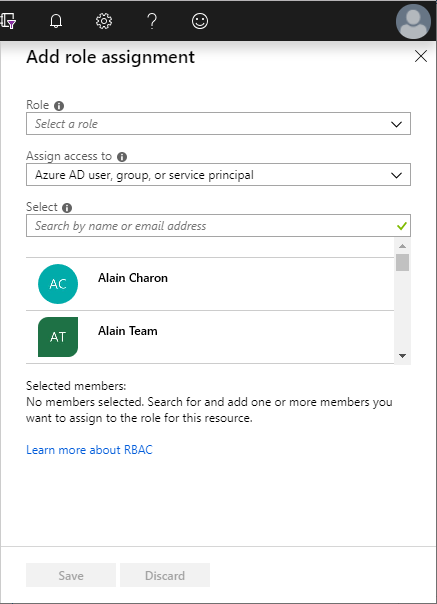
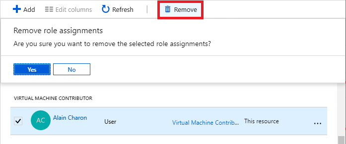

# Tutorial: Grant a user access to Azure resources using the Azure portal

[Azure role-based access control (Azure RBAC)](overview.md) is the way that you manage access to Azure resources. In this tutorial, you grant a user access to create and manage virtual machines in a resource group.

In this tutorial, you learn how to:

> [!div class="checklist"]
> * Grant access for a user at a resource group scope
> * Remove access

If you don't have an Azure subscription, create a [free account](https://azure.microsoft.com/free/?WT.mc_id=A261C142F) before you begin.

## Sign in to Azure

Sign in to the Azure portal at https://portal.azure.com.

## Create a resource group

1. In the navigation list, click **Resource groups**.

1. Click **Add** to open the **Resource group** blade.

   

1. For **Resource group name**, enter **rbac-resource-group**.

1. Select a subscription and a location.

1. Click **Create** to create the resource group.

1. Click **Refresh** to refresh the list of resource groups.

   The new resource group appears in your resource groups list.

   

## Grant access

In Azure RBAC, to grant access, you assign an Azure role.

1. In the list of **Resource groups**, click the new **rbac-resource-group** resource group.

1. Click **Access control (IAM)**.

1. Click the **Role assignments** tab to see the current list of role assignments.

   

1. Click **Add** > **Add role assignment** to open the Add role assignment pane.

   If you don't have permissions to assign roles, the Add role assignment option will be disabled.

   

    The Add role assignment pane opens.

   

1. In the **Role** drop-down list, select **Virtual Machine Contributor**.

1. In the **Select** list, select yourself or another user.

1. Click **Save** to assign the role.

   After a few moments, the user is assigned the Virtual Machine Contributor role at the rbac-resource-group resource group scope.

   

## Remove access

In Azure RBAC, to remove access, you remove a role assignment.

1. In the list of role assignments, add a checkmark next to the user with the Virtual Machine Contributor role.

1. Click **Remove**.

   

1. In the remove role assignment message that appears, click **Yes**.

## Clean up

1. In the navigation list, click **Resource groups**.

1. Click **rbac-resource-group** to open the resource group.

1. Click **Delete resource group** to delete the resource group.

   

1. On the **Are you sure you want to delete** blade, type the resource group name: **rbac-resource-group**.

1. Click **Delete** to delete the resource group.

## Next steps

> [!div class="nextstepaction"]
> [Tutorial: Grant a user access to Azure resources using Azure PowerShell](tutorial-role-assignments-user-powershell.md)
