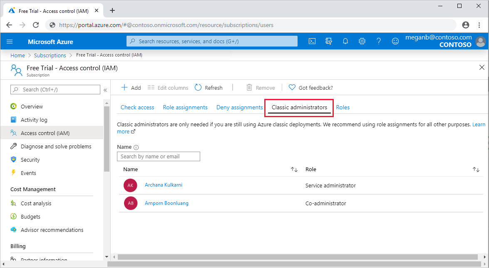
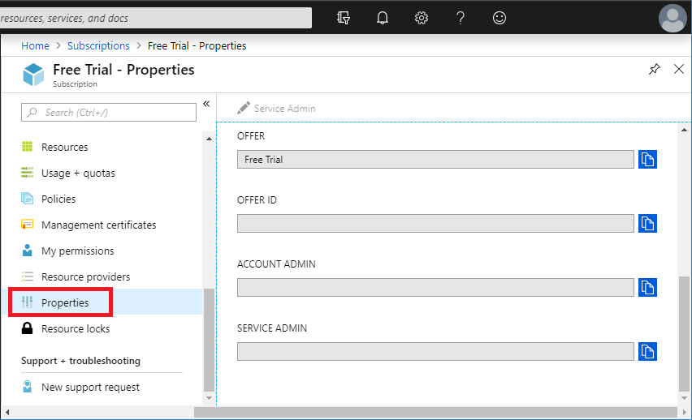
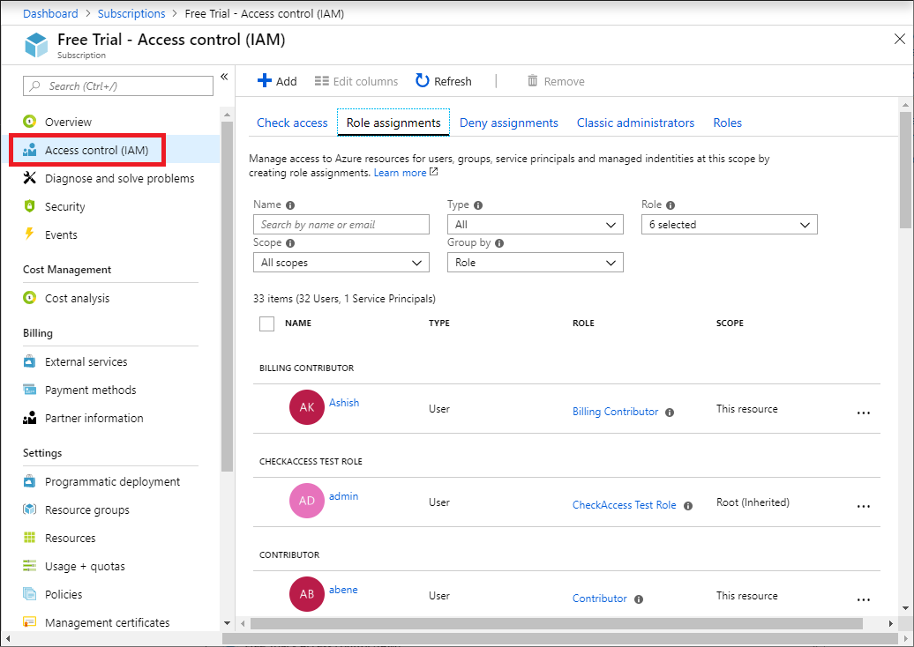
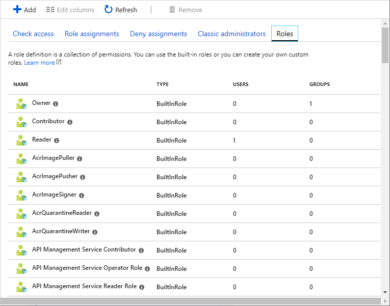

# Classic subscription administrator roles, Azure roles, and Azure AD roles

If you are new to Azure, you may find it a little challenging to understand all the different roles in Azure. This article helps explain the following roles and when you would use each:
- Classic subscription administrator roles
- Azure roles
- Azure Active Directory (Azure AD) roles

## How the roles are related

To better understand roles in Azure, it helps to know some of the history. When Azure was initially released, access to resources was managed with just three administrator roles: Account Administrator, Service Administrator, and Co-Administrator. Later, Azure role-based access control (Azure RBAC) was added. Azure RBAC is a newer authorization system that provides fine-grained access management to Azure resources. Azure RBAC includes many built-in roles, can be assigned at different scopes, and allows you to create your own custom roles. To manage resources in Azure AD, such as users, groups, and domains, there are several Azure AD roles.

The following diagram is a high-level view of how the classic subscription administrator roles, Azure roles, and Azure AD roles are related.

## Classic subscription administrator roles

Account Administrator, Service Administrator, and Co-Administrator are the three classic subscription administrator roles in Azure. Classic subscription administrators have full access to the Azure subscription. They can manage resources using the Azure portal, Azure Resource Manager APIs, and the classic deployment model APIs. The account that is used to sign up for Azure is automatically set as both the Account Administrator and Service Administrator. Then, additional Co-Administrators can be added. The Service Administrator and the Co-Administrators have the equivalent access of users who have been assigned the Owner role (an Azure role) at the subscription scope. The following table describes the differences between these three classic subscription administrative roles.

| Classic subscription administrator | Limit | Permissions | Notes |
| --- | --- | --- | --- |
| Account Administrator | 1 per Azure account | <ul><li>Manage billing in the [Azure portal](https://portal.azure.com/#blade/Microsoft_Azure_Billing/SubscriptionsBlade)</li><li>Manage all subscriptions in an account</li><li>Create new subscriptions</li><li>Cancel subscriptions</li><li>Change the billing for a subscription</li><li>Change the Service Administrator</li></ul> | Conceptually, the billing owner of the subscription. The Account Administrator has no access to the Azure portal. |
| Service Administrator | 1 per Azure subscription | <ul><li>Manage services in the [Azure portal](https://portal.azure.com)</li><li>Cancel the subscription</li><li>Assign users to the Co-Administrator role</li></ul> | By default, for a new subscription, the Account Administrator is also the Service Administrator. The Service Administrator has the equivalent access of a user who is assigned the Owner role at the subscription scope. The Service Administrator has full access to the Azure portal. |
| Co-Administrator | 200 per subscription | <ul><li>Same access privileges as the Service Administrator, but can’t change the association of subscriptions to Azure directories</li><li>Assign users to the Co-Administrator role, but cannot change the Service Administrator</li></ul> | The Co-Administrator has the equivalent access of a user who is assigned the Owner role at the subscription scope. |

In the Azure portal, you can manage Co-Administrators or view the Service Administrator by using the **Classic administrators** tab.

In the Azure portal, you can view or change the Service Administrator or view the Account Administrator on the properties blade of your subscription.

For more information, see [Azure classic subscription administrators](classic-administrators.md).

### Azure account and Azure subscriptions

An Azure account represents a billing relationship. An Azure account is a user identity, one or more Azure subscriptions, and an associated set of Azure resources. The person who creates the account is the Account Administrator for all subscriptions created in that account. That person is also the default Service Administrator for the subscription.

Azure subscriptions help you organize access to Azure resources. They also help you control how resource usage is reported, billed, and paid for. Each subscription can have a different billing and payment setup, so you can have different subscriptions and different plans by office, department, project, and so on. Every service belongs to a subscription, and the subscription ID may be required for programmatic operations.

Each subscription is associated with an Azure AD directory. To find the directory the subscription is associated with, open **Subscriptions** in the Azure portal and then select a subscription to see the directory.

Accounts and subscriptions are managed in the [Azure portal](https://portal.azure.com/#blade/Microsoft_Azure_Billing/SubscriptionsBlade).

## Azure roles

Azure RBAC is an authorization system built on [Azure Resource Manager](../azure-resource-manager/management/overview.md) that provides fine-grained access management to Azure resources, such as compute and storage. Azure RBAC includes over 70 built-in roles. There are four fundamental Azure roles. The first three apply to all resource types:

| Azure role | Permissions | Notes |
| --- | --- | --- |
| [Owner](built-in-roles.md#owner) | <ul><li>Full access to all resources</li><li>Delegate access to others</li></ul> | The Service Administrator and Co-Administrators are assigned the Owner role at the subscription scope Applies to all resource types. |
| [Contributor](built-in-roles.md#contributor) | <ul><li>Create and manage all of types of Azure resources</li><li>Create a new tenant in Azure Active Directory</li><li>Cannot grant access to others</li></ul> | Applies to all resource types. |
| [Reader](built-in-roles.md#reader) | <ul><li>View Azure resources</li></ul> | Applies to all resource types. |
| [User Access Administrator](built-in-roles.md#user-access-administrator) | <ul><li>Manage user access to Azure resources</li></ul> |  |

The rest of the built-in roles allow management of specific Azure resources. For example, the [Virtual Machine Contributor](built-in-roles.md#virtual-machine-contributor) role allows the user to create and manage virtual machines. For a list of all the built-in roles, see [Azure built-in roles](built-in-roles.md).

Only the Azure portal and the Azure Resource Manager APIs support Azure RBAC. Users, groups, and applications that are assigned Azure roles cannot use the [Azure classic deployment model APIs](../azure-resource-manager/management/deployment-models.md).

In the Azure portal, role assignments using Azure RBAC appear on the **Access control (IAM)** blade. This blade can be found throughout the portal, such as management groups, subscriptions, resource groups, and various resources.

When you click the **Roles** tab, you will see the list of built-in and custom roles.

For more information, see [Add or remove Azure role assignments using the Azure portal](role-assignments-portal.md).

## Azure AD roles

Azure AD roles are used to manage Azure AD resources in a directory such as create or edit users, assign administrative roles to others, reset user passwords, manage user licenses, and manage domains. The following table describes a few of the more important Azure AD roles.

| Azure AD role | Permissions | Notes |
| --- | --- | --- |
| [Global Administrator](../active-directory/users-groups-roles/directory-assign-admin-roles.md#company-administrator-permissions) | <ul><li>Manage access to all administrative features in Azure Active Directory, as well as services that federate to Azure Active Directory</li><li>Assign administrator roles to others</li><li>Reset the password for any user and all other administrators</li></ul> | The person who signs up for the Azure Active Directory tenant becomes a Global Administrator. |
| [User Administrator](../active-directory/users-groups-roles/directory-assign-admin-roles.md#user-administrator) | <ul><li>Create and manage all aspects of users and groups</li><li>Manage support tickets</li><li>Monitor service health</li><li>Change passwords for users, Helpdesk administrators, and other User Administrators</li></ul> |  |
| [Billing Administrator](../active-directory/users-groups-roles/directory-assign-admin-roles.md#billing-administrator) | <ul><li>Make purchases</li><li>Manage subscriptions</li><li>Manage support tickets</li><li>Monitors service health</li></ul> |  |

In the Azure portal, you can see the list of Azure AD roles on the **Roles and administrators** blade. For a list of all the Azure AD roles, see [Administrator role permissions in Azure Active Directory](../active-directory/users-groups-roles/directory-assign-admin-roles.md).

## Differences between Azure roles and Azure AD roles

At a high level, Azure roles control permissions to manage Azure resources, while Azure AD roles control permissions to manage Azure Active Directory resources. The following table compares some of the differences.

| Azure roles | Azure AD roles |
| --- | --- |
| Manage access to Azure resources | Manage access to Azure Active Directory resources |
| Supports custom roles | Supports custom roles |
| Scope can be specified at multiple levels (management group, subscription, resource group, resource) | Scope is at the tenant level |
| Role information can be accessed in Azure portal, Azure CLI, Azure PowerShell, Azure Resource Manager templates, REST API | Role information can be accessed in Azure admin portal, Microsoft 365 admin center, Microsoft Graph, AzureAD PowerShell |

### Do Azure roles and Azure AD roles overlap?

By default, Azure roles and Azure AD roles do not span Azure and Azure AD. However, if a Global Administrator elevates their access by choosing the **Access management for Azure resources** switch in the Azure portal, the Global Administrator will be granted the [User Access Administrator](built-in-roles.md#user-access-administrator) role (an Azure role) on all subscriptions for a particular tenant. The User Access Administrator role enables the user to grant other users access to Azure resources. This switch can be helpful to regain access to a subscription. For more information, see [Elevate access to manage all Azure subscriptions and management groups](elevate-access-global-admin.md).

Several Azure AD roles span Azure AD and Microsoft 365, such as the Global Administrator and User Administrator roles. For example, if you are a member of the Global Administrator role, you have global administrator capabilities in Azure AD and Microsoft 365, such as making changes to Microsoft Exchange and Microsoft SharePoint. However, by default, the Global Administrator doesn't have access to Azure resources.

## Next steps

- [What is Azure role-based access control (Azure RBAC)?](overview.md)
- [Administrator role permissions in Azure Active Directory](../active-directory/users-groups-roles/directory-assign-admin-roles.md)
- [Azure classic subscription administrators](classic-administrators.md)
