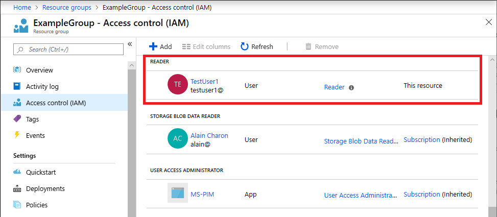
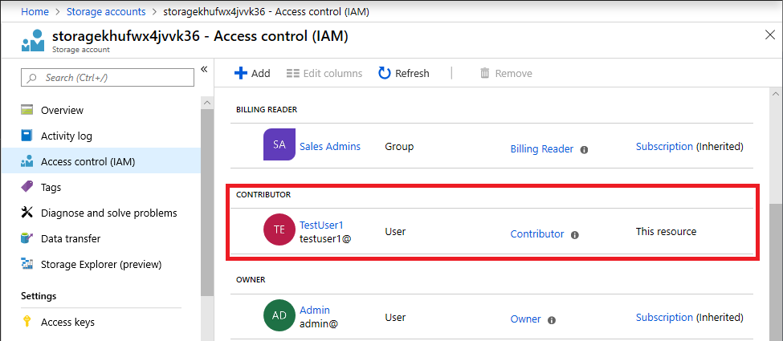

# Manage access to Azure resources using RBAC and Azure Resource Manager templates

[Role-based access control (RBAC)](overview.md) is the way that you manage access to Azure resources. In addition to using Azure PowerShell or the Azure CLI, you can manage access to Azure resources using RBAC and [Azure Resource Manager templates](../azure-resource-manager/resource-group-authoring-templates.md). Templates can be helpful if you need to deploy resources consistently and repeatedly. This article describes how you can manage access using RBAC and templates.

## Assign role to resource group or subscription

In RBAC, to grant access, you create a role assignment. The following template demonstrates:
- How to assign a role to a user, group, or application at either the resource group or subscription scope
- How to specify the Owner, Contributor, and Reader roles as a parameter

To use the template, you must specify the following inputs:
- The unique identifier of a user, group, or application to assign the role to
- The role to assign
- A unique identifier that will be used for the role assignment, or you can use the default identifier

```json
{
  "$schema": "https://schema.management.azure.com/schemas/2015-01-01/deploymentTemplate.json#",
  "contentVersion": "1.0.0.0",
  "parameters": {
    "principalId": {
      "type": "string",
      "metadata": {
        "description": "The principal to assign the role to"
      }
    },
    "builtInRoleType": {
      "type": "string",
      "allowedValues": [
        "Owner",
        "Contributor",
        "Reader"
      ],
      "metadata": {
        "description": "Built-in role to assign"
      }
    },
    "roleNameGuid": {
      "type": "string",
      "defaultValue": "[newGuid()]",
      "metadata": {
        "description": "A new GUID used to identify the role assignment"
      }
    }
  },
  "variables": {
    "Owner": "[concat('/subscriptions/', subscription().subscriptionId, '/providers/Microsoft.Authorization/roleDefinitions/', '8e3af657-a8ff-443c-a75c-2fe8c4bcb635')]",
    "Contributor": "[concat('/subscriptions/', subscription().subscriptionId, '/providers/Microsoft.Authorization/roleDefinitions/', 'b24988ac-6180-42a0-ab88-20f7382dd24c')]",
    "Reader": "[concat('/subscriptions/', subscription().subscriptionId, '/providers/Microsoft.Authorization/roleDefinitions/', 'acdd72a7-3385-48ef-bd42-f606fba81ae7')]"
  },
  "resources": [
    {
      "type": "Microsoft.Authorization/roleAssignments",
      "apiVersion": "2018-09-01-preview",
      "name": "[parameters('roleNameGuid')]",
      "properties": {
        "roleDefinitionId": "[variables(parameters('builtInRoleType'))]",
        "principalId": "[parameters('principalId')]"
      }
    }
  ]
}
```

The following shows an example of a Reader role assignment to a user for a resource group after deploying the template.



The scope of the role assignment is determined from the level of the deployment. Both resource group and subscription level deployment commands are shown in this article.

## Assign role to resource

If you need to create a role assignment at the level of a resource, the format of the role assignment is different. You provide the resource provider namespace and resource type of the resource to assign the role to. You also include the name of the resource in the name of the role assignment.

For the type and name of the role assignment, use the following format:

```json
"type": "{resource-provider-namespace}/{resource-type}/providers/roleAssignments",
"name": "{resource-name}/Microsoft.Authorization/{role-assign-GUID}"
```

The following template deploys a storage account and assigns a role to it. You deploy it with the resource group commands.

```json
{
  "$schema": "https://schema.management.azure.com/schemas/2015-01-01/deploymentTemplate.json#",
  "contentVersion": "1.0.0.0",
  "parameters": {
    "principalId": {
      "type": "string",
      "metadata": {
        "description": "The principal to assign the role to"
      }
    },
    "builtInRoleType": {
      "type": "string",
      "allowedValues": [
        "Owner",
        "Contributor",
        "Reader"
      ],
      "metadata": {
        "description": "Built-in role to assign"
      }
    },
    "roleNameGuid": {
      "type": "string",
      "defaultValue": "[newGuid()]",
      "metadata": {
        "description": "A new GUID used to identify the role assignment"
      }
    },
    "location": {
        "type": "string",
        "defaultValue": "[resourceGroup().location]"
    }
  },
  "variables": {
    "Owner": "[concat('/subscriptions/', subscription().subscriptionId, '/providers/Microsoft.Authorization/roleDefinitions/', '8e3af657-a8ff-443c-a75c-2fe8c4bcb635')]",
    "Contributor": "[concat('/subscriptions/', subscription().subscriptionId, '/providers/Microsoft.Authorization/roleDefinitions/', 'b24988ac-6180-42a0-ab88-20f7382dd24c')]",
    "Reader": "[concat('/subscriptions/', subscription().subscriptionId, '/providers/Microsoft.Authorization/roleDefinitions/', 'acdd72a7-3385-48ef-bd42-f606fba81ae7')]",
    "storageName": "[concat('storage', uniqueString(resourceGroup().id))]"
  },
  "resources": [
    {
      "apiVersion": "2019-04-01",
      "type": "Microsoft.Storage/storageAccounts",
      "name": "[variables('storageName')]",
      "location": "[parameters('location')]",
      "sku": {
          "name": "Standard_LRS"
      },
      "kind": "Storage",
      "properties": {}
    },
    {
      "type": "Microsoft.Storage/storageAccounts/providers/roleAssignments",
      "apiVersion": "2018-09-01-preview",
      "name": "[concat(variables('storageName'), '/Microsoft.Authorization/', parameters('roleNameGuid'))]",
      "dependsOn": [
          "[variables('storageName')]"
      ],
      "properties": {
        "roleDefinitionId": "[variables(parameters('builtInRoleType'))]",
        "principalId": "[parameters('principalId')]"
      }
    }
  ]
}
```

The following shows an example of a Contributor role assignment to a user for a storage account after deploying the template.



## Deploy template using Azure PowerShell

[!INCLUDE [az-powershell-update](../../includes/updated-for-az.md)]

To deploy the previous template to either a resource group or a subscription using Azure PowerShell, follow these steps.

1. Create a new file named rbac-rg.json and copy the previous template.

1. Sign in to [Azure PowerShell](/powershell/azure/authenticate-azureps).

1. Get the unique identifier of a user, group, or application. For example, you can use the [Get-AzADUser](/powershell/module/az.resources/get-azaduser) command to list Azure AD users.

    ```azurepowershell
    $userid = (Get-AzADUser -DisplayName "{name}").id
    ```

1. The template generates a default value for the GUID that is used to identify the role assignment. If you need to specify a specific GUID, pass that value in for the roleNameGuid parameter. The identifier has the format: `11111111-1111-1111-1111-111111111111`

To assign the role at the level of a resource or resource group, follow these steps:

1. Create an example resource group.

    ```azurepowershell
    New-AzResourceGroup -Name ExampleGroup -Location "Central US"
    ```

1. Use the [New-AzResourceGroupDeployment](/powershell/module/az.resources/new-azresourcegroupdeployment) command to start the deployment.

    ```azurepowershell
    New-AzResourceGroupDeployment -ResourceGroupName ExampleGroup -TemplateFile rbac-rg.json -principalId $userid -builtInRoleType Reader
    ```

    The following shows an example of the output.

    ```Output
    PS /home/user> New-AzResourceGroupDeployment -ResourceGroupName ExampleGroup -TemplateFile rbac-rg.json -principalId $userid -builtInRoleType Reader
    
    DeploymentName          : rbac-rg
    ResourceGroupName       : ExampleGroup
    ProvisioningState       : Succeeded
    Timestamp               : 7/17/2018 7:46:32 PM
    Mode                    : Incremental
    TemplateLink            :
    Parameters              :
                              Name             Type                       Value
                              ===============  =========================  ==========
                              principalId      String                     22222222-2222-2222-2222-222222222222
                              builtInRoleType  String                     Reader
                              roleNameGuid     String                     11111111-1111-1111-1111-111111111111
    
    Outputs                 :
    DeploymentDebugLogLevel :
    ```

To assign the role at the level of a subscription, use the [New-AzDeployment](/powershell/module/az.resources/new-azdeployment) command and specify a location for the deployment.

```azurepowershell
New-AzDeployment -Location centralus -TemplateFile rbac-rg.json -principalId $userid -builtInRoleType Reader
```

It has a similar output to the deployment command for resource groups.

## Deploy template using the Azure CLI

To deploy the previous template using the Azure CLI to either a resource group or a subscription, follow these steps.

1. Create a new file named rbac-rg.json and copy the previous template.

1. Sign in to the [Azure CLI](/cli/azure/authenticate-azure-cli).

1. Get the unique identifier of a user, group, or application. For example, you can use the [az ad user show](/cli/azure/ad/user#az-ad-user-show) command to show an Azure AD user.

    ```azurecli
    userid=$(az ad user show --upn-or-object-id "{email}" --query objectId --output tsv)
    ```

1. The template generates a default value for the GUID that is used to identify the role assignment. If you need to specify a specific GUID, pass that value in for the roleNameGuid parameter. The identifier has the format: `11111111-1111-1111-1111-111111111111`

To assign the role at the level of a resource or resource group, follow these steps:

1. Create an example resource group.

    ```azurecli
    az group create --name ExampleGroup --location "Central US"
    ```

1. Use the [az group deployment create](/cli/azure/group/deployment#az-group-deployment-create) command to start the deployment.

    ```azurecli
    az group deployment create --resource-group ExampleGroup --template-file rbac-rg.json --parameters principalId=$userid builtInRoleType=Reader
    ```

    The following shows an example of the output.

    ```Output
    C:\Azure\Templates>az group deployment create --resource-group ExampleGroup --template-file rbac-rg.json --parameters principalId=$userid builtInRoleType=Reader
    
    {
      "id": "/subscriptions/00000000-0000-0000-0000-000000000000/resourceGroups/ExampleGroup/providers/Microsoft.Resources/deployments/rbac-rg",
      "name": "rbac-rg",
      "properties": {
        "additionalProperties": {
          "duration": "PT9.5323924S",
          "outputResources": [
            {
              "id": "/subscriptions/00000000-0000-0000-0000-000000000000/resourceGroups/ExampleGroup/providers/Microsoft.Authorization/roleAssignments/11111111-1111-1111-1111-111111111111",
              "resourceGroup": "ExampleGroup"
            }
          ],
          "templateHash": "0000000000000000000"
        },
        "correlationId": "33333333-3333-3333-3333-333333333333",
        "debugSetting": null,
        "dependencies": [],
        "mode": "Incremental",
        "outputs": null,
        "parameters": {
          "builtInRoleType": {
            "type": "String",
            "value": "Reader"
          },
          "principalId": {
            "type": "String",
            "value": "22222222-2222-2222-2222-222222222222"
          },
          "roleNameGuid": {
            "type": "String",
            "value": "11111111-1111-1111-1111-111111111111"
          }
        },
        "parametersLink": null,
        "providers": [
          {
            "id": null,
            "namespace": "Microsoft.Authorization",
            "registrationState": null,
            "resourceTypes": [
              {
                "aliases": null,
                "apiVersions": null,
                "locations": [
                  null
                ],
                "properties": null,
                "resourceType": "roleAssignments"
              }
            ]
          }
        ],
        "provisioningState": "Succeeded",
        "template": null,
        "templateLink": null,
        "timestamp": "2018-07-17T19:00:31.830904+00:00"
      },
      "resourceGroup": "ExampleGroup"
    }
    ```

To assign the role at the level of a subscription, use the [az deployment create](/cli/azure/deployment#az-deployment-create) command and specify a location for the deployment.

```azurecli
az deployment create --location centralus --template-file rbac-rg.json --parameters principalId=$userid builtInRoleType=Reader
```

It has a similar output to the deployment command for resource groups.

## Next steps

- [Quickstart: Create and deploy Azure Resource Manager templates by using the Azure portal](../azure-resource-manager/resource-manager-quickstart-create-templates-use-the-portal.md)
- [Understand the structure and syntax of Azure Resource Manager Templates](../azure-resource-manager/resource-group-authoring-templates.md)
- [Azure Quickstart Templates](https://azure.microsoft.com/resources/templates/?term=rbac)
