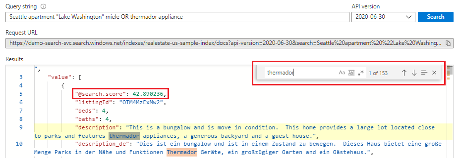
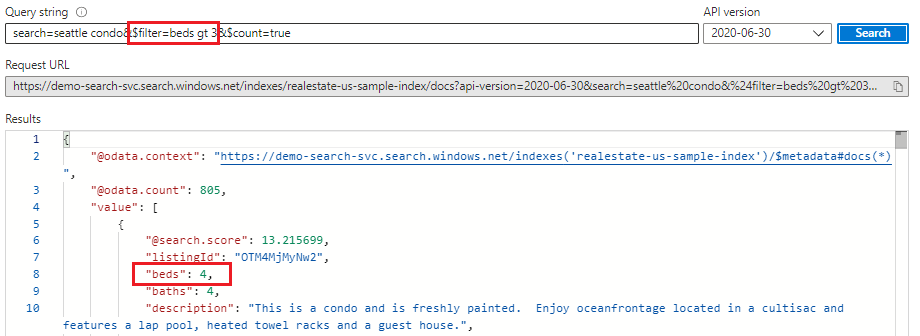
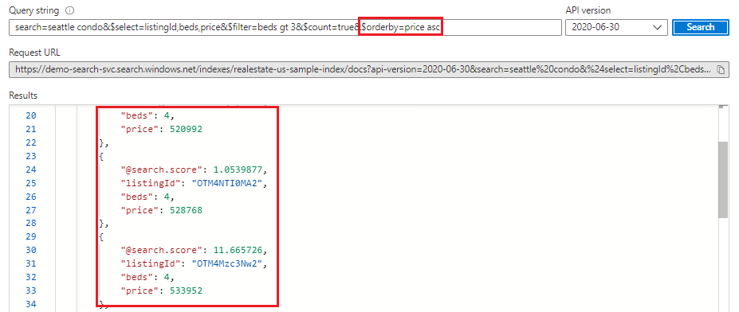

# Use Search explorer in the Azure portal for querying documents in Azure Cognitive Search 

This article shows you how to query an existing Azure Cognitive Search index using **Search explorer** in the Azure portal. You can start Search explorer from the command bar to submit simple or full Lucene query expressions to any existing index in your service. 

   

## Basic search strings

The following examples assume the built-in real estate sample index. You can create this index using the Import data wizard in the portal, choosing **Samples** as the data source.

### Example 1 - empty search

For a first look at your content, execute an empty search by clicking **Search** with no terms provided. An empty search is useful as a first query because it returns entire documents so that you can review document composition. On an empty search, there is no search rank and documents are returned in arbitrary order (`"@search.score": 1` for all documents). By default, 50 documents are returned in a search request.

Equivalent syntax for an empty search is `*` or `search=*`.

   ```Input
   search=*
   ```

   **Results**
   
   

### Example 2 - free text search

Free-form queries, with or without operators, are useful for simulating user-defined queries sent from a custom app to Azure Cognitive Search. Notice that when you provide query terms or expressions, search rank comes into play. The following example illustrates a free text search.

   ```Input
   Seattle apartment "Lake Washington" miele OR thermador appliance
   ```

   **Results**

   You can use Ctrl-F to search within results for specific terms of interest.

   

### Example 3 - count of matching documents 

Add **$count** to get the number of matches found in an index. On an empty search, count is the total number of documents in the index. On a qualified search, it's the number of documents matching the query input.

   ```Input1
   $count=true
   ```
   **Results**

   

### Example 4 - restrict fields in search results

Add **$select** to limit results to the explicitly named fields for more readable output in **Search explorer**. To keep the search string and **$count=true**, prefix arguments with **&**. 

   ```Input
   search=seattle condo&$select=listingId,beds,baths,description,street,city,price&$count=true
   ```

   **Results**

   

### Example 5 - return next batch of results

Azure Cognitive Search returns the top 50 matches based on the search rank. To get the next set of matching documents, append **$top=100,&$skip=50** to increase the result set to 100 documents (default is 50, maximum is 1000), skipping the first 50 documents. Recall that you need to provide search criteria, such as a query term or expression, to get ranked results. Notice that search scores decrease the deeper you reach into search results.

   ```Input
   search=seattle condo&$select=listingId,beds,baths,description,street,city,price&$count=true&$top=100&$skip=50
   ```

   **Results**

   

## Filter expressions (greater than, less than, equal to)

Use the **$filter** parameter when you want to specify precise criteria rather than free text search. This example searches for bedrooms greater than 3:

   ```Input
   search=seattle condo&$filter=beds gt 3&$count=true
   ```
   
   **Results**

   

## Order-by expressions

Add **$orderby** to sort results by another field besides search score. An example expression you can use to test this out is:

   ```Input
   search=seattle condo&$select=listingId,beds,price&$filter=beds gt 3&$count=true&$orderby=price asc
   ```
   
   **Results**

   

Both **$filter** and **$orderby** expressions are OData constructions. For more information, see [Filter OData syntax](https://docs.microsoft.com/rest/api/searchservice/odata-expression-syntax-for-azure-search).

<a name="start-search-explorer"></a>

## How to start Search explorer

1. In the [Azure portal](https://portal.azure.com), open the search service page from the dashboard or [find your service](https://ms.portal.azure.com/#blade/HubsExtension/BrowseResourceBlade/resourceType/Microsoft.Search%2FsearchServices) in the service list.

2. In the service overview page, click **Search explorer**.

   

3. Select the index to query.

   

4. Optionally, set the API version. By default, the current generally available API version is selected, but you can choose a preview or older API if the syntax you want to use is version-specific.

5. Once the index and API version is selected, enter search terms or fully qualified query expressions in the search bar and click **Search** to execute.

   

Tips for searching in **Search explorer**:

+ Results are returned as verbose JSON documents so that you can view document construction and content, in entirety. You can use query expressions, shown in the examples, to limit which fields are returned.

+ Documents are composed of all fields marked as **Retrievable** in the index. To view index attributes in the portal, click *realestate-us-sample* in the **Indexes** list on the search overview page.

+ Free-form queries, similar to what you might enter in a commercial web browser, are useful for testing an end-user experience. For example, assuming the built-in realestate sample index, you could enter "Seattle apartments lake washington", and then you can use Ctrl-F to find terms within the search results. 

+ Query and filter expressions must be articulated in a syntax supported by Azure Cognitive Search. The default is a [simple syntax](https://docs.microsoft.com/rest/api/searchservice/simple-query-syntax-in-azure-search), but you can optionally use [full Lucene](https://docs.microsoft.com/rest/api/searchservice/lucene-query-syntax-in-azure-search) for more powerful queries. [Filter expressions](https://docs.microsoft.com/rest/api/searchservice/odata-expression-syntax-for-azure-search) are an OData syntax.


## Next steps

The following resources provide additional query syntax information and examples.

 + [Simple query syntax](https://docs.microsoft.com/rest/api/searchservice/simple-query-syntax-in-azure-search) 
 + [Lucene query syntax](https://docs.microsoft.com/rest/api/searchservice/lucene-query-syntax-in-azure-search) 
 + [Lucene query examples](search-query-lucene-examples.md) 
 + [OData Filter expression syntax](https://docs.microsoft.com/rest/api/searchservice/odata-expression-syntax-for-azure-search) 
