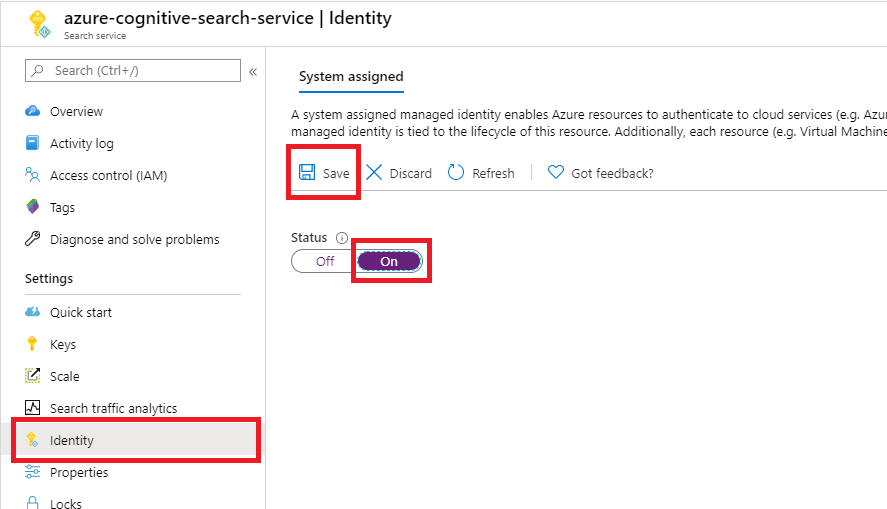
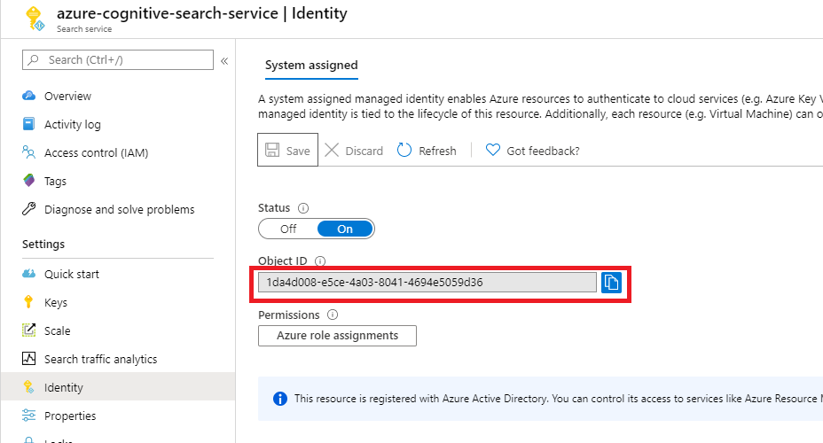
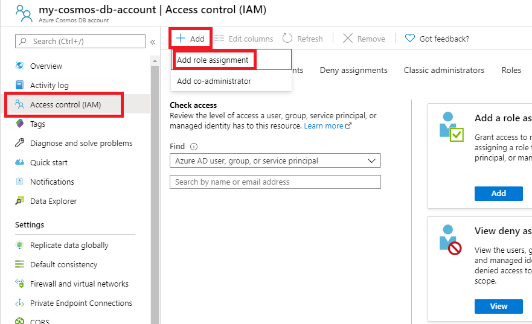
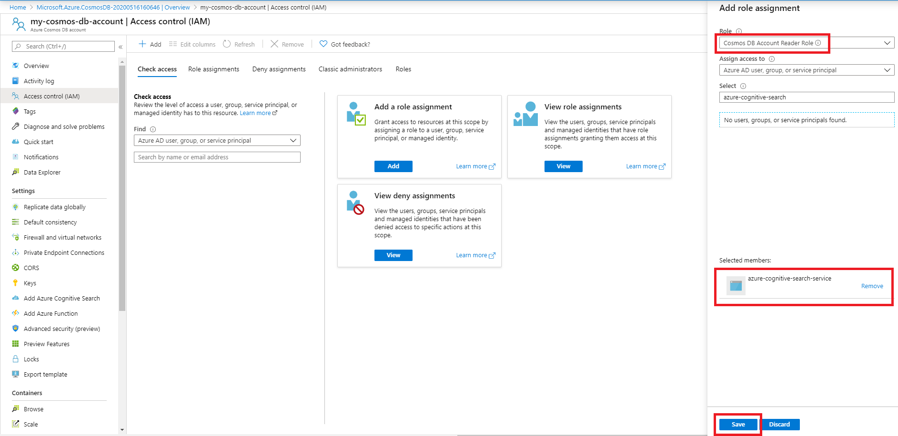

# Set up an indexer connection to a Cosmos DB database using a managed identity

This page describes how to set up an indexer connection to an Azure Cosmos DB database using a managed identity instead of providing credentials in the data source object connection string.

Before learning more about this feature, it is recommended that you have an understanding of what an indexer is and how to set up an indexer for your data source. More information can be found at the following links:
* [Indexer overview](search-indexer-overview.md)
* [Azure Cosmos DB indexer](search-howto-index-cosmosdb.md)

## Set up a connection using a managed identity

### 1 - Turn on system-assigned managed identity

When a system-assigned managed identity is enabled, Azure creates an identity for your search service that can be used to authenticate to other Azure services within the same tenant and subscription. You can then use this identity in role-based access control (RBAC) assignments that allow access to data during indexing.



After selecting **Save** you will see an Object ID that has been assigned to your search service.


 
### 2 - Add a role assignment

In this step you will give your Azure Cognitive Search service permission to read data from your Cosmos DB database.

1. In the Azure portal, navigate to the Cosmos DB account that contains the data that you would like to index.
2. Select **Access control (IAM)**
3. Select **Add** then **Add role assignment**

    

4. Select the **Cosmos DB Account Reader Role**
5. Leave **Assign access to** as **Azure AD user, group or service principal**
6. Search for your search service, select it, then select **Save**

    

### 3 - Create the data source

The [REST API](/rest/api/searchservice/create-data-source), Azure portal, and the [.NET SDK](/dotnet/api/microsoft.azure.search.models.datasource) support the managed identity connection string. Below is an example of how to create a data source to index data from Cosmos DB using the [REST API](/rest/api/searchservice/create-data-source) and a managed identity connection string. The managed identity connection string format is the same for the REST API, .NET SDK, and the Azure portal.

When using managed identities to authenticate, the **credentials** will not include an account key.

```
POST https://[service name].search.windows.net/datasources?api-version=2020-06-30
Content-Type: application/json
api-key: [Search service admin key]

{
    "name": "cosmos-db-datasource",
    "type": "cosmosdb",
    "credentials": {
        "connectionString": "Database=sql-test-db;ResourceId=/subscriptions/00000000-0000-0000-0000-000000000000/resourceGroups/cosmos-db-resource-group/providers/Microsoft.DocumentDB/databaseAccounts/my-cosmos-db-account/;"
    },
    "container": { "name": "myCollection", "query": null },
    "dataChangeDetectionPolicy": {
        "@odata.type": "#Microsoft.Azure.Search.HighWaterMarkChangeDetectionPolicy",
        "highWaterMarkColumnName": "_ts"
    }
}
```    

The body of the request contains the data source definition, which should include the following fields:

| Field   | Description |
|---------|-------------|
| **name** | Required. Choose any name to represent your data source object. |
|**type**| Required. Must be `cosmosdb`. |
|**credentials** | Required. <br/><br/>When connecting using a managed identity, the **credentials** format should be: *Database=[database-name];ResourceId=[resource-id-string];(ApiKind=[api-kind];)*<br/> <br/>The ResourceId format: *ResourceId=/subscriptions/**your subscription ID**/resourceGroups/**your resource group name**/providers/Microsoft.DocumentDB/databaseAccounts/**your cosmos db account name**/;*<br/><br/>For SQL collections, the connection string does not require an ApiKind.<br/><br/>For MongoDB collections, add **ApiKind=MongoDb** to the connection string. <br/><br/>For Gremlin graphs and Cassandra tables, sign up for the [gated indexer preview](https://aka.ms/azure-cognitive-search/indexer-preview) to get access to the preview and information about how to format the credentials.<br/>|
| **container** | Contains the following elements: <br/>**name**: Required. Specify the ID of the database collection to be indexed.<br/>**query**: Optional. You can specify a query to flatten an arbitrary JSON document into a flat schema that Azure Cognitive Search can index.<br/>For the MongoDB API, Gremlin API, and Cassandra API, queries are not supported. |
| **dataChangeDetectionPolicy** | Recommended |
|**dataDeletionDetectionPolicy** | Optional |

### 4 - Create the index

The index specifies the fields in a document, attributes, and other constructs that shape the search experience.

Here's how to create an index with a searchable `booktitle` field:

```
POST https://[service name].search.windows.net/indexes?api-version=2020-06-30
Content-Type: application/json
api-key: [admin key]

{
    "name" : "my-target-index",
    "fields": [
    { "name": "id", "type": "Edm.String", "key": true, "searchable": false },
    { "name": "booktitle", "type": "Edm.String", "searchable": true, "filterable": false, "sortable": false, "facetable": false }
    ]
}
```

For more on creating indexes, see [Create Index](/rest/api/searchservice/create-index)

### 5 - Create the indexer

An indexer connects a data source with a target search index and provides a schedule to automate the data refresh.

Once the index and data source have been created, you're ready to create the indexer.

Example indexer definition:

```http
    POST https://[service name].search.windows.net/indexers?api-version=2020-06-30
    Content-Type: application/json
    api-key: [admin key]

    {
      "name" : "cosmos-db-indexer",
      "dataSourceName" : "cosmos-db-datasource",
      "targetIndexName" : "my-target-index",
      "schedule" : { "interval" : "PT2H" }
    }
```

This indexer will run every two hours (schedule interval is set to "PT2H"). To run an indexer every 30 minutes, set the interval to "PT30M". The shortest supported interval is 5 minutes. The schedule is optional - if omitted, an indexer runs only once when it's created. However, you can run an indexer on-demand at any time.   

For more details on the Create Indexer API, check out [Create Indexer](/rest/api/searchservice/create-indexer).

For more information about defining indexer schedules see [How to schedule indexers for Azure Cognitive Search](search-howto-schedule-indexers.md).

## Troubleshooting

If you find that you are not able to index data from Cosmos DB consider the following:

1. If you recently rotated your Cosmos DB account keys you will need to wait up to 15 minutes for the managed identity connection string to work.

1. Check to see if the Cosmos DB account has its access restricted to select networks. If it does, refer to [Indexer access to data sources using Azure network security features](search-indexer-securing-resources.md).

## See also

Learn more about Cosmos DB indexers:
* [Azure Cosmos DB indexer](search-howto-index-cosmosdb.md)