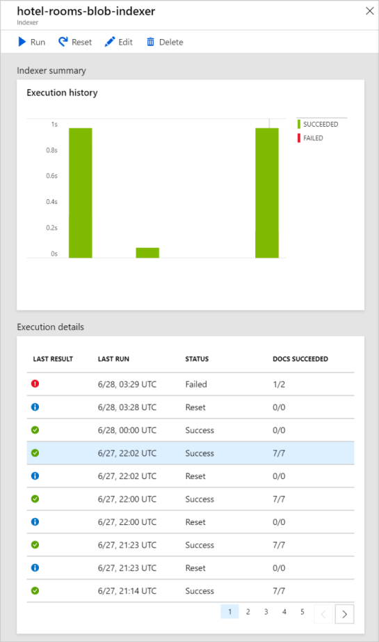
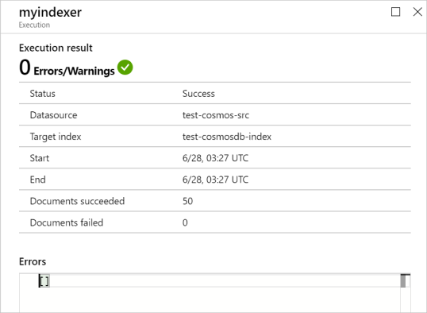
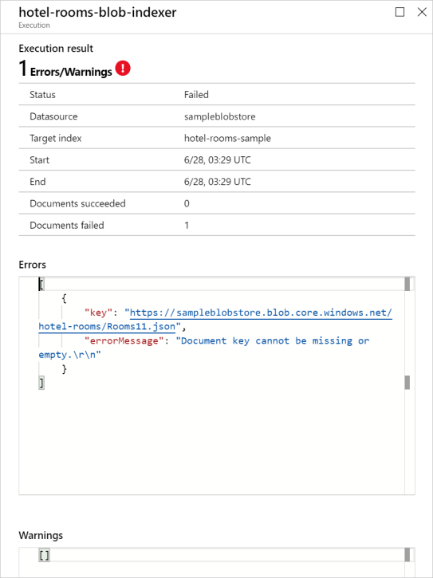

# How to monitor Azure Search indexer status and results

Azure Search provides status and monitoring information about current and historical runs of every indexer.

Indexer monitoring is useful when you want to:

* Track the progress of an indexer during an ongoing run.
* Review the results of ongoing or previous indexer run.
* Identify top-level indexer errors, and errors or warnings about individual documents being indexed.

## Find indexer status and history details

You can access indexer monitoring information in various ways, including:

* In the [Azure portal](#portal)
* Using the [REST API](#restapi)
* Using the [.NET SDK](#dotnetsdk)

Available indexer monitoring information includes all the following (though the data formats differ based on the access method used):

* Status information about the indexer itself
* Information about the most recent run of the indexer, including its status, start and end times, and detailed errors and warnings.
* A list of historical indexer runs, and their statuses, results, errors, and warnings.

Indexers that process large volumes of data can take a long time to run. For example, indexers that handle millions of source documents can run for 24 hours, and then restart almost immediately. The status for high-volume indexers might always say **In Progress** in the portal. Even when an indexer is running, details are available about ongoing progress and previous runs.

<a name="portal"></a>

## Monitor indexers in the portal

You can see the current status of all of your indexers in the **Indexers** list on your search service Overview page.

   

When an indexer is executing, the status in the list shows **In Progress**, and the **Docs Succeeded** value shows the number of documents processed so far. It can take a few minutes for the portal to update indexer status values and document counts.

An indexer whose most recent run was successful shows **Success**. An indexer run can be successful even if individual documents have errors, if the number of errors is less than the indexer's **Max failed items** setting.

If the most recent run ended with an error, the status shows **Failed**. A status of **Reset** means that the indexer's change tracking state was reset.

Click on an indexer in the list to see more details about the indexer's current and recent runs.

   

The **Indexer summary** chart displays a graph of the number of documents processed in its most recent runs.

The **Execution details** list shows up to 50 of the most recent execution results.

Click on an execution result in the list to see specifics about that run. This includes its start and end times, and any errors and warnings that occurred.

   

If there were document-specific problems during the run, they will be listed in the Errors and Warnings fields.

   

Warnings are common with some types of indexers, and do not always indicate a problem. For example indexers that use cognitive services can report warnings when image or PDF files don't contain any text to process.

For more information about investigating indexer errors and warnings, see [Troubleshooting common indexer issues in Azure Search](search-indexer-troubleshooting.md).

<a name="restapi"></a>

## Monitor indexers using the REST API

You can retrieve the status and execution history of an indexer using the [Get Indexer Status command](https://docs.microsoft.com/rest/api/searchservice/get-indexer-status):

    GET https://[service name].search.windows.net/indexers/[indexer name]/status?api-version=2019-05-06
    api-key: [Search service admin key]

The response contains overall indexer status, the last (or in-progress) indexer invocation, and the history of recent indexer invocations.

    {
        "status":"running",
        "lastResult": {
            "status":"success",
            "errorMessage":null,
            "startTime":"2018-11-26T03:37:18.853Z",
            "endTime":"2018-11-26T03:37:19.012Z",
            "errors":[],
            "itemsProcessed":11,
            "itemsFailed":0,
            "initialTrackingState":null,
            "finalTrackingState":null
         },
        "executionHistory":[ {
            "status":"success",
             "errorMessage":null,
            "startTime":"2018-11-26T03:37:18.853Z",
            "endTime":"2018-11-26T03:37:19.012Z",
            "errors":[],
            "itemsProcessed":11,
            "itemsFailed":0,
            "initialTrackingState":null,
            "finalTrackingState":null
        }]
    }

Execution history contains up to the 50 most recent runs, which are sorted in reverse chronological order (most recent first).

Note there are two different status values. The top level status is for the indexer itself. A indexer status of **running** means the indexer is set up correctly and available to run, but not that it's currently running.

Each run of the indexer also has its own status that indicates whether that specific execution is ongoing (**running**), or already completed with a **success**, **transientFailure**, or **persistentFailure** status. 

When an indexer is reset to refresh its change tracking state, a separate execution history entry is added with a **Reset** status.

For more details about status codes and indexer monitoring data, see [GetIndexerStatus](https://docs.microsoft.com/rest/api/searchservice/get-indexer-status).

<a name="dotnetsdk"></a>

## Monitor indexers using the .NET SDK

You can define the schedule for an indexer using the Azure Search .NET SDK. To do this, include the **schedule** property when creating or updating an Indexer.

The following C# example writes information about an indexer's status and the results of its most recent (or ongoing) run to the console.

```csharp
static void CheckIndexerStatus(Indexer indexer, SearchServiceClient searchService)
{
    try
    {
        IndexerExecutionInfo execInfo = searchService.Indexers.GetStatus(indexer.Name);

        Console.WriteLine("Indexer has run {0} times.", execInfo.ExecutionHistory.Count);
        Console.WriteLine("Indexer Status: " + execInfo.Status.ToString());

        IndexerExecutionResult result = execInfo.LastResult;

        Console.WriteLine("Latest run");
        Console.WriteLine("  Run Status: {0}", result.Status.ToString());
        Console.WriteLine("  Total Documents: {0}, Failed: {1}", result.ItemCount, result.FailedItemCount);

        TimeSpan elapsed = result.EndTime.Value - result.StartTime.Value;
        Console.WriteLine("  StartTime: {0:T}, EndTime: {1:T}, Elapsed: {2:t}", result.StartTime.Value, result.EndTime.Value, elapsed);

        string errorMsg = (result.ErrorMessage == null) ? "none" : result.ErrorMessage;
        Console.WriteLine("  ErrorMessage: {0}", errorMsg);
        Console.WriteLine("  Document Errors: {0}, Warnings: {1}\n", result.Errors.Count, result.Warnings.Count);
    }
    catch (Exception e)
    {
        // Handle exception
    }
}
```

The output in the console will look something like this:

    Indexer has run 18 times.
    Indexer Status: Running
    Latest run
      Run Status: Success
      Total Documents: 7, Failed: 0
      StartTime: 10:02:46 PM, EndTime: 10:02:47 PM, Elapsed: 00:00:01.0990000
      ErrorMessage: none
      Document Errors: 0, Warnings: 0

Note there are two different status values. The top-level status is the status of the indexer itself. A indexer status of **Running** means that the indexer is set up correctly and available for execution, but not that it is currently executing.

Each run of the indexer also has its own status for whether that specific execution is ongoing (**Running**), or was already completed with a **Success** or **TransientError** status. 

When an indexer is reset to refresh its change tracking state, a separate history entry is added with a **Reset** status.

For more details about status codes and indexer monitoring information, see [GetIndexerStatus](https://docs.microsoft.com/rest/api/searchservice/get-indexer-status) in the REST API.

Details about document-specific errors or warnings can be retrieved by enumerating the lists `IndexerExecutionResult.Errors` and `IndexerExecutionResult.Warnings`.

For more information about the .NET SDK classes used to monitor indexers, see [IndexerExecutionInfo](https://docs.microsoft.com/dotnet/api/microsoft.azure.search.models.indexerexecutioninfo?view=azure-dotnet) and [IndexerExecutionResult](https://docs.microsoft.com/dotnet/api/microsoft.azure.search.models.indexerexecutionresult?view=azure-dotnet).
