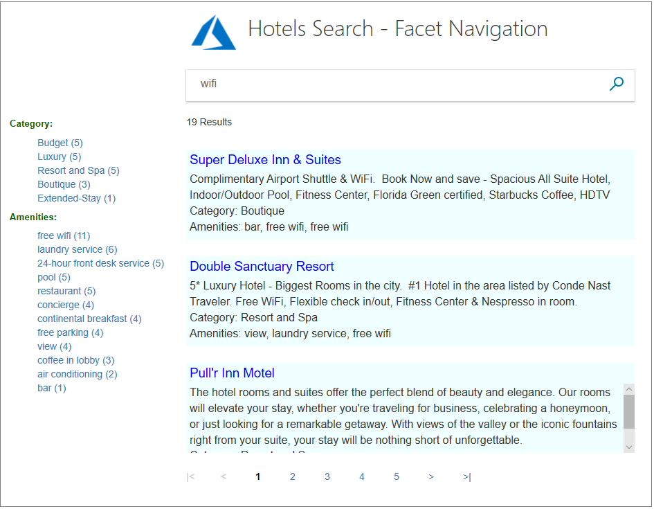
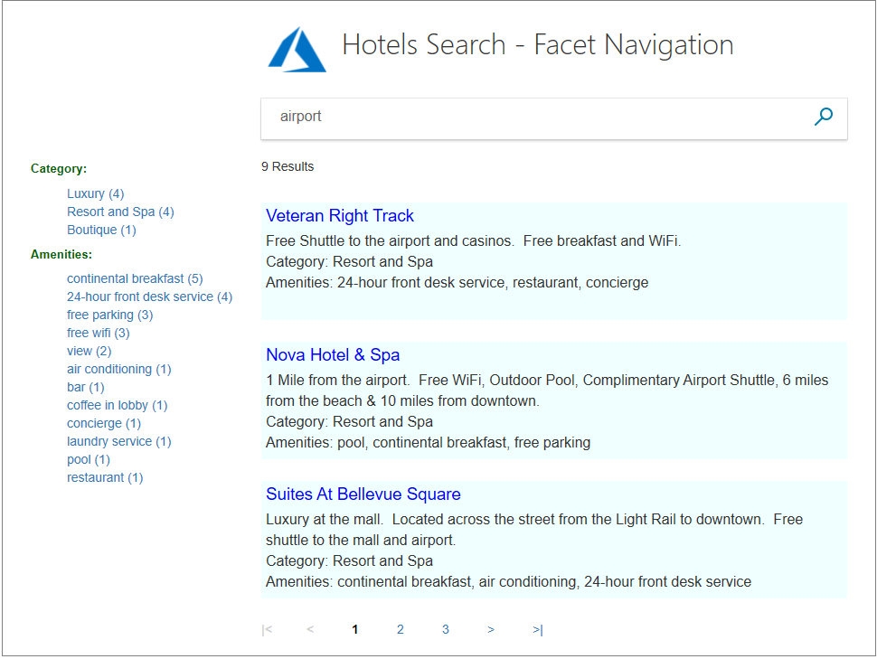
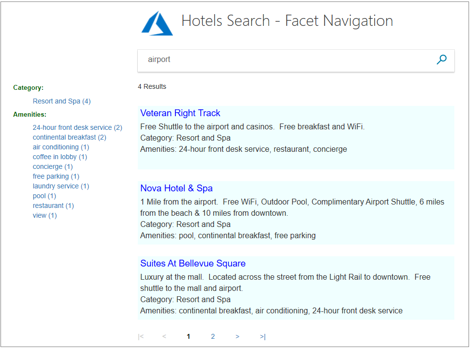
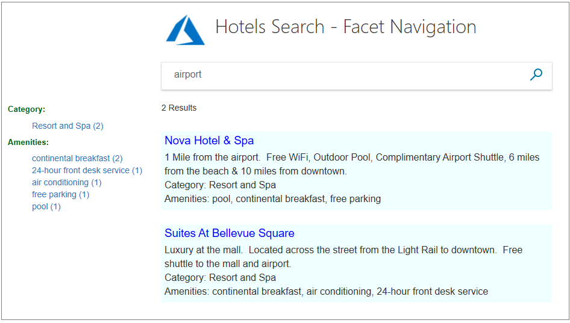

# C# tutorial: Use facets to aid navigation - Azure Search

Facets are used to aid navigation, by providing the user with a set of links to use to focus their search. Facets are attributes of the data (such as the category, or a specific feature, of a hotel in our sample data).

This tutorial builds onto the paging project created in the [C# Tutorial: Search results pagination - Azure Search](tutorial-csharp-paging.md) tutorial.

In this tutorial, you learn how to:
> [!div class="checklist"]
> * Set model properties as _IsFacetable_
> * Add facet navigation to your app

## Prerequisites

To complete this tutorial, you need to:

Have the [C# Tutorial: Search results pagination - Azure Search](tutorial-csharp-paging.md) project up and running. This project can either be your own version, or install it from GitHub: [Create first app](https://github.com/Azure-Samples/azure-search-dotnet-samples).

## Set model properties as IsFacetable

In order for a model property to be located in a facet search, it must be tagged with **IsFacetable**.

1. Examine the **Hotel** class. **Category** and **Tags**, for example, are tagged as **IsFacetable**, but **HotelName** and **Description** are not. 

    ```cs
    public partial class Hotel
    {
        [System.ComponentModel.DataAnnotations.Key]
        [IsFilterable]
        public string HotelId { get; set; }

        [IsSearchable, IsSortable]
        public string HotelName { get; set; }

        [IsSearchable]
        [Analyzer(AnalyzerName.AsString.EnLucene)]
        public string Description { get; set; }

        [IsSearchable]
        [Analyzer(AnalyzerName.AsString.FrLucene)]
        [JsonProperty("Description_fr")]
        public string DescriptionFr { get; set; }

        [IsSearchable, IsFilterable, IsSortable, IsFacetable]
        public string Category { get; set; }

        [IsSearchable, IsFilterable, IsFacetable]
        public string[] Tags { get; set; }

        [IsFilterable, IsSortable, IsFacetable]
        public bool? ParkingIncluded { get; set; }

        [IsFilterable, IsSortable, IsFacetable]
        public DateTimeOffset? LastRenovationDate { get; set; }

        [IsFilterable, IsSortable, IsFacetable]
        public double? Rating { get; set; }

        public Address Address { get; set; }

        [IsFilterable, IsSortable]
        public GeographyPoint Location { get; set; }

        public Room[] Rooms { get; set; }

    }
    ```

2. We will not be changing any tags as part of this tutorial, so close the hotel.cs file unaltered.

    > [!Note]
    > A facet search will throw an error if a field requested in the search is not tagged appropriately.


## Add facet navigation to your app

For this example, we are going to enable the user to select one category of hotel, or one amenity, from lists of links shown to the left of the results. The user starts by entering some search text, then can narrow the results of the search by selecting a category, and can narrow the results further by selecting an amenity, or they can select the amenity first (the order is not important).

We need the controller to pass the lists of facets to the view. We need to maintain the user selections as the search progresses, and again, we use temporary storage as the mechanism for preserving data.



### Add filter strings to the SearchData model

1. Open the SearchData.cs file, and add string properties to the **SearchData** class, to hold the facet filter strings.

    ```cs
        public string categoryFilter { get; set; }
        public string amenityFilter { get; set; }
    ```

### Add the Facet action method

The home controller needs one new action, **Facet**, and updates to its existing **Index** and **Page** actions, as well as updates to the **RunQueryAsync** method.

1. Open the home controller file, and add the **using** statement, to enable the **List&lt;string&gt;** construct.

    ```cs
    using System.Collections.Generic;
    ```

2. Replace the **Index(SearchData model)** action method.

    ```cs
        public async Task<ActionResult> Index(SearchData model)
        {
            try
            {
                // Ensure the search string is valid.
                if (model.searchText == null)
                {
                    model.searchText = "";
                }

                // Make the search call for the first page.
                await RunQueryAsync(model, 0, 0, "", "");
            }

            catch
            {
                return View("Error", new ErrorViewModel { RequestId = "1" });
            }
            return View(model);
        }
    ```

3. Replace the **Page(SearchData model)** action method.

    ```cs
        public async Task<ActionResult> Page(SearchData model)
        {
            try
            {
                int page;

                // Calculate the page that should be displayed.
                switch (model.paging)
                {
                    case "prev":
                        page = (int)TempData["page"] - 1;
                        break;

                    case "next":
                        page = (int)TempData["page"] + 1;
                        break;

                    default:
                        page = int.Parse(model.paging);
                        break;
                }

                // Recover the leftMostPage.
                int leftMostPage = (int)TempData["leftMostPage"];

                // Recover the filters.
                string catFilter = TempData["categoryFilter"].ToString();
                string ameFilter = TempData["amenityFilter"].ToString();

                // Recover the search text.
                model.searchText = TempData["searchfor"].ToString();

                // Search for the new page.
                await RunQueryAsync(model, page, leftMostPage, catFilter, ameFilter);
            }

            catch
            {
                return View("Error", new ErrorViewModel { RequestId = "2" });
            }
            return View("Index", model);
        }
    ```

4. Add a **Facet(SearchData model)** action method, to be activated when the user clicks on a facet link. The model will contain either a category search filter, or an amenity search filter. Perhaps add it after the **Page** action.

    ```cs
        public async Task<ActionResult> Facet(SearchData model)
        {
            try
            {
                // Filters set by the model override those stored in temporary data.
                string catFilter;
                string ameFilter;
                if (model.categoryFilter != null)
                {
                    catFilter = model.categoryFilter;
                } else
                {
                    catFilter = TempData["categoryFilter"].ToString();
                }

                if (model.amenityFilter != null)
                {
                    ameFilter = model.amenityFilter;
                } else
                {
                    ameFilter = TempData["amenityFilter"].ToString();
                }

                // Recover the search text.
                model.searchText = TempData["searchfor"].ToString();

                // Initiate a new search.
                await RunQueryAsync(model, 0, 0, catFilter, ameFilter);
            }

            catch
            {
                return View("Error", new ErrorViewModel { RequestId = "2" });
            }
            return View("Index", model);
        }
    ```

### Set up the search filter

When a user selects a certain facet, for example, they click on the **Resort and Spa** category, then only hotels that are specified as this category should be returned in the results. To narrow a search in this way, we need to set up a _filter_.

1. Replace the **RunQueryAsync** method with the following code. Primarily, it takes a category filter string, and an amenity filter string, and sets the **Filter** parameter of the **SearchParameters**.

    ```cs
        private async Task<ActionResult> RunQueryAsync(SearchData model, int page, int leftMostPage, string catFilter, string ameFilter)
        {
            InitSearch();

            string facetFilter = "";

            if (catFilter.Length > 0 && ameFilter.Length > 0)
            {
                // Both facets apply.
                facetFilter = $"{catFilter} and {ameFilter}"; 
            } else
            {
                // One, or zero, facets apply.
                facetFilter = $"{catFilter}{ameFilter}";
            }

            var parameters = new SearchParameters
            {
                Filter = facetFilter,

                // Return information on the text, and number, of facets in the data.
                Facets = new List<string> { "Category,count:20", "Tags,count:20" },

                // Enter Hotel property names into this list, so only these values will be returned.
                Select = new[] { "HotelName", "Description", "Category", "Tags" },

                SearchMode = SearchMode.All,

                // Skip past results that have already been returned.
                Skip = page * GlobalVariables.ResultsPerPage,

                // Take only the next page worth of results.
                Top = GlobalVariables.ResultsPerPage,

                // Include the total number of results.
                IncludeTotalResultCount = true,
            };

            // For efficiency, the search call should be asynchronous, so use SearchAsync rather than Search.
            model.resultList = await _indexClient.Documents.SearchAsync<Hotel>(model.searchText, parameters);

            // This variable communicates the total number of pages to the view.
            model.pageCount = ((int)model.resultList.Count + GlobalVariables.ResultsPerPage - 1) / GlobalVariables.ResultsPerPage;

            // This variable communicates the page number being displayed to the view.
            model.currentPage = page;

            // Calculate the range of page numbers to display.
            if (page == 0)
            {
                leftMostPage = 0;
            }
            else
               if (page <= leftMostPage)
            {
                // Trigger a switch to a lower page range.
                leftMostPage = Math.Max(page - GlobalVariables.PageRangeDelta, 0);
            }
            else
            if (page >= leftMostPage + GlobalVariables.MaxPageRange - 1)
            {
                // Trigger a switch to a higher page range.
                leftMostPage = Math.Min(page - GlobalVariables.PageRangeDelta, model.pageCount - GlobalVariables.MaxPageRange);
            }
            model.leftMostPage = leftMostPage;

            // Calculate the number of page numbers to display.
            model.pageRange = Math.Min(model.pageCount - leftMostPage, GlobalVariables.MaxPageRange);

            // Ensure Temp data is stored for the next call.
            TempData["page"] = page;
            TempData["leftMostPage"] = model.leftMostPage;
            TempData["searchfor"] = model.searchText;
            TempData["categoryFilter"] = catFilter;
            TempData["amenityFilter"] = ameFilter;

            // Return the new view.
            return View("Index", model);
        }
    ```

    We have added the **Category** and **Tags** properties to the list of **Select** items to return. This addition is not a requirement for facet navigation to work, but we use this information to verify that we are filtering correctly.

### Add lists of facet links to the view

The view is going to require some significant changes. 

1. Start by opening the hotels.css file (in the wwwroot/css folder), and add the following classes.

    ```html
    .facetlist {
        list-style: none;
    }

    .facetchecks {
        width: 250px;
        display: normal;
        color: #666;
        margin: 10px;
        padding: 5px;
    }

    .facetheader {
        font-size: 10pt;
        font-weight: bold;
        color: darkgreen;    
    }
    ```

2. For the view, we organize the output into a table, to neatly align the facet lists on the left, and the results on the right. Open the index.cshtml file. Replace the entire contents of the HTML &lt;body&gt; tags, with the following code.

    ```cs
    <body>

    @using (Html.BeginForm("Index", "Home", FormMethod.Post))
    {
        <table>
            <tr>
                <td></td>
                <td>
                    <h1 class="sampleTitle">
                        
                        Hotels Search - Facet Navigation
                    </h1>
                </td>
            </tr>

            <tr>
                <td></td>
                <td>
                    <!-- Display the search text box, with the search icon to the right of it.-->
                    <div class="searchBoxForm">
                        @Html.TextBoxFor(m => m.searchText, new { @class = "searchBox" }) <input value="" class="searchBoxSubmit" type="submit">
                    </div>
                </td>
            </tr>

            <tr>
                <td valign="top">
                    <div id="facetplace" class="facetchecks">

                        @if (Model != null && Model.resultList != null)
                        {
                            List<string> categories = Model.resultList.Facets["Category"].Select(x => x.Value.ToString()).ToList();

                            if (categories.Count > 0)
                            {
                                <h5 class="facetheader">Category:</h5>
                                <ul class="facetlist">
                                    @for (var c = 0; c < categories.Count; c++)
                                    {
                                        var facetLink = $"{categories[c]} ({Model.resultList.Facets["Category"][c].Count})";
                                        <li>
                                            @Html.ActionLink(facetLink, "Facet", "Home", new { categoryFilter = $"Category eq '{categories[c]}'" }, null)
                                        </li>
                                    }
                                </ul>
                            }

                            List<string> tags = Model.resultList.Facets["Tags"].Select(x => x.Value.ToString()).ToList();

                            if (tags.Count > 0)
                            {
                                <h5 class="facetheader">Amenities:</h5>
                                <ul class="facetlist">
                                    @for (var c = 0; c < tags.Count; c++)
                                    {
                                        var facetLink = $"{tags[c]} ({Model.resultList.Facets["Tags"][c].Count})";
                                        <li>
                                            @Html.ActionLink(facetLink, "Facet", "Home", new { amenityFilter = $"Tags/any(t: t eq '{tags[c]}')" }, null)
                                        </li>
                                    }
                                </ul>
                            }
                        }
                    </div>
                </td>
                <td valign="top">
                    <div id="resultsplace">
                        @if (Model != null && Model.resultList != null)
                        {
                            // Show the result count.
                            <p class="sampleText">
                                @Html.DisplayFor(m => m.resultList.Count) Results
                            </p>

                            @for (var i = 0; i < Model.resultList.Results.Count; i++)
                            {
                                string amenities = string.Join(", ", Model.resultList.Results[i].Document.Tags);

                                string fullDescription = Model.resultList.Results[i].Document.Description;
                                fullDescription += $"\nCategory: {Model.resultList.Results[i].Document.Category}";
                                fullDescription += $"\nAmenities: {amenities}";

                                // Display the hotel name and description.
                                @Html.TextAreaFor(m => Model.resultList.Results[i].Document.HotelName, new { @class = "box1" })
                                @Html.TextArea($"desc{i}", fullDescription, new { @class = "box2" })
                            }
                        }
                    </div>
                </td>
            </tr>

            <tr>
                <td></td>
                <td valign="top">
                    @if (Model != null && Model.pageCount > 1)
                    {
                        // If there is more than one page of results, show the paging buttons.
                        <table>
                            <tr>
                                <td class="tdPage">
                                    @if (Model.currentPage > 0)
                                    {
                                        <p class="pageButton">
                                            @Html.ActionLink("|<", "Page", "Home", new { paging = "0" }, null)
                                        </p>
                                    }
                                    else
                                    {
                                        <p class="pageButtonDisabled">|&lt;</p>
                                    }
                                </td>

                                <td class="tdPage">
                                    @if (Model.currentPage > 0)
                                    {
                                        <p class="pageButton">
                                            @Html.ActionLink("<", "Page", "Home", new { paging = "prev" }, null)
                                        </p>
                                    }
                                    else
                                    {
                                        <p class="pageButtonDisabled">&lt;</p>
                                    }
                                </td>

                                @for (var pn = Model.leftMostPage; pn < Model.leftMostPage + Model.pageRange; pn++)
                                {
                                    <td class="tdPage">
                                        @if (Model.currentPage == pn)
                                        {
                                            // Convert displayed page numbers to 1-based and not 0-based.
                                            <p class="pageSelected">@(pn + 1)</p>
                                        }
                                        else
                                        {
                                            <p class="pageButton">
                                                @Html.ActionLink((pn + 1).ToString(), "Page", "Home", new { paging = @pn }, null)
                                            </p>
                                        }
                                    </td>
                                }

                                <td class="tdPage">
                                    @if (Model.currentPage < Model.pageCount - 1)
                                    {
                                        <p class="pageButton">
                                            @Html.ActionLink(">", "Page", "Home", new { paging = "next" }, null)
                                        </p>
                                    }
                                    else
                                    {
                                        <p class="pageButtonDisabled">&gt;</p>
                                    }
                                </td>

                                <td class="tdPage">
                                    @if (Model.currentPage < Model.pageCount - 1)
                                    {
                                        <p class="pageButton">
                                            @Html.ActionLink(">|", "Page", "Home", new { paging = Model.pageCount - 1 }, null)
                                        </p>
                                    }
                                    else
                                    {
                                        <p class="pageButtonDisabled">&gt;|</p>
                                    }
                                </td>
                            </tr>
                        </table>
                    }
                </td>
            </tr>
        </table>
    }
    </body>
    ```

    Notice the use of the **Html.ActionLink** call. This call communicates valid filter strings to the controller, when the user clicks a facet link. 

### Run and test the app

The advantage of facet navigation to the user is that they can narrow searches with a single click, which we can show in the following sequence.

1. Run the app, type "airport" as the search text. Verify that the list of facets appears neatly to the left. These facets are all that apply to hotels that have "airport" in their text data, with a count of how often they occur.

    

2. Click the **Resort and Spa** category. Verify all results are in this category.

    

3. Click the **continental breakfast** amenity. Verify all results are still in the "Resort and Spa" category, with the selected amenity.

    

4. Try selecting any other category, then one amenity, and view the narrowing results. Then try the other way around, one amenity, then one category.

    >[!Note]
    > When one selection is made in a facet list (such as category) it will override any previous selection within the category list.

## Takeaways

Consider the following takeaways from this project:

* It is imperative to mark each property as **IsFacetable**, if they are to be included in facet navigation.
* Facet navigation provides a user with an easy, and intuitive, way of narrowing a search.
* Facet navigation is best divided into sections (categories of hotel, amenities of a hotel, price ranges, rating ranges, etc.), each section with an appropriate heading.

## Next steps

In the next tutorial, we look at ordering results. Up to this point, results are ordered simply in the order that they are located in the database.

> [!div class="nextstepaction"]
> [C# tutorial: Order the results- Azure Search](tutorial-csharp-orders.md)
