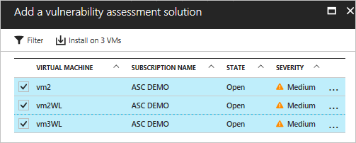
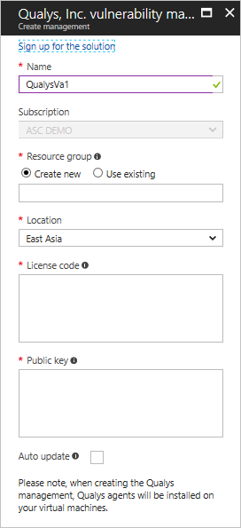

# Deploying a partner vulnerability scanning solution

If you're on the standard tier, you're able to use Azure Security Center's built-in vulnerability assessment tool as described in [Integrated vulnerability scanner for virtual machines](built-in-vulnerability-assessment.md). This tool doesn't require a Qualys license or even a Qualys account - everything's handled seamlessly inside Security Center.

Alternatively, you might want to deploy your own privately licensed vulnerability assessment solution from [Qualys](https://www.qualys.com/lp/azure) or [Rapid7](https://www.rapid7.com/products/insightvm/). You can install one of these partner solutions on multiple VMs that belong to the same subscription.

## Configuring a partner solution (in the Azure portal)

1. On the **Security Center** dashboard, in the **Overview** section, click **Recommendations**.

1. On the **Recommendations** page, select **Vulnerability assessment solution should be installed on your virtual machines**.

    

1. On the **Vulnerability assessment solution should be installed on your virtual machines** page, select the VMs where you want to install the vulnerability assessment solution.

    

1. On the **Vulnerability assessment solution should be installed on your virtual machines** page, click **Install on 2 VMs** (the name might vary according to the number of VMs that you selected):

    

1. You can create a new vulnerability assessment or use an existing solution. If you create a new vulnerability assessment, you can select a partner solution in the **Azure Marketplace**. Or, under **Use existing solution**, select **Qualys** or **Rapid7**.

    To deploy the agent from Security Center, you need a license code and public key from the vendor. To learn how to get the license code and public key, see the [Qualys documentation](https://community.qualys.com/docs/DOC-5823-deploying-qualys-cloud-agents-from-microsoft-azure-security-center) or [Rapid7 documentation](https://insightvm.help.rapid7.com/docs/azure-security-center).


1. To create a new assessment, click **Create new**. The partner's **vulnerability management** page opens. The options shown on this page might change depending on the partner.

    

    To set up Qualys (for example), select **Qualys** then:
    
    1. For **Resource group**, select **Use existing**.
    
    1. For **Location**, select where the solution is geographically located.
    
    1. In the **License code** box (this is specific for Qualys), enter the license provided by the partner.
    
    1. In the **Public key** box (this is specific for Qualys), enter the public key information provided by the partner.
    
    1. To automatically install a vulnerability assessment agent on all discovered VMs in the subscription of this Qualys solution, select the **Auto update** check box.
    
    1. Click **OK**.


## Configuring a partner solution (using PowerShell and the REST API)

To programatically deploy your own privately licensed vulnerability assessment solution from [Qualys](https://www.qualys.com/lp/azure) or [Rapid7](https://www.rapid7.com/products/insightvm/), use the supplied script [PowerShell > Vulnerability Solution](https://github.com/Azure/Azure-Security-Center/tree/master/Powershell%20scripts/Vulnerability%20Solution). 

This script uses the REST API to create a new Security Solution in ASC. The solution requires a license and a key provided by the service provider: Qualys or Rapid7.

> [!IMPORTANT] 
> Only one solution can be created per license. Attempting to create another solution using the same name/license/key will fail.

### Prerequisites

Required PowerShell modules:

- Install-module Az
- Install-module Az.security

### Running the script

To run the script, you'll need the relevant information for the parameters below.

| **Parameter** | **Required** | **Notes** |
|----|:----:|----|
|**SubscriptionId**|✔|The subscriptionID of the Azure Subscription that contains the resources you want to analyze.|
|**ResourceGroupName**|✔|Name of the resource group. Use any existing resource group including the default ("DefaultResourceGroup-xxx"). Since the solution isn't an Azure resource, it won't be listed under the resource group, but still it is attached to it.|
|**vaSolutionName**|✔|The name of the new solution.|
|**vaType**|✔|Qualys or Rapid7.|
|**licenceCode**|✔|Vendor provided license string.|
|**publicKey**|✔|Vendor provided public key.|
|**autoUpdate**|-|Enable (true) or disable (false) auto deploy for this VA solution. When enabled, every new VM on the subscription will automatically attempt to link to the solution.<br/>(Default: False)|


Syntax:

```
.\New-ASCVASolution.ps1 -subscriptionId <Subscription Id> -resourceGroupName <RG Name>
-vaSolutionName <New solution name> -vaType <Qualys / Rapid7> -autoUpdate <true/false>
-licenceCode <License code from vendor> -publicKey <Public Key received from vendor>
```

Example (this example doesn't include valid license details):

```
.\New-ASCVASolution.ps1 -subscriptionId 'f4cx1b69-dtgb-4ch6-6y6f-ea2e95373d3b' -resourceGroupName 'DefaultResourceGroup-WEU' -vaSolutionName 'QualysVa001' -vaType 'Qualys' -autoUpdate 'false' `
-licenceCode 'eyJjaWQiOiJkZDg5OTYzXe4iMTMzLWM4NTAtODM5FD2mZWM1N2Q3ZGU5MjgiLCJgbTYuOiIyMmM5NDg3MS1lNTVkLTQ1OGItYjhlMC03OTRhMmM3YWM1ZGQiLCJwd3NVcmwiOiJodHRwczovL3FhZ3B1YmxpYy1wMDEuaW50LnF1YWx5cy5jb20vQ2xvdSKJY6VudC8iLCJwd3NQb3J0IjoiNDQzIn0=' `
-publicKey 'MIGfMA0GCSqGSIb3DQEBAQUAA4GNADCBiQKBgQCOiOLXjOywMfLZIBGPZLwSocf1Q64GASLK9OHFEmanBl1nkJhZDrZ4YD5lM98fThYbAx1Rde2iYV1ze/wDlX4cIvFAyXuN7HbdkeIlBl6vWXEBZpUU17bOdJOUGolzEzNBhtxi/elEZLghq9Chmah82me/okGMIhJJsCiTtglVQIDAQAB'
```


## Review the recommendation
After the vulnerability assessment solution is installed on the target VM, Security Center scans the VM to detect and identify vulnerabilities in the system and application.

> [!NOTE]
> It might take a couple of hours for the first scan to complete. After that, it is an hourly process.

Detected issues are shown under the **Virtual Machines Recommendations**.

## Next steps

This article described the built-in vulnerability assessment tool powered by Qualys for scanning your VMs. For related material, see the following articles:

- [Learn about the different elements of a recommendation](security-center-recommendations.md)
- [Learn how to remediate recommendations](security-center-remediate-recommendations.md)