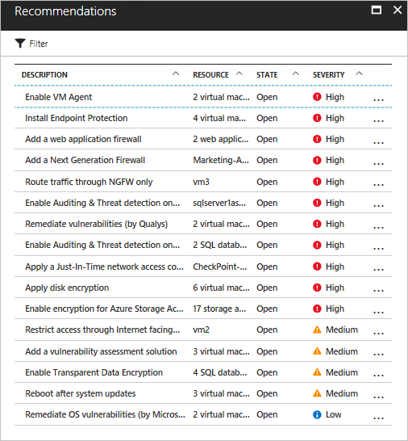
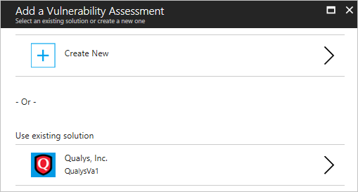

# Deploying a partner vulnerability scanning solution (Free tier users only)

Customers on the Free tier can choose to deploy vulnerability assessment solutions from [Qualys](https://www.qualys.com/lp/azure) and [Rapid7](https://www.rapid7.com/products/insightvm/). You can install the solution on multiple VMs. The VMs must belong to the same subscription.

## Configuring a partner solution

1. On the **Security Center** dashboard, in the **Overview** section, click **Recommendations**.

1. On the **Recommendations** page, select **Vulnerability assessment solution should be installed on your virtual machines**.

    

1. On the **Vulnerability assessment solution should be installed on your virtual machines** page, select the VMs where you want to install the vulnerability assessment solution.

    

1. On the **Vulnerability assessment solution should be installed on your virtual machines** page, click **Install on 2 VMs** (the name might vary according to the number of VMs that you selected):

    

1. You can create a new vulnerability assessment or use an existing solution. If you create a new vulnerability assessment, you can select a partner solution in the **Azure Marketplace**. Or, under **Use existing solution**, select **Qualys** or **Rapid7**.

    To deploy the agent from Security Center, you need a license code and public key from the vendor. To learn how to get the license code and public key, see the [Qualys documentation](https://community.qualys.com/docs/DOC-5823-deploying-qualys-cloud-agents-from-microsoft-azure-security-center) or [Rapid7 documentation](https://insightvm.help.rapid7.com/docs/azure-security-center).

1. To create a new assessment, click **Create new**. The partner’s **vulnerability management** page opens. The options shown on this page might change depending on the partner.

    

    To set up Qualys (for example), select **Qualys** then:
    
    1. For **Resource group**, select **Use existing**.
    
    1. For **Location**, select where the solution is geographically located.
    
    1. In the **License code** box (this is specific for Qualys), enter the license provided by the partner.
    
    1. In the **Public key** box (this is specific for Qualys), enter the public key information provided by the partner.
    
    1. To automatically install a vulnerability assessment agent on all discovered VMs in the subscription of this Qualys solution, select the **Auto update** check box.
    
    1. Click **OK**.

## Review the recommendation
After the vulnerability assessment solution is installed on the target VM, Security Center scans the VM to detect and identify system and application vulnerabilities.

> [!NOTE]
> It might take a couple of hours for the first scan to complete. After that, it is an hourly process.

Detected issues are shown under the **Virtual Machines Recommendations**.

## Next steps

This article described the built-in vulnerability assessment tool powered by Qualys for scanning your VMs. For related material, see the following articles:

- [Learn about the different elements of a recommendation](security-center-recommendations.md)
- [Learn how to remediate recommendations](security-center-remediate-recommendations.md)