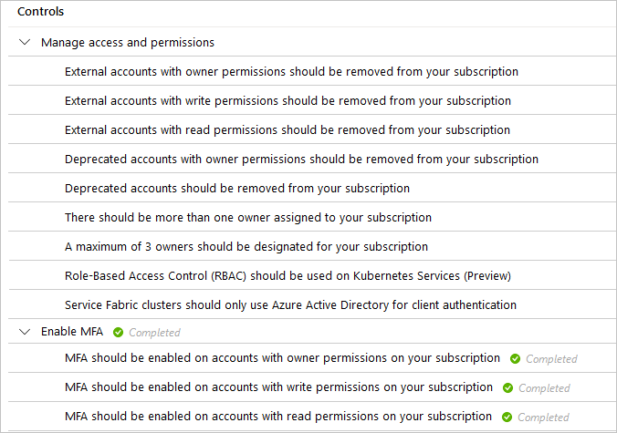

# Monitor identity and access

> [!TIP]
> From March 2020, Azure Security Center's identity and access recommendations are included in all subscriptions on the free pricing tier. If you have subscriptions on the free tier, their Secure Score will be affected as they were not previously assessed for their identity and access security. 

When Security Center identifies potential security vulnerabilities, it creates recommendations that guide you through the process of configuring the needed controls to harden and protect your resources.

The security perimeter has evolved from a network perimeter to an identity perimeter. Security becomes less about defending your network and more about defending your data, as well as managing the security of your apps and users. Nowadays, with more data and more apps moving to the cloud, identity becomes the new perimeter.

By monitoring identity activities, you can take proactive actions before an incident takes place, or reactive actions to stop an attack attempt. For example, Security Center might flag deprecated accounts (accounts that are no longer needed, and blocked from signing in by Azure Active Directory) for removal. 

Examples of recommendations you might see on the **Identity and access** resource security section of Azure Security Center include:

- MFA should be enabled on accounts with owner permissions on your subscription
- A maximum of 3 owners should be designated for your subscription
- External accounts with read permissions should be removed from your subscription
- Deprecated accounts should be removed from your subscription

For more information about these recommendations as well as a full list of the recommendations you might see here, see [Identity and Access recommendations](recommendations-reference.md#recs-identity).

> [!NOTE]
> If your subscription has more than 600 accounts, Security Center is unable to run the Identity recommendations against your subscription. Recommendations that are not run are listed under "unavailable assessments" below.
Security Center is unable to run the Identity recommendations against a Cloud Solution Provider (CSP) partner's admin agents.
>

All of the identity and access recommendations are available within two security controls in the **Recommendations** page:

- Manage access and permissions 
- Enable MFA

## Enable multi-factor authentication (MFA)

Enabling MFA requires [Azure Active Directory (AD) tenant permissions](https://docs.microsoft.com/azure/active-directory/users-groups-roles/directory-assign-admin-roles). 

- If you have a premium edition of AD, enable MFA using [Conditional Access](../active-directory/conditional-access/concept-conditional-access-policy-common.md).

- Users of AD free edition can enable **security defaults** in Azure Active Directory as described in the [AD documentation](https://docs.microsoft.com/azure/active-directory/fundamentals/concept-fundamentals-security-defaults) but the Security Center recommendation to enable MFA will still appear.

## Next steps
To learn more about recommendations that apply to other Azure resource types, see the following articles:

- [Protecting your machines and applications in Azure Security Center](security-center-virtual-machine-protection.md)
- [Protecting your network in Azure Security Center](security-center-network-recommendations.md)
- [Protecting your Azure SQL service and data in Azure Security Center](security-center-sql-service-recommendations.md)