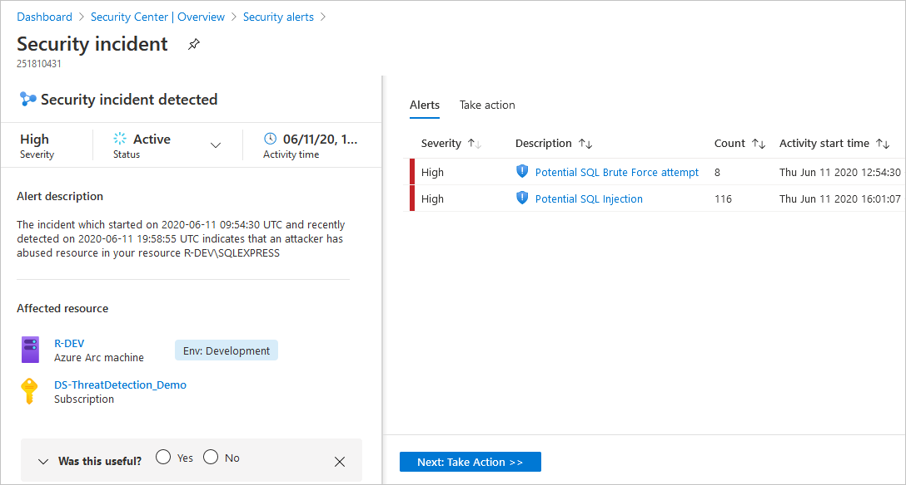
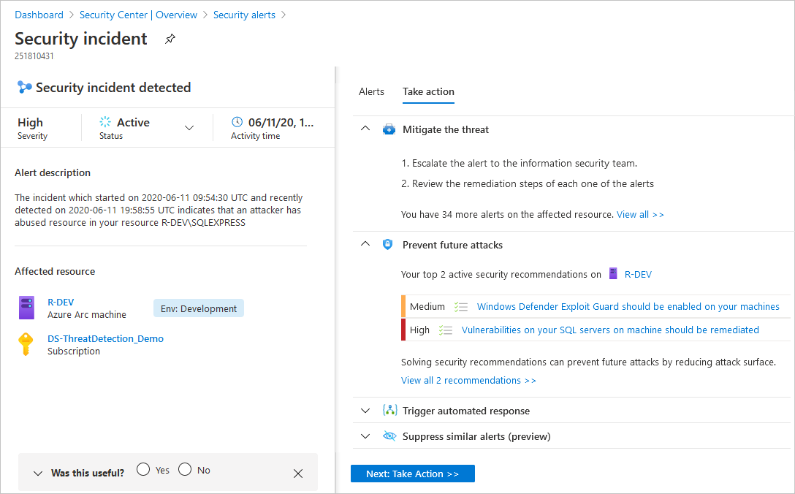

# Manage security incidents in Azure Security Center

Triaging and investigating security alerts can be time consuming for even the most skilled security analysts. For many, it's hard to know where to begin. 

Security Center uses [analytics](./security-center-alerts-overview.md) to connect the information between distinct [security alerts](security-center-managing-and-responding-alerts.md). Using these connections, Security Center can provide a single view of an attack campaign and its related alerts to help you understand the attacker's actions and the affected resources.

This page provides an overview of incidents in Security Center.

## What is a security incident?

In Security Center, a security incident is an aggregation of all alerts for a resource that align with [kill chain](alerts-reference.md#intentions) patterns. Incidents appear in the [Security alerts](security-center-managing-and-responding-alerts.md) page. Select an incident to view the related alerts and get more information.

## Managing security incidents

1. On the Security Center overview page, select the **Security alerts** tile. The incidents and alerts are listed. Notice that security incidents have a different icon to security alerts.

    

1. To view details, select an incident. The **Security incident** page shows more details. 

    

    The left pane of the security incident page shows high-level information about the security incident: title, severity, status, activity time, description, and the affected resource. Next to the affected resource you can see the relevant Azure tags. Use these tags to infer the organizational context of the resource when investigating the alert.

    The right pane includes the **Alerts** tab with the security alerts that were correlated as part of this incident. 

    >[!TIP]
    > For more information about a specific alert, select it. 

    

    To switch to the **Take action** tab, select the tab or the button on the bottom of the right pane. Use this tab to take further actions such as:
    - *Mitigate the threat* - provides manual remediation steps for this security incident
    - *Prevent future attacks* - provides security recommendations to help reduce the attack surface, increase security posture, and prevent future attacks
    - *Trigger automated response* - provides the option to trigger a Logic App as a response to this security incident
    - *Suppress similar alerts* - provides the option to suppress future alerts with similar characteristics if the alert isn’t relevant for your organization 

   > [!NOTE]
   > The same alert can exist as part of an incident, as well as to be visible as a standalone alert.

1. To remediate the threats in the incident, follow the remediation steps provided with each alert.

## Next steps

This page explained the security incident capabilities of Security Center. For related information, see the following pages:

- [Security alerts in Security Center](security-center-alerts-overview.md)
- [Manage and respond to security alerts](security-center-managing-and-responding-alerts.md)