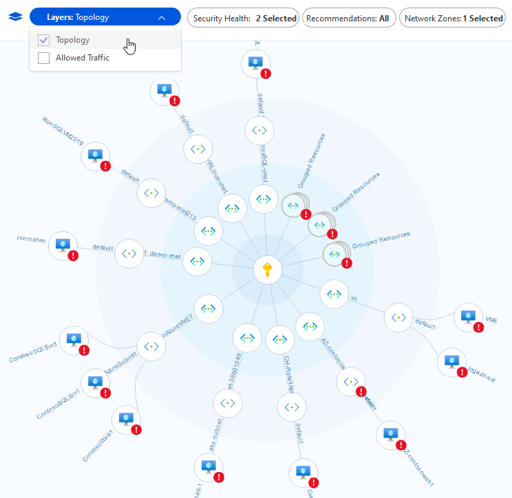
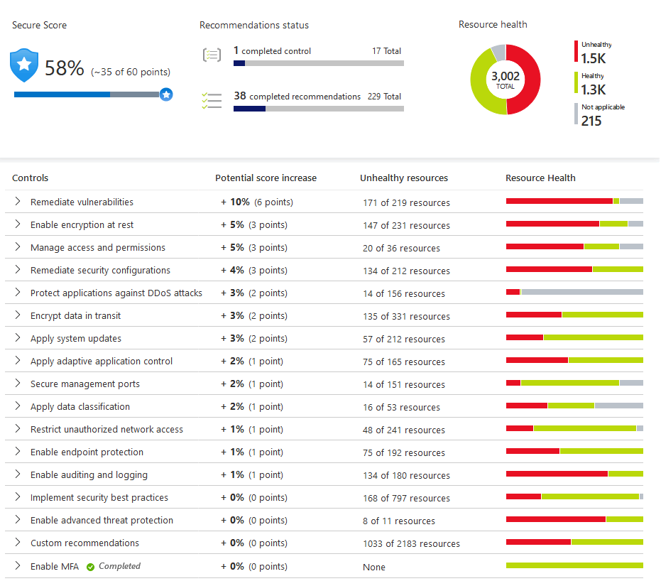
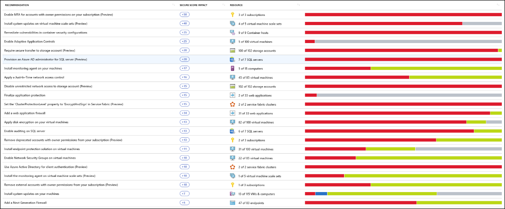
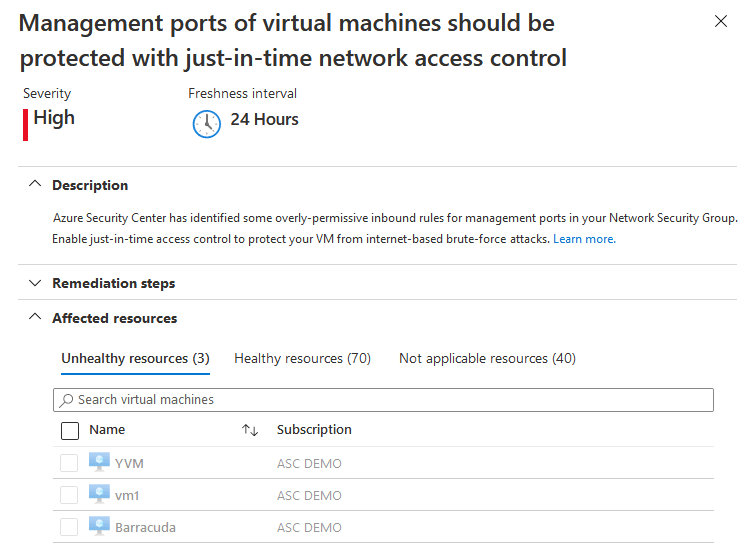
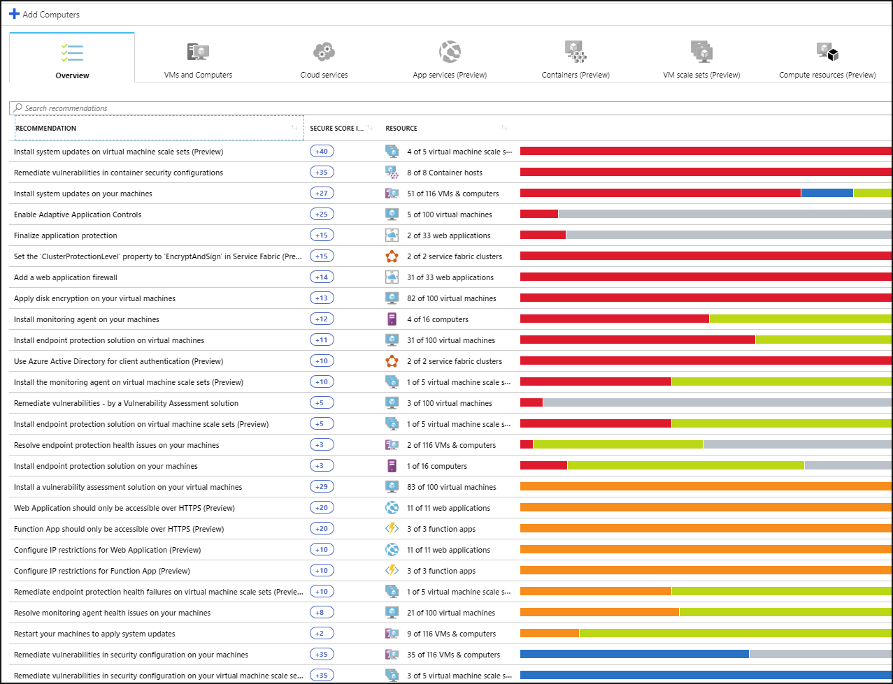
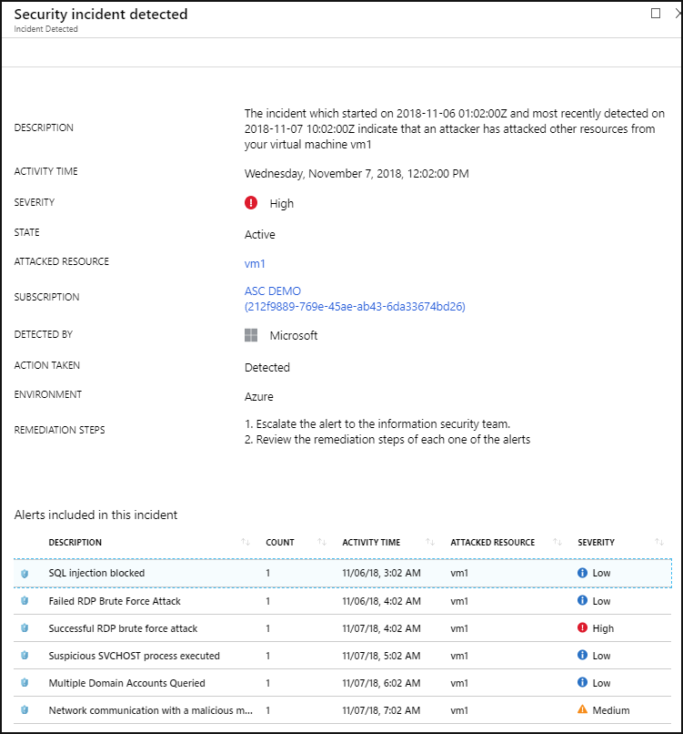

# What is Azure Security Center?

Azure Security Center is a unified infrastructure security management system that strengthens the security posture of your data centers, and provides advanced threat protection across your hybrid workloads in the cloud - whether they're in Azure or not - as well as on premises.

Keeping your resources safe is a joint effort between your cloud provider, Azure, and you, the customer. You have to make sure your workloads are secure as you move to the cloud, and at the same time, when you move to IaaS (infrastructure as a service) there is more customer responsibility than there was in PaaS (platform as a service), and SaaS (software as a service). Azure Security Center provides you the tools needed to harden your network, secure your services and make sure you're on top of your security posture.

Azure Security Center addresses the three most urgent security challenges:

-   **Rapidly changing workloads** – It’s both a strength and a challenge of the cloud. On the one hand, end users are empowered to do more. On the other, how do you make sure that the ever-changing services people are using and creating are up to your security standards and follow security best
    practices?

-   **Increasingly sophisticated attacks** - Wherever you run your workloads, the attacks keep getting more sophisticated. You have to secure your public cloud workloads, which are, in effect, an Internet facing workload that can leave you even more vulnerable if you don't follow security best practices.

-   **Security skills are in short supply** - The number of security alerts and alerting systems far outnumbers the number of administrators with the necessary background and experience far to make sure your environments are protected. Staying up-to-date with the latest attacks is a constant challenge, making it impossible to stay in place while the world of security is an ever-changing front.

To help you protect yourself against these challenges, Security Center provides
you with the tools to:

-   **Strengthen security posture**: Security Center assesses your environment and enables you to understand the status of your resources, are they secure or not?

-   **Protect against threats**: Security Center assesses your workloads and raises threat prevention recommendations and threat detection alerts.

-   **Get secure faster**: In Security Center, everything is done in cloud speed. Because it is natively integrated, deployment of Security Center is easy, providing you with autoprovisioning and protection with Azure services.

## Architecture

Because Security Center is natively part of Azure, PaaS services in Azure - including Service Fabric, SQL databases, and storage accounts - are monitored and protected by Security Center without necessitating any deployment.

In addition, Security Center protects non-Azure servers and virtual machines in the cloud or on premises, for both Windows and Linux servers, by installing the Microsoft Monitoring Agent on them. Azure virtual machines are auto-provisioned in Security Center.

The events collected from the agents and from Azure are correlated in the security analytics engine to provide you tailored recommendations (hardening tasks), that you should follow to make sure your workloads are secure, and threat detection alerts. You should investigate such alerts as soon as possible to make sure malicious attacks aren't taking place on your workloads.

When you enable Security Center, the security policy built-in to Security Center is reflected in Azure Policy as a built in initiative under Security Center category. The built-in initiative is automatically assigned to all Security Center registered subscriptions (Free or Standard tiers). The built-in initiative contains only Audit policies. For more information about Security Center policies in Azure Policy, see [Working with security policies](tutorial-security-policy.md).

## Strengthen security posture

Azure Security Center enables you to strengthen your security posture. This means it helps you identify and perform the hardening tasks recommended as security best practices and implement them across your machines, data services, and apps. This includes managing and enforcing your security policies, and making sure your Azure virtual machines, non-Azure servers, and Azure PaaS services are compliant. Security Center provides you with the tools you need to have a bird's eye view on your workloads, with focused visibility on your
network security estate. 

### Manage organization security policy and compliance

It's a security basic to know and make sure your workloads are secure, and it starts with having tailored security policies in place. Because all the policies in Security Center are built on top of Azure policy controls, you're getting the full range and flexibility of a **world-class policy solution**. In Security
Center, you can set your policies to run on management groups, across subscriptions, and even for a whole tenant.

Security Center helps you **identify Shadow IT subscriptions**. By looking at subscriptions labeled **not covered** in your dashboard, you can know immediately when there are newly created subscriptions and make sure they are covered by your policies, and protected by Azure Security Center.

The advanced monitoring capabilities in Security Center also let you **track and manage compliance and governance over time**. The **overall compliance** provides you with a measure of how much your subscriptions are compliant with policies associated with your workload. 

### Continuous assessments

Security Center continuously discovers new resources that are being deployed across your workloads and assesses whether they are configured according to security best practices, if not, they're flagged and you get a prioritized list of recommendations for what you need to fix in order to protect your machines.

One of the most powerful tools Security Center provides for continuously monitoring the security status of your network is the **Network map**. The map enables you to see the topology of your workloads, so you can see if each node is properly configured. You can see how your nodes are connected, which helps
you block unwanted connections that could potentially make it easier for an attacker to creep along your network.

Security Center makes mitigating your security alerts one step easier, by adding a **Secure score**. The secure scores are now associated with each recommendation you receive to help you understand how important each
recommendation is to your overall security posture. This is crucial in enabling you to **prioritize your security work**.

### Optimize and improve security by configuring recommended controls

The heart of Azure Security Center's value lies in its recommendations. The recommendations are tailored to the particular security concerns found on your workloads, and Security Center does the security admin work for you, by not only finding your vulnerabilities, but providing you with specific instructions for
how to get rid of them.

In this way, Security Center enables you not just to set security policies, but to apply secure configuration standards across your resources.

The recommendations help you to reduce the attack surface across each of your resources. That includes Azure virtual machines, non-Azure servers, and Azure PaaS services such as SQL and Storage accounts and more - where each type of resource is assessed differently and has its own standards.

## Protect against threats

Security Center's threat protection enables you to detect and prevent threats at the Infrastructure as a Service (IaaS) layer, non-Azure servers as well as for Platforms as a Service (PaaS) in Azure.

Security Center's threat protection includes fusion kill-chain analysis, which automatically correlates alerts in your environment based on cyber kill-chain analysis, to help you better understand the full story of an attack campaign, where it started and what kind of impact it had on your resources.

### Advanced threat protection

With Security Center, you get native integration with Windows Defender Advanced Threat Protection out of the box. This means that without any configuration, your Windows virtual machines and servers are fully integrated with Security Center's recommendations and assessments. Advanced threat detection is also
offered out of the box for Linux virtual machines and servers.

In addition, Security Center lets you automate application control policies on server environments. The adaptive application controls in Security Center enable end-to-end app whitelisting across your Windows servers. You don't need to create the rules and check violations, it's all done automatically for you.

### Protect PaaS

Security Center helps you detect threats across Azure PaaS services. You can detect threats targeting Azure services including Azure App Service, Azure SQL, Azure Storage Account, and more data services. You can also take advantage of the native integration with Microsoft Cloud App Security's User and Entity
Behavioral Analytics (UEBA) to perform anomaly detection on your Azure activity logs.

### Block brute force attacks

Security Center helps you limit exposure to brute force attacks. By reducing access to virtual machine ports, using the just-in-time VM access, you can harden your network by preventing unnecessary access. You can set secure access policies on selected ports, for only authorized users, allowed source IP address
ranges or IP addresses, and for a limited amount of time.

### Protect data services

Security Center includes capabilities that help you perform automatic classification of your data in Azure SQL. You can also get assessments for potential vulnerabilities across Azure SQL and Storage services, and
recommendations for how to mitigate them.

### Protect IoT and hybrid cloud workloads (Preview)

Azure Security Center for IoT (Internet of Things) simplifies hybrid workload protection by delivering unified visibility and control, adaptive threat prevention, and intelligent threat detection and response across workloads running on edge, on-premises, in Azure, and in other clouds. For more information, see [Azure Security Center for IoT (Preview)](https://docs.microsoft.com/azure/asc-for-iot/).

## Get secure faster

Native Azure integration (including Azure Policy and Azure Monitor logs) combined with seamless integration with other Microsoft security solutions, such as Microsoft Cloud App Security and Windows Defender Advanced Threat Protection help make sure your security solution is comprehensive as well as simple to
onboard and roll out.

In addition, you can extend the full solution beyond Azure to workloads running on other clouds and in on-premises data centers.

### Automatically discover and onboard Azure resources

Security Center provides seamless, native integration with Azure and Azure resources. That means that you can pull together a complete security story involving Azure Policy and built-in Security Center policies across all your Azure resources, and make sure that the whole thing is automatically applied to
newly discovered resources as you create them in Azure.

Extensive log collection - logs from Windows and Linux are all leveraged in the security analytics engine and used to create recommendations and alerts.

## Next steps

- To get started with Security Center, you need a subscription to Microsoft Azure. If you do not have a subscription, you can sign up for a [free trial](https://azure.microsoft.com/free/).
- Security Center’s Free pricing tier is enabled with your Azure subscription. To take advantage of advanced security management and threat detection capabilities, you must upgrade to the Standard pricing tier. The Standard tier can be tried for free. See the [Security Center pricing page](https://azure.microsoft.com/pricing/details/security-center/) for more information.
- If you’re ready to enable Security Center Standard now, the [Quickstart: Onboard your Azure subscription to Security Center Standard](security-center-get-started.md) walks you through the steps.

