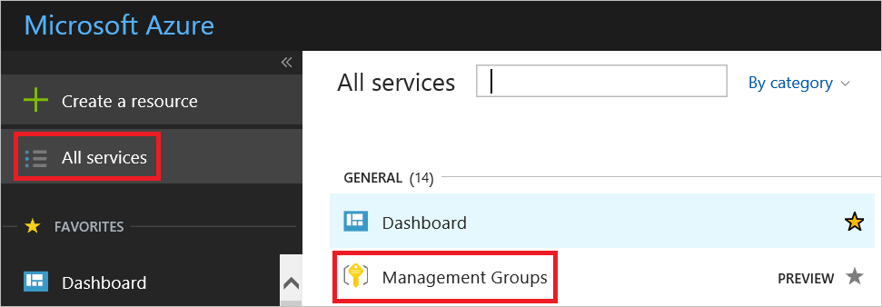
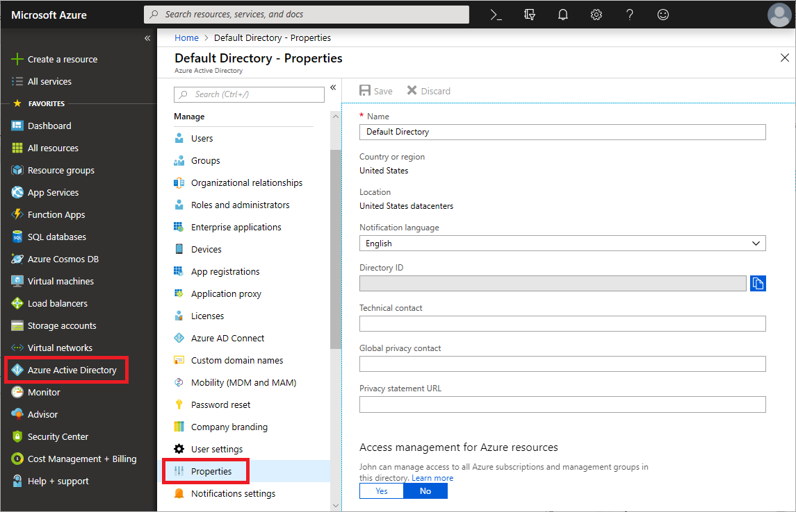
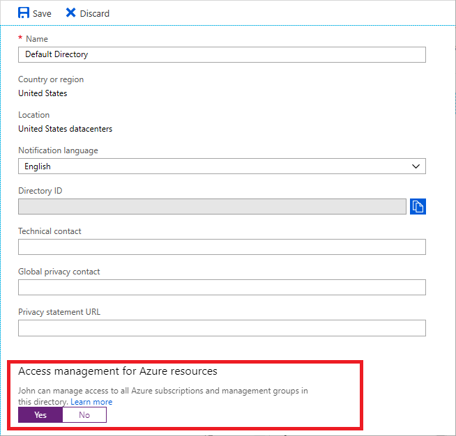
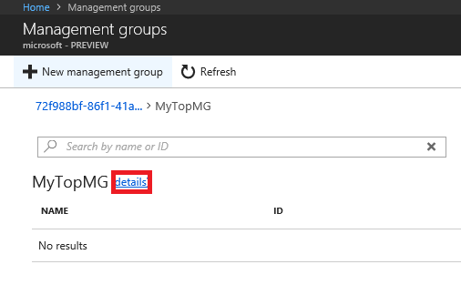
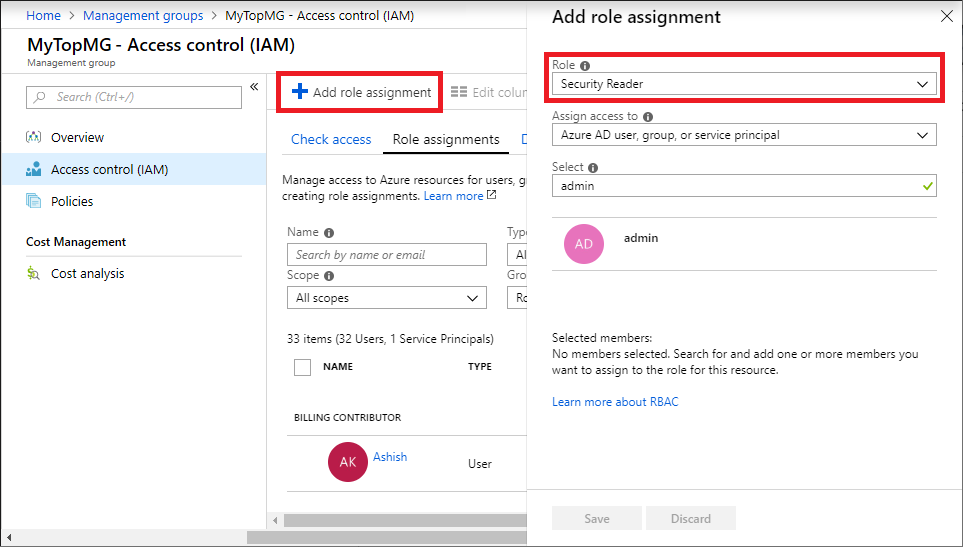
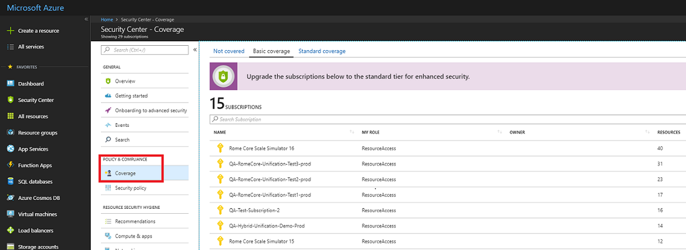
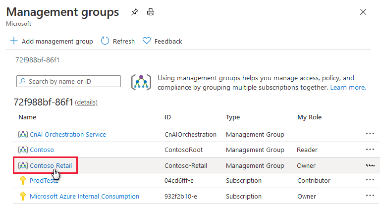

# Gain tenant-wide visibility for Azure Security Center
This article explains how to manage your organization’s security posture at scale by applying security policies to all Azure subscriptions linked to your Azure Active Directory tenant.

[!INCLUDE [updated-for-az](../../includes/updated-for-az.md)]

## Management groups
Azure management groups provide the ability to efficiently manage access, policies, and reporting on groups of subscriptions, as well as effectively manage the entire Azure estate by performing actions on the root management group. Each Azure AD tenant is given a single top-level management group called the root management group. This root management group is built into the hierarchy to have all management groups and subscriptions fold up to it. This group allows global policies and RBAC assignments to be applied at the directory level. 

The root management group is created automatically when you do any of the following actions: 
1. Opt in to use Azure management groups by navigating to **Management Groups** in the [Azure portal](https://portal.azure.com).
2. Create a management group via an API call.
3. Create a management group with PowerShell.

For a detailed overview of management groups, see the [Organize your resources with Azure management groups](../azure-resource-manager/management-groups-overview.md) article.

## Create a management group in the Azure portal
You can organize subscriptions into management groups and apply your governance policies to the management groups. All subscriptions within a management group automatically inherit the policies applied to the management group. While management groups aren't required to onboard Security Center, it’s highly recommended that you create at least one management group so the root management group is created. After the group is created, all subscriptions under your Azure AD tenant will be linked to it. For instructions for PowerShell and more information, see [Create management groups for resource and organization management](../azure-resource-manager/management-groups-create.md).

 
1. Sign in to the [Azure portal](https://portal.azure.com).
2. Select **All services** > **Management groups**.
3. On the main page, select **New Management group.** 

     
4.  Fill in the management group ID field. 
    - The **Management Group ID** is the directory unique identifier that is used to submit commands on this management group. This identifier isn't editable after creation as it is used throughout the Azure system to identify this group. 
    - The display name field is the name that is displayed within the Azure portal. A separate display name is an optional field when creating the management group and can be changed at any time.  

        
5.  Select **Save**

### View management groups in the Azure portal
1. Sign in to the [Azure portal](https://portal.azure.com).
2. To view management groups, select **All services** under the Azure main menu.
3. Under **General**, select **Management Groups**.

	

## Grant tenant-level visibility and the ability to assign policies

To get visibility into the security posture of all subscriptions registered in the Azure AD tenant, an RBAC role with sufficient read permissions is required to be assigned on the root management group.

### Elevate access for a global administrator in Azure Active Directory
An Azure Active Directory tenant administrator doesn’t have direct access to Azure subscriptions. However, as a directory administrator, they have the right to elevate themselves to a role that does have access. An Azure AD tenant administrator needs to elevate itself to user access administrator at the root management group level so they can assign RBAC roles. For PowerShell instructions and additional information, see [Elevate access for a Global administrator in Azure Active Directory](../role-based-access-control/elevate-access-global-admin.md). 


1. Sign in to the [Azure portal](https://portal.azure.com) or the [Azure Active Directory admin center](https://aad.portal.azure.com).

2. In the navigation list, click **Azure Active Directory** and then click **Properties**.

   

3. Under **Access management for Azure resources**, set the switch to **Yes**.

   

   - When you set the switch to Yes, you are assigned the User Access Administrator role in Azure RBAC at the root scope (/). This grants you permission to assign roles in all Azure subscriptions and management groups associated with this Azure AD directory. This switch is only available to users who are assigned the Global Administrator role in Azure AD.

   - When you set the switch to No, the User Access Administrator role in Azure RBAC is removed from your user account. You can no longer assign roles in all Azure subscriptions and management groups that are associated with this Azure AD directory. You can view and manage only the Azure subscriptions and management groups to which you have been granted access.

4. Click **Save** to save your setting.

    - This setting isn't a global property and applies only to the currently logged in user.

5. Perform the tasks you need to make at the elevated access. When you're done, set the switch back to **No**.


### Assign RBAC roles to users
To gain visibility to all subscriptions, tenant administrators need to assign the appropriate RBAC role to any users they wish to grant tenant-wide visibility, including themselves, at the root management group level. The recommended roles to assign are either **Security Admin** or **Security Reader**. Generally, the Security Admin role is required to apply policies on the root level, while Security Reader will suffice to provide tenant-level visibility. For more information about the permissions granted by these roles, see the [Security Admin built-in role description](../role-based-access-control/built-in-roles.md#security-admin) or the [Security Reader built-in role description](../role-based-access-control/built-in-roles.md#security-reader).


#### Assign RBAC roles to users through the Azure portal: 

1. Sign in to the [Azure portal](https://portal.azure.com). 
1. To view management groups, select **All services** under the Azure main menu then select **Management Groups**.
1.  Select a management group and click **details**.

    
 
1. Click **Access control (IAM)** then **Role assignments**.

1. Click **Add role assignment**.

1. Select the role to assign and the user, then click **Save**.  
   
   


#### Assign RBAC roles to users with PowerShell: 

[!INCLUDE [updated-for-az](../../includes/updated-for-az.md)]

1. Install [Azure PowerShell](/powershell/azure/install-az-ps).
2. Run the following commands: 

    ```azurepowershell
    # Login to Azure as a Global Administrator user
    Connect-AzAccount
    ```

3. When prompted, sign in with global admin credentials. 

    

4. Grant reader role permissions by running the following command:

    ```azurepowershell
    # Add Reader role to the required user on the Root Management Group
    # Replace "user@domian.com” with the user to grant access to
    New-AzRoleAssignment -SignInName "user@domain.com" -RoleDefinitionName "Reader" -Scope "/"
    ```
5. To remove the role, use the following command: 

    ```azurepowershell
    Remove-AzRoleAssignment -SignInName "user@domain.com" -RoleDefinitionName "Reader" -Scope "/" 
    ```

### Open or refresh Security Center
Once you have elevated access, open or refresh Azure Security Center to verify you have visibility into all subscriptions under your Azure AD tenant. 

1. Sign in to the [Azure portal](https://portal.azure.com). 
2. Make sure you select all the subscriptions in the subscription selector that you would like to view in Security Center.

    

1. Select **All services** under the Azure main menu then select **Security Center**.
2. In the **Overview**, there's a subscription coverage chart.

    

3. Click on **Coverage** to see the list of subscriptions covered. 

    

### Remove elevated access 
Once the RBAC roles have been assigned to the users, the tenant administrator should remove itself from the user access administrator role.

1. Sign in to the [Azure portal](https://portal.azure.com) or the [Azure Active Directory admin center](https://aad.portal.azure.com).

2. In the navigation list, click **Azure Active Directory** and then click **Properties**.

3. Under **Access management for Azure resources**, set the switch to **No**.

4. Click **Save** to save your setting.


## Adding subscriptions to a management group
You can add subscriptions to the management group that you created. These steps aren't mandatory for gaining tenant-wide visibility and global policy and access management.

1. Under **Management Groups**, select a management group to add your subscription to.

	

2. Select **Add existing**.

	

3. Enter subscription under **Add existing resource** and click **Save**.

4. Repeat steps 1 through 3 until you've added all the subscriptions in the scope.

   > [!NOTE]
   > Management groups can contain both subscriptions and child management  groups. When you assign a user an RBAC role to the parent management group, the access is inherited by the child management group's subscriptions. Policies set at the parent management group are also inherited by the children. 

## Next steps
In this article, you learned how to gain tenant-wide visibility for Azure Security Center. To learn more about Security Center, see the following articles:

> [!div class="nextstepaction"]
> [Security health monitoring in Azure Security Center](security-center-monitoring.md)

> [!div class="nextstepaction"]
> [Manage and respond to security alerts in Azure Security Center](security-center-managing-and-responding-alerts.md)

