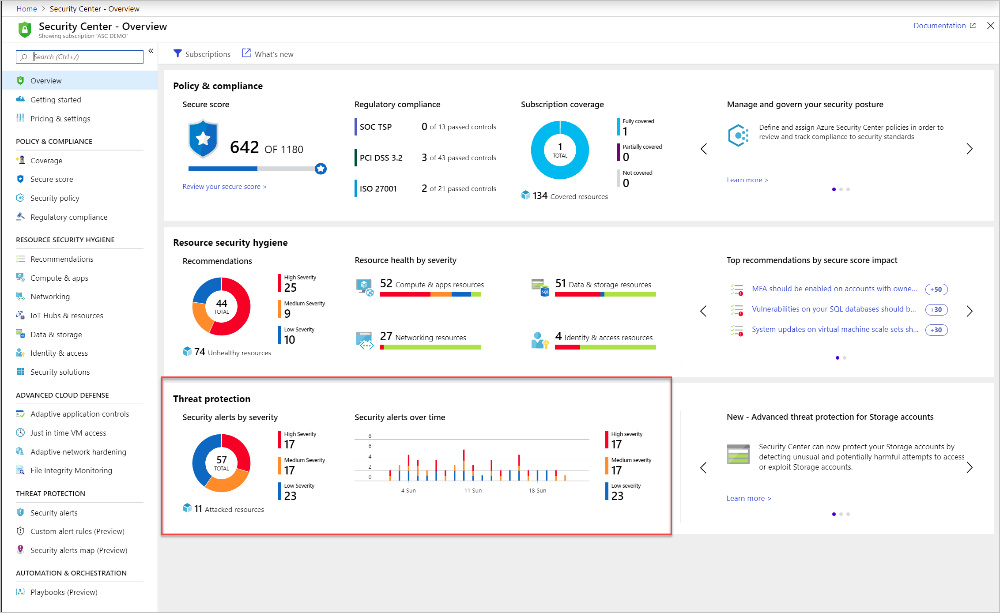

# Manage and respond to security alerts in Azure Security Center

This topic shows you how to view and process the alerts that you have received in order to protect your resources. 

* To learn about the different types of alerts, see [Security alert types](alerts-reference.md).
* For an overview of how Security Center generates alerts, see [How Azure Security Center detects and responds to threats](security-center-alerts-overview.md).

> [!NOTE]
> To enable advanced detections, upgrade to Azure Security Center Standard. A free trial is available. To upgrade, select Pricing Tier in the [Security Policy](tutorial-security-policy.md). See [Azure Security Center pricing](security-center-pricing.md) to learn more.

## What are security alerts?
Security Center automatically collects, analyzes, and integrates log data from your Azure resources, the network, and connected partner solutions, like firewall and endpoint protection solutions, to detect real threats and reduce false positives. A list of prioritized security alerts is shown in Security Center along with the information you need to quickly investigate the problem and recommendations for how to remediate an attack.

> [!NOTE]
> For more information about how Security Center detection capabilities work, see [How Azure Security Center detects and responds to threats](security-center-alerts-overview.md#detect-threats).

## Manage your security alerts

1. From the Security Center dashboard, see the  **Threat protection** tile to view and overview of the alerts.

    

1. To see more details about the alerts, click the tile.

   

1. To filter the alerts shown, click **Filter**, and from the **Filter** blade that opens, select the filter options that you want to apply. The list updates according to the selected filter. Filtering can be very helpful. For example, you might you want to address security alerts that occurred in the last 24 hours because you are investigating a potential breach in the system.

    

## Respond to security alerts

1. From the **Security alerts** list, click a security alert. The resources involved and the steps you need to take to remediate an attack is shown.

    

1. After reviewing the information, click a resource that was attacked.

    

    The **General Information** section can offer an insight into what triggered the security alert. It displays information such as the target resource, source IP address (when applicable), if the alert is still active, and recommendations about how to remediate.  

    > [!NOTE]
    >In some instances, the source IP address is not available, some Windows security events logs do not include the IP address.

1. The remediation steps suggested by Security Center vary according to the security alert. Follow them for each alert. 

    In some cases, in order to mitigate a security alert, you may have to use other Azure controls or services to implement the recommended remediation. 

## See also

In this document, you learned how to configure security policies in Security Center. To learn more about Security Center, see the following:

* [Security alerts in Azure Security Center](security-center-alerts-overview.md).
* [Handling security incidents](security-center-incident.md)