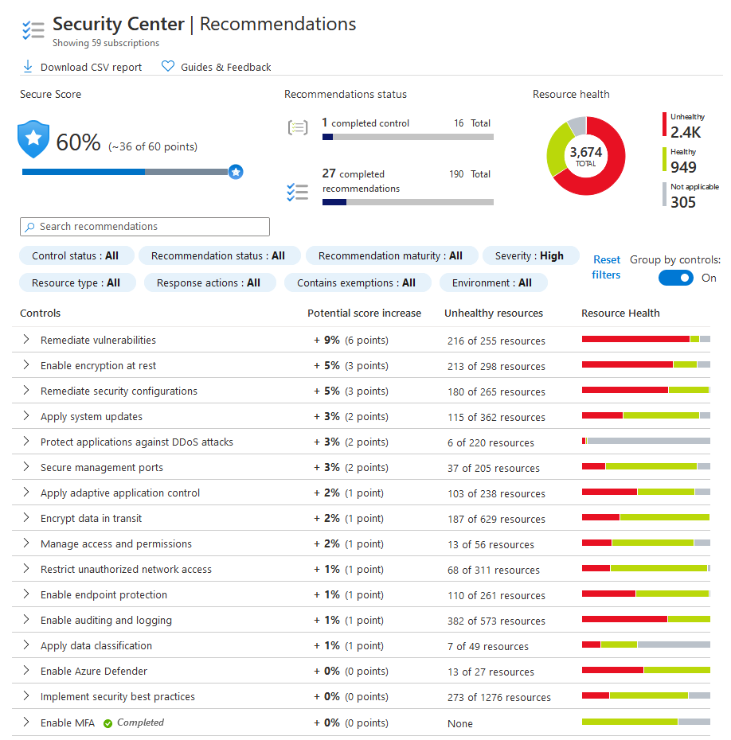

# Security recommendations in Azure Security Center 
This topic explains how to view and understand the recommendations in Azure Security Center to help you protect your Azure resources.

## What are security recommendations?

Recommendations are actions for you to take in order to secure your resources.

Security Center periodically analyzes the security state of your Azure resources to identify potential security vulnerabilities. It then provides you with recommendations on how to remediate those vulnerabilities.

Each recommendation provides you with:

- A short description of the issue
- The remediation steps to carry out in order to implement the recommendation
- The affected resources

## Monitor recommendations 

Security Center analyzes the security state of your resources to identify potential vulnerabilities. 

1. From Security Center's menu, open the **Recommendations** page to see the recommendations applicable to your environment. Recommendations are grouped into security controls.

      

1. Expand a control and select a specific recommendation to view the recommendation details page.

    :::image type="content" source="./media/security-center-recommendations/recommendation-details-page.png" alt-text="Recommendation details page." lightbox="./media/security-center-recommendations/recommendation-details-page.png":::

    The page includes:

    1. **Enforce** and **Deny** buttons on supported recommendations (see [Prevent misconfigurations with Enforce/Deny recommendations](prevent-misconfigurations.md))
    1. **Severity indicator**
    1. **Freshness interval**  (where relevant) 
    1. **Description** - A short description of the issue
    1. **Remediation steps** - A description of the manual steps required to remediate the security issue on the affected resources. For recommendations with 'quick fix', you can select **View remediation logic** before applying the suggested fix to your resources. 
    1. **Affected resources** - Your resources are grouped into tabs:
        - **Healthy resources** – Relevant resources which either aren't impacted or on which you've already  remediated the issue.
        - **Unhealthy resources** – Resources which are still impacted by the identified issue.
        - **Not applicable resources** – Resources for which the recommendation can't give a definitive answer. The not applicable tab also includes reasons for each resource. 

            :::image type="content" source="./media/security-center-recommendations/recommendations-not-applicable-reasons.png" alt-text="Not applicable resources with reasons.":::
    1. Action buttons to remediate the recommendation or trigger a logic app.

## Preview recommendations

Recommendations flagged as **Preview** aren't included in the calculations of your secure score.

They should still be remediated wherever possible, so that when the preview period ends they'll contribute towards your score.

An example of a preview recommendation:

:::image type="content" source="./media/secure-score-security-controls/example-of-preview-recommendation.png" alt-text="Recommendation with the preview flag":::
 
## Next steps

In this document, you were introduced to security recommendations in Security Center. For related information:

- [Remediate recommendations](security-center-remediate-recommendations.md) — Learn how to configure security policies for your Azure subscriptions and resource groups.
- [Prevent misconfigurations with Enforce/Deny recommendations](prevent-misconfigurations.md).
- [Automate responses to recommendations](workflow-automation.md)
- [Exempt a resource from a recommendation](exempt-resource.md)
- [Security recommendations - a reference guide](recommendations-reference.md)