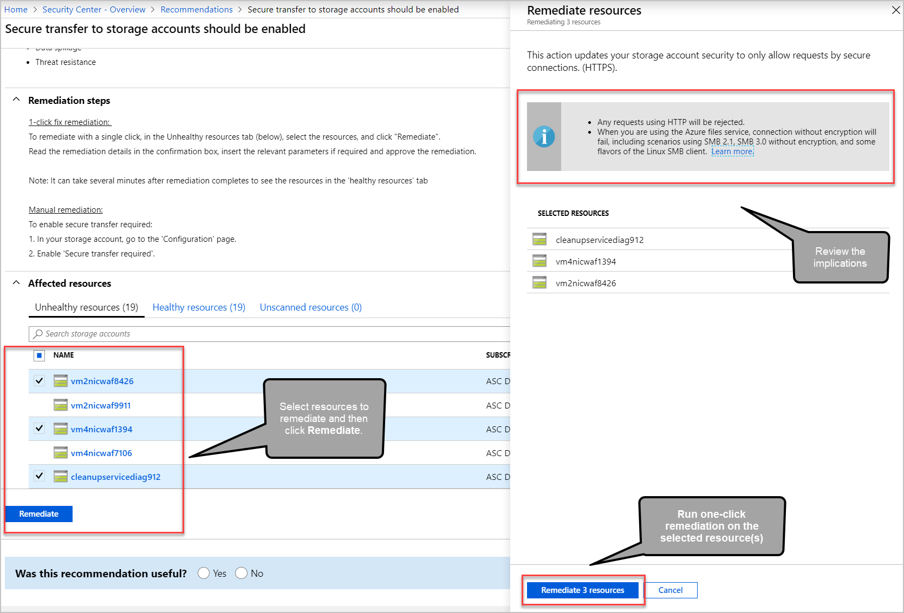

# Remediate recommendations in Azure Security Center

Recommendations give you suggestions on how to better secure your resources. You implement a recommendation by following the remediation steps provided in the recommendation.

## Remediation steps 

After reviewing all the recommendations, decide which one to remediate first. We recommend that you use the [Secure Score impact](security-center-recommendations.md#monitor-recommendations) to help prioritize what to do first.

1. From the list, click the recommendation.

1. Follow the instructions in the **Remediation steps** section. Each recommendation has its own set of instructions. The following screenshot shows remediation steps for configuring applications to only allow traffic over HTTPS.

    

1. Once completed, a notification appears informing you if the remediation succeeded.

## Quick fix remediation

Quick fix simplifies remediation and enables you to quickly increase your secure score, improving your environment's security.

Quick fix enables you to quickly remediate a recommendation on multiple resources. 

> [!TIP]
> Quick fix is only available for specific recommendations. To find the recommendations that have the quick fix option, use the dedicated filter at the top of the list of recommendations:
> 
> :::image type="content" source="media/security-center-remediate-recommendations/quick-fix-filter.png" alt-text="Use the filters above the recommendations list to find recommendations that have the quick fix option":::

To implement a quick fix remediation:

1. From the list of recommendations that have the **Quick Fix!** label, click on the recommendation.

    

1. From the **Unhealthy resources** tab, select the resources that you want to implement the recommendation on, and click **Remediate**.

    > [!NOTE]
    > Some of the listed resources might be disabled, because you don't have the appropriate permissions to modify them.

1. In the confirmation box, read the remediation details and implications.

    

    > [!NOTE]
    > The implications are listed in the grey box in the **Remediate resources** window that opens after clicking **Remediate**. They list what changes happen when proceeding with the quick fix remediation.

1. Insert the relevant parameters if necessary, and approve the remediation.

    > [!NOTE]
    > It can take several minutes after remediation completes to see the resources in the **Healthy resources** tab. To view the remediation actions, check the [activity log](#activity-log).

1. Once completed, a notification appears informing you if the remediation succeeded.

## Quick fix remediation logging in the activity log 

The remediation operation uses a template deployment or REST PATCH API call to apply the configuration on the resource. These operations are logged in [Azure activity log](../azure-resource-manager/management/view-activity-logs.md).

## Next steps

In this document, you were shown how to remediate recommendations in Security Center. To learn more about Security Center, see the following topics:

* [Setting security policies in Azure Security Center](tutorial-security-policy.md) - Learn how to configure security policies for your Azure subscriptions and resource groups.
* [Security health monitoring in Azure Security Center](security-center-monitoring.md) - Learn how to monitor the health of your Azure resources.
