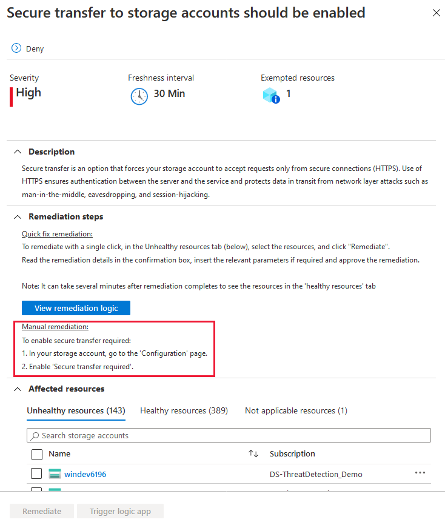

# Remediate recommendations in Azure Security Center

Recommendations give you suggestions on how to better secure your resources.  You implement a recommendation by following the remediation steps provided in the recommendation. 

## Remediation steps 

After reviewing all the recommendations, decide which one to remediate first. We recommend that you use the [secure score impact](security-center-recommendations.md#monitor-recommendations) to help prioritize what to do first.

1. From the list, click on the recommendation.
1. Follow the instructions in the **Remediation steps** section. Each recommendation has its own set of instructions. The following shows remediation steps for configuring applications to only allow traffic over HTTPS.

    

1. Once completed, a notification appears informing you if the remediation succeeded.

## Next steps

In this document, you were shown how to remediate recommendations in Security Center. To learn more about Security Center, see the following topics:

* [Setting security policies in Azure Security Center](tutorial-security-policy.md) — Learn how to configure security policies for your Azure subscriptions and resource groups.
* [Security health monitoring in Azure Security Center](security-center-monitoring.md) — Learn how to monitor the health of your Azure resources.
