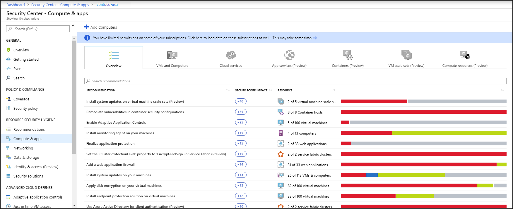
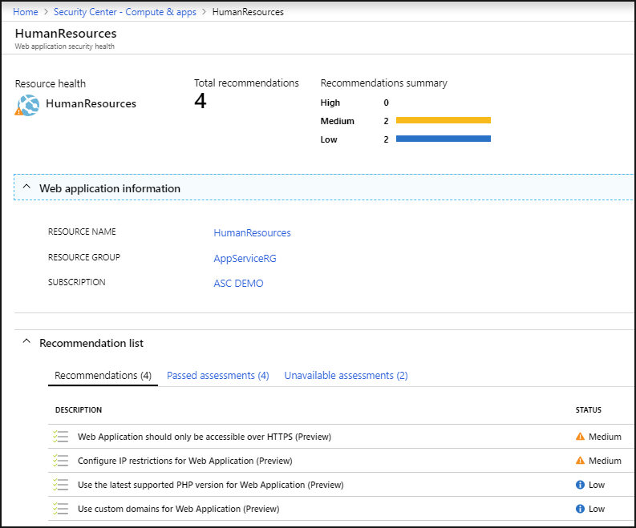

# Protect your machines and applications
When Security Center identifies potential security vulnerabilities, it creates recommendations that guide you through the process of configuring the necessary controls. 

This article explains the **Compute and apps** page of the Azure Security Center's resource security section. It also describes some of the recommendations you'll see there.

For a full list of the recommendations for Compute and App services, see [Compute and App recommendations](recommendations-compute-and-apps.md).

## View the security of your compute and apps resources

To view the status of your compute and apps resources, select **Compute & apps** under **Resources** in the Security Center sidebar. The following tabs are available:

* **Overview**: lists the recommendations for all the compute and apps resources as well as their current security status 

* [**VMs and computers**](#vms-and-computers): lists the recommendations for your VMs, computers, and current security state of each

* [**VM Scale Sets**](#vmscale-sets): lists the recommendations for your scale sets, 

* [**Cloud Services**](#cloud-services): lists the recommendations for your web and worker roles monitored by Security Center

* [**App services**](#app-services): lists the recommendations for your App service environments and the current security state of each

* **Containers**: lists the recommendations for your containers and security assessment of their configurations

* **Compute resources**: lists the recommendations for your compute resources, such as Service Fabric clusters and Event hubs

### What's in each tab?

Each tab has multiple sections, and in each section, you can drill down to see additional details about the item shown.

In each tab, you will also see recommendations for the relevant resources in your monitored environment. The first column lists the recommendation, the second shows the total number of resources affected, and the third shows the severity of the issue.

Each recommendation has a set of actions that you can perform after you select it. For example, if you select **Missing system updates**, the number of VMs and computers that are missing patches, and the severity of the missing update appears.

> [!NOTE]
> The security recommendations are the same as those on the **Recommendations** page, but here they're filtered to the specific resource type you've selected. For more information about how to resolve recommendations, see [Implementing security recommendations in Azure Security Center](security-center-recommendations.md).
>

### VMs and computers
The VMs and computers section gives you an overview of all security recommendations for your VMs and computers. Four types of machines are included:

 Non-Azure computer.

 Azure Resource Manager VM.

 Azure Classic VM.

 VMs that are identified only from the workspace that is part of the viewed subscription. This includes VMs from other subscriptions that report to the workspace in this subscription, and VMs that were installed with Operations Manager direct agent, and have no resource ID.

The icon that appears under each recommendation helps you to quickly identify the VM and computer that needs attention, and the type of recommendation. You can also use the filters to search the list by **Resource type** and by **Severity**.

To drill down into the security recommendations for each VM, click on the VM.
Here you see the security details for the VM or computer. At the bottom, you can see the recommended action and the severity of each issue.

### Cloud services
For cloud services, a recommendation is created when the operating system version is out of date.

In a scenario where you have a recommendation, follow the steps in the recommendation to update the operating system. When an update is available, you will have an alert (red or orange - depending on the severity of the issue). For a full explanation of this recommendation, click **Update OS version** under the **DESCRIPTION** column.

### App services
To view the App Service information, you must be on Security Center's Standard pricing tier and enable App Service in your subscription. For instructions on enabling this feature, see [Protect App Service with Azure Security Center](security-center-app-services.md).

Under **App services**, you find a list of your App service environments and the health summary based on the assessment Security Center performed.

There are three types of application services shown:

 App services environment

 Web application

 Function application

If you select a web application, a summary view opens with three tabs:

   - **Recommendations**: based on assessments performed by Security Center that failed.
   - **Passed assessments**: list of assessments performed by Security Center that passed.
   - **Unavailable assessments**: list of assessments that failed to run due to an error or the recommendation is not relevant for the specific App service

   Under **Recommendations** is a list of the recommendations for the selected web application and severity of each recommendation.

   

Select a recommendation to see a description of the recommendation and a list of unhealthy resources, healthy resources, and unscanned resources.

   - The **Passed assessments** column shows a list of passed assessments. Severity of these assessments is always green.

   - Select a passed assessment from the list for a description of the assessment, a list of unhealthy and healthy resources, and a list of unscanned resources. There is a tab for unhealthy resources but that list is always empty since the assessment passed.

### Virtual machine scale sets
Security Center automatically discovers whether you have scale sets and recommends that you install the Microsoft Monitoring Agent on them.

To install the Microsoft Monitoring Agent: 

1. Select the recommendation **Install the monitoring agent on virtual machine scale set**. You get a list of unmonitored scale sets.

1. Select an unhealthy scale set. Follow the instructions to install the monitoring agent using an existing populated workspace or create a new one. Make sure to set the workspace [pricing tier](security-center-pricing.md) if it’s not set.

   

To set new scale sets to automatically install the Microsoft Monitoring Agent:
1. Go to Azure Policy and click **Definitions**.

1. Search for the policy **Deploy Log Analytics agent for Windows virtual machine scale sets** and click on it.

1. Click **Assign**.

1. Set the **Scope** and **Log Analytics workspace** and click **Assign**.

If you want to set all existing scale sets to install the Microsoft Monitoring Agent, in Azure Policy, go to **Remediation** and apply the existing policy to existing scale sets.

## Next steps
To learn more about recommendations that apply to other Azure resource types, see the following articles:

* [Monitor identity and access in Azure Security Center](security-center-identity-access.md)
* [Protecting your network in Azure Security Center](security-center-network-recommendations.md)
* [Protecting your Azure SQL service in Azure Security Center](security-center-sql-service-recommendations.md)
