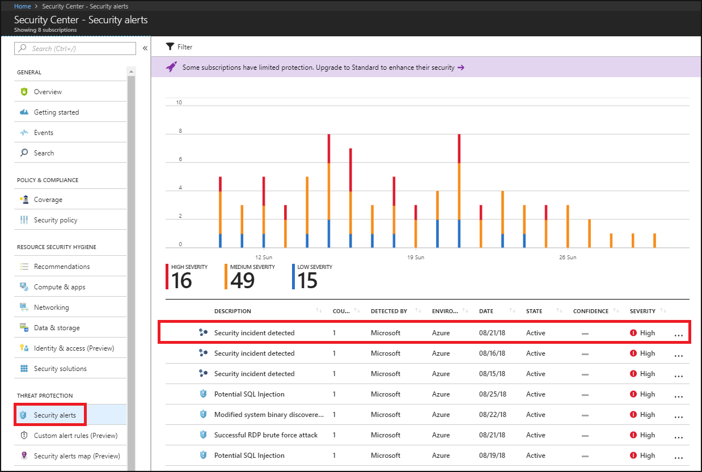
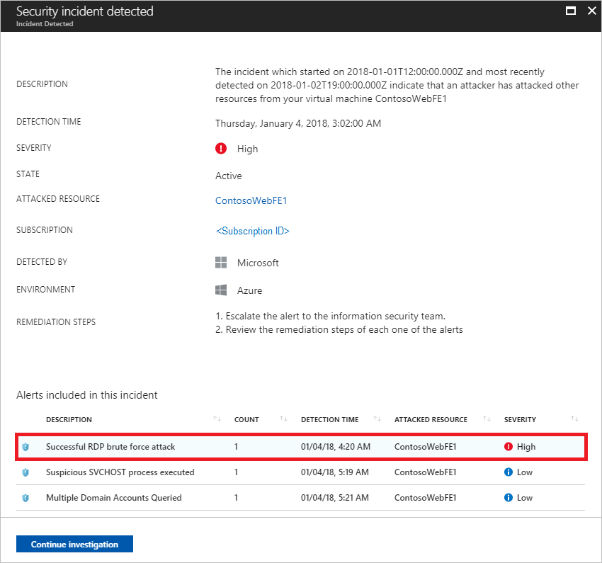
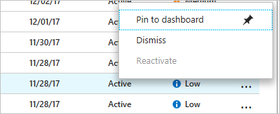

# Tutorial: Respond to security incidents
Security Center continuously analyzes your hybrid cloud workloads using advanced analytics and threat intelligence to alert you to malicious activity. In addition, you can integrate alerts from other security products and services into Security Center, and create custom alerts based on your own indicators or intelligence sources. Once an alert is generated, swift action is needed to investigate and remediate. In this tutorial, you will learn how to:

> [!div class="checklist"]
> * Triage security alerts
> * Investigate further to determine the root cause and scope of a security incident
> * Search security data to aid in investigation

If you don't have an Azure subscription, create a [free account](https://azure.microsoft.com/free/) before you begin.

## Prerequisites
To step through the features covered in this tutorial, you must have Azure Defender enabled. You can try Azure Defender at no cost. To learn more, see the [pricing page](https://azure.microsoft.com/pricing/details/security-center/). The quickstart [Get started with Security Center](security-center-get-started.md) walks you through how to upgrade.

## Scenario
Contoso recently migrated some of their on-premises resources to Azure, including some virtual machine-based line-of-business workloads and SQL databases. Currently, Contoso's Core Computer Security Incident Response Team (CSIRT) has a problem investigating security issues because of security intelligence not being integrated with their current incident response tools. This lack of integration introduces a problem during the Detect stage (too many false positives), as well as during the Assess and Diagnose stages. As part of this migration, they decided to opt in for Security Center to help them address this problem.

The first phase of this migration finished after they onboarded all resources and addressed all of the security recommendations from Security Center. Contoso CSIRT is the focal point for dealing with computer security incidents. The team consists of a group of people with responsibilities for dealing with any security incident. The team members have clearly defined duties to ensure that no area of response is left uncovered.

For the purpose of this scenario, we're going to focus on the roles of the following personas that are part of Contoso CSIRT:

Judy is in security operations. Their responsibilities include:

* Monitoring and responding to security threats around the clock.
* Escalating to the cloud workload owner or security analyst as needed.

Sam is a security analyst and their responsibilities include:

* Investigating attacks.
* Remediating alerts.
* Working with workload owners to determine and apply mitigations.

As you can see, Judy and Sam have different responsibilities, and they must work together to share Security Center information.

## Triage security alerts
Security Center provides a unified view of all security alerts. Security alerts are ranked based on the severity and when possible related alerts are combined into a security incident. When triaging alerts and incidents, you should:

- Dismiss alerts for which no additional action is required, for example if the alert is a false positive
- Act to remediate known attacks, for example blocking network traffic from a malicious IP address
- Determine alerts that require further investigation

1. On the Security Center main menu under **DETECTION**, select **Security alerts**:

   

2. In the list of alerts, select a security incident, which is a collection of alerts, to learn more about this incident. **Security incident detected** opens.

   

3. On this screen you have the security incident description on top, and the list of alerts that are part of this incident. Click on the alert that you want to investigate further to obtain more information.

   

   The type of alert can vary, read [Understanding security alerts in Azure Security Center](security-center-alerts-type.md) for more details about the type of alert, and potential remediation steps. For alerts that can be safely dismissed, you can right click on the alert and select the option **Dismiss**:

   

4. If the root cause and scope of the malicious activity is unknown, proceed to the next step to investigate further.

## Investigate an alert or incident
1. On the **Security alert** page, click **Start investigation** button (if you already started, the name changes to **Continue investigation**).

   

   The investigation map is a graphical representation of the entities that are connected to this security alert or incident. By clicking on an entity in the map, the information about that entity will show new entities, and the map expands. The entity that is selected in the map has its properties highlighted in the pane on the right side of the page. The information available on each tab will vary according to the selected entity. During the investigation process, review all relevant information to better understand the attacker's movement.

2. If you need more evidence, or must further investigate entities that were found during the investigation, proceed to the next step.

## Search data for investigation

You can use search capabilities in Security Center to find more evidence of compromised systems, and more details about the entities that are part of the investigation.

To perform a search open the **Security Center** dashboard, click **Search** in the left navigation pane, select the workspace that contains the entities that you want to search, type the search query, and click the search button.

## Clean up resources

Other quickstarts and tutorials in this collection build upon this quickstart. If you plan to continue to work with subsequent quickstarts and tutorials, keep automatic provisioning and Azure Defender enabled. If you do not plan to continue or wish to disable Azure Defender:

1. Return to the Security Center main menu and select **Pricing and settings**.
1. Select the subscription that you want to downgrade.
1. Set **Azure Defender** to Off.
1. Select **Save**.

If you wish to disable automatic provisioning:

1. Return to the Security Center main menu and select **Security policy**.
2. Select the subscription that you wish to disable automatic provisioning.
3. Under **Security policy – Data Collection**, select **Off** under **Onboarding** to disable automatic provisioning.
4. Select **Save**.

>[!NOTE]
> Disabling automatic provisioning does not remove the Log Analytics agent from Azure VMs where the agent has been provisioned. Disabling automatic provisioning limits security monitoring for your resources.
>

## Next steps
In this tutorial, you learned about Security Center features to be used when responding to a security incident, such as:

> [!div class="checklist"]
> * Security incident which is an aggregation of related alerts for a resource
> * Investigation map which is a graphical representation of the entities connected to a security alert or incident
> * Search capabilities to find more evidence of compromised systems