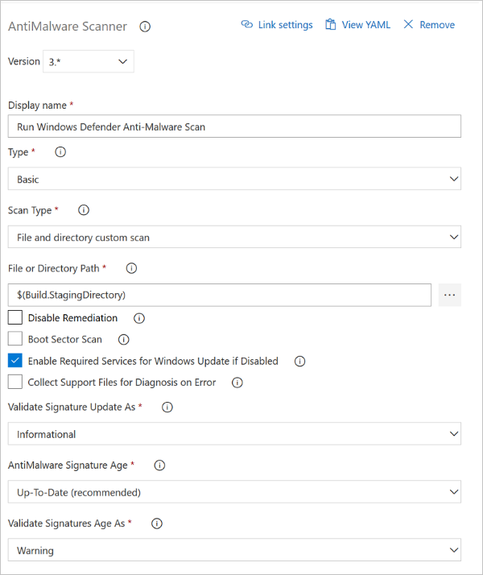
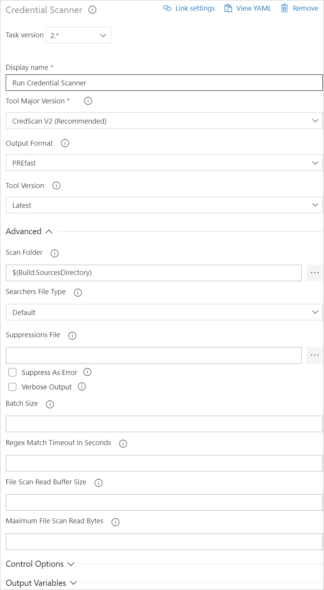
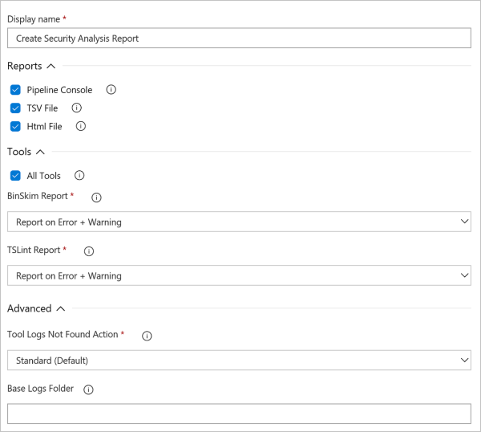
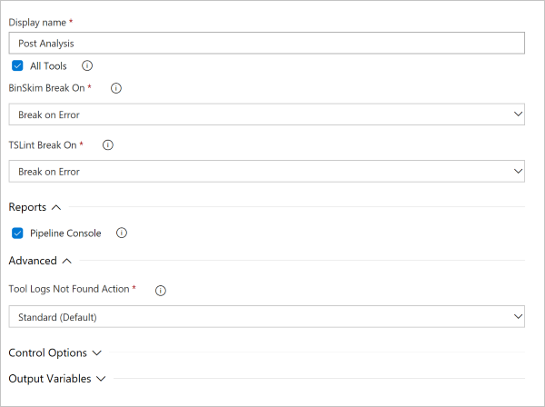

# Configure and customize the build tasks

This article describes in detail the configuration options available in each of the build tasks. The article starts with the tasks for security code analysis tools. It ends with the post-processing tasks.

## Anti-Malware Scanner task

>[!NOTE]
> The Anti-Malware Scanner build task requires a build agent with Windows Defender enabled. Hosted Visual Studio 2017 and later provide such an agent. The build task won't run on the Visual Studio 2015 hosted agent.
>
> Although signatures can't be updated on these agents, signatures should always be less than three hours old.

Details of task configuration are shown in the following screenshot and text.

In the **Type** list box of the screenshot, **Basic** is selected. Select **Custom** to provide command-line arguments that customize the scan.

Windows Defender uses the Windows Update client to download and install signatures. If signature update fails on your build agent, the **HRESULT** error code is likely coming from Windows Update.

For more information on Windows Update errors and their mitigation, see [Windows Update error codes by component](https://docs.microsoft.com/windows/deployment/update/windows-update-error-reference) and the TechNet article [Windows Update Agent - Error Codes](https://social.technet.microsoft.com/wiki/contents/articles/15260.windows-update-agent-error-codes.aspx).

For information about YAML configuration for this task, please check our [Anti-Malware YAML options](yaml-configuration.md#anti-malware-scanner-task)

## BinSkim task

> [!NOTE]
> Before you can run the BinSkim task, your build must meet one of these conditions:
>  - Your build produces binary artifacts from managed code.
>  - You have binary artifacts committed that you want to analyze with BinSkim.

Details of task configuration are shown in the following screenshot and list.

- Set the build configuration to Debug so that .pdb debug files are produced. BinSkim uses these files to map issues in the output binaries back to source code.
- To avoid researching and creating your own command line:
     - In the **Type** list, select **Basic**.
     - In the **Function** list, select **Analyze**.
- In **Target**, enter one or more specifiers for a file, directory, or filter pattern. These specifiers resolve to one or more binaries to be analyzed:
    - Multiple specified targets must be separated by a semicolon (;).
    - A specifier can be a single file or contain wildcards.
    - Directory specifications must always end with \\*.
    - Examples:

           *.dll;*.exe
           $(BUILD_STAGINGDIRECTORY)\*
           $(BUILD_STAGINGDIRECTORY)\*.dll;$(BUILD_STAGINGDIRECTORY)\*.exe;

- If you select **Command Line** in the **Type** list, you need to run binskim.exe:
     - Make sure the first arguments to binskim.exe are the verb **analyze** followed by one or more path specifications. Each path can be either a full path or a path relative to the source directory.
     - Multiple target paths must be separated by a space.
     - You can omit the **/o** or **/output** option. The output value is added for you or replaced.
     - Standard command-line configurations are shown as follows.

           analyze $(Build.StagingDirectory)\* --recurse --verbose
           analyze *.dll *.exe --recurse --verbose

          > [!NOTE]
          > The trailing \\* is important if you specify directories for the target.

For more information on BinSkim command-line arguments, rules by ID, or exit codes, see the [BinSkim User Guide](https://github.com/Microsoft/binskim/blob/master/docs/UserGuide.md).

For information about YAML configuration for this task, please check our [BinSkim YAML options](yaml-configuration.md#binskim-task)

## Credential Scanner task

Details of task configuration are shown in the following screenshot and list.

Available options include:

  - **Output Format**: Available values include **TSV**, **CSV**, **SARIF**, and **PREfast**.
  - **Tool Version**: We recommend you select **Latest**.
  - **Scan Folder**: The repository folder to be scanned.
  - **Searchers File Type**: The options for locating the searchers file that is used for scanning.
  - **Suppressions File**: A [JSON](https://json.org/) file can suppress issues in the output log. For more information about suppression scenarios, see the FAQ section of this article.
  - **Verbose Output**: Self-explanatory.
  - **Batch Size**: The number of concurrent threads used to run Credential Scanner. The default value is 20. Possible values range from 1 through 2,147,483,647.
  - **Match Timeout**: The amount of time in seconds to spend attempting a searcher match before abandoning the check.
  - **File Scan Read Buffer Size**: The size in bytes of the buffer used while content is read. The default value is 524,288.  
  - **Maximum File Scan Read Bytes**: The maximum number of bytes to read from a file during content analysis. The default value is 104,857,600.
  - **Control Options** > **Run this task**: Specifies when the task will run. Select **Custom conditions** to specify more complex conditions.
  - **Version**: The build task version within Azure DevOps. This option isn't frequently used.

For information about YAML configuration for this task, please check our [Credential Scanner YAML options](yaml-configuration.md#credential-scanner-task)

## Microsoft Security Risk Detection task

> [!NOTE]
> You must create and configure an account with the Microsoft Security Risk Detection (MSRD) service before using the MSRD task. This service requires a separate onboarding process. Unlike most other tasks in this extension, this task requires a separate subscription with MSRD.
>
> Please refer to [Microsoft Security Risk Detection](https://aka.ms/msrddocs) and [Microsoft Security Risk Detection: How To](https://docs.microsoft.com/security-risk-detection/how-to/) for instructions.

Details for configuring this task are shown in the following list. For any UI element, you can hover over that element to get help.

   - **Azure DevOps Service Endpoint Name for MSRD**: A generic type of Azure DevOps service endpoint stores your onboarded MSRD instance URL and your REST API access token. If you've created such an endpoint, you can specify it here. Otherwise, select the **Manage** link to create and configure a new service endpoint for this MSRD task.
   - **Account ID**: A GUID that can be retrieved from the MSRD account URL.
   - **URLs to Binaries**: A semicolon-delimited list of publicly available URLs. The fuzzing machine uses these URLs to download the binaries.
   - **URLs of the Seed Files**: A semicolon-delimited list of publicly available URLs. The fuzzing machine uses these URLs to download the seeds. Specifying this value is optional if the seed files are downloaded together with the binaries.
   - **OS Platform Type**: The operating system (OS) platform of machines that run the fuzzing job. Available values are **Windows** and **Linux**.
   - **Windows Edition / Linux Edition**: The OS edition of machines that run the fuzzing job. You can overwrite the default value if your machines have a different OS edition.
   - **Package Installation Script**: Your script to be run on a test machine. This script installs the test target program and its dependencies before the fuzzing job is submitted.
   - **Job Submission Parameters**:
       - **Seed Directory**: The path to the directory on the fuzzing machine that contains the seeds.
       - **Seed Extension**: The filename extension of the seeds.
       - **Test Driver Executable**: The path to the target executable file on the fuzzing machine.
       - **Test Driver Executable Architecture**: The target executable file's architecture. Available values are **x86** and **amd64**.
       - **Test Driver Arguments**: The command-line arguments passed to the test executable file. The argument "%testfile%", including the quotation marks, is automatically replaced with the full path to the target file. This file is parsed by the test driver and is required.
       - **Test Driver Process Exits Upon Test Completion**: Select this checkbox if the test driver is to be terminated upon completion. Clear it if the test driver needs to be forcibly closed.
       - **Maximum Duration (in seconds)**: An estimation of the longest reasonably expected time that the target program requires to parse an input file. The more accurate the estimation, the more efficiently the fuzzing app runs.
       - **Test Driver Can Be Run Repeatedly**: Select this checkbox if the test driver can run repeatedly without depending on a persistent or shared global state.
       - **Test Driver Can Be Renamed**: Select this checkbox if the test driver executable file can be renamed and still work correctly.
       - **The Fuzzing Application Runs as a Single OS Process**: Select this checkbox if the test driver runs under a single OS process. Clear it if the test driver spawns additional processes.

For information about YAML configuration for this task, please check our [Microsoft Security Risk Detection YAML options](yaml-configuration.md#microsoft-security-risk-detection-task)

## Roslyn Analyzers task

> [!NOTE]
> Before you can run the Roslyn Analyzers task, your build needs to meet these conditions:
>
> - Your build definition includes the built-in MSBuild or VSBuild build task to compile C# or Visual Basic code. The analyzers task relies on the input and output of the built-in task to run the MSBuild compilation with Roslyn analyzers enabled.
> - The build agent running this build task has Visual Studio 2017 version 15.5 or later installed, so that it uses compiler version 2.6 or later.

Details of task configuration are shown in the following list and note.

Available options include:

- **Ruleset**: Values are **SDL Required**, **SDL Recommended**, or your own custom rule set.
- **Analyzers Version**: We recommend you select **Latest**.
- **Compiler Warnings Suppressions File**: A text file with a list of warnings IDs that are suppressed.
- **Control Options** > **Run this task**: Specifies when the task will run. Choose **Custom conditions** to specify more complex conditions.

> [!NOTE]
>
> - Roslyn Analyzers are integrated with the compiler and can be run only as part of csc.exe compilation. Hence, this task requires the compiler command that ran earlier in the build to be replayed or run again. This replay or run is done by querying Visual Studio Team Services (VSTS) for the MSBuild build task logs.
>
>   There is no other way for the task to reliably get the MSBuild compilation command line from the build definition. We considered adding a freeform text box to allow users to enter their command lines. But then it would be hard to keep those command lines up-to-date and in sync with the main build.
>
>   Custom builds require replaying the entire set of commands, not just compiler commands. In these cases, enabling Roslyn Analyzers isn't trivial or reliable.
>
> - Roslyn Analyzers are integrated with the compiler. To be invoked, Roslyn Analyzers require compilation.
>
>   This new build task is implemented by recompiling C# projects that were already built. The new task uses only the MSBuild and VSBuild build tasks in the same build or build definition as the original task. However, in this case the new task uses them with Roslyn Analyzers enabled.
>
>   If the new task runs on the same agent as the original task, the new task's output overwrites the original task's output in the *s* sources folder. Although the build output is the same, we advise that you run MSBuild, copy output to the the artifacts staging directory, and then run Roslyn Analyzers.

For additional resources for the Roslyn Analyzers task, check out [The Roslyn-based Analyzers](https://docs.microsoft.com/dotnet/standard/analyzers/) on Microsoft Docs.

You can find the analyzer package installed and used by this build task on the NuGet page [Microsoft.CodeAnalysis.FxCopAnalyzers](https://www.nuget.org/packages/Microsoft.CodeAnalysis.FxCopAnalyzers).

For information about YAML configuration for this task, please check our [Roslyn Analyzers YAML options](yaml-configuration.md#roslyn-analyzers-task)

## TSLint task

For More information about TSLint, go to the [TSLint GitHub repo](https://github.com/palantir/tslint).

>[!NOTE] 
>As you might be aware, the [TSLint GitHub repo](https://github.com/palantir/tslint) home page says that TSLint will be deprecated sometime in 2019. Microsoft is investigating [ESLint](https://github.com/eslint/eslint) as an alternative task.

For information about YAML configuration for this task, please check our [TSLint YAML options](yaml-configuration.md#tslint-task)

## Publish Security Analysis Logs task

Details of task configuration are shown in the following screenshot and list.

  

- **Artifact Name**: Any string identifier.
- **Artifact Type**: Depending on your selection, you can publish logs to your Azure DevOps Server or to a shared file that is accessible to the build agent.
- **Tools**: You can choose to preserve logs for specific tools, or you can select **All Tools** to preserve all logs.

For information about YAML configuration for this task, please check our [Publish Security Logs YAML options](yaml-configuration.md#publish-security-analysis-logs-task)

## Security Report task

Details of Security Report configuration are shown in the following screenshot and list.

- **Reports**: Select any of the **Pipeline Console**, **TSV File**, and **Html File** formats. One report file is created for each selected format.
- **Tools**: Select the tools in your build definition for which you want a summary of detected issues. For each tool selected, there might be an option to select whether you see errors only or see both errors and warnings in the summary report.
- **Advanced Options**: If there are no logs for one of the tools selected, you can choose to log a warning or an error. If you log an error, the task fails.
- **Base Logs Folder**: You can customize the base logs folder where logs are to be found. But this option is typically not used.

For information about YAML configuration for this task, please check our [Security report YAML options](yaml-configuration.md#security-report-task)

## Post-Analysis task

Details of task configuration are shown in the following screenshot and list.

- **Tools**: Select the tools in your build definition for which you want to conditionally inject a build break. For each tool selected, there might be an option to select whether you want to break on errors only or on both errors and warnings.
- **Report**: You can optionally write the results that are causing the build break. The results are written to the Azure DevOps console window and log file.
- **Advanced Options**: If there are no logs for one of the tools selected, you can choose to log a warning or an error. If you log an error, the task fails.

For information about YAML configuration for this task, please check our [Post Analysis YAML options](yaml-configuration.md#post-analysis-task)

## Next steps

For information about YAML based configuration, refer to our [YAML Configuration guide](yaml-configuration.md).

If you have further questions about the Security Code Analysis extension and the tools offered, check out [our FAQ page](security-code-analysis-faq.md).
