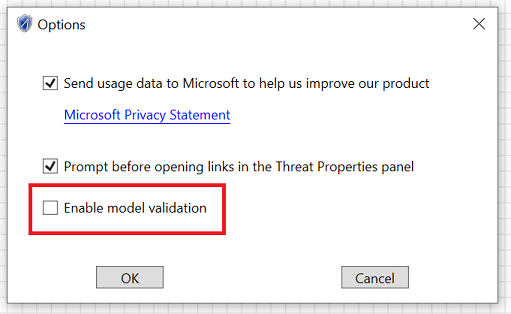

# Threat Modeling Tool update release 7.1.60126.1 - 1/29/2019

Version 7.1.60126.1 of the Microsoft Threat Modeling Tool was released on January 29 2019 and contains the following changes:

- The minimum required version of .NET has been increased to [.NET 4.7.1](https://go.microsoft.com/fwlink/?LinkId=863262).
- The minimum required version of Windows has been increased to [Windows 10 Anniversary Update](https://blogs.windows.com/windowsexperience/2016/08/02/how-to-get-the-windows-10-anniversary-update/#HTkoK5Zdv0g2F2Zq.97) due to the .NET dependency.
- A model validation toggle feature has been added to the tool's Options menu.
- Several links in the Threat Properties were updated.
- Minor UX changes to the tool's home screen.
- The Threat Modeling Tool now inherits the TLS settings of the host operating system and is supported in environments that require TLS 1.2 or greater.

## Feature changes

### Model validation option

Based on customer feedback, an option has been added to the tool to enable or disable the model validation. Previously, if your template used a single unidirectional data flow between two objects, you may have received an error message in the Messages frame stating: ObjectsName requires at least one 'Any'. Disabling model validation will prevent these warnings from showing in the view.

The option to toggle model validation on and off can be found in the File->Settings->Options menu. The default value for this setting is Disabled.

## System requirements

- Supported Operating Systems
  - [Microsoft Windows 10 Anniversary Update](https://blogs.windows.com/windowsexperience/2016/08/02/how-to-get-the-windows-10-anniversary-update/#HTkoK5Zdv0g2F2Zq.97) or later
- .NET Version Required
  - [.NET 4.7.1](https://go.microsoft.com/fwlink/?LinkId=863262) or later
- Additional Requirements
  - An Internet connection is required to receive updates to the tool as well as templates.

## Known issues

### Unsupported systems

#### Issue

Users of Windows 10 systems that are unable to install .NET 4.7.1 or later, such as Windows 10 Enterprise LTSB (version 1507), will be unable to open the tool after upgrading. These older versions of Windows are no longer supported platforms for the Threat Modeling Tool, and should not install the latest update.

#### Workaround

Users of Windows 10 Enterprise LTSB (version 1507) that have installed the latest update can revert to the previous version of the Threat Modeling Tool through the uninstall dialog in Apps & Features.

## Documentation and feedback

- Documentation for the Threat Modeling Tool is located on [docs.microsoft.com](threat-modeling-tool.md), and includes information [about using the tool](threat-modeling-tool-getting-started.md).

## Next steps

Download the latest version of the [Microsoft Threat Modeling Tool](https://aka.ms/threatmodelingtool).
