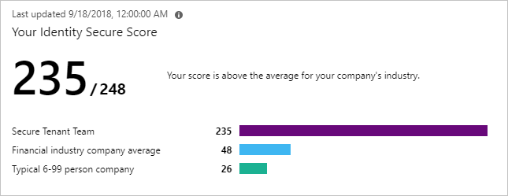
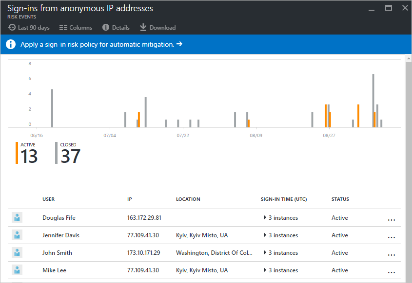
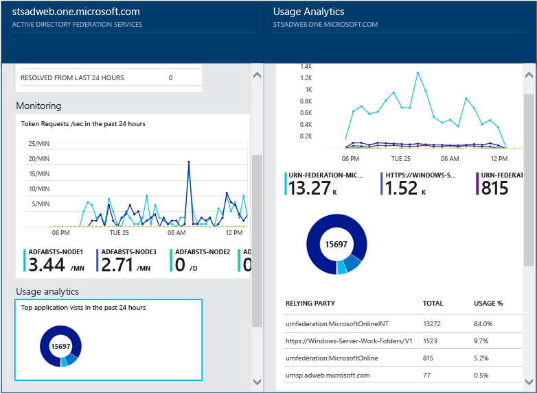

# Five steps to securing your identity infrastructure

If you're reading this document, you're aware of the significance of security. You likely already carry the responsibility for securing your organization. If you need to convince others of the importance of security, send them to read the latest [Microsoft Security Intelligence report](https://go.microsoft.com/fwlink/p/?linkid=2073747).

This document will help you get a more secure posture using the capabilities of Azure Active Directory by using a five-step checklist to inoculate your organization against cyber-attacks.

This checklist will help you quickly deploy critical recommended actions to protect your organization immediately by explaining how to:

* Strengthen your credentials.
* Reduce your attack surface area.
* Automate threat response.
* Increase your awareness of auditing and monitoring.
* Enable more predictable and complete end-user security with self-help.

Make sure you keep track of which features and steps are complete while reading this checklist.

> [!NOTE]
> Many of the recommendations in this document apply only to applications that are configured to use Azure Active Directory as their identity provider. Configuring apps for Single Sign-On assures the benefits of credential policies, threat detection, auditing, logging, and other features add to those applications. [Single sign-on through Azure Active Directory](../../active-directory/manage-apps/configure-single-sign-on-portal.md) is the foundation - on which all these recommendations are based.

The recommendations in this document are aligned with the [Identity Secure Score](../../active-directory/fundamentals/identity-secure-score.md), an automated assessment of your Azure AD tenant’s identity security configuration. Organizations can use the Identity Secure Score page in the Azure AD portal to find gaps in their current security configuration to ensure they follow current Microsoft [best practices](identity-management-best-practices.md) for security. Implementing each recommendation in the Secure Score page will increase your score and allow you to track your progress, plus help you compare your implementation against other similar size organizations or your industry.

> [!NOTE]
> Many of the features described here require an Azure AD Premium subscription, while some are free. Please review our [Azure Active Directory pricing](https://azure.microsoft.com/pricing/details/active-directory/) and [Azure AD Deployment checklist](https://docs.microsoft.com/azure/active-directory/fundamentals/active-directory-deployment-checklist-p2) for more information.

## Before you begin: Protect privileged accounts with MFA

Before you begin this checklist, make sure you don't get compromised while you're reading this checklist. You first need to protect your privileged accounts.

Attackers who get control of privileged accounts can do tremendous damage, so it's critical to protect these accounts first. Enable and require [Azure Multi-Factor Authentication](../../active-directory/authentication/multi-factor-authentication.md) (MFA) for all administrators in your organization using [Azure AD Security Defaults](../../active-directory/conditional-access/concept-conditional-access-security-defaults.md) or [Conditional Access](../../active-directory/conditional-access/plan-conditional-access.md). If you haven't implemented MFA, do it now! It's that important.

All set? Let's get started on the checklist.

## Step 1 - Strengthen your credentials 

Most enterprise security breaches originate with an account compromised with one of a handful of methods such as password spray, breach replay, or phishing. Learn more about these attacks in this video (45 min):
> [!VIDEO https://www.youtube.com/embed/uy0j1_t5Hd4]

### Make sure your organization uses strong authentication

Given the frequency of passwords being guessed, phished, stolen with malware, or reused, it's critical to back the password with some form of strong credential – learn more about [Azure Multi-Factor Authentication](../../active-directory/authentication/multi-factor-authentication.md).

To easily enable the basic level of identity security, you can use the one-click enablement with [Azure AD Security Defaults](../../active-directory/conditional-access/concept-conditional-access-security-defaults.md). Security defaults enforce Azure MFA for all users in a tenant and blocks sign-ins from legacy protocols tenant-wide.

### Start banning commonly attacked passwords and turn off traditional complexity, and expiration rules.

Many organizations use the traditional complexity (requiring special characters, numbers, uppercase, and lowercase) and password expiration rules. [Microsoft's research](https://aka.ms/passwordguidance) has shown these policies cause users to choose passwords that are easier to guess.

Azure AD's [dynamic banned password](../../active-directory/authentication/concept-password-ban-bad.md) feature uses current attacker behavior to prevent users from setting passwords that can easily be guessed. This capability is always on when users are created in the cloud, but is now also available for hybrid organizations when they deploy [Azure AD password protection for Windows Server Active Directory](../../active-directory/authentication/concept-password-ban-bad-on-premises.md). Azure AD password protection blocks users from choosing these common passwords and can be extended to block password containing custom keywords you specify. For example, you can prevent your users from choosing passwords containing your company’s product names or a local sport team.

Microsoft recommends adopting the following modern password policy based on [NIST guidance](https://pages.nist.gov/800-63-3/sp800-63b.html):

1. Require passwords have at least 8 characters. Longer isn't necessarily better, as they cause users to choose predictable passwords, save passwords in files, or write them down.
2. Disable expiration rules, which drive users to easily guessed passwords such as **Spring2019!**
3. Disable character-composition requirements and prevent users from choosing commonly attacked passwords, as they cause users to choose predictable character substitutions in passwords.

You can use [PowerShell to prevent passwords from expiring](../../active-directory/authentication/concept-sspr-policy.md) for users if you create identities in Azure AD directly. Hybrid organizations should implement these policies using [domain group policy settings](https://docs.microsoft.com/previous-versions/windows/it-pro/windows-server-2008-R2-and-2008/hh994572(v%3dws.10)) or [Windows PowerShell](https://docs.microsoft.com/powershell/module/addsadministration/set-addefaultdomainpasswordpolicy).

### Protect against leaked credentials and add resilience against outages

If your organization uses a hybrid identity solution with pass-through authentication or federation, then you should enable password hash sync for the following two reasons:

* The [Users with leaked credentials](../../active-directory/reports-monitoring/concept-risk-events.md) report in the Azure AD management warns you of username and password pairs, which have been exposed on the "dark web." An incredible volume of passwords is leaked via phishing, malware, and password reuse on third-party sites that are later breached. Microsoft finds many of these leaked credentials and will tell you, in this report, if they match credentials in your organization – but only if you [enable password hash sync](../../active-directory/hybrid/how-to-connect-password-hash-synchronization.md)!
* In the event of an on-premises outage (for example, in a ransomware attack) you can switch over to using [cloud authentication using password hash sync](choose-ad-authn.md). This backup authentication method will allow you to continue accessing apps configured for authentication with Azure Active Directory, including Office 365. In this case IT staff won't need to resort to personal email accounts to share data until the on-premises outage is resolved.

Learn more about how [password hash sync](../../active-directory/hybrid/how-to-connect-password-hash-synchronization.md) works.

> [!NOTE]
> If you enable password hash sync and are using Azure AD Domain services, Kerberos (AES 256) hashes and optionally NTLM (RC4, no salt) hashes will also be encrypted and synchronized to Azure AD. 

### Implement AD FS extranet smart lockout

Organizations, which configure applications to authenticate directly to Azure AD benefit from [Azure AD smart lockout](../../active-directory/authentication/concept-sspr-howitworks.md). If you use AD FS in Windows Server 2012R2, implement AD FS [extranet lockout protection](https://docs.microsoft.com/windows-server/identity/ad-fs/operations/configure-ad-fs-extranet-soft-lockout-protection). If you use AD FS on Windows Server 2016, implement [extranet smart lockout](https://support.microsoft.com/help/4096478/extranet-smart-lockout-feature-in-windows-server-2016). AD FS Smart Extranet lockout protects against brute force attacks, which target AD FS while preventing users from being locked out in Active Directory.

### Take advantage of intrinsically secure, easier to use credentials

Using [Windows Hello](https://docs.microsoft.com/windows/security/identity-protection/hello-for-business/hello-identity-verification), you can replace passwords with strong two-factor authentication on PCs and mobile devices. This authentication consists of a new type of user credential that is tied securely to a device and uses a biometric or PIN.

## Step 2 - Reduce your attack surface

Given the pervasiveness of password compromise, minimizing the attack surface in your organization is critical. Eliminating use of older, less secure protocols, limiting access entry points, and exercising more significant control of administrative access to resources can help reduce the attack surface area.

### Block legacy authentication

Apps using their own legacy methods to authenticate with Azure AD and access company data, pose another risk for organizations. Examples of apps using legacy authentication are POP3, IMAP4, or SMTP clients. Legacy authentication apps authenticate on behalf of the user and prevent Azure AD from doing advanced security evaluations. The alternative, modern authentication, will reduce your security risk, because it supports multi-factor authentication and Conditional Access. We recommend the following three actions:

1. Block [legacy authentication if you use AD FS](https://docs.microsoft.com/windows-server/identity/ad-fs/operations/access-control-policies-w2k12).
2. Setup [SharePoint Online and Exchange Online to use modern authentication](../../active-directory/conditional-access/conditional-access-for-exo-and-spo.md).
3. If you have Azure AD Premium, use [Conditional Access policies](../../active-directory/conditional-access/conditions.md) to block legacy authentication, otherwise use [Azure AD Security Defaults](../../active-directory/conditional-access/concept-conditional-access-security-defaults.md).

### Block invalid authentication entry points

Using the assume breach mentality, you should reduce the impact of compromised user credentials when they happen. For each app in your environment consider the valid use cases: which groups, which networks, which devices and other elements are authorized – then block the rest. With [Azure AD Conditional Access](../../active-directory/conditional-access/overview.md), you can control how authorized users access their apps and resources based on specific conditions you define.

### Block end-user consent

By default, all users in Azure AD are allowed to grant applications that leverage OAuth 2.0 and the Microsoft identity [consent framework](../../active-directory/develop/consent-framework.md) permissions to access company data. While consenting does allow users to easily acquire useful applications that integrate with Microsoft 365 and Azure, it can represent a risk if not used and monitored carefully. [Disabling all future user consent operations](../../active-directory/manage-apps/methods-for-removing-user-access.md) can help reduce your surface area and mitigate this risk. If end-user consent is disabled previous consent grants will still be honored, but all future consent operations must be performed by an administrator. Before disabling this functionality it's recommended to ensure that users will understand how to request admin approval for new applications; doing this should help reduce user friction, minimize support volume, and make sure users don't sign up for applications using non-Azure AD credentials.

### Implement Azure AD Privileged Identity Management

Another impact of "assume breach" is the need to minimize the likelihood a compromised account can operate with a privileged role. 

[Azure AD Privileged Identity Management (PIM)](../../active-directory/privileged-identity-management/pim-configure.md) helps you minimized account privileges by helping you:

* Identify and manage users assigned to administrative roles.
* Understand unused or excessive privilege roles you should remove.
* Establish rules to make sure privileged roles are protected by multi-factor authentication.
* Establish rules to make sure privileged roles are granted only long enough to accomplish the privileged task.

Enable Azure AD PIM, then view the users who are assigned administrative roles and remove unnecessary accounts in those roles. For remaining privileged users, move them from permanent to eligible. Finally, establish appropriate policies to make sure when they need to gain access to those privileged roles, they can do so securely, with the necessary change control.

As part of deploying your privileged account process, follow the [best practice to create at least two emergency accounts](../../active-directory/users-groups-roles/directory-admin-roles-secure.md) to make sure you have access to Azure AD if you lock yourself out.

## Step 3 - Automate threat response

Azure Active Directory has many capabilities that automatically intercept attacks, to remove the latency between detection and response. You can reduce the costs and risks, when you reduce the time criminals use to embed themselves into your environment. Here are the concrete steps you can take.

### Implement user risk security policy using Azure AD Identity Protection

User risk indicates the likelihood a user's identity has been compromised and is calculated based on the [user risk detections](../../active-directory/identity-protection/overview.md) that are associated with a user's identity. A user risk policy is a Conditional Access policy that evaluates the risk level to a specific user or group. Based on Low, Medium, High risk-level, a policy can be configured to block access or require a secure password change using multi-factor authentication. Microsoft's recommendation is to require a secure password change for users on high risk.

### Implement sign-in risk policy using Azure AD Identity Protection

Sign-in risk is the likelihood someone other than the account owner is attempting to sign on using the identity. A [sign-in risk policy](../../active-directory/identity-protection/overview.md) is a Conditional Access policy that evaluates the risk level to a specific user or group. Based on the risk level (high/medium/low), a policy can be configured to block access or force multi-factor authentication. Make sure you force multi-factor authentication on Medium or above risk sign-ins.

## Step 4 - Increase your awareness

Auditing and logging of security-related events and related alerts are essential components of an efficient protection strategy. Security logs and reports provide you with an electronic record of suspicious activities and help you detect patterns that may indicate attempted or successful external penetration of the network, and internal attacks. You can use auditing to monitor user activity, document regulatory compliance, do forensic analysis, and more. Alerts provide notifications of security events.

### Monitor Azure AD

Microsoft Azure services and features provide you with configurable security auditing and logging options to help you identify gaps in your security policies and mechanisms and address those gaps to help prevent breaches. You can use [Azure Logging and Auditing](log-audit.md) and use [Audit activity reports in the Azure Active Directory portal](../../active-directory/reports-monitoring/concept-audit-logs.md).

### Monitor Azure AD Connect Health in hybrid environments

[Monitoring AD FS with Azure AD Connect Health](../../active-directory/hybrid/how-to-connect-health-adfs.md) provides you with greater insight into potential issues and visibility of attacks on your AD FS infrastructure. Azure AD Connect Health delivers alerts with details, resolution steps, and links to related documentation; usage analytics for several metrics related to authentication traffic; performance monitoring and reports.

### Monitor Azure AD Identity Protection events

[Azure AD Identity Protection](../../active-directory/identity-protection/overview.md) is a notification, monitoring and reporting tool you can use to detect potential vulnerabilities affecting your organization's identities. It detects risk detections, such as leaked credentials, impossible travel, and sign-ins from infected devices, anonymous IP addresses, IP addresses associated with the suspicious activity, and unknown locations. Enable notification alerts to receive email of users at risk and/or a weekly digest email.

Azure AD Identity Protection provides two important reports you should monitor daily:
1. Risky sign-in reports will surface user sign-in activities you should investigate, the legitimate owner may not have performed the sign-in.
2. Risky user reports will surface user accounts that may have been compromised, such as leaked credential that was detected or the user signed in from different locations causing an impossible travel event. 

### Audit apps and consented permissions

Users can be tricked into navigating to a compromised web site or apps that will gain access to their profile information and user data, such as their email. A malicious actor can use the consented permissions it received to encrypt their mailbox content and demand a ransom to regain your mailbox data. [Administrators should review and audit](https://docs.microsoft.com/office365/securitycompliance/detect-and-remediate-illicit-consent-grants) the permissions given by users.

## Step 5 - Enable end-user self-service

As much as possible you'll want to balance security with productivity. Along the same lines of approaching your journey with the mindset that you're setting a foundation for security in the long run, you can remove friction from your organization by empowering your users while remaining vigilant.

### Implement self-service password reset

Azure AD's [self-service password reset (SSPR)](../../active-directory/authentication/quickstart-sspr.md) offers a simple means for IT administrators to allow users to reset or unlock their passwords or accounts without help desk or administrator intervention. The system includes detailed reporting that tracks when users have reset their passwords, along with notifications to alert you to misuse or abuse.

### Implement self-service group and application access

Azure AD provides the ability to non-administrators to manage access to resources, using security groups, Office 365 groups, application roles and access package catalogs.  [Self-service group management](../../active-directory/users-groups-roles/groups-self-service-management.md) enables group owners to manage their own groups, without needing to be assigned an administrative role. Users can also create and manage Office 365 groups without relying on administrators to handle their requests, and unused groups expire automatically.  [Azure AD entitlement management](../../active-directory/governance/entitlement-management-overview.md) further enables delegation and visibility, with comprehensive access request workflows and automatic expiration.  You can delegate to non-administrators the ability to configure their own access packages for groups, Teams, applications, and SharePoint Online sites they own, with custom policies for who is required to approve access, including configuring employee's managers and business partner sponsors as approvers.

### Implement Azure AD access reviews

With [Azure AD access reviews](../../active-directory/governance/access-reviews-overview.md), you can manage access package and group memberships, access to enterprise applications, and privileged role assignments to make sure you maintain a security standard.  Regular oversight by the users themselves, resource owners and other reviewers ensure that users don't retain access for extended periods of time when they no longer need it.

## Summary

There are many aspects to a secure Identity infrastructure, but this five-step checklist will help you quickly accomplish a safer and secure identity infrastructure:

* Strengthen your credentials.
* Reduce your attack surface area.
* Automate threat response.
* Increase your awareness of auditing and monitoring.
* Enable more predictable and complete end-user security with self-help.

We appreciate how seriously you take Identity Security and hope this document is a useful roadmap to a more secure posture for your organization.

## Next steps

If you need assistance to plan and deploy the recommendations, refer to the [Azure AD project deployment plans](https://aka.ms/deploymentplans) for help.

If you're confident all these steps are complete, use Microsoft’s [Identity Secure Score](../../active-directory/fundamentals/identity-secure-score.md), which will keep you up-to-date with the [latest best practices](identity-management-best-practices.md) and security threats.
