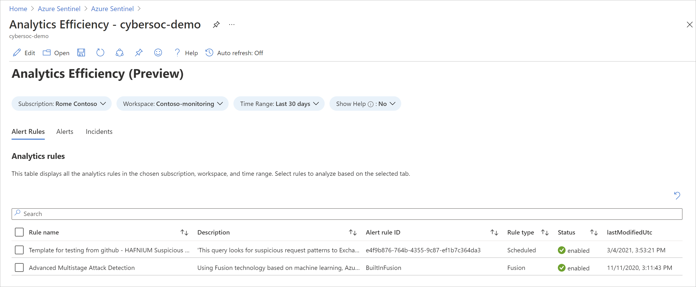
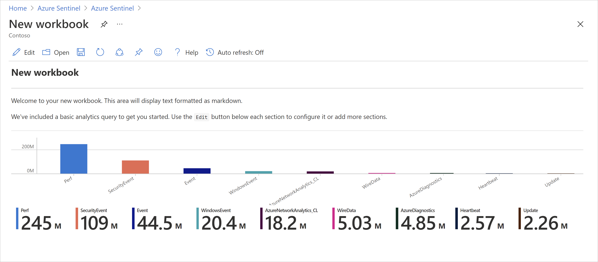
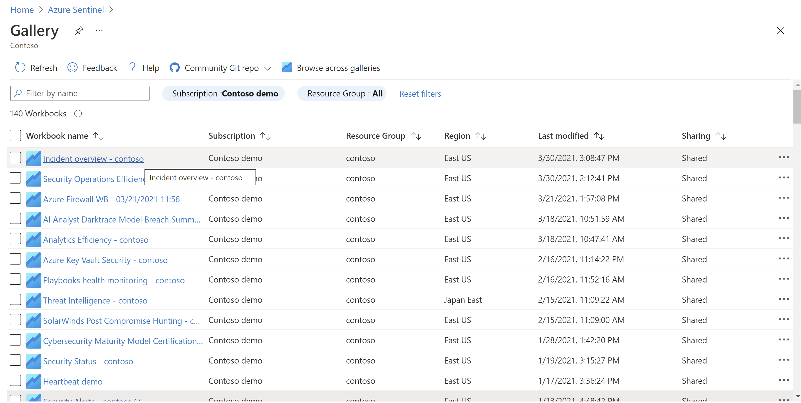
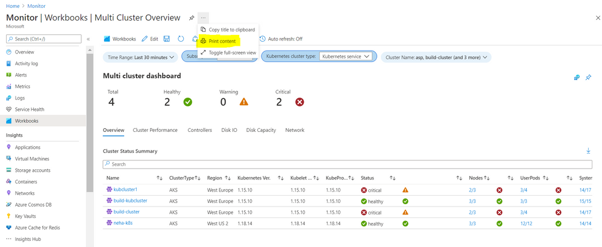

# Tutorial: Visualize and monitor your data

Once you have [connected your data sources](quickstart-onboard.md) to Azure Sentinel, you can visualize and monitor the data using the Azure Sentinel adoption of Azure Monitor Workbooks, which provides versatility in creating custom dashboards. While the Workbooks are displayed differently in Azure Sentinel, it may be useful for you to see how to [create interactive reports with Azure Monitor Workbooks](../azure-monitor/visualize/workbooks-overview.md). Azure Sentinel allows you to create custom workbooks across your data, and also comes with built-in workbook templates to allow you to quickly gain insights across your data as soon as you connect a data source.

This tutorial helps you visualize your data in Azure Sentinel.
> [!div class="checklist"]
> * Use built-in workbooks
> * Create new workbooks

## Prerequisites

You must have at least **Workbook reader** or **Workbook contributor** permissions on the resource group of the Azure Sentinel workspace.

> [!NOTE]
> The workbooks that you can see in Azure Sentinel are saved within the Azure Sentinel workspace's resource group and are tagged by the workspace in which they were created.

## Use built-in workbooks

1. Go to **Workbooks** and then select **Templates** to see the full list of Azure Sentinel built-in workbooks. 

    To see which are relevant to the data types you have connected, the **Required data types** field in each workbook will list the data type next to a green check mark if you already stream relevant data to Azure Sentinel.

    

1. Select **View template** to see the template populated with your data.

1. To edit the workbook, select **Save**, and then select the location where you want to save the JSON file for the template.

   > [!NOTE]
   > This creates an Azure resource based on the relevant template and saves the JSON file of the workbook and not the data.

1. Select **View saved workbook**. 

    

    Select the **Edit** button in the workbook toolbar to customize the workbook according to your needs. When you're done, select **Save** to save your changes.

    For more information, see how to [Create interactive reports with Azure Monitor Workbooks](../azure-monitor/visualize/workbooks-overview.md).

> [!TIP]
> To clone your workbook, select **Edit** and then **Save as**, making sure to save it with another name, under the same subscription and resource group.
> Cloned workbooks are displayed under the **My workbooks** tab.
>
## Create new workbook

1. Go to **Workbooks** and then select **Add workbook** to create a new workbook from scratch.

    

1. To edit the workbook, select **Edit**, and then add text, queries, and parameters as necessary. For more information on how to customize the workbook, see how to [Create interactive reports with Azure Monitor Workbooks](../azure-monitor/visualize/workbooks-overview.md). 

1. When building a query, make sure the **Data source** is set to **Logs** and **Resource type** is set to **Log Analytics**, and then choose the relevant workspace(s). 

1. After you create your workbook, save the workbook, making sure you save it under the subscription and resource group of your Azure Sentinel workspace.

1. If you want to let others in your organization use the workbook, under **Save to** select **Shared reports**. If you want this workbook to be available only to you, select **My reports**.

1. To switch between workbooks in your workspace, select **Open**  in the toolbar of any workbook. The screen switches to a list of other workbooks you can switch to.

    Select the workbook you want to open:

    

## Refresh your workbook data

Refresh your workbook to display updated data. In the toolbar, select one of the following options:

- :::image type="icon" source="media/whats-new/manual-refresh-button.png" border="false"::: **Refresh**, to manually refresh your workbook data.

- :::image type="icon" source="media/whats-new/auto-refresh-workbook.png" border="false"::: **Auto refresh**, to set your workbook to automatically refresh at a configured interval.

    - Supported auto refresh intervals range from **5 minutes** to **1 day**.

    - Auto refresh is paused while you're editing a workbook, and intervals are restarted each time you switch back to view mode from edit mode.

    - Auto refresh intervals are also restarted if you manually refresh your data.

    > [!TIP]
    > By default, auto refresh is turned off. To optimize performance, auto refresh is also turned off each time you close a workbook, and does not run in the background. Turn auto refresh back on as needed the next time you open the workbook.
    >

## Print a workbook or save as PDF

To print a workbook, or save it as a PDF, use the options menu to the right of the workbook title.

1. Select options > :::image type="icon" source="media/whats-new/print-icon.png" border="false"::: **Print content**. 
2. In the print screen, adjust your print settings as needed or select **Save as PDF** to save it locally.

For example:

## How to delete workbooks

To delete a saved workbook (either a saved template or a customized workbook), in the Workbooks page, select the saved workbook that you want to delete and select **Delete**. This will remove the saved workbook.

> [!NOTE]
> This removes the workbook resource as well as any changes you made to the template. The original template will remain available.

## Next steps

In this tutorial, you learned how to visualize your data in Azure Sentinel, using Azure Workbooks.

To learn how to automate your responses to threats, see [Set up automated threat responses in Azure Sentinel](tutorial-respond-threats-playbook.md).
