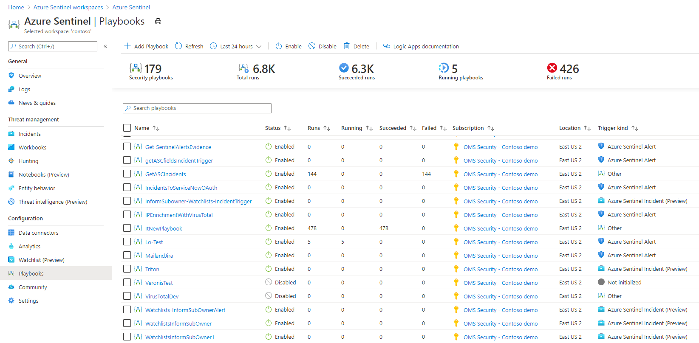
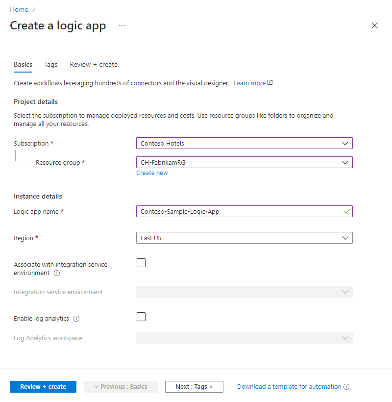

# Tutorial: Set up automated threat responses in Azure Sentinel

This tutorial helps you to use security playbooks in Azure Sentinel to set automated threat responses to security-related issues detected by Azure Sentinel.

> [!div class="checklist"]
> * Understand playbooks
> * Create a playbook
> * Run a playbook
> * Automate threat responses

## What is a security playbook in Azure Sentinel?

A security playbook is a collection of procedures that can be run from Azure Sentinel in response to an alert. A security playbook can help automate and orchestrate your response, and can be run manually or set to run automatically when specific alerts are triggered. Security playbooks in Azure Sentinel are based on [Azure Logic Apps](../logic-apps/logic-apps-overview.md), which means that you get all the power, customizability, and built-in templates of Logic Apps. Each playbook is created for the specific subscription you choose, but when you look at the Playbooks page, you will see all the playbooks across any selected subscriptions.

> [!NOTE]
> Playbooks leverage Azure Logic Apps, therefore charges apply. Visit [Azure Logic Apps](https://azure.microsoft.com/pricing/details/logic-apps/) pricing page for more details.

For example, if you're worried about malicious attackers accessing your network resources, you can set an alert that looks for malicious IP addresses accessing your network. Then, you can create a playbook that does the following:
1. When the alert is triggered, open a ticket in ServiceNow or any other IT ticketing system.
2. Send a message to your security operations channel in Microsoft Teams or Slack to make sure your security analysts are aware of the incident.
3. Send all the information in the alert to your senior network admin and security admin. The email message also includes two user option buttons **Block** or **Ignore**.
4. The playbook continues to run after a response is received from the admins.
5. If the admins choose **Block**, the IP address is blocked in the firewall and the user is disabled in Azure AD.
6. If the admins choose **Ignore**, the alert is closed in Azure Sentinel and the incident is closed in ServiceNow.

Security playbooks can be run either manually or automatically. Running them manually means that when you get an alert, you can choose to run a playbook on-demand as a response to the selected alert. Running them automatically means that while authoring the correlation rule, you set it to automatically run one or more playbooks when the alert is triggered.

## Create a security playbook

Follow these steps to create a new security playbook in Azure Sentinel:

1. Open the **Azure Sentinel** dashboard.
2. Under **Configuration**, select **Playbooks**.

   

3. In the **Azure Sentinel - Playbooks** page, click **Add** button.

    

4. In the **Create Logic app** page, type the requested information to create your new logic app, and click **Create**. 

5. In the [**Logic App Designer**](../logic-apps/logic-apps-overview.md), select the template you want to use. If you select a template that necessitates credentials, you will have to provide them. Alternatively, you can create a new blank playbook from scratch. Select **Blank Logic App**. 

   

6. You are taken to the Logic App Designer where you can either build new or edit the template. For more information on creating a playbook with [Logic Apps](../logic-apps/logic-apps-create-logic-apps-from-templates.md).

7. If you are creating a blank playbook, in the **Search all connectors and triggers** field, type *Azure Sentinel*, and select **When a response to an Azure Sentinel alert is triggered**.  After it is created, the new playbook appears in the **Playbooks** list. If it doesn’t appear, click **Refresh**.

1. Use the **Get entities** functions, which enable you to get the relevant entities from inside the **Entities** list, such as accounts, IP addresses and hosts. This will enable you to run actions on specific entities.

7. Now you can define what happens when you trigger the playbook. You can add an action, logical condition, switch case conditions, or loops.

   

## How to run a security playbook

You can run a playbook on demand.

To run a playbook on-demand:

1. In the **incidents** page, select an incident and click on **View full details**.

2. In the **Alerts** tab, click on the alert you want to run the playbook on, and scroll all the way to the right and click **View playbooks** and select a playbook to **run** from the list of available playbooks on the subscription. 

## Automate threat responses

SIEM/SOC teams can be inundated with security alerts on a regular basis. The volume of alerts generated is so huge, that available security admins are overwhelmed. This results all too often in situations where many alerts can't be investigated, leaving the organization vulnerable to attacks that go unnoticed. 

Many, if not most, of these alerts conform to recurring patterns that can be addressed by specific and defined remediation actions. Azure Sentinel already enables you to define your remediation in playbooks. It is also possible to set real-time automation as part of your playbook definition to enable you to fully automate a defined response to particular security alerts. Using real-time automation, response teams can significantly reduce their workload by fully automating the routine responses to recurring types of alerts, allowing you to concentrate more on unique alerts, analyzing patterns, threat hunting, and more.

To automate responses:

1. Select the alert for which you want to automate the response.
1. In the **Edit alert rule** page, under **Real-time automation**, choose the **Triggered playbook** you want to run when this alert rule is matched.
1. Select **Save**.

   

## Next steps

In this tutorial, you learned how to run a playbook in Azure Sentinel. Continue to the [how to proactively hunt for threats](hunting.md) using Azure Sentinel.