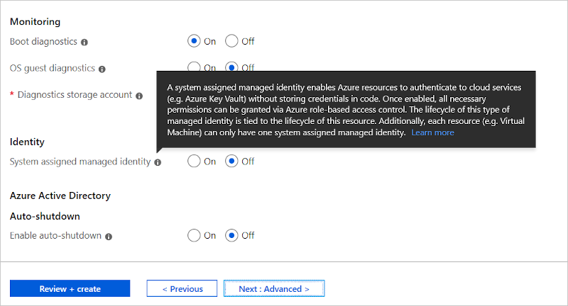
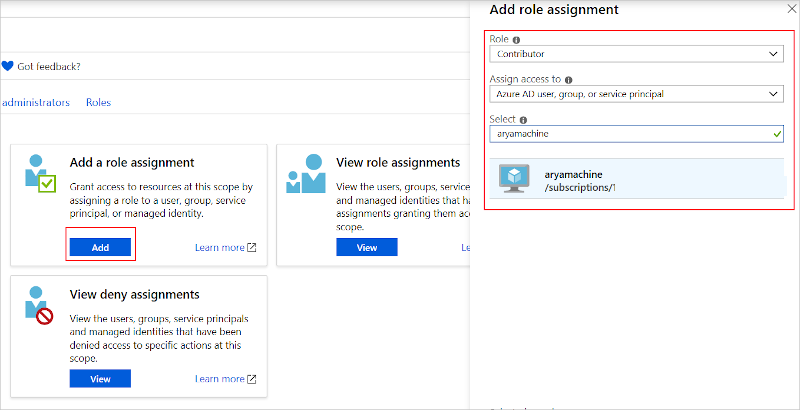

# Configure repository credentials for your application to download container images

Configure container registry authentication by adding `RepositoryCredentials` to the `ContainerHostPolicies` section of your application manifest. Add the account and password for your container registry (*myregistry.azurecr.io* in the example below), which allows the service to download the container image from the repository.

```xml
<ServiceManifestImport>
    ...
    <Policies>
        <ContainerHostPolicies CodePackageRef="Code">
            <RepositoryCredentials AccountName="myregistry" Password="=P==/==/=8=/=+u4lyOB=+=nWzEeRfF=" PasswordEncrypted="false"/>
            <PortBinding ContainerPort="80" EndpointRef="Guest1TypeEndpoint"/>
        </ContainerHostPolicies>
    </Policies>
    ...
</ServiceManifestImport>
```

It is recommended that you encrypt the repository password by using an encipherment certificate that's deployed to all nodes of the cluster. When Service Fabric deploys the service package to the cluster, the encipherment certificate is used to decrypt the cipher text. The Invoke-ServiceFabricEncryptText cmdlet is used to create the cipher text for the password, which is added to the ApplicationManifest.xml file.
See [Secret Management](service-fabric-application-secret-management.md) for more on certificates and encryption semantics.

## Configure cluster-wide credentials

Service Fabric allows you to configure cluster-wide credentials which can be used as default repository credentials by applications.

This feature can be enabled or disabled by adding the `UseDefaultRepositoryCredentials` attribute to `ContainerHostPolicies` in ApplicationManifest.xml with a `true` or `false` value.

```xml
<ServiceManifestImport>
    ...
    <Policies>
        <ContainerHostPolicies CodePackageRef="Code" UseDefaultRepositoryCredentials="true">
            <PortBinding ContainerPort="80" EndpointRef="Guest1TypeEndpoint"/>
        </ContainerHostPolicies>
    </Policies>
    ...
</ServiceManifestImport>
```

Service Fabric then uses the default repository credentials which can be specified in the ClusterManifest under the `Hosting` section.  If `UseDefaultRepositoryCredentials` is `true`, Service Fabric reads the following values from the ClusterManifest:

* DefaultContainerRepositoryAccountName (string)
* DefaultContainerRepositoryPassword (string)
* IsDefaultContainerRepositoryPasswordEncrypted (bool)
* DefaultContainerRepositoryPasswordType (string)

Here is an example of what can be added inside the `Hosting` section in the ClusterManifestTemplate.json file. The `Hosting` section can be added at cluster creation or later in a configuration upgrade. For more information, see [Change Azure Service Fabric cluster settings](service-fabric-cluster-fabric-settings.md) and [Manage Azure Service Fabric application secrets](service-fabric-application-secret-management.md)

```json
"fabricSettings": [
	...,
	{
        "name": "Hosting",
        "parameters": [
          {
            "name": "EndpointProviderEnabled",
            "value": "true"
          },
          {
            "name": "DefaultContainerRepositoryAccountName",
            "value": "someusername"
          },
          {
            "name": "DefaultContainerRepositoryPassword",
            "value": "somepassword"
          },
          {
            "name": "IsDefaultContainerRepositoryPasswordEncrypted",
            "value": "false"
          },
          {
            "name": "DefaultContainerRepositoryPasswordType",
            "value": "PlainText"
          }
        ]
      },
]
```

## Use tokens as registry credentials

Service Fabric supports using tokens as credentials to download images for your containers.  This feature leverages the *managed identity* of the underlying virtual machine scale set to authenticate to the registry, eliminating the need for managing user credentials.  See [Managed identities for Azure resources](../active-directory/managed-identities-azure-resources/overview.md) for more info.  Using this feature requires the follows steps:

1. Ensure that *System Assigned Managed Identity* is enabled for the VM.

    

> [!NOTE]
> For user-assigned managed identity, skip this step. The remaining steps below will work the same, as long as the scale set is only associated with a single user-assigned managed identity.

2. Grant permissions to the virtual machine scale set to pull/read images from the registry. From the Access Control (IAM) blade of your Azure Container Registry in the Azure portal, add a *role assignment* for your virtual machine:

    

3. Next, modify your application manifest. In the `ContainerHostPolicies` section, add the attribute `‘UseTokenAuthenticationCredentials=”true”`.

    ```xml
      <ServiceManifestImport>
          <ServiceManifestRef ServiceManifestName="NodeServicePackage" ServiceManifestVersion="1.0"/>
      <Policies>
        <ContainerHostPolicies CodePackageRef="NodeService.Code" Isolation="process" UseTokenAuthenticationCredentials="true">
          <PortBinding ContainerPort="8905" EndpointRef="Endpoint1"/>
        </ContainerHostPolicies>
        <ResourceGovernancePolicy CodePackageRef="NodeService.Code" MemoryInMB="256"/>
      </Policies>
      </ServiceManifestImport>
    ```

    > [!NOTE]
    > The flag `UseDefaultRepositoryCredentials` set to true while `UseTokenAuthenticationCredentials` is true will cause an error during deployment.

## Next steps

* See more about [Container registry authentication](../container-registry/container-registry-authentication.md).
