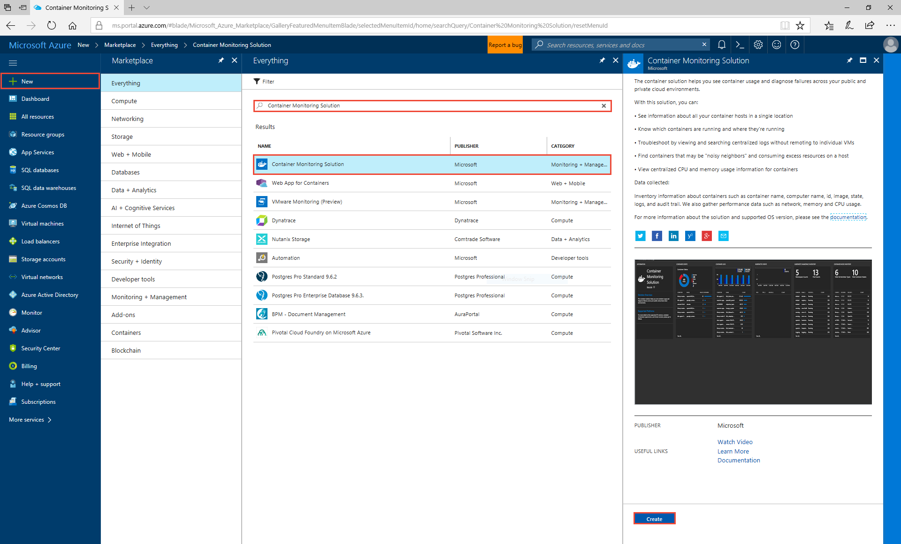

# Monitor containers with Azure Monitor logs
 
This article covers the steps required to set up the Azure Monitor logs container monitoring solution to view container events. To set up your cluster to collect container events, see this [step-by-step tutorial](service-fabric-tutorial-monitoring-wincontainers.md). 

[!INCLUDE [log-analytics-agent-note.md](../../includes/log-analytics-agent-note.md)]

[!INCLUDE [azure-monitor-log-analytics-rebrand](../../includes/azure-monitor-log-analytics-rebrand.md)]

## Set up the container monitoring solution

> [!NOTE]
> You need to have Azure Monitor logs set up for your cluster as well as have the Log Analytics agent deployed on your nodes. If you don't, follow the steps in [Set up Azure Monitor logs](service-fabric-diagnostics-oms-setup.md) and [Add the Log Analytics agent to a cluster](service-fabric-diagnostics-oms-agent.md) first.

1. Once your cluster is set up with Azure Monitor logs and the Log Analytics agent, deploy your containers. Wait for your containers to be deployed before moving to the next step.

2. In Azure Marketplace, search for *Container Monitoring Solution* and click on the **Container Monitoring Solution** resource that shows up under the Monitoring + Management category.

    

3. Create the solution inside the same workspace that has already been created for the cluster. This change automatically triggers the agent to start gathering docker data on the containers. In about 15 minutes or so, you should see the solution light up with incoming logs and stats, as shown in the image below.

    

The agent enables the collection of several container-specific logs that can be queried in Azure Monitor logs, or used to visualize performance indicators. The log types that are collected are:

* ContainerInventory: shows information about container location, name, and images
* ContainerImageInventory: information about deployed images, including IDs or sizes
* ContainerLog: specific error logs, docker logs (stdout, etc.), and other entries
* ContainerServiceLog: docker daemon commands that have been run
* Perf: performance counters including container cpu, memory, network traffic, disk i/o, and custom metrics from the host machines

## Next steps
* Learn more about [Azure Monitor logs Containers solution](../azure-monitor/insights/containers.md).
* Read more about container orchestration on Service Fabric - [Service Fabric and containers](service-fabric-containers-overview.md)
* Get familiarized with the [log search and querying](../log-analytics/log-analytics-log-searches.md) features offered as part of Azure Monitor logs
* Configure Azure Monitor logs to set up [automated alerting](../log-analytics/log-analytics-alerts.md) rules to aid in detecting and diagnostics