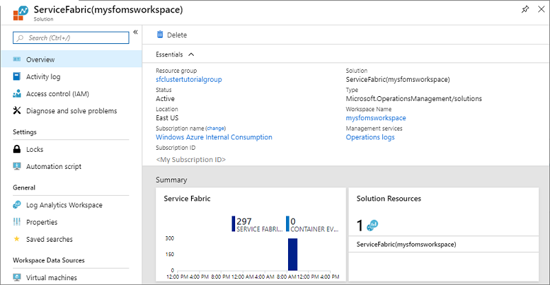
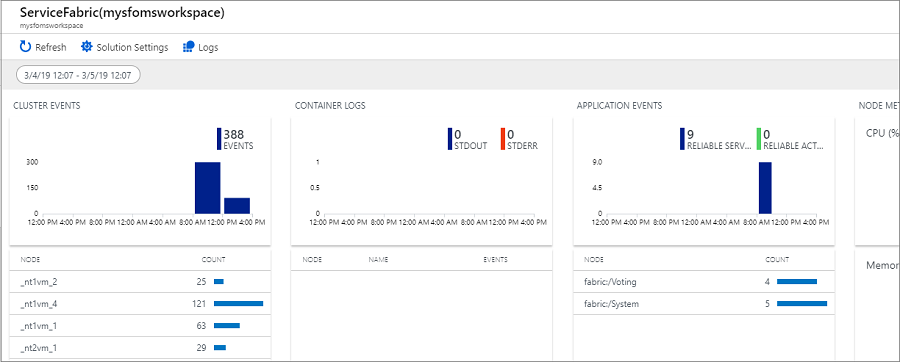
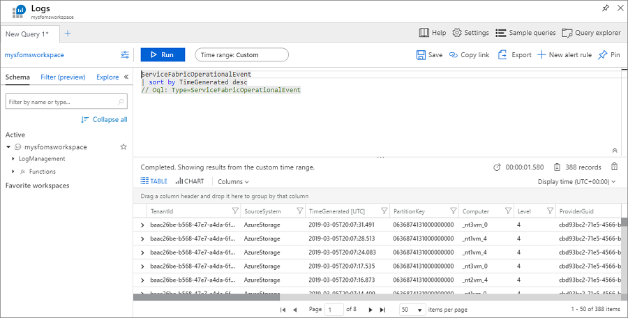
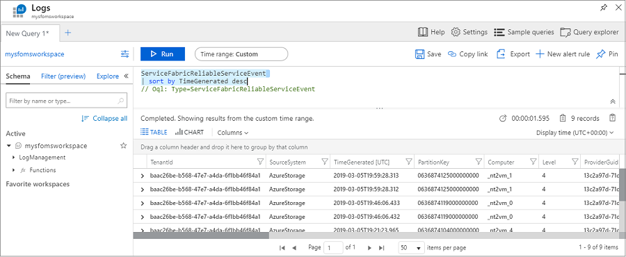

# Tutorial: Monitor a Service Fabric cluster in Azure

Monitoring and diagnostics are critical to developing, testing, and deploying workloads in any cloud environment. This tutorial is part two of a series, and shows you how to monitor and diagnose a Service Fabric cluster using events, performance counters, and health reports.   For more information, read the overview about [cluster monitoring](service-fabric-diagnostics-overview.md#platform-cluster-monitoring) and [infrastructure monitoring](service-fabric-diagnostics-overview.md#infrastructure-performance-monitoring).

In this tutorial, you learn how to:

> [!div class="checklist"]
> * View Service Fabric events
> * Query EventStore APIs for cluster events
> * Monitor infrastructure/collect perf counters
> * View cluster health reports

In this tutorial series you learn how to:
> [!div class="checklist"]
> * Create a secure [Windows cluster](service-fabric-tutorial-create-vnet-and-windows-cluster.md) on Azure using a template
> * Monitor a cluster
> * [Scale a cluster in or out](service-fabric-tutorial-scale-cluster.md)
> * [Upgrade the runtime of a cluster](service-fabric-tutorial-upgrade-cluster.md)
> * [Delete a cluster](service-fabric-tutorial-delete-cluster.md)


[!INCLUDE [updated-for-az](../../includes/updated-for-az.md)]

## Prerequisites

Before you begin this tutorial:

* If you don't have an Azure subscription, create a [free account](https://azure.microsoft.com/free/?WT.mc_id=A261C142F)
* Install [Azure PowerShell](/powershell/azure/install-az-ps) or [Azure CLI](/cli/azure/install-azure-cli).
* Create a secure [Windows cluster](service-fabric-tutorial-create-vnet-and-windows-cluster.md) 
* Setup [diagnostics collection](service-fabric-tutorial-create-vnet-and-windows-cluster.md#configurediagnostics_anchor) for the cluster
* Enable the [EventStore service](service-fabric-tutorial-create-vnet-and-windows-cluster.md#configureeventstore_anchor) in the cluster
* Configure [Azure Monitor logs and the Log Analytics agent](service-fabric-tutorial-create-vnet-and-windows-cluster.md#configureloganalytics_anchor) for the cluster

## View Service Fabric events using Azure Monitor logs

Azure Monitor logs collects and analyzes telemetry from applications and services hosted in the cloud and provides analysis tools to help you maximize their availability and performance. You can run queries in Azure Monitor logs to gain insights and troubleshoot what is happening in your cluster.

To access the Service Fabric Analytics solution, go to the [Azure portal](https://portal.azure.com) and select the resource group in which you created the Service Fabric Analytics solution.

Select the resource **ServiceFabric(mysfomsworkspace)**.

In **Overview** you see tiles in the form of a graph for each of the solutions enabled, including one for Service Fabric. Click the **Service Fabric** graph to continue to the Service Fabric Analytics solution.



The following image shows the home page of the Service Fabric Analytics solution. This home page provides a snapshot view of what's happening in your cluster.



 If you enabled diagnostics upon cluster creation, you can see events for 

* [Service Fabric cluster events](service-fabric-diagnostics-event-generation-operational.md)
* [Reliable Actors programming model events](service-fabric-reliable-actors-diagnostics.md)
* [Reliable Services programming model events](service-fabric-reliable-services-diagnostics.md)

>[!NOTE]
>In addition to the Service Fabric events out of the box, more detailed system events can be collected by [updating the config of your diagnostics extension](service-fabric-diagnostics-event-aggregation-wad.md#log-collection-configurations).

### View Service Fabric Events, including actions on nodes

On the Service Fabric Analytics page, click on the graph for **Cluster Events**.  The logs for all the system events that have been collected appear. For reference, these are from the **WADServiceFabricSystemEventsTable** in the Azure Storage account, and similarly the reliable services and actors events you see next are from those respective tables.
    


The query uses the Kusto query language, which you can modify to refine what you're looking for. For example, to find all actions taken on nodes in the cluster, you can use the following query. The event IDs used below are found in the [operational channel events reference](service-fabric-diagnostics-event-generation-operational.md).

```kusto
ServiceFabricOperationalEvent
| where EventId < 25627 and EventId > 25619 
```

The Kusto query language is powerful. Here are some other useful queries.

Create a *ServiceFabricEvent* lookup table as user-defined function by saving the query as a function with alias ServiceFabricEvent:

```kusto
let ServiceFabricEvent = datatable(EventId: int, EventName: string)
[
    ...
    18603, 'NodeUpOperational',
    18604, 'NodeDownOperational',
    ...
];
ServiceFabricEvent
```

Return operational events recorded in the last hour:
```kusto
ServiceFabricOperationalEvent
| where TimeGenerated > ago(1h)
| join kind=leftouter ServiceFabricEvent on EventId
| project EventId, EventName, TaskName, Computer, ApplicationName, EventMessage, TimeGenerated
| sort by TimeGenerated
```

Return operational events with EventId == 18604 and EventName == 'NodeDownOperational':
```kusto
ServiceFabricOperationalEvent
| where EventId == 18604
| project EventId, EventName = 'NodeDownOperational', TaskName, Computer, EventMessage, TimeGenerated
| sort by TimeGenerated 
```

Return operational events with EventId == 18604 and EventName == 'NodeUpOperational':
```kusto
ServiceFabricOperationalEvent
| where EventId == 18603
| project EventId, EventName = 'NodeUpOperational', TaskName, Computer, EventMessage, TimeGenerated
| sort by TimeGenerated 
``` 

Returns Health Reports with HealthState == 3 (Error) and extract additional properties from the EventMessage field:

```kusto
ServiceFabricOperationalEvent
| join kind=leftouter ServiceFabricEvent on EventId
| extend HealthStateId = extract(@"HealthState=(\S+) ", 1, EventMessage, typeof(int))
| where TaskName == 'HM' and HealthStateId == 3
| extend SourceId = extract(@"SourceId=(\S+) ", 1, EventMessage, typeof(string)),
         Property = extract(@"Property=(\S+) ", 1, EventMessage, typeof(string)),
         HealthState = case(HealthStateId == 0, 'Invalid', HealthStateId == 1, 'Ok', HealthStateId == 2, 'Warning', HealthStateId == 3, 'Error', 'Unknown'),
         TTL = extract(@"TTL=(\S+) ", 1, EventMessage, typeof(string)),
         SequenceNumber = extract(@"SequenceNumber=(\S+) ", 1, EventMessage, typeof(string)),
         Description = extract(@"Description='([\S\s, ^']+)' ", 1, EventMessage, typeof(string)),
         RemoveWhenExpired = extract(@"RemoveWhenExpired=(\S+) ", 1, EventMessage, typeof(bool)),
         SourceUTCTimestamp = extract(@"SourceUTCTimestamp=(\S+)", 1, EventMessage, typeof(datetime)),
         ApplicationName = extract(@"ApplicationName=(\S+) ", 1, EventMessage, typeof(string)),
         ServiceManifest = extract(@"ServiceManifest=(\S+) ", 1, EventMessage, typeof(string)),
         InstanceId = extract(@"InstanceId=(\S+) ", 1, EventMessage, typeof(string)),
         ServicePackageActivationId = extract(@"ServicePackageActivationId=(\S+) ", 1, EventMessage, typeof(string)),
         NodeName = extract(@"NodeName=(\S+) ", 1, EventMessage, typeof(string)),
         Partition = extract(@"Partition=(\S+) ", 1, EventMessage, typeof(string)),
         StatelessInstance = extract(@"StatelessInstance=(\S+) ", 1, EventMessage, typeof(string)),
         StatefulReplica = extract(@"StatefulReplica=(\S+) ", 1, EventMessage, typeof(string))
```

Return a time chart of events with EventId != 17523:

```kusto
ServiceFabricOperationalEvent
| join kind=leftouter ServiceFabricEvent on EventId
| where EventId != 17523
| summarize Count = count() by Timestamp = bin(TimeGenerated, 1h), strcat(tostring(EventId), " - ", case(EventName != "", EventName, "Unknown"))
| render timechart 
```

Get Service Fabric operational events aggregated with the specific service and node:

```kusto
ServiceFabricOperationalEvent
| where ApplicationName  != "" and ServiceName != ""
| summarize AggregatedValue = count() by ApplicationName, ServiceName, Computer 
```

Render the count of Service Fabric events by EventId / EventName using a cross-resource query:

```kusto
app('PlunkoServiceFabricCluster').traces
| where customDimensions.ProviderName == 'Microsoft-ServiceFabric'
| extend EventId = toint(customDimensions.EventId), TaskName = tostring(customDimensions.TaskName)
| where EventId != 17523
| join kind=leftouter ServiceFabricEvent on EventId
| extend EventName = case(EventName != '', EventName, 'Undocumented')
| summarize ["Event Count"]= count() by bin(timestamp, 30m), EventName = strcat(tostring(EventId), " - ", EventName)
| render timechart
```

### View Service Fabric application events

You can view events for the reliable services and reliable actors applications deployed on the cluster.  On the Service Fabric Analytics page, click the graph for **Application Events**.

Run the following query to view events from your reliable services applications:
```kusto
ServiceFabricReliableServiceEvent
| sort by TimeGenerated desc
```

You can see different events for when the service `runasync` is started and completed which typically happens on deployments and upgrades.



You can also find events for the reliable service with ServiceName == "fabric:/Watchdog/WatchdogService":

```kusto
ServiceFabricReliableServiceEvent
| where ServiceName == "fabric:/Watchdog/WatchdogService"
| project TimeGenerated, EventMessage
| order by TimeGenerated desc  
```
 
Reliable actor events can be viewed in a similar fashion:

```kusto
ServiceFabricReliableActorEvent
| sort by TimeGenerated desc
```
To configure more detailed events for reliable actors, you can change the `scheduledTransferKeywordFilter` in the config for the diagnostic extension in the cluster template. Details on the values for these are in the [reliable actors events reference](service-fabric-reliable-actors-diagnostics.md#keywords).

```json
"EtwEventSourceProviderConfiguration": [
                {
                    "provider": "Microsoft-ServiceFabric-Actors",
                    "scheduledTransferKeywordFilter": "1",
                    "scheduledTransferPeriod": "PT5M",
                    "DefaultEvents": {
                    "eventDestination": "ServiceFabricReliableActorEventTable"
                    }
                },
```

## View performance counters with Azure Monitor logs
To view performance counters, go to the [Azure portal](https://portal.azure.com) and the resource group in which you created the Service Fabric Analytics solution. 

Select the resource **ServiceFabric(mysfomsworkspace)**, then **Log Analytics Workspace**, and then **Advanced Settings**.

Click **Data**, then click **Windows Performance Counters**. There is a list of default counters you can choose to enable and you can set the interval for collection too. You can also add [additional performance counters](service-fabric-diagnostics-event-generation-perf.md) to collect. The proper format is referenced in this [article](/windows/desktop/PerfCtrs/specifying-a-counter-path). Click **Save**, then click **OK**.

Close the Advanced Settings blade and select **Workspace summary** under the **General** heading. For each of the solutions enabled there is a graphical tile, including one for Service Fabric. Click the **Service Fabric** graph to continue to the Service Fabric Analytics solution.

There are graphical tiles for operational channel and reliable services events. The graphical representation of the data flowing in for the counters you have selected will appear under **Node Metrics**. 

Select the **Container Metric** graph to see additional details. You can also query on performance counter data similarly to cluster events and filter on the nodes, perf counter name, and values using the Kusto query language.

## Query the EventStore service
The [EventStore service](service-fabric-diagnostics-eventstore.md) provides a way to understand the state of your cluster or workloads at a given point in time. The EventStore is a stateful Service Fabric service that maintains events from the cluster. The events are exposed through the [Service Fabric Explorer](service-fabric-visualizing-your-cluster.md), REST, and APIs. EventStore queries the cluster directly to get diagnostics data on any entity in your cluster
To see a full list of events available in the EventStore, see [Service Fabric events](service-fabric-diagnostics-event-generation-operational.md).

The EventStore APIs can be queried programmatically using the [Service Fabric client library](/dotnet/api/overview/azure/service-fabric?view=azure-dotnet#client-library).

Here is an example request for all cluster events between 2018-04-03T18:00:00Z and 2018-04-04T18:00:00Z, via the GetClusterEventListAsync function.

```csharp
var sfhttpClient = ServiceFabricClientFactory.Create(clusterUrl, settings);

var clstrEvents = sfhttpClient.EventsStore.GetClusterEventListAsync(
    "2018-04-03T18:00:00Z",
    "2018-04-04T18:00:00Z")
    .GetAwaiter()
    .GetResult()
    .ToList();
```

Here is another example that queries for the cluster health and all node events in September 2018 and prints them out.

```csharp
const int timeoutSecs = 60;
var clusterUrl = new Uri(@"http://localhost:19080"); // This example is for a Local cluster
var sfhttpClient = ServiceFabricClientFactory.Create(clusterUrl);

var clusterHealth = sfhttpClient.Cluster.GetClusterHealthAsync().GetAwaiter().GetResult();
Console.WriteLine("Cluster Health: {0}", clusterHealth.AggregatedHealthState.Value.ToString());


Console.WriteLine("Querying for node events...");
var nodesEvents = sfhttpClient.EventsStore.GetNodesEventListAsync(
    "2018-09-01T00:00:00Z",
    "2018-09-30T23:59:59Z",
    timeoutSecs,
    "NodeDown,NodeUp")
    .GetAwaiter()
    .GetResult()
    .ToList();
Console.WriteLine("Result Count: {0}", nodesEvents.Count());

foreach (var nodeEvent in nodesEvents)
{
    Console.Write("Node event happened at {0}, Node name: {1} ", nodeEvent.TimeStamp, nodeEvent.NodeName);
    if (nodeEvent is NodeDownEvent)
    {
        var nodeDownEvent = nodeEvent as NodeDownEvent;
        Console.WriteLine("(Node is down, and it was last up at {0})", nodeDownEvent.LastNodeUpAt);
    }
    else if (nodeEvent is NodeUpEvent)
    {
        var nodeUpEvent = nodeEvent as NodeUpEvent;
        Console.WriteLine("(Node is up, and it was last down at {0})", nodeUpEvent.LastNodeDownAt);
    }
}
```


## Monitor cluster health
Service Fabric introduces a [health model](service-fabric-health-introduction.md) with health entities on which system components and watchdogs can report local conditions that they are monitoring. The [health store](service-fabric-health-introduction.md#health-store) aggregates all health data to determine whether entities are healthy.

The cluster is automatically populated with health reports sent by the system components. Read more at [Use system health reports to troubleshoot](service-fabric-understand-and-troubleshoot-with-system-health-reports.md).

Service Fabric exposes health queries for each of the supported [entity types](service-fabric-health-introduction.md#health-entities-and-hierarchy). They can be accessed through the API, using methods on [FabricClient.HealthManager](/dotnet/api/system.fabric.fabricclient.healthmanager?view=azure-dotnet), PowerShell cmdlets, and REST. These queries return complete health information about the entity: the aggregated health state, entity health events, child health states (when applicable), unhealthy evaluations (when the entity is not healthy), and children health statistics (when applicable).

### Get cluster health
The [Get-ServiceFabricClusterHealth cmdlet](/powershell/module/servicefabric/get-servicefabricclusterhealth) returns the health of the cluster entity and contains the health states of applications and nodes (children of the cluster).  First, connect to the cluster using the [Connect-ServiceFabricCluster cmdlet](/powershell/module/servicefabric/connect-servicefabriccluster?view=azureservicefabricps).

The state of the cluster is 11 nodes, the system application, and fabric:/Voting configured as described.

The following example gets cluster health by using default health policies. The 11 nodes are healthy but the cluster aggregated health state is Error because the fabric:/Voting application is in Error. Note how the unhealthy evaluations provide details on the conditions that triggered the aggregated health.

```powershell
Get-ServiceFabricClusterHealth

AggregatedHealthState   : Error
UnhealthyEvaluations    : 
                          100% (1/1) applications are unhealthy. The evaluation tolerates 0% unhealthy applications.
                          
                          Application 'fabric:/Voting' is in Error.
                          
                          	33% (1/3) deployed applications are unhealthy. The evaluation tolerates 0% unhealthy deployed applications.
                          
                          	Deployed application on node '_nt2vm_3' is in Error.
                          
                          		50% (1/2) deployed service packages are unhealthy.
                          
                          		Service package for manifest 'VotingWebPkg' and service package activation ID '8723eb73-9b83-406b-9de3-172142ba15f3' is in Error.
                          
                          			'System.Hosting' reported Error for property 'CodePackageActivation:Code:SetupEntryPoint:131959376195593305'.
                          			There was an error during CodePackage activation.The service host terminated with exit code:1
                          
                          
NodeHealthStates        : 
                          NodeName              : _nt2vm_3
                          AggregatedHealthState : Ok
                          
                          NodeName              : _nt1vm_4
                          AggregatedHealthState : Ok
                          
                          NodeName              : _nt2vm_2
                          AggregatedHealthState : Ok
                          
                          NodeName              : _nt1vm_3
                          AggregatedHealthState : Ok
                          
                          NodeName              : _nt2vm_1
                          AggregatedHealthState : Ok
                          
                          NodeName              : _nt1vm_2
                          AggregatedHealthState : Ok
                          
                          NodeName              : _nt2vm_0
                          AggregatedHealthState : Ok
                          
                          NodeName              : _nt1vm_1
                          AggregatedHealthState : Ok
                          
                          NodeName              : _nt1vm_0
                          AggregatedHealthState : Ok
                          
                          NodeName              : _nt3vm_0
                          AggregatedHealthState : Ok
                          
                          NodeName              : _nt2vm_4
                          AggregatedHealthState : Ok
                          
ApplicationHealthStates : 
                          ApplicationName       : fabric:/System
                          AggregatedHealthState : Ok
                          
                          ApplicationName       : fabric:/Voting
                          AggregatedHealthState : Error
                          
HealthEvents            : None
HealthStatistics        : 
                          Node                  : 11 Ok, 0 Warning, 0 Error
                          Replica               : 4 Ok, 0 Warning, 0 Error
                          Partition             : 2 Ok, 0 Warning, 0 Error
                          Service               : 2 Ok, 0 Warning, 0 Error
                          DeployedServicePackage : 3 Ok, 1 Warning, 1 Error
                          DeployedApplication   : 1 Ok, 1 Warning, 1 Error
                          Application           : 0 Ok, 0 Warning, 1 Error
```

The following example gets the health of the cluster by using a custom application policy. It filters results to get only applications and nodes in error or warning. In this example no nodes are returned, as they are all healthy. Only the fabric:/Voting application respects the applications filter. Because the custom policy specifies to consider warnings as errors for the fabric:/Voting application, the application is evaluated as in error and so is the cluster.

```powershell
$appHealthPolicy = New-Object -TypeName System.Fabric.Health.ApplicationHealthPolicy
$appHealthPolicy.ConsiderWarningAsError = $true
$appHealthPolicyMap = New-Object -TypeName System.Fabric.Health.ApplicationHealthPolicyMap
$appUri1 = New-Object -TypeName System.Uri -ArgumentList "fabric:/Voting"
$appHealthPolicyMap.Add($appUri1, $appHealthPolicy)
Get-ServiceFabricClusterHealth -ApplicationHealthPolicyMap $appHealthPolicyMap -ApplicationsFilter "Warning,Error" -NodesFilter "Warning,Error" -ExcludeHealthStatistics

AggregatedHealthState   : Error
UnhealthyEvaluations    : 
                          100% (1/1) applications are unhealthy. The evaluation tolerates 0% unhealthy applications.
                          
                          Application 'fabric:/Voting' is in Error.
                          
                          	100% (5/5) deployed applications are unhealthy. The evaluation tolerates 0% unhealthy deployed applications.
                          
                          	Deployed application on node '_nt2vm_3' is in Error.
                          
                          		50% (1/2) deployed service packages are unhealthy.
                          
                          		Service package for manifest 'VotingWebPkg' and service package activation ID '8723eb73-9b83-406b-9de3-172142ba15f3' is in Error.
                          
                          			'System.Hosting' reported Error for property 'CodePackageActivation:Code:SetupEntryPoint:131959376195593305'.
                          			There was an error during CodePackage activation.The service host terminated with exit code:1
                          
                          	Deployed application on node '_nt2vm_2' is in Error.
                          
                          		50% (1/2) deployed service packages are unhealthy.
                          
                          		Service package for manifest 'VotingWebPkg' and service package activation ID '2466f2f9-d5fd-410c-a6a4-5b1e00630cca' is in Error.
                          
                          			'System.Hosting' reported Error for property 'CodePackageActivation:Code:SetupEntryPoint:131959376486201388'.
                          			There was an error during CodePackage activation.The service host terminated with exit code:1
                          
                          	Deployed application on node '_nt2vm_4' is in Error.
                          
                          		100% (1/1) deployed service packages are unhealthy.
                          
                          		Service package for manifest 'VotingWebPkg' and service package activation ID '5faa5201-eede-400a-865f-07f7f886aa32' is in Error.
                          
                          			'System.Hosting' reported Warning for property 'CodePackageActivation:Code:SetupEntryPoint:131959376207396204'. The evaluation treats 
                          Warning as Error.
                          			There was an error during CodePackage activation.The service host terminated with exit code:1
                          
                          	Deployed application on node '_nt2vm_0' is in Error.
                          
                          		100% (1/1) deployed service packages are unhealthy.
                          
                          		Service package for manifest 'VotingWebPkg' and service package activation ID '204f1783-f774-4f3a-b371-d9983afaf059' is in Error.
                          
                          			'System.Hosting' reported Error for property 'CodePackageActivation:Code:SetupEntryPoint:131959375885791093'.
                          			There was an error during CodePackage activation.The service host terminated with exit code:1
                          
                          	Deployed application on node '_nt3vm_0' is in Error.
                          
                          		50% (1/2) deployed service packages are unhealthy.
                          
                          		Service package for manifest 'VotingWebPkg' and service package activation ID '2533ae95-2d2a-4f8b-beef-41e13e4c0081' is in Error.
                          
                          			'System.Hosting' reported Error for property 'CodePackageActivation:Code:SetupEntryPoint:131959376108346272'.
                          			There was an error during CodePackage activation.The service host terminated with exit code:1                         
                          
NodeHealthStates        : None
ApplicationHealthStates : 
                          ApplicationName       : fabric:/Voting
                          AggregatedHealthState : Error
                          
HealthEvents            : None
```

### Get node health
The [Get-ServiceFabricNodeHealth cmdlet](/powershell/module/servicefabric/get-servicefabricnodehealth) returns the health of a node entity and contains the health events reported on the node. First, connect to the cluster by using the [Connect-ServiceFabricCluster cmdlet](/powershell/module/servicefabric/connect-servicefabriccluster?view=azureservicefabricps). The following example gets the health of a specific node by using default health policies:

```powershell
Get-ServiceFabricNodeHealth _nt1vm_3
```

The following example gets the health of all nodes in the cluster:
```powershell
Get-ServiceFabricNode | Get-ServiceFabricNodeHealth | select NodeName, AggregatedHealthState | ft -AutoSize
```

### Get system service health 

Get the aggregated health of the system services:

```powershell
Get-ServiceFabricService -ApplicationName fabric:/System | Get-ServiceFabricServiceHealth | select ServiceName, AggregatedHealthState | ft -AutoSize
```

## Next steps

In this tutorial, you learned how to:

> [!div class="checklist"]
> * View Service Fabric events
> * Query EventStore APIs for cluster events
> * Monitor infrastructure/collect perf counters
> * View cluster health reports

Next, advance to the following tutorial to learn how to scale a cluster.
> [!div class="nextstepaction"]
> [Scale a cluster](service-fabric-tutorial-scale-cluster.md)

[durability]: service-fabric-cluster-capacity.md#durability-characteristics-of-the-cluster
[template]: https://github.com/Azure-Samples/service-fabric-cluster-templates/blob/master/7-VM-Windows-3-NodeTypes-Secure-NSG/AzureDeploy.json
