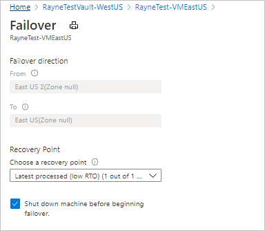
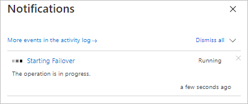
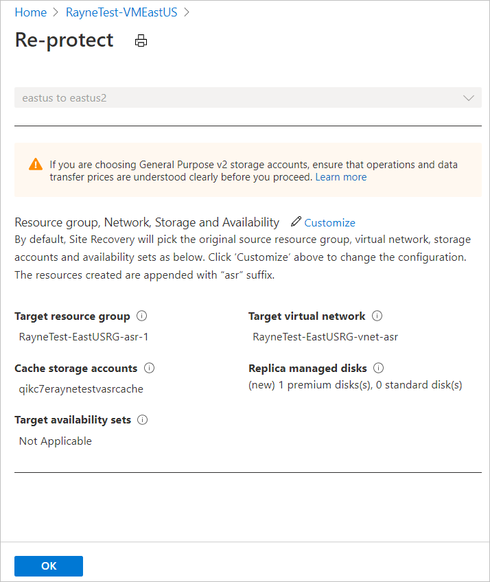
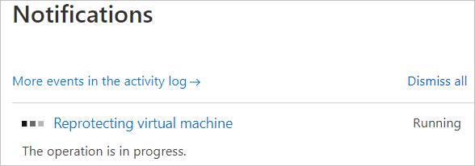

# Tutorial: Fail back Azure VM to the primary region

After failing over an Azure VM to a secondary Azure region, follow this tutorial to fail the VM to the primary Azure region, using [Azure Site Recovery](site-recovery-overview.md).  In this article, you learn how to:

> [!div class="checklist"]
> 
> * Review the prerequisites.
> * Fail back the VM in the secondary region.
> * Reprotect primary VMs back to the secondary region.
> 
> [!NOTE]
> This tutorial shows you how to fail back with minimal steps. If you want to run a failover with full settings, learn about Azure VM [networking](azure-to-azure-about-networking.md), [automation](azure-to-azure-powershell.md), and [troubleshooting](azure-to-azure-troubleshoot-errors.md).

## Prerequisites

Before you start this tutorial, you should have:

1. [Set up replication](azure-to-azure-tutorial-enable-replication.md) for at least one Azure VM, and tried out a [disaster recovery drill](azure-to-azure-tutorial-dr-drill.md) for it.
2. [Failed over the VM](azure-to-azure-tutorial-failover-failback.md) from the primary region to a secondary region, and reprotected it so that it replicates from the secondary region to the primary. 
3. Check that the primary region is available, and that you're able to create and access new resources in it.

## Fail back to the primary region

After VMs are reprotected, you can fail back to the primary region as needed.

1. In the vault > **Replicated items**, select the VM.

2. On the VM overview page, check that the VM is healthy, and that synchronization is complete, before you run a failover. The VM should be in a *Protected* state.

    

3. On the overview page, select **Failover**. Since we're not doing a test failover this time, we're prompted to verify.

    [Page showing we agree to run failover without a test failover](./media/azure-to-azure-tutorial-failback/no-test.png)

4. In **Failover**, note the direction from secondary to primary, and select a recovery point. The Azure VM in the target (primary region) is created using data from this point.
   - **Latest processed**: Uses the latest recovery point processed by Site Recovery. The time stamp is shown. No time is spent processing data, so it provides a low recovery time objective (RTO).
   -  **Latest**: Processes all the data sent to Site Recovery, to create a recovery point for each VM before failing over to it. Provides the lowest recovery point objective (RPO), because all data is replicated to Site Recovery when the failover is triggered.
   - **Latest app-consistent**: This option fails over VMs to the latest app-consistent recovery point. The time stamp is shown.
   - **Custom**: Fail over to particular recovery point. Custom is only available when you fail over a single VM, and don't use a recovery plan.

    > [!NOTE]
    > If you fail over a VM to which you added a disk after you enabled replication for the VM, replication points will show the disks available for recovery. For example, a replication point that was created before you added a second disk will show as "1 of 2 disks".

4. Select **Shut down machine before beginning failover** if you want Site Recovery to attempt to shut down the source VMs before starting failover. Shutdown helps to ensure no data loss. Failover continues even if shutdown fails. 

        

3. To start the failover, select **OK**.
4. Monitor the failover in notifications.

      
       

## Reprotect VMs

After failing back VMs to the primary region, you need to reprotect them, so that they start replicating to the secondary region again.

1. In the **Overview** page for the VM, select **Re-protect**.

      

2. Review the target settings for the primary region. Resources marked as new are created by Site Recovery as part of the reprotect operation.
3. Select **OK** to start the reprotect process. The process sends initial data to the target location, and then replicates delta information for the VMs to the target.

      

4. Monitor reprotect progress in notifications. 

    
    [Reprotect progress notification](./media/azure-to-azure-tutorial-failback/notification-reprotect-finish.png)
    
  

## Clean up resources

For VMs with managed disks, after failback is complete and VMs are reprotected for replication from primary to secondary, Site Recovery automatically cleans up machines in the secondary disaster recovery region. You don't need to manually delete VMs and NICs in the secondary region. VMs with unmanaged disks aren't cleaned up.

If you completely disable replication after failing back, Site Recovery cleans up machines protected by it. In this case, it also cleans up disks for VMs that don't use managed disks. 
 
## Next steps

In this tutorial, you failed VMs back from the secondary region to the primary. This is the last step in the process that includes enabling replication for a VM, trying out a disaster recovery drill, failing over from the primary region to the secondary, and finally failing back.

> [!div class="nextstepaction"]
> Now, try out disaster recovery to Azure for an [on-premises VM](vmware-azure-tutorial-prepare-on-premises.md)

