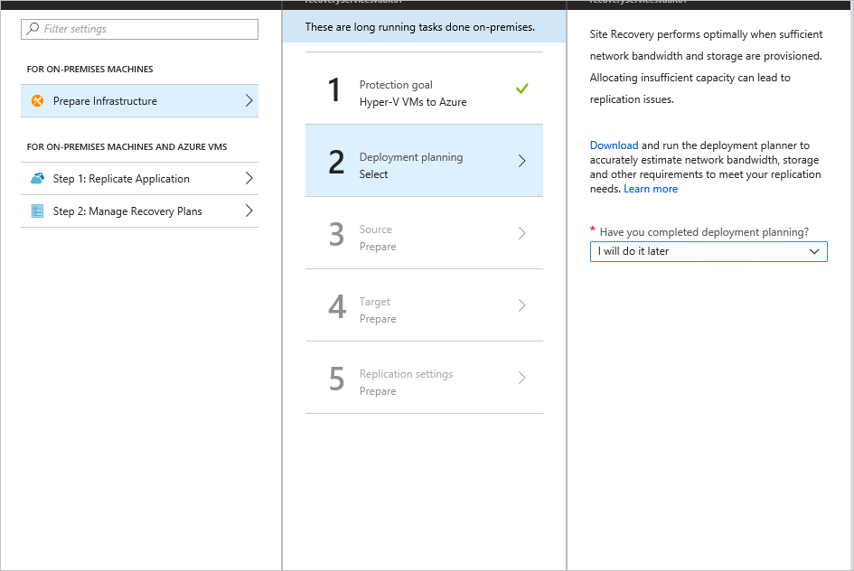
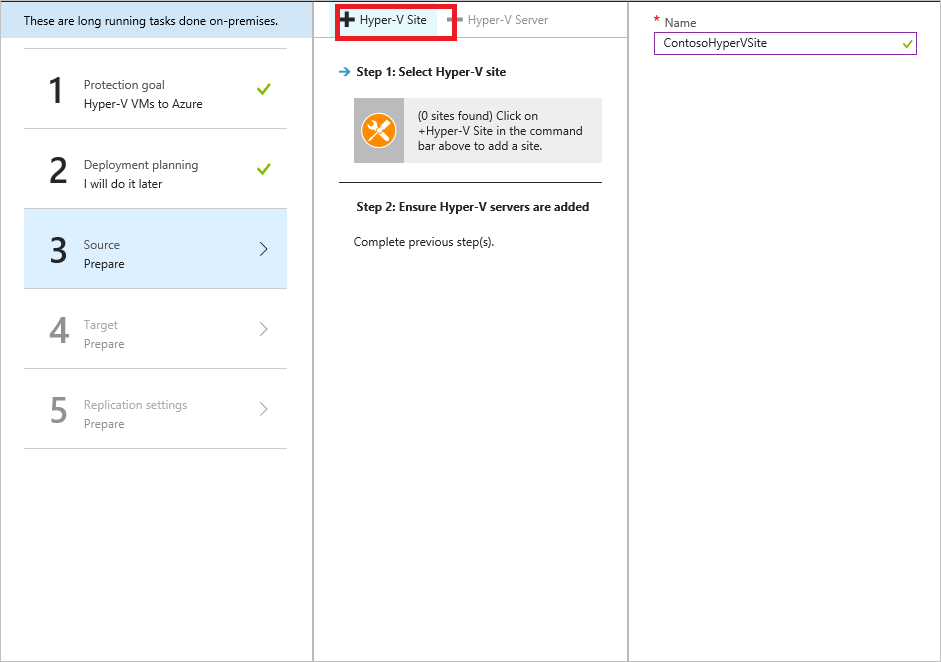
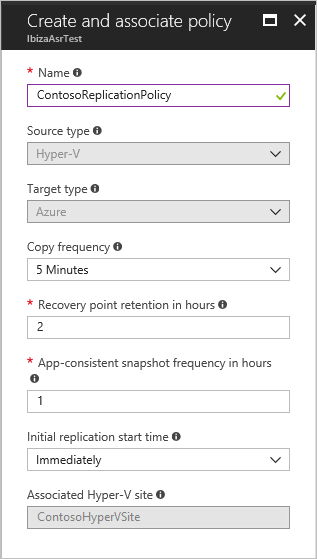

# Set up disaster recovery of on-premises Hyper-V VMs to Azure

The [Azure Site Recovery](site-recovery-overview.md) service contributes to your disaster-recovery strategy by managing and orchestrating replication, failover, and failback of on-premises machines and Azure virtual machines (VMs).

This is the third tutorial in a series. It shows you how to set up disaster recovery of on-premises Hyper-V VMs to Azure. This tutorial applies Hyper-V VMs that are not managed by Microsoft System Center Virtual Machine Manager (VMM).

In this tutorial, you learn how to:

> [!div class="checklist"]
> * Select your replication source and target.
> * Set up the source replication environment, including on-premises Site Recovery components and the target replication environment.
> * Create a replication policy.
> * Enable replication for a VM.

> [!NOTE]
> Tutorials show you the simplest deployment path for a scenario. They use default options where possible, and don't show all possible settings and paths. For detailed instructions, review the articles in the **How-to Guides** section of the [Site Recovery documentation](./index.yml).


## Before you begin

This is the third tutorial in a series. It assumes that you have already completed the tasks in the previous tutorials:

1. [Prepare Azure](tutorial-prepare-azure.md)
2. [Prepare on-premises Hyper-V](./hyper-v-prepare-on-premises-tutorial.md)

## Select a replication goal

1. In the Azure portal, go to **Recovery Services vaults** and select the vault. We prepared the vault **ContosoVMVault** in the previous tutorial.
2. In **Getting Started**, select **Site Recovery**, and then select **Prepare Infrastructure**.
3. In **Protection goal** > **Where are your machines located?**, select **On-premises**.
4. In **Where do you want to replicate your machines?**, select **To Azure**.
5. In **Are your machines virtualized?**, select **Yes, with Hyper-V**.
6. In **Are you using System Center VMM to manage your Hyper-V hosts?**, select **No**.
7. Select **OK**.

    

## Confirm deployment planning

1. In **Deployment planning**, if you're planning a large deployment, download the Deployment Planner for Hyper-V from the link on the page. [Learn more](hyper-v-deployment-planner-overview.md) about Hyper-V deployment planning.
2. For this tutorial, we don't need the Deployment Planner. In **Have you completed deployment planning?**, select **I will do it later**, and then select **OK**.

    

## Set up the source environment

To set up the source environment, you create a Hyper-V site and add to that site the Hyper-V hosts containing VMs that you want to replicate. Then, you download and install the Azure Site Recovery Provider and the Azure Recovery Services agent on each host, and register the Hyper-V site in the vault.

1. Under **Prepare Infrastructure**, select **Source**.
2. In **Prepare source**, select **+ Hyper-V Site**.
3. In **Create Hyper-V site**, specify the site name. We're using **ContosoHyperVSite**.

    

4. After the site is created, in **Prepare source** > **Step 1: Select Hyper-V site**, select the site you created.
5. Select **+ Hyper-V Server**.

    

6. Download the installer for the Microsoft Azure Site Recovery Provider.
7. Download the vault registration key. You need this key to install the Provider. The key is valid for five days after you generate it.

    
    

### Install the Provider

Install the downloaded setup file (AzureSiteRecoveryProvider.exe) on each Hyper-V host that you want to add to the Hyper-V site. Setup installs the Azure Site Recovery Provider and Recovery Services agent on each Hyper-V host.

1. Run the setup file.
2. In the Azure Site Recovery Provider Setup wizard > **Microsoft Update**, opt in to use Microsoft Update to check for Provider updates.
3. In **Installation**, accept the default installation location for the Provider and agent, and select **Install**.
4. After installation, in the Microsoft Azure Site Recovery Registration Wizard > **Vault Settings**, select **Browse**, and in **Key File**, select the vault key file that you downloaded.
5. Specify the Azure Site Recovery subscription, the vault name (**ContosoVMVault**), and the Hyper-V site (**ContosoHyperVSite**) to which the Hyper-V server belongs.
6. In **Proxy Settings**, select **Connect directly to Azure Site Recovery without a proxy**.
7. In **Registration**, after the server is registered in the vault, select **Finish**.

Metadata from the Hyper-V server is retrieved by Azure Site Recovery, and the server is displayed in **Site Recovery Infrastructure** > **Hyper-V Hosts**. This process can take up to 30 minutes.

#### Install the Provider on a Hyper-V core server

If you're running a Hyper-V core server, download the setup file and follow these steps:

1. Extract the files from AzureSiteRecoveryProvider.exe to a local directory by running this command:

    `AzureSiteRecoveryProvider.exe /x:. /q`
 
2. Run `.\setupdr.exe /i`. Results are logged to %Programdata%\ASRLogs\DRASetupWizard.log.

3. Register the server by running this command:

    ```
    cd  "C:\Program Files\Microsoft Azure Site Recovery Provider\DRConfigurator.exe" /r /Friendlyname "FriendlyName of the Server" /Credentials "path to where the credential file is saved"
    ```

## Set up the target environment

Select and verify target resources:

1. Select **Prepare infrastructure** > **Target**.
2. Select the subscription and the resource group **ContosoRG** in which the Azure VMs will be created after failover.
3. Select the **Resource Manager"** deployment model.

Site Recovery checks that you have one or more compatible Azure storage accounts and networks.

## Set up a replication policy

1. Select **Prepare infrastructure** > **Replication Settings** > **+Create and associate**.
2. In **Create and associate policy**, specify a policy name. We're using **ContosoReplicationPolicy**.
3. For this tutorial, we'll leave the default settings:
    - **Copy frequency** indicates how often delta data (after initial replication) will replicate. The default frequency is every five minutes.
    - **Recovery point retention** indicates that recovery points will be retained for two hours. The maximum allowed value for retention when protecting virtual machines hosted on Hyper-V hosts is 24 hours.
    - **App-consistent snapshot frequency** indicates that recovery points containing app-consistent snapshots will be created every hour.
    - **Initial replication start time** indicates that initial replication will start immediately.
4. After the policy is created, select **OK**. When you create a new policy, it's automatically associated with the specified Hyper-V site. In our tutorial, that's **ContosoHyperVSite**.

    

## Enable replication

1. In **Replicate application**, select **Source**.
2. In **Source**, select the **ContosoHyperVSite** site. Then, select **OK**.
3. In **Target**, verify the target (Azure), the vault subscription, and the **Resource Manager** deployment model.
4. If you're using tutorial settings, select the **contosovmsacct1910171607** storage account created in the previous tutorial for replicated data. Also select the **ContosoASRnet** network, in which Azure VMs will be located after failover.
5. In **Virtual machines** > **Select**, select the VM that you want to replicate. Then, select **OK**.

   You can track progress of the **Enable Protection** action in **Jobs** > **Site Recovery jobs**. After the **Finalize Protection** job finishes, the initial replication is complete, and the VM is ready for failover.

## Next steps
> [!div class="nextstepaction"]
> [Run a disaster recovery drill](tutorial-dr-drill-azure.md)
