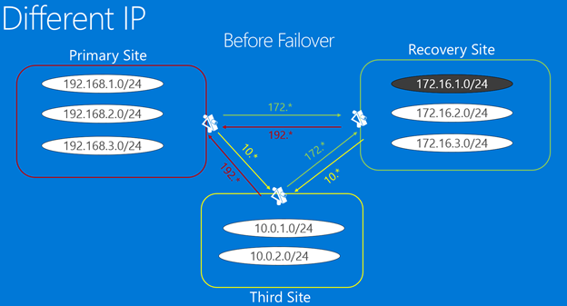
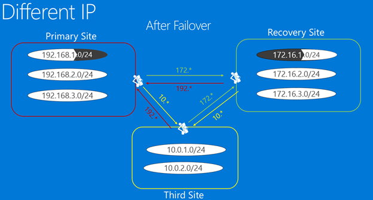

# Set up IP addressing to connect to a secondary on-premises site after failover

After you fail over Hyper-V VMs in System Center Virtual Machine Manager (VMM) clouds to a secondary site, you need to be able connect to the replica VMs. This article helps you to do this. 

## Connection options

After failover, there are a couple of ways to handle IP addressing for replica VMs: 

- **Retain the same IP address after failover**: In this scenario, the replicated VM has the same IP address as the primary VM. This simplifies network related issues after failover, but requires some infrastructure work.
- **Use a different IP address after failover**: In this scenario the VM gets a new IP address after failover. 
 

## Retain the IP address

If you want to retain the IP addresses from the primary site, after failover to the secondary site, you can:

- Deploy a stretched subnet between the primary and the secondary sites.
- Perform a full subnet failover from the primary to secondary site. You need to update routes to indicate the new location of the IP addresses.


### Deploy a stretched subnet

In a stretched configuration, the subnet is available simultaneously in both the primary and secondary sites. In a stretched subnet, when you move a machine and its IP (Layer 3) address configuration to the secondary site, the network automatically routes the traffic to the new location. 

- From a Layer 2 (data link layer) perspective, you need networking equipment that can manage a stretched VLAN.
- By stretching the VLAN, the potential fault domain extends to both sites. This becomes a single point of failure. While unlikely, in such a scenario you might not be able to isolate an incident such as a broadcast storm. 


### Fail over a subnet

You can fail over the entire subnet to obtain the benefits of the stretched subnet, without actually stretching it. In this solution, a subnet is available in the source or target site, but not in both simultaneously.

- To maintain the IP address space in the event of a failover, you can programmatically arrange for the router infrastructure to move subnets from one site to another.
- When a failover occurs, subnets move with their associated VMs.
- The main drawback of this approach is that in the event of a failure, you have to move the entire subnet.

#### Example

Here's an example of complete subnet failover. 

- Before failover, the primary site has applications running in subnet 192.168.1.0/24.
- During failover, all of the VMs in this subnet are failed over to the secondary site, and retain their IP addresses. 
- Routes between all sites need to be modified to reflect the fact that all the VMs in subnet 192.168.1.0/24 have now moved to the secondary site.

The following graphics illustrate the subnets before and after failover.


**Before failover**


**After failover**


After failover, Site Recovery allocates an IP address for each network interface on the VM. The address is allocated from the static IP address pool in the relevant network, for each VM instance.

- If the IP address pool in the secondary site is the same as that on the source site, Site Recovery allocates the same IP address (of the source VM), to the replica VM. The IP address is reserved in VMM, but it isn't set as the failover IP address on the Hyper-V host. The failover IP address on a Hyper-v host is set just before the failover.
- If the same IP address isn't available, Site Recovery allocates another available IP address from the pool.
- If VMs use DHCP, Site Recovery doesn't manage the IP addresses. You need to check that the DHCP server on the secondary site can allocate addresses from the same range as the source site.

### Validate the IP address

After you enable protection for a VM, you can use following sample script to verify the address assigned to the VM. This IP address is set as the failover IP address, and assigned to the VM at the time of failover:

```powershell
$vm = Get-SCVirtualMachine -Name <VM_NAME>
$na = $vm[0].VirtualNetworkAdapters>
$ip = Get-SCIPAddress -GrantToObjectID $na[0].id
$ip.address
```

## Use a different IP address

In this scenario, the IP addresses of VMs that fail over are changed. The drawback of this solution is the maintenance required.  DNS and cache entries might need to be updated. This can result in downtime, which can be mitigated as follows:

- Use low TTL values for intranet applications.
- Use the following script in a Site Recovery recovery plan, for a timely update of the DNS server. You don't need the script if you use dynamic DNS registration.

    ```powershell
    param(
    string]$Zone,
    [string]$name,
    [string]$IP
    )
    $Record = Get-DnsServerResourceRecord -ZoneName $zone -Name $name
    $newrecord = $record.clone()
    $newrecord.RecordData[0].IPv4Address  =  $IP
    Set-DnsServerResourceRecord -zonename $zone -OldInputObject $record -NewInputObject $Newrecord
    ```
    
### Example 

In this example we have different IP addresses across primary and secondary sites, and there's a third site from which applications hosted on the primary or recovery site can be accessed.

- Before failover, apps are hosted subnet 192.168.1.0/24 on the primary site.
- After failover, apps are configured in subnet 172.16.1.0/24 in the secondary site.
- All three sites can access each other.
- After failover, apps will be restored in the recovery subnet.
- In this scenario there's no need to fail over the entire subnet, and no changes are needed to reconfigure VPN or network routes. The failover, and some DNS updates, ensure that applications remain accessible.
- If DNS is configured to allow dynamic updates, then the VMs will register themselves using the new IP address, when they start after failover.

**Before failover**



**After failover**




## Next steps

[Run a failover](hyper-v-vmm-failover-failback.md)

