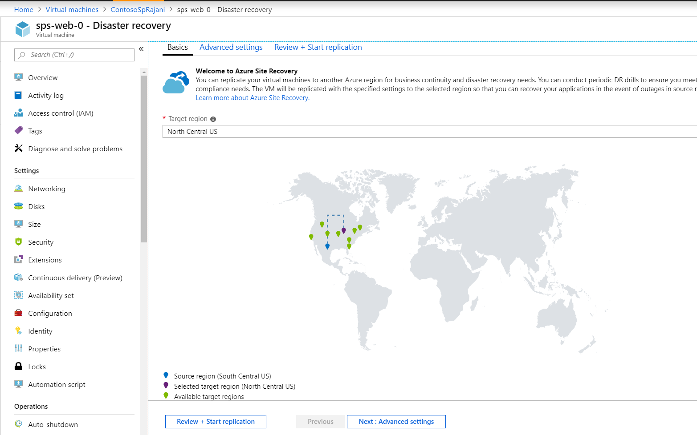
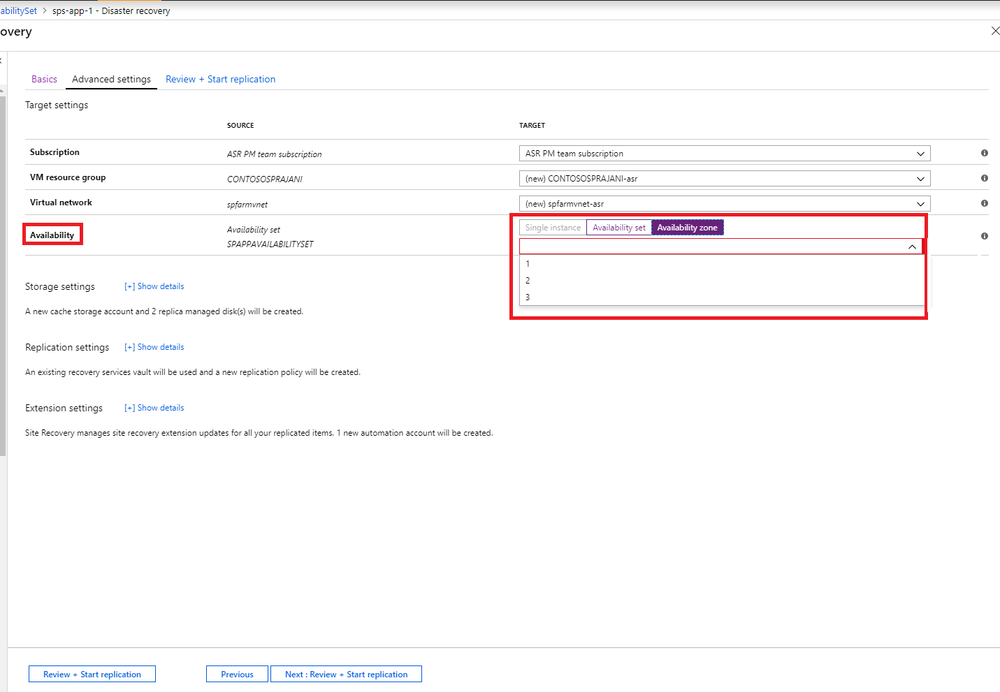

# Move Azure VMs into Availability Zones

This articles describes how to move Azure VMs to an availability zone in a different region. If you want to move to a different zone in the same region, [review this article](./azure-to-azure-how-to-enable-zone-to-zone-disaster-recovery.md).

Availability Zones in Azure help protect your applications and data from datacenter failures. Each Availability Zone is made up of one or more datacenters equipped with independent power, cooling, and networking. To ensure resiliency, there’s a minimum of three separate zones in all enabled regions. The physical separation of Availability Zones within a region helps protect applications and data from datacenter failures. With Availability Zones, Azure offers a service-level agreement (SLA) of 99.99% for uptime of virtual machines (VMs). Availability Zones are supported in select regions, as mentioned in [Regions that support Availability Zones](../availability-zones/az-region.md).

In a scenario where your VMs are deployed as *single instance* into a specific region, and you want to improve your availability by moving these VMs into an Availability Zone, you can do so by using Azure Site Recovery. This action can further be categorized into:

- Move single-instance VMs into Availability Zones in a target region
- Move VMs in an availability set into Availability Zones in a target region

> [!IMPORTANT]
> To move Azure VMs to an availability zone in a different region region, we now recommend using [Azure Resource Mover](../resource-mover/move-region-availability-zone.md). Resource Mover is in public preview and provides:
> - A single hub for moving resources across regions.
> - Reduced move time and complexity. Everything you need is in a single location.
> - A simple and consistent experience for moving different types of Azure resources.
> - An easy way to identify dependencies across resources you want to move. This helps you to move related resources together, so that everything works as expected in the target region, after the move.
> - Automatic cleanup of resources in the source region, if you want to delete them after the move.
> - Testing. You can try out a move, and then discard it if you don't want to do a full move.

## Check prerequisites

- Check whether the target region has [support for Availability Zones](../availability-zones/az-region.md). Check that your choice of [source region/target region combination is supported](./azure-to-azure-support-matrix.md#region-support). Make an informed decision on the target region.
- Make sure that you understand the [scenario architecture and components](azure-to-azure-architecture.md).
- Review the [support limitations and requirements](azure-to-azure-support-matrix.md).
- Check account permissions. If you just created your free Azure account, you're the admin of your subscription. If you aren't the subscription admin, work with the admin to assign the permissions you need. To enable replication for a VM and eventually copy data to the target by using Azure Site Recovery, you must have:

    1. Permission to create a VM in Azure resources. The *Virtual Machine Contributor* built-in role has these permissions, which include:
        - Permission to create a VM in the selected resource group
        - Permission to create a VM in the selected virtual network
        - Permission to write to the selected storage account

    2. Permission to manage Azure Site Recovery tasks. The *Site Recovery Contributor* role has all permissions required to manage Site Recovery actions in a Recovery Services vault.

## Prepare the source VMs

1. Your VMs should use managed disks if you want to move them to an Availability Zone by using Site Recovery. You can convert existing Windows VMs that use unmanaged disks to use managed disks. Follow the steps at [Convert a Windows virtual machine from unmanaged disks to managed disks](../virtual-machines/windows/convert-unmanaged-to-managed-disks.md). Ensure that the availability set is configured as *managed*.
2. Check that all the latest root certificates are present on the Azure VMs you want to move. If the latest root certificates aren't present, the data copy to the target region can't be enabled because of security constraints.

3. For Windows VMs, install all the latest Windows updates on the VM, so that all the trusted root certificates are on the machine. In a disconnected environment, follow the standard Windows update and certificate update processes for your organization.

4. For Linux VMs, follow the guidance provided by your Linux distributor to get the latest trusted root certificates and certificate revocation list on the VM.
5. Make sure you don't use an authentication proxy to control network connectivity for VMs that you want to move.

6. If the VM you're trying to move doesn't have access to the internet and uses a firewall proxy to control outbound access, check the requirements at [Configure outbound network connectivity](azure-to-azure-tutorial-enable-replication.md#set-up-outbound-network-connectivity-for-vms).

7. Identify the source networking layout and the resources you currently use for verification, including load balancers, NSGs, and public IP.

## Prepare the target region

1. Check that your Azure subscription lets you create VMs in the target region used for disaster recovery. If necessary, contact support to enable the required quota.

2. Make sure your subscription has enough resources to support VMs with sizes that match your source VMs. If you use Site Recovery to copy data to the target, it picks the same size or the closest possible size for the target VM.

3. Create a target resource for every component identified in the source networking layout. This action ensures that after you cut over to the target region, your VMs have all the functionality and features that you had in the source.

    > [!NOTE]
    > Azure Site Recovery automatically discovers and creates a virtual network and storage account when you enable replication for the source VM. You can also pre-create these resources and assign to the VM as part of the enable replication step. But for any other resources, as mentioned later, you need to manually create them in the target region.

     The following documents tell how to create the most commonly used network resources that are relevant to you, based on the source VM configuration.

    - [Network security groups](../virtual-network/manage-network-security-group.md)
    - [Load balancers](../load-balancer/index.yml)
    - [Public IP](../virtual-network/virtual-network-public-ip-address.md)
    
   For any other networking components, refer to the networking [documentation](../index.yml?pivot=products&panel=network).

    > [!IMPORTANT]
    > Ensure that you use a zone-redundant load balancer in the target. You can read more at [Standard Load Balancer and Availability Zones](../load-balancer/load-balancer-standard-availability-zones.md).

4. Manually [create a non-production network](../virtual-network/quick-create-portal.md) in the target region if you want to test the configuration before you cut over to the target region. We recommend this approach because it causes minimal interference with the production environment.

## Enable replication
The following steps will guide you when using Azure Site Recovery to enable replication of data to the target region, before you eventually move them into Availability Zones.

> [!NOTE]
> These steps are for a single VM. You can extend the same to multiple VMs. Go to the Recovery Services vault, select **+ Replicate**, and select the relevant VMs together.

1. In the Azure portal, select **Virtual machines**, and select the VM you want to move into Availability Zones.
2. In **Operations**, select **Disaster recovery**.
3. In **Configure disaster recovery** > **Target region**, select the target region to which you'll replicate. Ensure this region [supports](../availability-zones/az-region.md) Availability Zones.

    

4. Select **Next: Advanced settings**.
5. Choose the appropriate values for the target subscription, target VM resource group, and virtual network.
6. In the **Availability** section, choose the Availability Zone into which you want to move the VM. 
   > [!NOTE]
   > If you don’t see the option for availability set or Availabilty Zone, ensure that the [prerequisites](#prepare-the-source-vms) are met and the [preparation](#prepare-the-source-vms) of source VMs is complete.
  
    

7. Select **Enable Replication**. This action starts a job to enable replication for the VM.

## Check settings

After the replication job has finished, you can check the replication status, modify replication settings, and test the deployment.

1. In the VM menu, select **Disaster recovery**.
2. You can check replication health, the recovery points that have been created and the source, and target regions on the map.

   

## Test the configuration

1. In the virtual machine menu, select  **Disaster recovery**.
2. Select the **Test Failover** icon.
3. In **Test Failover**, select a recovery point to use for the failover:

   - **Latest processed**: Fails the VM over to the latest recovery point that was processed by the
     Site Recovery service. The time stamp is shown. With this option, no time is spent processing
     data, so it provides a low recovery time objective (RTO).
   - **Latest app-consistent**: This option fails over all VMs to the latest app-consistent
     recovery point. The time stamp is shown.
   - **Custom**: Select any recovery point.

3. Select the test target Azure virtual network to which you want to move the Azure VMs to test the configuration. 

    > [!IMPORTANT]
    > We recommend that you use a separate Azure VM network for the test failure, and not the production network in the target region into which you want to move your VMs.

4. To start testing the move, select **OK**. To track progress, select the VM to open its properties. Or,
   you can select the **Test Failover** job in the vault name > **Settings** > **Jobs** > **Site Recovery jobs**.
5. After the failover finishes, the replica Azure VM appears in the Azure portal > **Virtual Machines**. Make sure that the VM is running, sized appropriately, and connected to the appropriate network.
6. If you want to delete the VM created as part of testing the move, select **Cleanup test failover** on the replicated item. In **Notes**, record and save any observations associated with the test.

## Move to the target region and confirm

1.  In the virtual machine menu, select  **Disaster recovery**.
2. Select the **Failover** icon.
3. In **Failover**, select **Latest**. 
4. Select **Shut down machine before beginning failover**. Site Recovery attempts to shut down the source VM before triggering the failover. Failover continues even if shutdown fails. You can follow the failover progress on the **Jobs** page. 
5. After the job is finished, check that the VM appears in the target Azure region as expected.
6. In **Replicated items**, right-click the VM > **Commit**. This finishes the move process to the target region. Wait until the commit job is finished.

## Discard the resource in the source region

Go to the VM. Select **Disable Replication**. This action stops the process of copying the data for the VM.  

> [!IMPORTANT]
> Do the preceding step to avoid getting charged for Site Recovery replication after the move. The source replication settings are cleaned up automatically. Note that the Site Recovery extension that is installed as part of the replication isn't removed and needs to be removed manually.

## Next steps

In this tutorial, you increased the availability of an Azure VM by moving into an availability set or Availability Zone. Now you can set disaster recovery for the moved VM.

> [!div class="nextstepaction"]
> [Set up disaster recovery after migration](azure-to-azure-quickstart.md)
