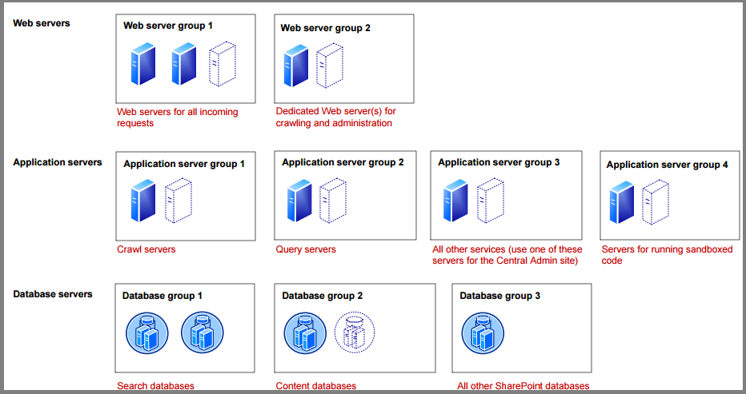
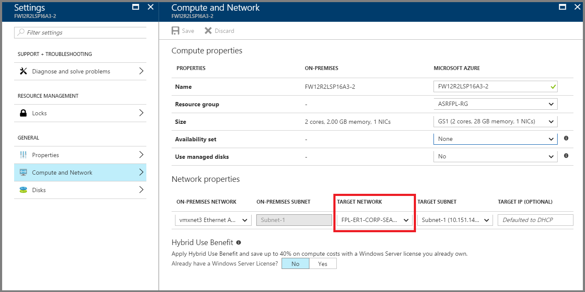
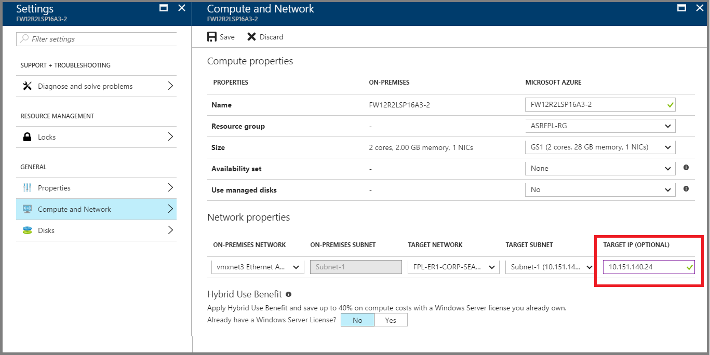
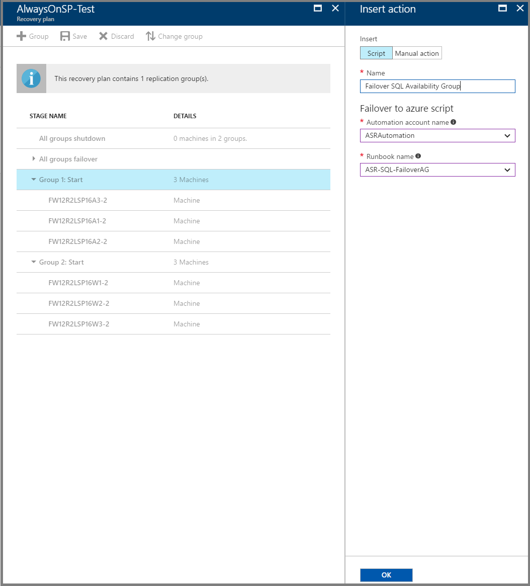
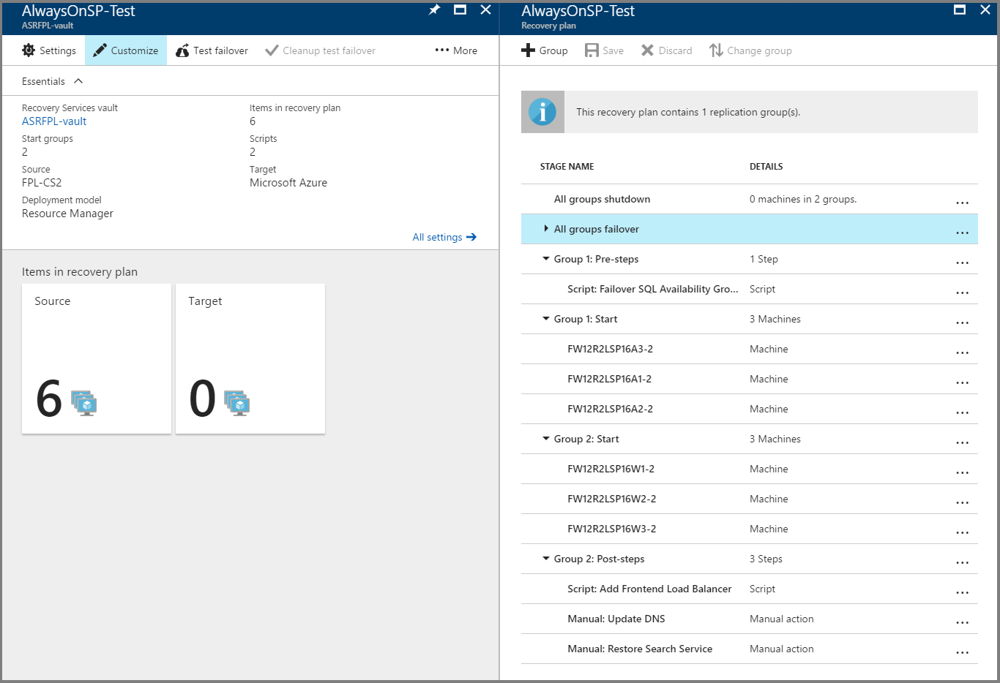

# Set up disaster recovery for a multi-tier SharePoint application for disaster recovery using Azure Site Recovery

This article describes in detail how to protect a SharePoint application using  [Azure Site Recovery](site-recovery-overview.md).

## Overview

Microsoft SharePoint is a powerful application that can help a group or department organize, collaborate, and share information. SharePoint can provide intranet portals, document and file management, collaboration, social networks, extranets, websites, enterprise search, and business intelligence. It also has system integration, process integration, and workflow automation capabilities. Typically, organizations consider it as a Tier-1 application sensitive to downtime and data loss.

Today, Microsoft SharePoint  does not provide any out-of-the-box disaster recovery capabilities. Regardless of the type and scale of a disaster, recovery involves the use of a standby data center that you can recover the farm to. Standby data centers are required for scenarios where local redundant systems and backups cannot recover from the outage at the primary data center.

A good disaster recovery solution should allow modeling of recovery plans around the  complex application architectures such as SharePoint. It should also have the ability to add customized steps to handle application mappings between various tiers and hence providing a single-click failover with a lower RTO in the event of a disaster.

This article describes in detail how to protect a SharePoint application using [Azure Site Recovery](site-recovery-overview.md). This article will cover best practices for replicating a three tier SharePoint application to Azure, how you can do a disaster recovery drill, and how you can failover the application to Azure.

You can watch the below video about recovering a multi-tier application to Azure.

> [!VIDEO https://channel9.msdn.com/Series/Azure-Site-Recovery/Disaster-Recovery-of-load-balanced-multi-tier-applications-using-Azure-Site-Recovery/player]

## Prerequisites

Before you start, make sure you understand the following:

1. [Replicating a virtual machine to Azure](site-recovery-vmware-to-azure.md)
2. How to [design a recovery network](site-recovery-network-design.md)
3. [Doing a test failover to Azure](site-recovery-test-failover-to-azure.md)
4. [Doing a failover to Azure](site-recovery-failover.md)
5. How to [replicate a domain controller](site-recovery-active-directory.md)
6. How to [replicate SQL Server](site-recovery-sql.md)

## SharePoint architecture

SharePoint can be deployed on one or more servers using tiered topologies and server roles to implement a farm design that meets specific goals and objectives. A typical large, high-demand SharePoint server farm that supports a high number of concurrent users and a large number of content items use service grouping as part of their scalability strategy. This approach involves running services on dedicated servers, grouping these services together, and then scaling out the servers as a group. The following topology illustrates the service and server grouping for a three tier SharePoint server farm. Please refer to SharePoint documentation and product line architectures for detailed guidance on different SharePoint topologies. You can find more details about SharePoint 2013 deployment in [this document](https://technet.microsoft.com/library/cc303422.aspx).

## Site Recovery support

Site Recovery is application-agnostic and should work with any version of SharePoint running on a supported machine. For creating this article, VMware virtual machines with Windows Server 2012 R2 Enterprise were used. SharePoint 2013 Enterprise edition and SQL server 2014 Enterprise edition were used.

### Source and target

**Scenario** | **To a secondary site** | **To Azure**
--- | --- | ---
**Hyper-V** | Yes | Yes
**VMware** | Yes | Yes
**Physical server** | Yes | Yes
**Azure** | NA | Yes

### Things to keep in mind

If you are using a shared disk-based cluster as any tier in your application then you will not be able to use Site Recovery replication to replicate those virtual machines. You can use native replication provided by the application and then use a [recovery plan](site-recovery-create-recovery-plans.md) to failover all tiers.

## Replicating virtual machines

Follow [this guidance](site-recovery-vmware-to-azure.md) to start replicating the virtual machine to Azure.

* Once the replication is complete, make sure you go to each virtual machine of each tier and select same availability set in 'Replicated item > Settings > Properties > Compute and Network'. For example, if your web tier has 3 VMs, ensure all the 3 VMs are configured to be part of same availability set in Azure.

	

* For guidance on protecting Active Directory and DNS, refer to [Protect Active Directory and DNS](site-recovery-active-directory.md) document.

* For guidance on protecting database tier running on SQL server, refer to [Protect SQL Server](site-recovery-active-directory.md) document.

## Networking configuration

### Network properties

* For the App and Web tier VMs, configure network settings in Azure portal so that the VMs get attached to the right DR network after failover.

	

* If you are using a static IP, then specify the IP that you want the virtual machine to take in the **Target IP** field

	

### DNS and Traffic Routing

For internet facing sites, [create a Traffic Manager profile of 'Priority' type](../traffic-manager/traffic-manager-create-profile.md) in the Azure subscription. And then configure your DNS and Traffic Manager profile in the following manner.

| **Where**	| **Source** | **Target**|
| --- | --- | --- |
| Public DNS | Public DNS for SharePoint sites    Ex: sharepoint.contoso.com | Traffic Manager    contososharepoint.trafficmanager.net |
| On-premises DNS | sharepointonprem.contoso.com | Public IP on the on-premises farm |

In the Traffic Manager profile, [create the primary and recovery endpoints](../traffic-manager/traffic-manager-configure-priority-routing-method.md). Use the external endpoint for on-premises endpoint and public IP for Azure endpoint. Ensure that the priority is set higher to on-premises endpoint.

Host a test page on a specific port (for example, 800) in the SharePoint web tier in order for Traffic Manager to automatically detect availability post failover. This is a workaround in case you cannot enable anonymous authentication on any of your SharePoint sites.

[Configure the Traffic Manager profile](../traffic-manager/traffic-manager-configure-priority-routing-method.md) with the below settings.

* Routing method - 'Priority'
* DNS time to live (TTL) - '30 seconds'
* Endpoint monitor settings - If you can enable anonymous authentication, you can give a specific website endpoint. Or, you can use a test page on a specific port (for example, 800).

## Creating a recovery plan

A recovery plan allows sequencing the failover of various tiers in a multi-tier application, hence, maintaining application consistency. Follow the below steps while creating a recovery plan for a multi-tier web application. [Learn more about creating a recovery plan](site-recovery-runbook-automation.md#customize-the-recovery-plan).

### Adding virtual machines to failover groups

1. Create a recovery plan by adding the App and Web tier VMs.
2. Click on 'Customize' to group the VMs. By default, all VMs are part of 'Group 1'.

	

3. Create another Group (Group 2) and move the Web tier VMs into the new group. Your App tier VMs should be part of 'Group 1' and Web tier VMs should be part of 'Group 2'. This is to ensure that the App tier VMs boot up first followed by Web tier VMs.

### Adding scripts to the recovery plan

You can deploy the most commonly used Azure Site Recovery scripts into your Automation account clicking the 'Deploy to Azure' button below. When you are using any published script, ensure you follow the guidance in the script.

1. Add a pre-action script to 'Group 1' to failover SQL Availability group. Use the 'ASR-SQL-FailoverAG' script published in the sample scripts. Ensure you follow the guidance in the script and make the required changes in the script appropriately.

	

	

2. Add a post action script to attach a load balancer on the failed over virtual machines of Web tier (Group 2). Use the 'ASR-AddSingleLoadBalancer' script published in the sample scripts. Ensure you follow the guidance in the script and make the required changes in the script appropriately.

    

    

3. Add a manual step to update the DNS records to point to the new farm in Azure.

	* For internet facing sites, no DNS updates are required post failover. Follow the steps described in the 'Networking guidance' section to configure Traffic Manager. If the Traffic Manager profile has been set up as described in the previous section, add a script to open dummy port (800 in the example) on the Azure VM.

	* For internal facing sites, add a manual step to update the DNS record to point to the new Web tier VM’s load balancer IP.

4. Add a manual step to restore search application from a backup or start a new search service.

5. For restoring Search service application from a backup, follow below steps.

	* This method assumes that a backup of the Search Service Application was performed before the catastrophic event and that the backup is available at the DR site.
	* This can easily be achieved by scheduling the backup (for example, once daily) and using a copy procedure to place the backup at the DR site. Copy procedures could include scripted programs such as AzCopy (Azure Copy) or setting up DFSR (Distributed File Services Replication).
	* Now that the SharePoint farm is running, navigate the Central Administration, 'Backup and Restore' and select Restore. The restore interrogates the backup location specified (you may need to update the value). Select the Search Service Application backup you would like to restore.
	* Search is restored. Keep in mind that the restore expects to find the same topology (same number of servers) and same hard drive letters assigned to those servers. For more information, see ['Restore Search service application in SharePoint 2013'](https://technet.microsoft.com/library/ee748654.aspx) document.

6. For starting with a new Search service application, follow below steps.

	* This method assumes that a backup of the “Search Administration” database is available at the DR site.
	* Since the other Search Service Application databases are not replicated, they need to be re-created. To do so, navigate to Central Administration and delete the Search Service Application. On any servers which host the Search Index, delete the index files.
	* Re-create the Search Service Application and this re-creates the databases. It is recommended to have a prepared script that re-creates this service application since it is not possible to perform all actions via the GUI. For example, setting the index drive location and configuring the search topology are only possible by using SharePoint PowerShell cmdlets. Use the Windows PowerShell cmdlet Restore-SPEnterpriseSearchServiceApplication and specify the log-shipped and replicated Search Administration database, Search_Service__DB. This cmdlet gives the search configuration, schema, managed properties, rules, and sources and creates a default set of the other components.
	* Once the Search Service Application has be re-created, you must start a full crawl for each content source to restore the Search Service. You lose some analytics information from the on-premises farm, such as search recommendations.

7. Once all the steps are completed, save the recovery plan and the final recovery plan will look like following.

	

## Doing a test failover
Follow [this guidance](site-recovery-test-failover-to-azure.md) to do a test failover.

1.	Go to Azure portal and select your Recovery Service vault.
2.	Click on the recovery plan created for SharePoint application.
3.	Click on 'Test Failover'.
4.	Select recovery point and Azure virtual network to start the test failover process.
5.	Once the secondary environment is up, you can perform your validations.
6.	Once the validations are complete, you can click 'Cleanup test failover' on the recovery plan and the test failover environment is cleaned.

For guidance on doing test failover for AD and DNS, refer to [Test failover considerations for AD and DNS](site-recovery-active-directory.md#test-failover-considerations) document.

For guidance on doing test failover for SQL Always ON availability groups, refer to [Performing Application DR with Azure Site Recovery and doing Test failover](site-recovery-sql.md#disaster-recovery-of-an-application) document.

## Doing a failover
Follow [this guidance](site-recovery-failover.md) for doing a failover.

1.	Go to Azure portal and select your Recovery Services vault.
2.	Click on the recovery plan created for SharePoint application.
3.	Click on 'Failover'.
4.	Select recovery point to start the failover process.

## Next steps
You can learn more about [replicating other applications](site-recovery-workload.md) using Site Recovery.
