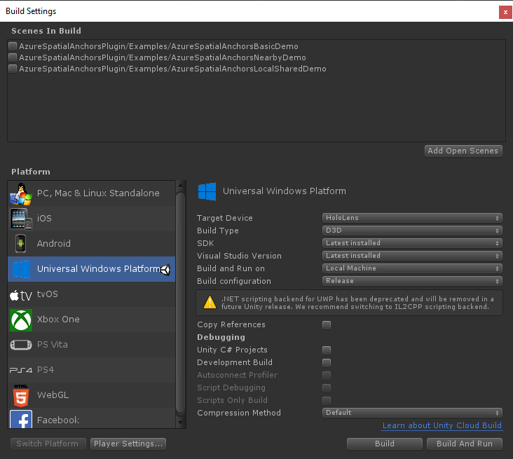

# Quickstart: Create a Unity HoloLens app that uses Azure Spatial Anchors

In this quickstart, you'll create a Unity HoloLens app that uses [Azure Spatial Anchors](../overview.md). Spatial Anchors is a cross-platform developer service that allows you to create mixed reality experiences with objects that persist their location across devices over time. When you're finished, you'll have a HoloLens app built with Unity that can save and recall a spatial anchor.

You'll learn how to:

- Create a Spatial Anchors account.
- Prepare Unity build settings.
- Configure the Spatial Anchors account identifier and account key.
- Export the HoloLens Visual Studio project.
- Deploy the app and run it on a HoloLens device.

[!INCLUDE [quickstarts-free-trial-note](../../../includes/quickstarts-free-trial-note.md)]

## Prerequisites

To complete this quickstart:

- You need a Windows computer on which <a href="https://unity3d.com/get-unity/download" target="_blank">Unity 2019.1 or 2019.2</a> or later and <a href="https://www.visualstudio.com/downloads/" target="_blank">Visual Studio 2019</a> or later are installed. Your Visual Studio installation must include the **Universal Windows Platform development** workload and the **Windows 10 SDK (10.0.18362.0 or newer)** component. You must also install <a href="https://git-scm.com/download/win" target="_blank">Git for Windows</a> and <a href="https://git-lfs.github.com/">Git LFS</a>.
- You need a HoloLens device on which [developer mode](https://docs.microsoft.com/windows/mixed-reality/using-visual-studio) enabled. [Windows 10 October 2018 Update](https://docs.microsoft.com/windows/mixed-reality/release-notes-october-2018) (also known as RS5) must be installed on the device. To update to the latest release on HoloLens, open the **Settings** app, go to **Update & Security**, and then select **Check for updates**.
- On your app, you need to enable the **SpatialPerception** capability. This setting is in **Build Settings** > **Player Settings** > **Publishing Settings** > **Capabilities**.
- On your app, you need to enable **Virtual Reality Supported** with **Windows Mixed Reality SDK**. This setting is in **Build Settings** > **Player Settings** > **XR Settings**.

[!INCLUDE [Create Spatial Anchors resource](../../../includes/spatial-anchors-get-started-create-resource.md)]

## Download and open the Unity sample project

[!INCLUDE [Clone Sample Repo](../../../includes/spatial-anchors-clone-sample-repository.md)]

[!INCLUDE [Open Unity Project](../../../includes/spatial-anchors-open-unity-project.md)]

Open **Build Settings** by selecting **File** > **Build Settings**.

In the **Platform** section, select **Universal Windows Platform**. Change the **Target Device** to **HoloLens**.

Select **Switch Platform** to change the platform to **Universal Windows Platform**. Unity might prompt you to install UWP support components if they're missing.

Close the **Build Settings** window.

## Configure the account identifier and key

In the **Project** pane, go to `Assets/AzureSpatialAnchors.Examples/Scenes` and open the `AzureSpatialAnchorsBasicDemo.unity` scene file.

[!INCLUDE [Configure Unity Scene](../../../includes/spatial-anchors-unity-configure-scene.md)]

Save the scene by selecting **File** > **Save**.

## Export the HoloLens Visual Studio project

[!INCLUDE [Export Unity Project](../../../includes/spatial-anchors-unity-export-project-snip.md)]

Select **Build**. In the dialog box, select a folder in which to export the HoloLens Visual Studio project.

When the export is complete, a folder containing the exported HoloLens project will appear.

## Deploy the HoloLens application

In the folder, double-click **HelloAR U3D.sln** to open the project in Visual Studio.

Change the **Solution Configuration** to **Release**, change the **Solution Platform** to **x86**, and select **Device** from the deployment target options.

If using HoloLens 2, use **ARM64** as the **Solution Platform**, instead of **x86**.

   

Turn on the HoloLens device, sign in, and connect the device to the PC by using a USB cable.

Select **Debug** > **Start debugging** to deploy your app and start debugging.

Follow the instructions in the app to place and recall an anchor.

In Visual Studio, stop the app by selecting either **Stop Debugging** or Shift+F5.

## Troubleshooting

### Unity 2019.3

Due to breaking changes, Unity 2019.3 is not currently supported. Please use Unity 2019.1 or 2019.2.

[!INCLUDE [Clean-up section](../../../includes/clean-up-section-portal.md)]

[!INCLUDE [Next steps](../../../includes/spatial-anchors-quickstarts-nextsteps.md)]

> [!div class="nextstepaction"]
> [Tutorial: Share spatial anchors across devices](../tutorials/tutorial-share-anchors-across-devices.md)
