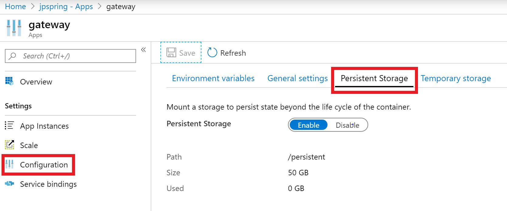

# Use persistent storage in Azure Spring Cloud

**This article applies to:** ✔️ Java ✔️ C#

Azure Spring Cloud provides two types of storage for your application: persistent and temporary.

By default, Azure Spring Cloud provides temporary storage for each application instance. Temporary storage is limited to 5 GB per instance with the default mount path /tmp.

> [!WARNING]
> If you restart an application instance, the associated temporary storage is permanently deleted.

Persistent storage is a file-share container managed by Azure and allocated per application. Data stored in persistent storage is shared by all instances of an application. An Azure Spring Cloud instance can have a maximum of 10 applications with persistent storage enabled. Each application is allocated 50 GB of persistent storage. The default mount path for persistent storage is /persistent.

> [!WARNING]
> If you disable an applications's persistent storage, all of that storage is deallocated and all of the stored data is lost.

## Use the Azure portal to enable persistent storage

1. From the **Home** page of your Azure portal, select **All Resources**.

    >

1. Select the Azure Spring Cloud resource that needs persistent storage. In this example, the selected application is called **upspring**.

    > 

1. Under the **Settings** heading, select **Apps**.

1. Your Azure Spring Cloud services appear in a table.  Select the service to which you want to add persistent storage. In this example, the **gateway** service is selected.

    > 

1. From the service's configuration page, select **Configuration**

1. Select the **Persistent Storage** tab and select **Enable**.

    > 

After persistent storage is enabled, its size and path are shown on the configuration page.

## Use the Azure CLI to modify persistent storage

If necessary, install the Spring Cloud extension for the Azure CLI:

```azurecli
az extension add --name spring-cloud
```
Other operations:

* To create an app with persistent storage enabled:

    ```azurecli
    az spring-cloud app create -n <app> -g <resource-group> -s <service-name> --enable-persistent-storage true
    ```

* To enable persistent storage for an existing app:

    ```azurecli
    az spring-cloud app update -n <app> -g <resource-group> -s <service-name> --enable-persistent-storage true
    ```

* To disable persistent storage in an existing app:

    ```azurecli
    az spring-cloud app update -n <app> -g <resource-group> -s <service-name> --enable-persistent-storage false
    ```

    > [!WARNING]
    > If you disable an applications's persistent storage, all of that storage is deallocated and all of the stored data is permanently lost.

## Next steps

* Learn about [application and service quotas](./quotas.md).
* Learn how to [manually scale your application](./how-to-scale-manual.md).